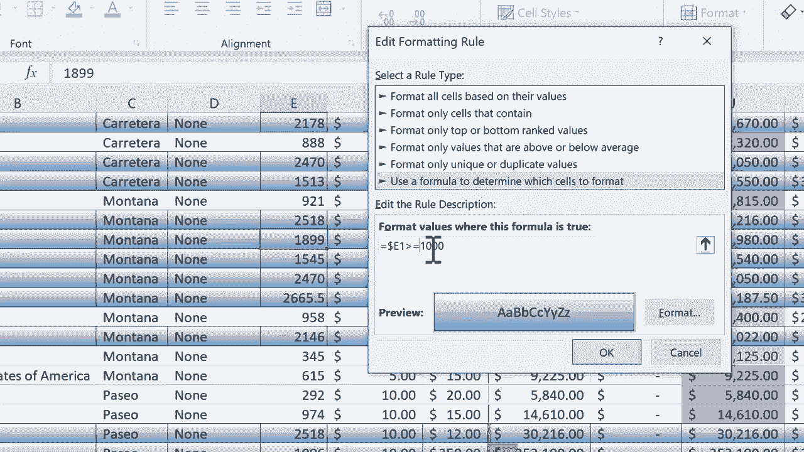

# Excel高级教程（持续更新中） - P4：4）条件格式高级技巧 🎨

在本节课中，我们将学习一种高级的条件格式技巧，它允许你根据某一列的值来突出显示**整行**数据，而不仅仅是单个单元格。这对于快速识别和分析数据表中的关键信息非常有用。

上一节我们介绍了条件格式的基础应用，本节中我们来看看如何实现更复杂的整行高亮。

## 概述：整行条件格式的原理

传统的条件格式通常只应用于单个单元格或一列。但有时，我们需要根据某个特定条件（例如，销售额超过一定数值）来高亮显示对应的整行数据，以便更直观地分析。

这个技巧的核心在于：**使用一个引用特定列的公式作为条件，并将该格式规则应用到整个数据区域**。公式中的绝对引用（使用美元符号 `$`）是关键。


## 步骤详解：如何设置整行高亮

以下是设置整行条件格式的具体步骤。

### 第一步：选择目标数据区域

首先，你需要选中希望应用条件格式的整个数据区域。

1.  点击工作表左上角（A列与第1行交汇处）的三角形，或拖动鼠标选中所有包含数据的单元格（例如从A列到Q列）。

### 第二步：创建新的格式规则

选中数据后，通过以下路径创建基于公式的新规则。

1.  在【开始】选项卡中，点击【条件格式】。
2.  在下拉菜单中，选择【新建规则】。

### 第三步：使用公式确定格式

在弹出的“新建格式规则”对话框中，进行如下设置。

1.  选择规则类型为：“使用公式确定要设置格式的单元格”。
2.  在“为符合此公式的值设置格式”下方的输入框中，输入你的条件公式。

**核心公式示例**：
假设我们想根据E列（例如“销售数量”）的值来高亮整行，条件是E列的值大于1000。公式应写为：
```
=$E1>1000
```
**公式解析**：
*   `$E`：美元符号锁定了E列。这意味着无论格式应用到哪一列，判断条件都只针对E列的值。
*   `1`：这里的行号是相对引用。当规则应用到不同行时，行号会相应变化（例如在第二行会变成`$E2`），从而对每一行进行独立判断。
*   `>1000`：判断条件，即E列单元格的值是否大于1000。

### 第四步：设置高亮格式

输入公式后，需要定义满足条件时整行的显示样式。

1.  点击【格式】按钮。
2.  在弹出的“设置单元格格式”对话框中，可以设置**填充**颜色（如浅绿色）、**字体**样式或**边框**等。
3.  设置完毕后，点击【确定】返回规则对话框。

### 第五步：应用并查看规则

完成格式设置后，应用规则并查看效果。

1.  在“新建格式规则”对话框中点击【确定】。
2.  此时，数据表中所有E列值大于1000的整行都会被高亮显示。
3.  你可以通过【条件格式】>【管理规则】来查看、编辑或删除已创建的规则。

## 注意事项与技巧

在使用此功能时，有几个关键点需要注意。

*   **公式中的引用**：确保列使用绝对引用（`$E`），而行起始号为相对引用（如`1`）。这是实现整行格式化的关键。
*   **条件调整**：公式 `=$E1>1000` 不包括等于1000的情况。若想包含1000，应使用 `=$E1>=1000`。
*   **活动单元格的影响**：编写公式时，活动单元格的位置（通常是选中区域的左上角单元格）决定了公式中相对引用的起始点。通常从第一行开始即可。

## 总结

本节课中我们一起学习了Excel条件格式的高级技巧——**根据单列条件高亮显示整行数据**。



我们掌握了从选择数据区域、创建基于公式的新规则，到编写核心公式 `=$E1>1000` 并设置格式的完整流程。这个技巧能极大地提升数据可视化和分析效率，帮助你快速聚焦于关键数据行。

记住，灵活运用公式中的绝对与相对引用，是掌握此类高级条件格式化的核心。