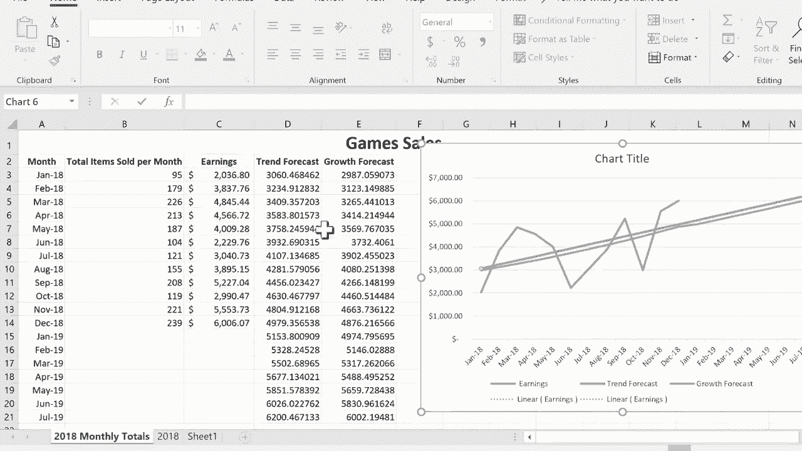

# Excel高级教程（持续更新中） - P5：使用图表和函数查看趋势 📈

在本节课中，我们将学习如何在Excel中识别和分析数据趋势。我们将重点介绍两种方法：通过图表工具直接添加趋势线，以及使用Excel函数（如`TREND`和`GROWTH`）在数据表中计算并绘制趋势。这些技巧能帮助你直观地理解数据的过去变化并预测未来走向。

## 准备数据与插入图表

首先，我们需要一份包含时间序列的数据。在本例中，我们使用一个记录“游戏销售”公司每月总销售额的表格。A列是“月份”，D列是“收益”。

为了直观展示收益随时间的变化趋势，我们首先创建一个图表。

以下是创建折线图的步骤：
1.  选择要绘制图表的数据区域。先点击并拖动选择D列的“收益”数据。
2.  按住键盘上的 `Ctrl` 键，再点击并拖动选择A列的“月份”数据。
3.  松开 `Ctrl` 键，转到Excel顶部的“插入”选项卡。
4.  在“图表”组中，选择“折线图”。这里我们选择基础的折线图类型。

插入图表后，可以将其移动到合适的位置。从图表中，我们可以初步观察到收益随时间有增长，但也存在波动。

## 为图表添加趋势线

折线图展示了历史数据，而趋势线能帮助我们更清晰地把握整体变化方向并预测未来。

上一节我们介绍了如何创建基础折线图，本节中我们来看看如何为其添加趋势线。

操作步骤如下：
1.  在图表中，单击选中代表收益的折线。
2.  右键点击该折线，在弹出菜单中选择“添加趋势线”。
3.  右侧将打开“设置趋势线格式”窗格。

在窗格中，我们可以进行多项设置：
*   **趋势线选项**：可以选择不同类型的趋势线，如**线性**（直线）、**指数**（曲线）、**对数**等。对于大多数趋势分析，线性和指数较为常用。
*   **预测**：可以设置向前或向后的周期数，例如输入“5”，图表会显示未来5个周期的趋势预测。
*   **显示公式**和**显示R平方值**：勾选后可在图表上显示趋势线的公式和R²值（用于衡量趋势线的拟合优度）。
*   **线条效果**：可以修改趋势线的颜色、宽度、阴影等视觉效果。

例如，选择“线性”趋势线，并设置“向前”预测5个周期，图表便会延伸出一条直线，展示未来的可能趋势。

## 使用函数计算趋势数据

除了直接在图表上添加趋势线，我们还可以使用Excel函数在数据表中计算趋势值。这样做的好处是可以在表格中保留和对比多种趋势计算结果。

上一节我们通过图表工具添加了趋势线，本节中我们来看看如何在单元格中使用函数实现类似效果。

我们将使用 `TREND` 函数计算线性趋势，使用 `GROWTH` 函数计算指数增长趋势。**注意**：这两个函数返回的是数组结果，输入公式的方法比较特殊。

以下是操作步骤：
1.  在数据表右侧新增两列，分别命名为“趋势预测”和“增长预测”。
2.  选择“趋势预测”列中与源数据对应的单元格区域。
3.  输入公式 `=TREND(D3:D14)`。此公式表示基于D3:D14区域的收益数据计算线性趋势。
    *   **关键步骤**：输入公式后，不能直接按 `Enter`，而需按住 `Ctrl` 和 `Shift` 键，再按 `Enter`。这会将公式作为**数组公式**输入，你会看到公式被大括号 `{}` 包围。
4.  用同样的方法，在“增长预测”列选择对应区域，输入数组公式 `=GROWTH(D3:D14)` 并按 `Ctrl+Shift+Enter`。

现在，表格中已计算出两种趋势预测值。我们可以创建一个新的折线图，同时包含“收益”、“趋势预测”和“增长预测”三组数据，以便对比。

## 扩展预测数据并更新图表

使用函数计算趋势后，我们可以手动扩展预测区间，并更新图表以包含这些未来预测点。

上一节我们使用函数在表格中生成了趋势数据，本节中我们来看看如何将这些预测数据延长并反映在图表中。

首先，我们需要将函数计算的数组公式转换为静态值，以便使用填充柄扩展。

操作步骤如下：
1.  选中“趋势预测”列的计算结果区域。
2.  右键点击选区边框，将其拖动到旁边空白处再拖回原位置。
3.  在弹出的菜单中选择“仅复制数值”。这样公式就变成了静态数字。
4.  对“增长预测”列重复步骤1-3。
5.  使用填充柄：选中转换后的数值区域，拖动右下角的填充柄向下延伸若干行（如7行），Excel会根据趋势自动填充未来的预测值。
6.  同样，在“月份”列也向下填充对应的未来月份。
7.  最后，更新图表的数据源范围，使其包含新添加的预测月份和预测数据列。

更新后，图表将展示基于历史数据的完整趋势线以及延伸至未来的预测部分。

## 课程总结

本节课中我们一起学习了在Excel中分析数据趋势的两种核心方法。

我们首先学习了如何通过**插入折线图**并**添加趋势线**来快速可视化趋势和进行预测。这种方法简单直观，适合快速分析。

接着，我们深入学习了如何使用 `TREND` 和 `GROWTH` 等**数组函数**在数据表中计算趋势值。这种方法更灵活，允许我们在表格中保留和操作趋势数据，并通过转换为数值和填充来扩展预测区间。

掌握这两种方法，你将能更有效地利用Excel分析数据的过去表现并洞察其未来走向。