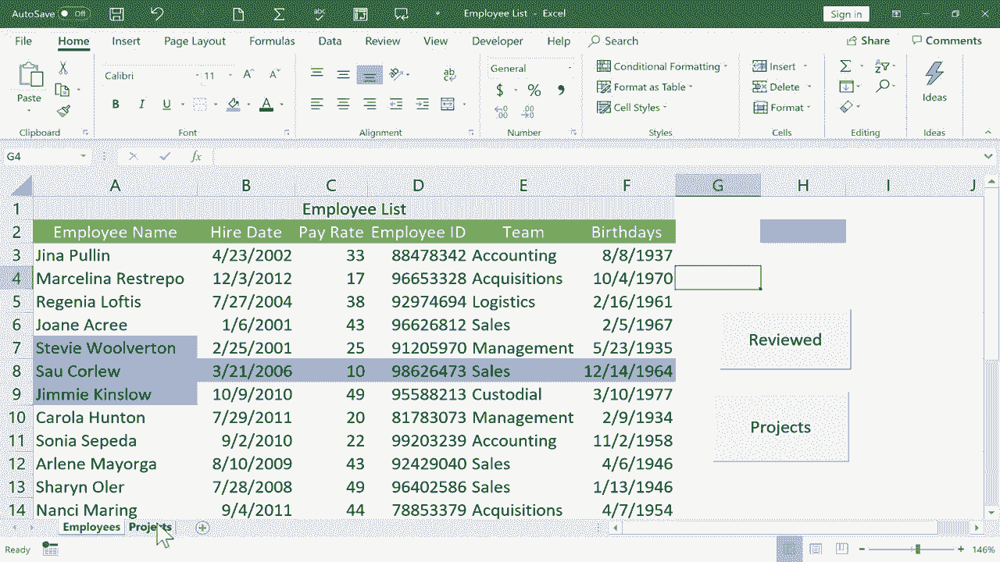

# Excel高级教程（持续更新中） - P6：宏初学者指南 - 创建快捷方式 🚀

在本节课中，我们将学习Excel宏的基础知识。宏是一种强大的工具，可以自动执行重复性任务，为你创建快捷方式，从而显著提高工作效率。我们将通过两个具体示例来演示如何录制宏，并将其与按钮控件关联，实现一键切换工作表和标记数据。

## 概述 📋

本节课将分为两个主要部分。首先，我们将创建一个用于在不同工作表之间快速跳转的宏。其次，我们将创建一个用于快速标记数据的宏。通过学习这两个示例，你将掌握录制宏、分配快捷键以及创建交互式按钮的基本流程。

## 第一部分：创建工作表切换宏

上一节我们介绍了宏的基本概念，本节中我们来看看如何创建一个用于在工作表之间导航的快捷方式。

假设我们有一个包含“员工”和“项目”两个工作表的工作簿。我们希望创建一个按钮，点击后能从“员工”表快速跳转到“项目”表。

以下是具体操作步骤：

1.  **启用“开发工具”选项卡**：如果功能区没有“开发工具”选项卡，需要在功能区右键单击，选择“自定义功能区”，然后勾选“开发工具”选项。

2.  **开始录制宏**：点击“开发工具”选项卡 -> “录制宏”。
    *   在弹出的对话框中，为宏命名，例如 `按钮到项目标签`。
    *   为宏指定一个键盘快捷键，例如 `Ctrl+Shift+A`。注意避免与常用快捷键（如Ctrl+C）冲突。
    *   将宏的保存位置设置为“当前工作簿”。
    *   可以添加描述，但注意宏名不能包含空格。
    *   点击“确定”开始录制。

3.  **执行要录制的操作**：录制开始后，**只记录你的操作（如点击），不记录鼠标移动或时间流逝**。本例中，只需点击“项目”工作表标签。

4.  **停止录制**：点击“开发工具”选项卡 -> “停止录制”。此时，跳转到“项目”表的操作已被记录为宏。

5.  **创建按钮并关联宏**：
    *   回到“员工”工作表。
    *   点击“开发工具” -> “插入” -> “按钮（表单控件）”。
    *   鼠标指针变为十字，在合适位置拖动绘制一个按钮。
    *   松开鼠标后，会弹出“指定宏”窗口，选择刚才录制的 `按钮到项目标签` 宏，点击“确定”。
    *   双击按钮上的文字，将其修改为“项目”。

6.  **测试按钮**：点击按钮外部退出编辑，然后点击“项目”按钮，即可跳转到“项目”工作表。

7.  **创建返回按钮**：按照相同步骤，在“项目”工作表中录制一个跳转回“员工”工作表的宏（例如命名为 `返回员工表`），并创建对应的“返回”按钮。

8.  **编辑按钮**：如需调整按钮位置或大小，需**右键单击**按钮选中它，然后才能进行拖动或缩放操作。

通过以上步骤，我们成功创建了用于快速导航的宏和按钮。接下来，我们看看如何用宏来简化数据标记工作。

## 第二部分：创建数据标记宏

上一节我们创建了导航宏，本节中我们来看看如何利用宏为特定操作（如标记颜色）创建快捷方式。

假设我们需要对已完成绩效评估的员工进行标记，例如将其名字单元格背景变为蓝色。

以下是创建标记宏的步骤：

1.  **关键准备**：在开始录制前，**不要预先选中任何特定单元格**。可以点击一个空白单元格，确保宏操作应用于“当前选中的内容”，而非固定单元格。

2.  **录制宏**：
    *   点击“开发工具” -> “录制宏”。
    *   命名为 `标记为已审核`，设置快捷键如 `Ctrl+Shift+C`，点击“确定”。
    *   在“开始”选项卡中，为当前选中的单元格设置蓝色背景填充。
    *   点击“停止录制”。

3.  **创建并使用按钮**：
    *   插入一个新的表单控件按钮。
    *   将其宏指定为 `标记为已审核`。
    *   将按钮文字改为“已审核”。
    *   **使用方式**：在工作表中，先手动选中一个或多个单元格（或整行），然后点击“已审核”按钮，选中区域即会变为蓝色。

**核心概念解释**：为什么录制前不选中特定单元格？因为宏记录的是**绝对操作**。如果录制时点击了A6单元格并变色，那么每次运行宏都只会改变A6单元格。而如果录制时未改变选区，只记录了“为当前选区填充蓝色”这个动作，那么宏运行时就会对**执行宏时当前选中的任何区域**生效，灵活性大大增强。

## 重要后续步骤：保存工作簿 💾

在工作簿中创建宏后，保存文件有特殊要求，否则宏将无法保留。

必须将文件另存为 **“Excel启用宏的工作簿 (*.xlsm)”** 格式。
*   点击“文件” -> “另存为”。
*   在“保存类型”中，选择“Excel启用宏的工作簿 (*.xlsm)”。
*   点击“保存”。

此后打开该.xlsm文件时，Excel可能会出于安全考虑禁用宏。你需要在顶部出现的“安全警告”栏中点击“启用内容”，才能使宏正常运行。

## 总结 🎯

本节课中我们一起学习了Excel宏的入门操作：
1.  我们掌握了如何通过“开发工具”选项卡录制宏，并为其分配快捷键。
2.  我们学会了创建表单控件按钮，并将其与录制好的宏关联，实现一键触发。
3.  我们通过“工作表切换”和“数据标记”两个实例，理解了宏的录制逻辑，特别是操作对象（固定单元格 vs 当前选区）的选择对宏功能的影响。
4.  我们明确了保存含宏工作簿时必须使用 **.xlsm** 格式，并在打开时启用宏内容。

宏是自动化重复任务的强大工具，从简单的导航到复杂的数据处理都能胜任。掌握这些基础知识后，你可以尝试为更多日常操作创建快捷方式，从而提升在Excel中的工作效率。