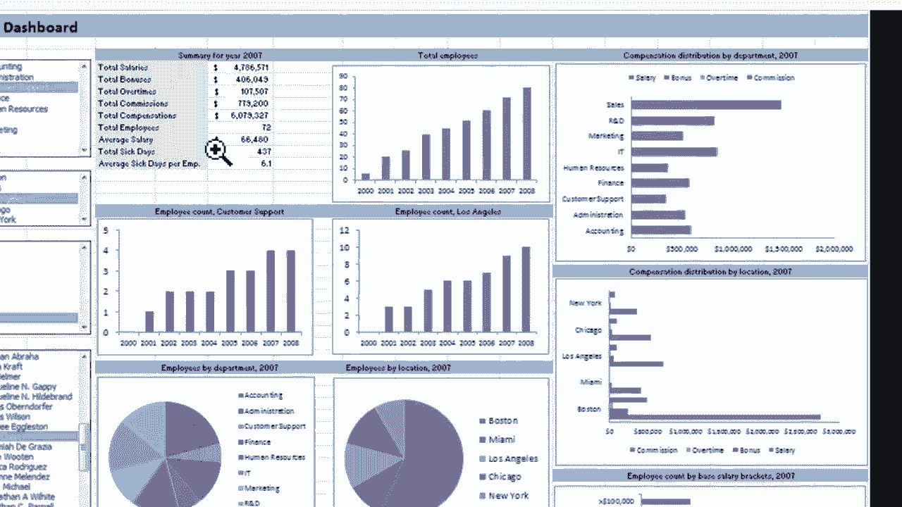
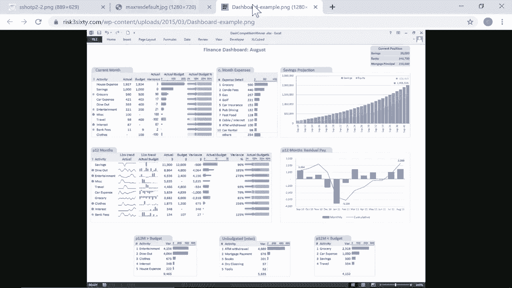
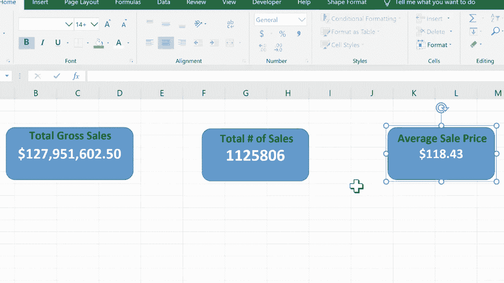

# Excel高级教程（持续更新中） - P7：Excel仪表板初学者指南 📊

在本节课中，我们将学习如何创建Excel仪表板。仪表板是一种将复杂数据以清晰、直观方式呈现的工具，它通常包含图表、图形和关键指标，帮助用户快速理解数据。

## 什么是仪表板？🤔

仪表板是从原始数据中提取关键信息并进行可视化展示的界面。原始数据表格通常包含大量杂乱信息，而仪表板则聚焦于特定的数据和指标，使其更易于阅读和分析。

以下是仪表板的几个例子：

*   **年度摘要仪表板**：展示一年的关键数据摘要。
*   **销售趋势仪表板**：展示各州的销售总额和变化趋势。
*   **高级复杂仪表板**：包含多种图表和交互元素的综合视图。

这些仪表板上显示的数据都链接自后台的原始数据表格。仪表板的核心价值在于将数据分析与数据展示分离，让报告更加美观和专业。

## 创建基础仪表板 🛠️

上一节我们介绍了仪表板的概念，本节中我们来看看如何从零开始创建一个简单的仪表板。我们将使用一个包含多年财务数据的复杂表格作为数据源。

### 第一步：规划与新建工作表

创建仪表板前，最好先规划要展示的内容。规划可以在纸上进行，也可以直接在Excel中构思。

以下是创建新工作表作为仪表板的步骤：
1.  在工作簿左下角，点击“+”号新建一个工作表。
2.  双击新工作表名称（如Sheet4），将其重命名为“仪表板”。
3.  将该工作表拖到最前面，作为仪表板界面。

### 第二步：使用形状创建指标框

设置仪表板最简单的方法之一是使用形状作为数据指标的容器。

以下是插入并链接形状的步骤：
1.  点击“插入”选项卡，在“插图”组中选择“形状”。
2.  选择一个形状（如圆角矩形）并在仪表板工作表上绘制出来。
3.  点击该形状，然后在顶部的公式栏中输入等号 `=`。
4.  切换到数据源工作表，点击你想要链接的单元格（例如2020年的总销售额）。
5.  按下回车键，形状中的文本就会动态链接到该单元格的数据。

**核心操作公式**：`形状内容 = 单元格引用`。例如，在公式栏输入 `=‘2020’!$B$100`。

### 第三步：美化指标框

仪表板的美观性很重要。我们可以调整形状和文字的格式，使其更醒目。

以下是美化指标框的方法：
*   **调整文字**：选中形状，可以更改字体、大小、颜色和对齐方式。
*   **调整形状**：可以更改形状的填充颜色、边框等。
*   **添加标签**：可以插入“文本框”来为指标添加标题（如“总销售额”），然后将文本框和形状“组合”成一个对象，方便整体移动。

### 第四步：复制并修改其他指标

要添加更多指标，可以复制已做好的指标框组，然后修改其链接的数据源和标签。

以下是快速添加新指标的步骤：
1.  右键点击已组合的指标框，选择“复制”。
2.  在空白处右键点击，选择“粘贴”。
3.  修改文本框内的标题（如改为“销售总数”）。
4.  选中形状，在公式栏中修改单元格引用，链接到新的数据（如总销售件数）。

### 第五步：确保数据格式正确

有时从形状中直接调整数字格式（如货币格式）会受限。我们需要确保数据源本身的格式是正确的。

以下是修正数据格式的方法：
*   如果形状中的数字需要显示为货币，应直接去**数据源工作表**，将对应的单元格格式设置为“货币”。
*   设置完成后，仪表板上的形状会自动更新格式。

## 总结与后续 🎯

本节课中我们一起学习了创建Excel仪表板的基础知识。我们掌握了如何新建仪表板工作表、使用形状链接动态数据、美化指标显示以及快速复制指标框。

核心要点包括：
1.  **仪表板**用于从复杂数据中提取和展示关键信息。
2.  使用 **`=`链接** 将形状与数据单元格关联是实现动态更新的关键。
3.  通过**组合**对象和格式化来提升仪表板的可读性与美观度。
4.  确保**数据源格式**正确，以保证仪表板显示无误。

这只是一个起点。要创建更高级的仪表板，还可以学习使用数据透视表、图表、切片器以及函数等中级和高级技能。

