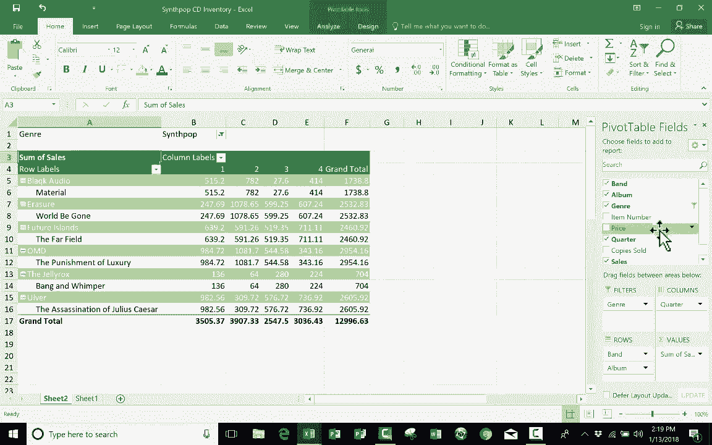

# Excel高级教程（持续更新中） - P8：8）创建数据透视表 📊

在本教程中，我们将学习如何在Excel中创建和使用数据透视表。数据透视表是一个强大的工具，它能帮助你快速汇总、分析和呈现大量数据。我们将从一个简单的库存管理示例开始，逐步讲解数据透视表的创建步骤和核心功能。

## 概述

数据透视表常被认为有些复杂，但通过本教程的学习，你会发现它其实非常直观和实用。我们将使用一个合成流行音乐CD库存的电子表格作为示例，演示如何利用数据透视表来回答关于销售业绩的具体问题。

## 准备数据

在创建数据透视表之前，确保你的数据组织良好至关重要。数据需要是一个结构清晰的列表。

以下是准备数据的关键步骤：

*   **列标题**：确保每一列都有一个清晰的标题。
*   **垂直列表**：数据应以垂直列表的形式排列，允许有重复项。
*   **无空行**：数据区域中不能存在空行。
*   **无额外信息**：数据区域旁边或下方不应有其他无关信息，如注释或总计行。

一个很好的做法是先将数据区域格式化为Excel表格。这不仅能让数据更美观，还能确保在你添加新数据时，数据透视表能自动更新。

**操作代码**：选中数据区域 -> `开始` 选项卡 -> `样式` 组 -> `套用表格格式` -> 选择一种样式 -> 确认。

## 创建数据透视表

上一节我们介绍了如何准备数据，本节中我们来看看如何创建第一个数据透视表。

1.  点击数据区域内的任意单元格。
2.  转到 `插入` 选项卡。
3.  点击 `数据透视表` 按钮。
4.  在弹出的对话框中，确认 `表/区域` 选择正确。
5.  选择将数据透视表放置在 `新工作表` 或 `现有工作表` 的指定位置。
6.  点击 `确定`。

Excel会创建一个新的工作表，并在右侧显示 `数据透视表字段` 窗格。这个窗格是你构建报告的控制中心。

## 理解字段区域

`数据透视表字段` 窗格包含你的所有列标题（字段），以及四个区域：`筛选器`、`列`、`行` 和 `值`。这四个区域决定了数据透视表的布局和计算内容。

以下是每个区域的作用：

*   **行**：你希望作为报告行标签的字段（例如，乐队名称）。
*   **列**：你希望作为报告列标签的字段（例如，季度）。
*   **值**：你希望进行汇总计算的字段（例如，销售额或销售数量）。默认会对数字字段进行求和。
*   **筛选器**：你希望用来对整个报告进行筛选的字段（例如，按音乐类型筛选）。

## 构建你的第一个报告

假设我们想分析每个乐队在不同季度的总销售额。

以下是构建此报告的步骤：

1.  将 `乐队` 字段拖动到 `行` 区域。数据透视表会列出所有不重复的乐队名称。
2.  将 `季度` 字段拖动到 `列` 区域。表格顶部会出现各个季度作为列标题。
3.  将 `销售额` 字段拖动到 `值` 区域。表格中会显示每个乐队在每个季度的销售额总和。

**核心公式**：数据透视表的核心计算是汇总。对于数值字段，默认使用 `SUM`（求和）函数。你可以通过点击值字段，选择 `值字段设置` 来更改计算方式，如求平均值、计数等。

通过简单的拖放操作，你就得到了一份清晰的交叉分析报告。

## 调整布局与使用筛选器

相同的字段放入不同的区域，会得到不同视角的报告。例如，将 `季度` 从 `列` 区域移动到 `行` 区域，会让季度显示在乐队名称下方，形成另一种层级结构。

`筛选器` 区域则提供了全局筛选能力。例如，将 `类型` 字段拖入 `筛选器`，你就可以在报告顶部筛选只显示“合成流行”或“摇滚”类型的CD销售情况。

## 总结

本节课中我们一起学习了数据透视表的基础知识。我们了解到，数据透视表是一个不会改变原始数据，但能通过拖放字段来快速重组和汇总数据的强大工具。关键在于理解四个字段区域（行、列、值、筛选器）的作用，并通过实践来探索不同布局带来的数据分析视角。掌握数据透视表能极大提升你处理和分析Excel数据的效率。

