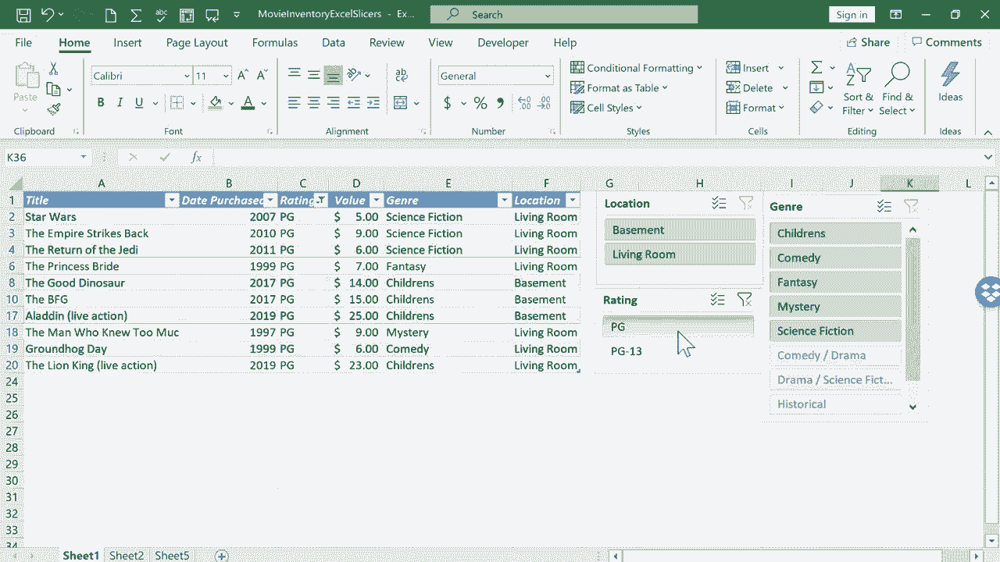

# Excel高级教程（持续更新中） - P9：9）使用切片器筛选数据 🎬

在本节课中，我们将学习如何在Excel中使用切片器来精确地筛选和展示数据。切片器是传统筛选器的一种可视化替代方案，它能让数据筛选过程变得更加直观和易于操作。

## 切片器简介

上一节我们介绍了Excel中基础的排序和筛选功能。本节中我们来看看切片器。切片器本质上是筛选器的替代方案。在之前的教程中，我们演示了如何通过列标题的筛选按钮来隐藏特定数据。例如，通过取消勾选“PG-13”评级来隐藏所有相关电影。

然而，传统筛选器有时并不理想。它们可能会完全隐藏数据，导致其他使用者无法意识到这些数据的存在。此外，筛选器的操作有时也略显繁琐。因此，切片器提供了一种更优的解决方案。

## 准备工作：清理数据

在使用切片器之前，首先需要确保数据区域的整洁，这是正确创建和使用切片器的关键。

以下是清理数据的具体步骤：

1.  **删除无关标题**：如果数据区域顶部存在与表格内容无关的标题行（例如“电影库存”），需要将其删除。右键点击该行的行号，选择“删除”即可。
2.  **清除底部多余数据**：确保主要数据区域下方没有其他信息。选中这些多余的数据，右键点击并选择“清除内容”。同样，清除右侧可能存在的无关数据。
3.  **移除格式**：对于已清除内容的单元格，可以选中后点击“开始”选项卡中的“边框”按钮，选择“无框线”来清理格式。

## 创建表格

清理数据的原因是，我们需要将普通的数据范围转换为正式的Excel表格，这是插入切片器的前提。

1.  点击数据区域内的任意单元格。
2.  转到“插入”选项卡。
3.  点击“表格”按钮。
4.  在弹出的对话框中，确认表格数据来源范围正确，然后点击“确定”。

此时，数据区域被格式化为一个表格。你可以在“表格设计”选项卡中更改其样式，但这对于后续操作并非必需。

## 插入与使用切片器

将数据转换为表格后，就可以轻松地添加切片器了。

1.  点击表格内部的任意位置。
2.  切换到“表格设计”选项卡。
3.  在“工具”组中，点击“插入切片器”。
4.  在弹出的对话框中，勾选你希望用来筛选数据的字段（例如“类型”、“存储位置”、“评级”）。
5.  点击“确定”。

Excel会为每个选中的字段生成一个独立的切片器窗口。你可以拖动和调整这些窗口的位置和大小以便查看。

现在，尝试使用切片器进行筛选：

*   点击“类型”切片器中的“喜剧”，表格将立即只显示喜剧类电影。
*   同时，其他切片器（如“存储位置”）中不符合当前筛选条件的选项会变为灰色，表示不可选。
*   再点击“评级”切片器中的“PG”，表格将进一步筛选出既是“喜剧”又是“PG”评级的电影。

要清除所有筛选并查看完整列表，需要点击每个切片器右上角的“清除筛选器”按钮（漏斗图标上带红叉）。

## 多选功能

你可能会注意到，当点击“喜剧”时，“喜剧剧”选项被排除在外。为了同时选择多个选项，需要使用“多选”功能。

1.  在切片器上，点击“多选”按钮（图标通常为复选框或带加号的光标）。
2.  启用多选后，你就可以依次点击“喜剧”和“喜剧剧”，表格将显示同时包含这两种类型的电影。

## 总结

本节课中，我们一起学习了Excel中切片器的强大功能。我们首先了解了为何切片器是比传统筛选更好的选择。接着，我们完成了使用前的准备工作，即清理数据并将其转换为正式表格。然后，我们逐步演示了如何插入切片器，并通过点击按钮进行直观的数据筛选。最后，我们还掌握了“多选”功能，以便进行更灵活的筛选组合。

通过切片器，你可以快速、直观地生成特定数据的子集，并以清晰的方式展示出来，极大地提升了数据分析和展示的效率。

😊
