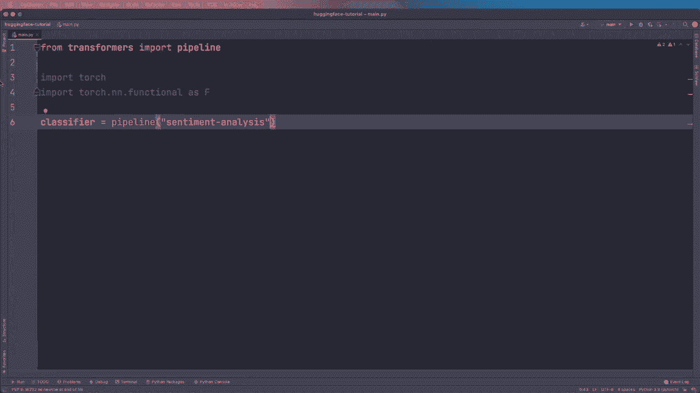
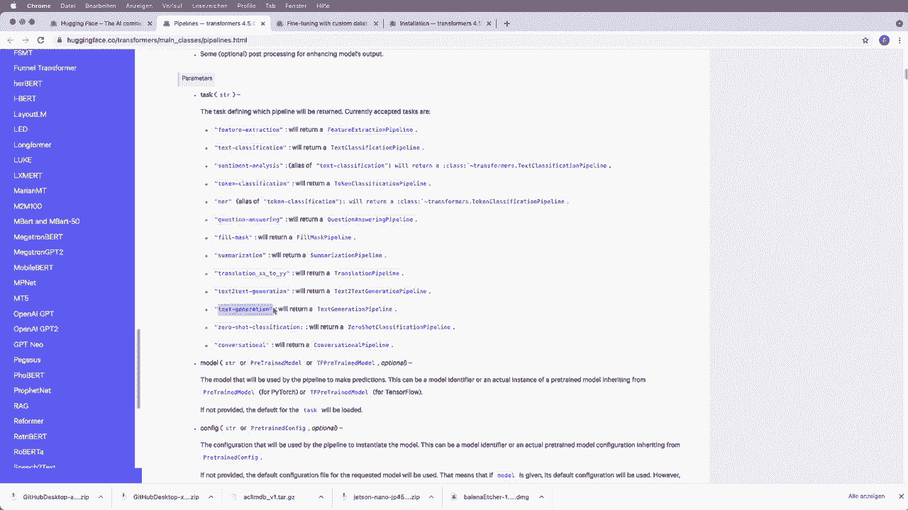
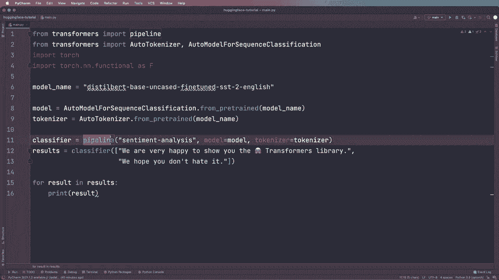

# Hugging Face 速成指南！P2：L2 - Pipeline 管道 🚀

在本节课中，我们将要学习如何使用 Hugging Face Transformers 库中的 `pipeline` 工具。`pipeline` 是一个高级 API，它抽象了模型加载、预处理和后处理的复杂步骤，让用户能够用几行代码快速执行各种自然语言处理任务，例如情感分析。我们将从安装开始，逐步学习如何使用默认管道、处理多个输入以及如何自定义模型和分词器。

---

## 安装与导入 📦

首先，需要安装 PyTorch 或 TensorFlow 作为后端框架。接着，通过 pip 安装 Transformers 库。安装命令如下：

```bash
pip install transformers
```

安装完成后，我们可以在代码中导入必要的模块。

```python
# 导入 pipeline
from transformers import pipeline

# 导入 PyTorch 相关工具（如果使用 PyTorch 后端）
import torch
import torch.nn.functional as F
```

---



## 使用默认管道进行情感分析 😊



上一节我们介绍了如何安装和导入库，本节中我们来看看如何使用 `pipeline` 执行情感分析任务。`pipeline` 将模型推断过程封装成一个简单的接口。

以下是创建一个情感分析管道的步骤：

1.  使用 `pipeline` 函数，并指定任务为 `"sentiment-analysis"`。
2.  将待分析的文本传递给创建好的分类器。

```python
# 创建情感分析管道
classifier = pipeline("sentiment-analysis")

# 对单个文本进行分类
result = classifier("We are very happy to show you the 🤗 Transformers library.")
print(result)
```

运行上述代码，你将得到类似以下的输出：

```
[{'label': 'POSITIVE', 'score': 0.9998}]
```

输出表明模型以很高的置信度（0.9998）判定该句子为正面情感。正如你所见，仅用两行代码就完成了情感分析。

---

## 处理多个文本输入 📝

我们不仅可以分析单个句子，还可以一次性分析一个文本列表。这在实际应用中非常高效。

以下是处理多个文本输入的步骤：

1.  将要分析的多个文本放入一个列表中。
2.  将这个列表传递给分类器。

```python
# 对多个文本进行分类
texts = [
    "We are very happy to show you the 🤗 Transformers library.",
    "We hope you don't hate it."
]
results = classifier(texts)

# 遍历并打印结果
for result in results:
    print(result)
```

运行代码后，你将看到两个文本各自的分析结果。第二个句子“We hope you don't hate it.”可能因为语义模糊，模型给出的置信度会相对较低。

---

## 自定义模型与分词器 🔧

默认情况下，`pipeline` 会使用预定义的模型。但有时我们需要使用特定的模型或分词器。本节中我们来看看如何实现自定义。

首先，我们需要知道模型名称。例如，`distilbert-base-uncased-finetuned-sst-2-english` 是一个在 SST-2 英文情感数据集上微调过的 DistilBERT 模型。我们可以通过 `model` 参数将其传递给管道。

```python
# 指定模型名称创建管道
model_name = "distilbert-base-uncased-finetuned-sst-2-english"
classifier = pipeline("sentiment-analysis", model=model_name)
```

为了获得更大的灵活性，我们可以分别加载模型和分词器，然后将它们传递给 `pipeline`。

以下是分别加载模型和分词器的步骤：

1.  从 `transformers` 导入 `AutoTokenizer` 和 `AutoModelForSequenceClassification`。
2.  使用 `from_pretrained` 方法加载指定的预训练模型和分词器。
3.  将加载好的模型和分词器实例传递给 `pipeline`。

```python
from transformers import AutoTokenizer, AutoModelForSequenceClassification

# 分别加载模型和分词器
model_name = "distilbert-base-uncased-finetuned-sst-2-english"
model = AutoModelForSequenceClassification.from_pretrained(model_name)
tokenizer = AutoTokenizer.from_pretrained(model_name)

# 将自定义的模型和分词器传入管道
classifier = pipeline("sentiment-analysis", model=model, tokenizer=tokenizer)
```

`from_pretrained` 是 Hugging Face 库的核心函数，用于加载预训练模型和分词器。如果你使用 TensorFlow，只需将类名前的 `Auto` 替换为 `TFAuto`（例如 `TFAutoModelForSequenceClassification`），其余步骤相同。

运行自定义配置的管道，你将得到与之前相同的结果，因为这里使用的模型与默认模型一致。但通过这种方式，你已经掌握了如何切换到任何其他兼容的模型。

---

## 总结 🎯

本节课中我们一起学习了 Hugging Face Transformers 库中 `pipeline` 工具的使用。

*   我们首先完成了环境安装与库的导入。
*   接着，我们使用默认的 `pipeline` 快速实现了情感分析，并学会了如何处理单个及多个文本输入。
*   最后，我们深入探讨了如何通过指定模型名称或分别加载模型与分词器来自定义 `pipeline`，这为使用特定模型提供了灵活性。



`pipeline` 极大地简化了模型推断的流程，是快速原型开发和入门学习的强大工具。在后续课程中，我们将探索更多不同的任务管道及其高级用法。