# Hugging Face速成指南！P5：L5- 模型保存和加载 💾

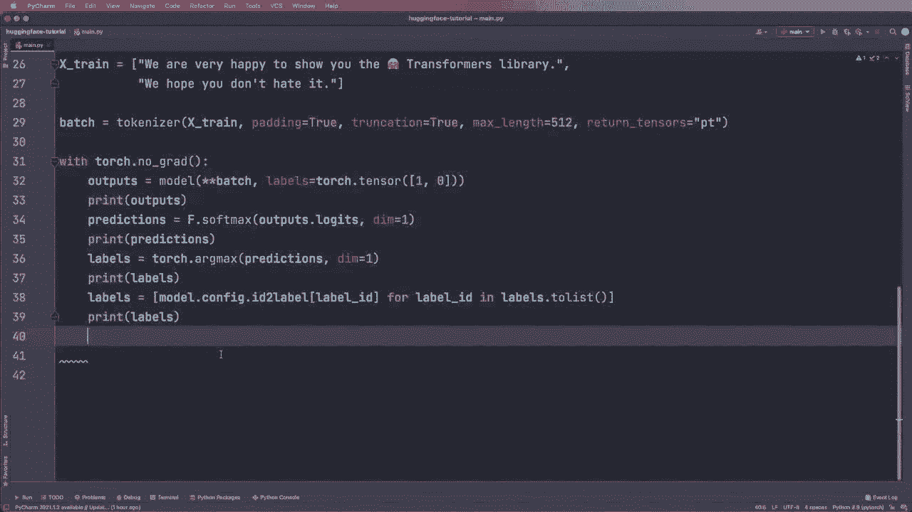


在本节课中，我们将要学习如何保存和加载Hugging Face的模型与分词器。这是将训练好的模型部署到其他应用或分享给他人的关键步骤。

## 概述

保存模型和分词器意味着将它们的配置、权重和词汇表等所有必要信息存储到本地文件夹中。加载则是从这些保存的文件中恢复出可用的模型和分词器对象。`save_pretrained`和`from_pretrained`是实现这两个功能的核心方法。

## 保存模型与分词器

上一节我们介绍了如何使用预训练模型。本节中我们来看看如何将它们保存到本地。

首先，你需要指定一个保存目录。例如，我们可以创建一个名为`saved`的文件夹。然后分别调用分词器和模型的`save_pretrained`方法。

以下是保存模型和分词器的基本步骤：

1.  **指定保存目录**：创建一个文件夹路径，例如 `./saved`。
2.  **保存分词器**：调用分词器的 `save_pretrained()` 方法。
3.  **保存模型**：调用模型的 `save_pretrained()` 方法。

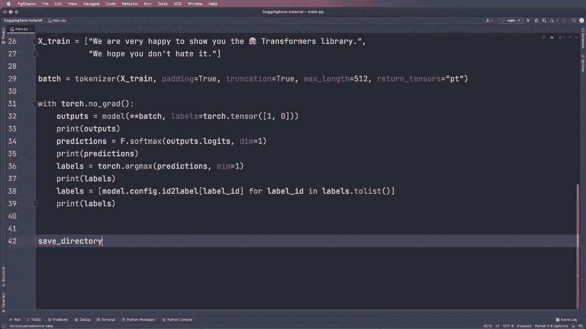

核心操作可以用以下代码描述：

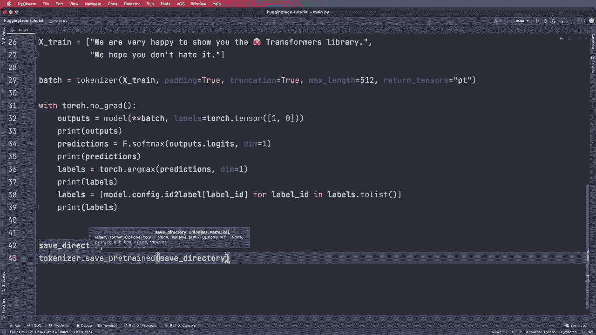

```python
# 假设 tokenizer 和 model 已经加载
save_directory = “./saved”

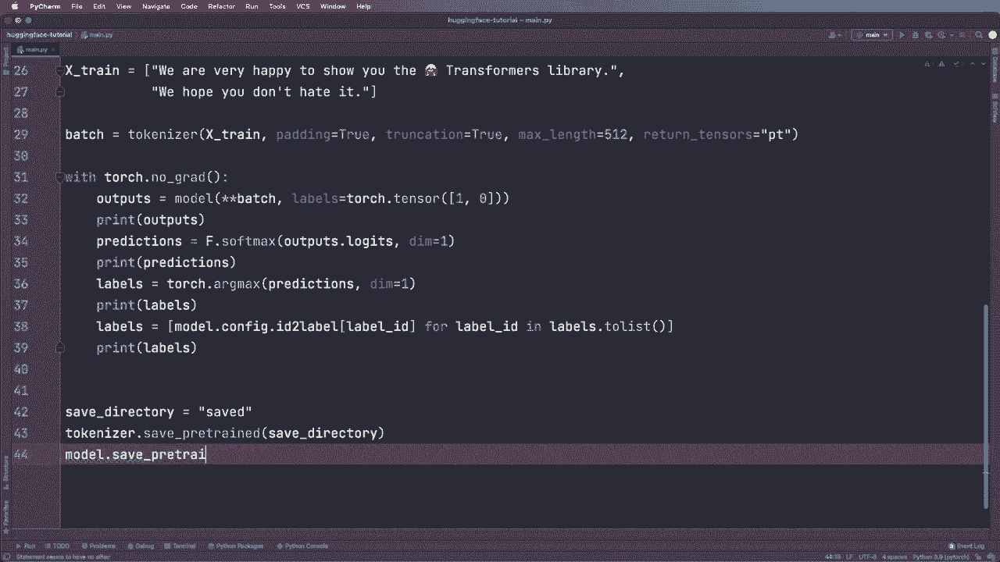

# 保存分词器
tokenizer.save_pretrained(save_directory)

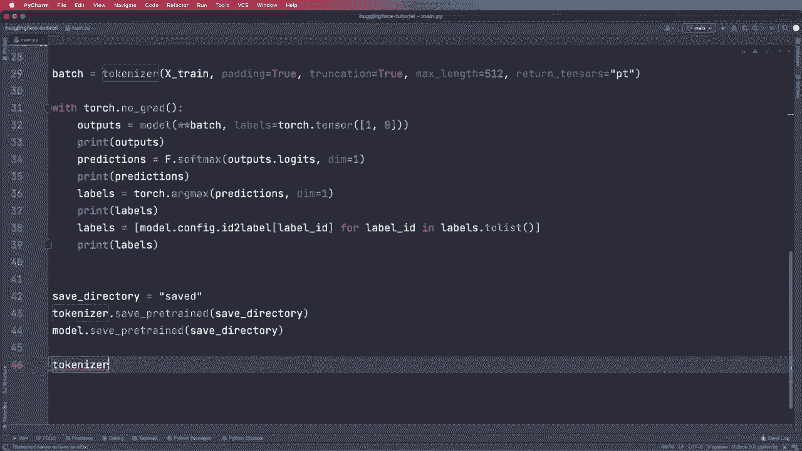

# 保存模型
model.save_pretrained(save_directory)
```

执行后，`saved`文件夹内将包含模型架构、权重和分词器词汇表等所有必要文件。

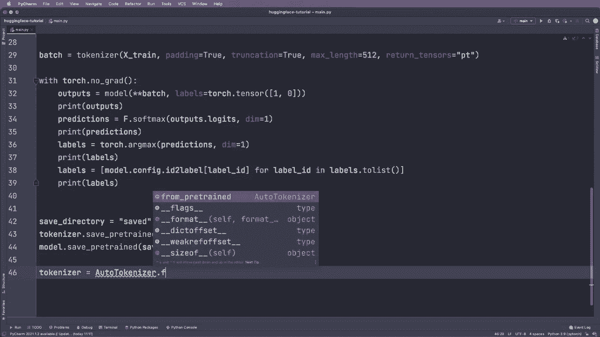


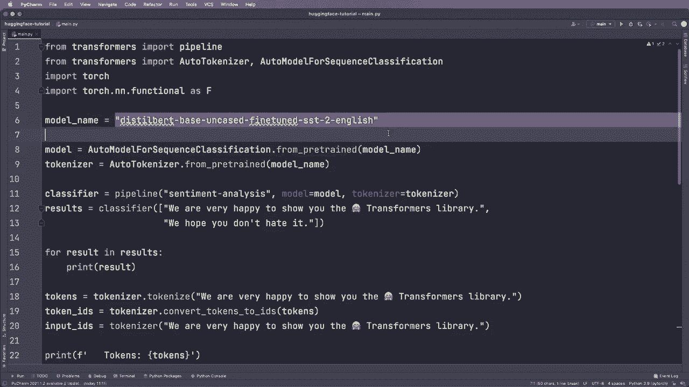

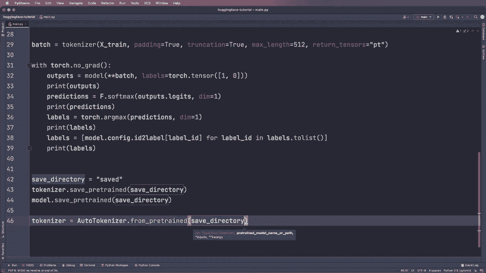

## 加载已保存的模型与分词器


保存之后，我们便可以在另一个应用程序或脚本中加载它们。加载过程同样使用`from_pretrained`方法，但这次参数是本地目录路径，而不是线上的模型名称。

以下是加载本地模型和分词器的步骤：

1.  **加载分词器**：使用 `AutoTokenizer.from_pretrained()` 并传入保存目录。
2.  **加载模型**：使用相应的模型类（如 `AutoModelForSequenceClassification.from_pretrained()`）并传入相同的保存目录。

这个过程可以用代码清晰地表示：

```python
from transformers import AutoTokenizer, AutoModelForSequenceClassification

save_directory = “./saved”

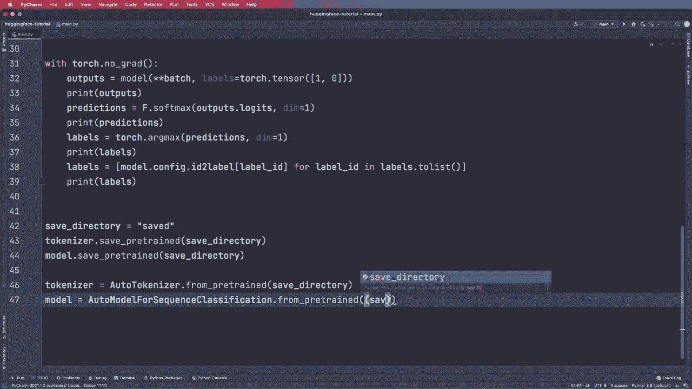

# 加载分词器
tokenizer = AutoTokenizer.from_pretrained(save_directory)

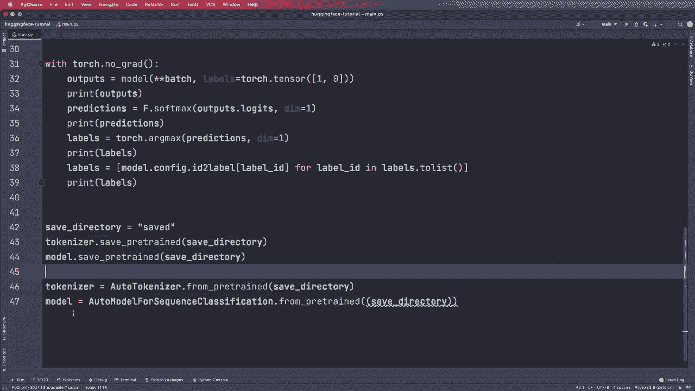

# 加载模型
model = AutoModelForSequenceClassification.from_pretrained(save_directory)
```

这样，你就得到了与保存前完全相同的模型和分词器，可以立即用于推理或进一步训练。

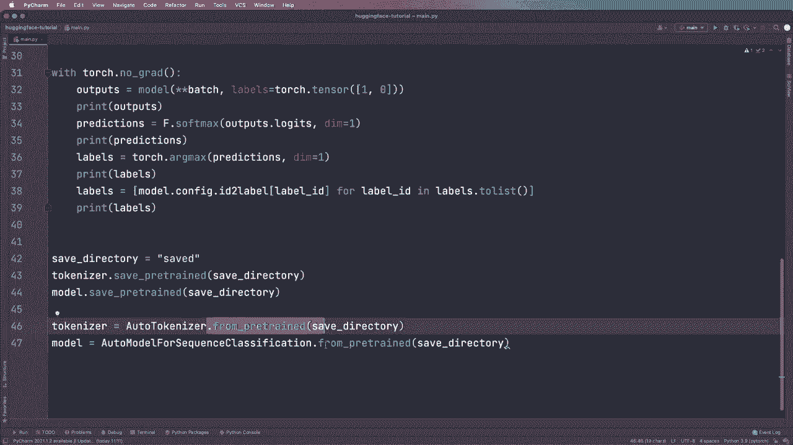


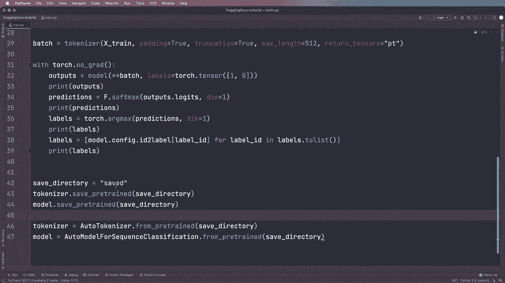
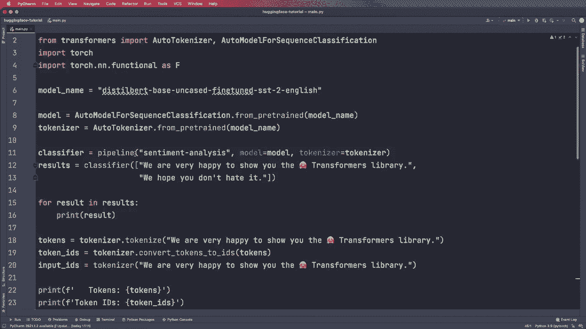


`from_pretrained`函数非常强大，它既可以接受Hugging Face模型中心的模型名称，也可以接受本地目录路径。这是你构建管道或手动应用模型和分词器所需的基本功能。


## 总结

本节课中我们一起学习了Hugging Face Transformers库中模型与分词器的保存与加载。我们掌握了使用`save_pretrained`方法将对象保存到本地目录，以及使用`from_pretrained`方法从本地目录或线上仓库加载对象。这是模型部署和分享的基础，`from_pretrained`函数是你未来会频繁使用的核心工具。