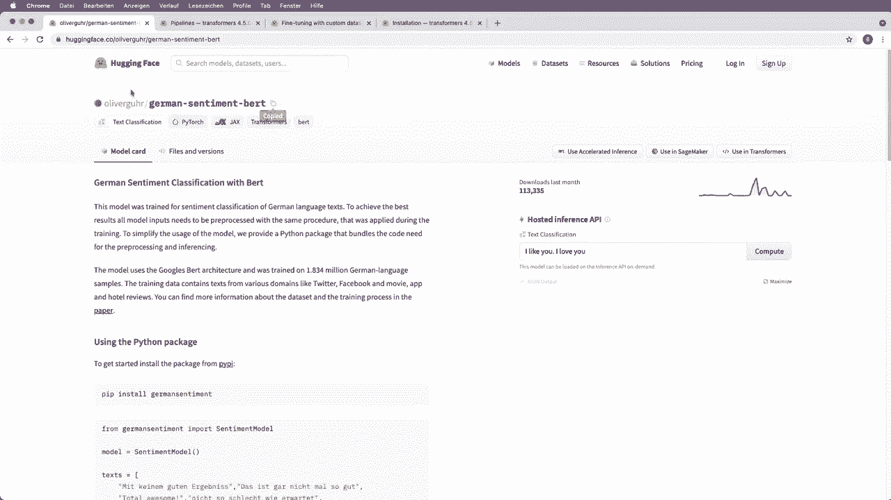
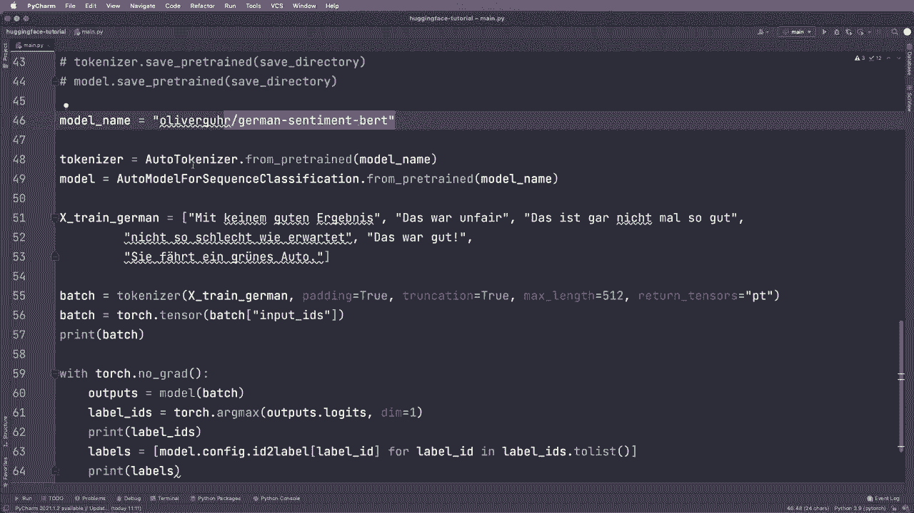

# Hugging Face速成指南！P6：L6- 模型中心(Hub) 🏛️

在本节课中，我们将学习如何从Hugging Face模型中心（Hub）搜索、选择并使用不同的预训练模型。我们将以情感分析任务为例，演示如何为特定语言（如德语）加载和使用模型。

---

## 概述

Hugging Face模型中心是一个包含海量预训练模型的在线仓库。你可以根据任务、语言、框架等条件筛选模型，并轻松将其集成到你的代码中。本节将指导你完成从模型中心查找模型到在代码中应用它的完整流程。

---

## 从模型中心加载模型

上一节我们介绍了如何使用本地模型。本节中我们来看看如何从Hugging Face模型中心加载并使用不同的模型。

你可以访问 `huggingface.co/models` 进入模型中心。在这里，你可以搜索和筛选模型。例如，如果你想进行文本分类（即情感分析），可以按任务进行过滤。

以下是如何操作的步骤：

1.  访问模型中心网站。
2.  在筛选器中，选择“Text Classification”任务。
3.  页面会显示最受欢迎的文本分类模型。

找到感兴趣的模型后，点击进入其详情页。详情页通常包含模型描述、使用示例和代码片段。你可以复制页面上显示的模型名称，用于你的代码。

例如，我们之前使用的模型名称是 `distilbert-base-uncased-finetuned-sst-2-english`。

---

## 为特定语言选择模型



现在，假设我们需要一个针对德语进行情感分析的模型。

以下是选择德语模型的步骤：

1.  在模型中心的搜索或筛选栏中，输入“german”或“german sentiment”。
2.  从结果中选择一个受欢迎的模型，例如 `oliverguhr/german-sentiment-bert`。
3.  进入模型详情页，复制其模型名称。

在代码中，我们只需将新的模型名称字符串赋值给变量，即可替换原有模型。

```python
model_name = "oliverguhr/german-sentiment-bert"
```

然后，将这个 `model_name` 同时用于初始化分词器（Tokenizer）和模型（Model）。

```python
from transformers import AutoTokenizer, AutoModelForSequenceClassification

tokenizer = AutoTokenizer.from_pretrained(model_name)
model = AutoModelForSequenceClassification.from_pretrained(model_name)
```

---

## 使用新模型进行推理

模型和分词器准备就绪后，就可以处理新的文本了。

我们准备一些德语句子作为示例输入：

```python
texts_german = [
    "Das ist kein gutes Ergebnis.",
    "Das ist unfair.",
    "Das ist nicht gut",
    "Nicht so schlecht wie erwartet.",
    "Das ist gut.",
    "Sie fährt ein grünes Auto."
]
```

以下是完整的推理步骤：

1.  使用分词器对文本进行编码。
2.  将编码后的输入传递给模型。
3.  从模型输出中获取预测结果。

```python
# 1. 对文本进行编码
batch = tokenizer(texts_german, padding=True, truncation=True, return_tensors="pt")

# 2. 模型推理（不计算梯度）
import torch
with torch.no_grad():
    outputs = model(**batch)

# 3. 获取预测的标签ID
predictions = torch.argmax(outputs.logits, dim=-1)

# 4. 将标签ID转换为可读的标签名称
labels = [model.config.id2label[label_id] for label_id in predictions.tolist()]

print("预测的标签:", labels)
```

运行上述代码，模型应能正确识别出句子的情感倾向（正面、负面或中性）。

---

## 关于 `return_tensors` 参数的说明

在调用分词器时，参数 `return_tensors="pt"` 指定返回PyTorch张量格式。如果不指定此参数，分词器将返回Python列表。

如果你使用PyTorch，指定 `return_tensors="pt"` 会更方便，因为可以直接将输出传递给模型。如果返回的是列表，你需要手动将其转换为张量：

```python
# 如果不指定 return_tensors，得到的是字典列表
batch = tokenizer(texts_german, padding=True, truncation=True)

# 手动将 input_ids 转换为 PyTorch 张量
input_ids = torch.tensor(batch['input_ids'])
attention_mask = torch.tensor(batch['attention_mask'])

# 然后传递给模型
outputs = model(input_ids=input_ids, attention_mask=attention_mask)
```

因此，根据你使用的深度学习框架，合理设置 `return_tensors` 参数（`"pt"` 对应PyTorch，`"tf"` 对应TensorFlow）可以简化代码。

---

## 总结



本节课中我们一起学习了如何使用Hugging Face模型中心。关键步骤包括：根据任务和语言在模型中心筛选模型、复制模型名称、在代码中加载模型与分词器，以及使用新模型进行预测。你还了解了 `return_tensors` 参数的作用。现在，你可以尝试为其他任务或语言寻找并测试不同的模型了。