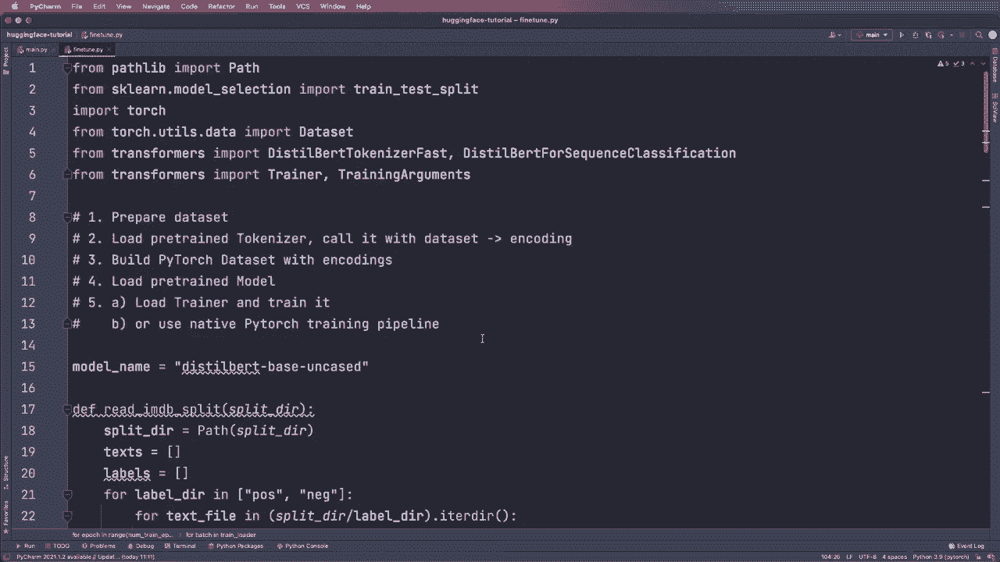
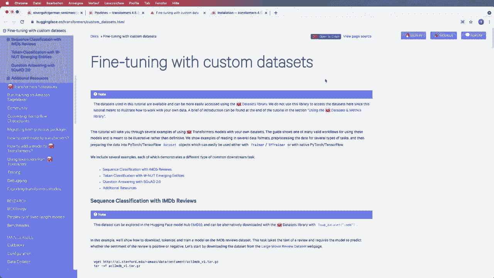
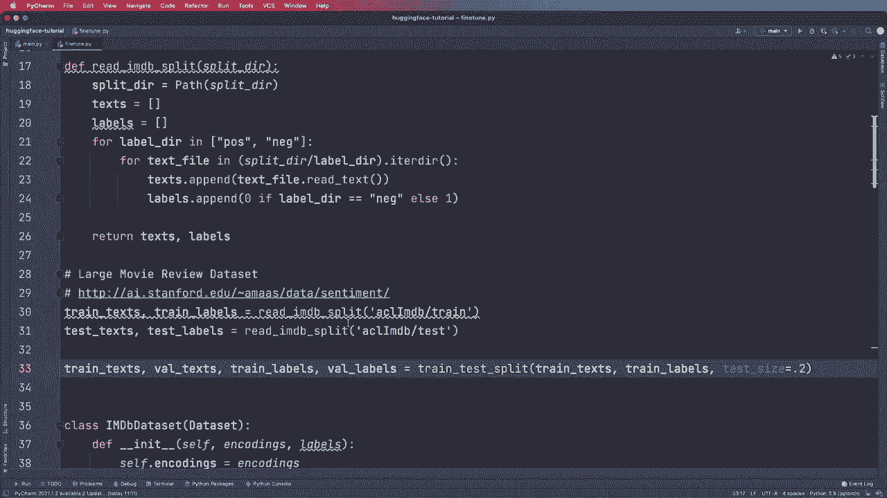
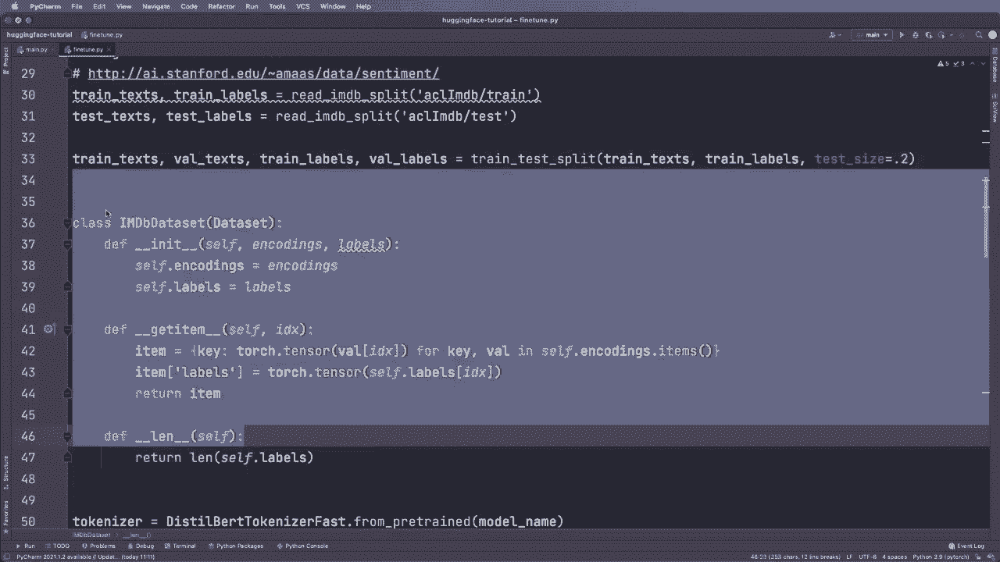
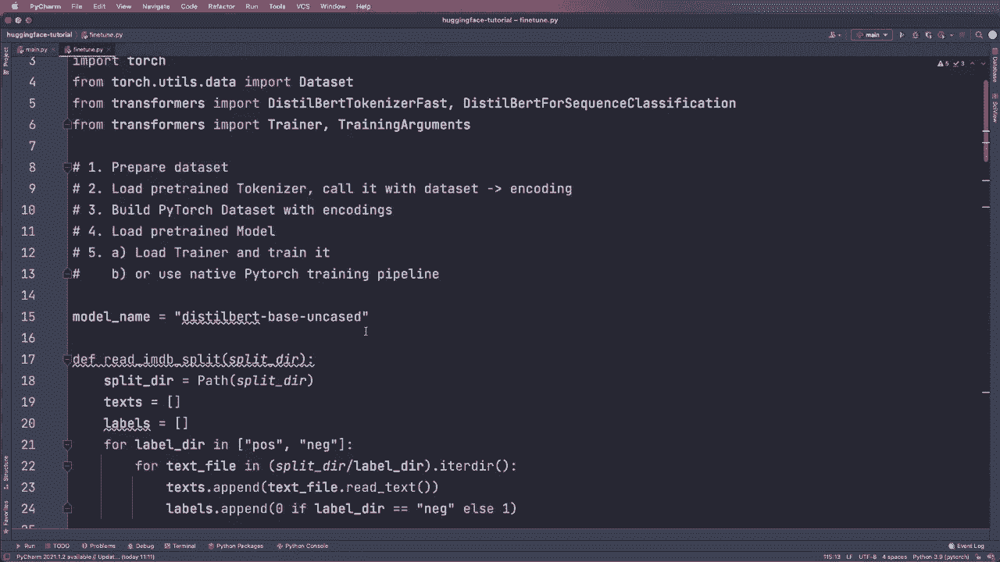

# Hugging Face速成指南！P7：L7- 微调(Fine Tuning) 🎯

在本节课中，我们将学习如何使用Hugging Face的Transformers库来微调一个预训练模型。微调是使通用模型适应特定任务的关键步骤，我们将通过一个情感分类的例子来演示完整的流程。

## 概述 📋

微调预训练模型通常涉及几个核心步骤：准备数据集、加载分词器进行编码、构建数据集对象、加载预训练模型，最后进行训练。我们将介绍两种训练方式：使用Hugging Face提供的便捷`Trainer`类，以及使用原生的PyTorch训练循环以获得更多控制权。





## 微调步骤详解

### 1. 准备数据集

首先，我们需要准备用于训练和评估的数据。在这个例子中，我们使用一个电影评论数据集进行情感分类。

以下是数据准备步骤：
*   从CSV文件或其他数据源加载原始文本和对应的标签。
*   将数据集划分为训练集和验证集。

### 2. 加载分词器并编码数据

我们需要使用与预训练模型配套的分词器来处理文本数据。

以下是关键操作：
*   使用`AutoTokenizer.from_pretrained(‘模型名称’)`加载分词器。
*   调用分词器对训练集和验证集的文本进行编码，将其转换为模型可接受的输入格式（即`input_ids`, `attention_mask`等）。

### 3. 构建PyTorch数据集

将编码后的数据封装成PyTorch的`Dataset`对象，便于后续使用`DataLoader`进行批量加载。





代码示例如下：
```python
from torch.utils.data import Dataset

class CustomDataset(Dataset):
    def __init__(self, encodings, labels):
        self.encodings = encodings
        self.labels = labels

    def __getitem__(self, idx):
        item = {key: val[idx] for key, val in self.encodings.items()}
        item[‘labels’] = self.labels[idx]
        return item

    def __len__(self):
        return len(self.labels)

train_dataset = CustomDataset(train_encodings, train_labels)
eval_dataset = CustomDataset(eval_encodings, eval_labels)
```

### 4. 加载预训练模型

使用`AutoModelForSequenceClassification.from_pretrained`加载一个用于序列分类的预训练模型。这将自动在原始模型基础上添加一个适合我们任务（例如二分类）的分类头。

### 5. 进行训练

上一节我们介绍了数据和模型的准备，本节中我们来看看如何进行训练。主要有两种方式。

#### 方式一：使用Hugging Face Trainer（推荐）

`Trainer`类封装了训练循环、评估和日志记录等功能，极大简化了流程。

以下是配置和启动训练的步骤：
*   定义`TrainingArguments`来设置训练参数，如训练轮次`num_train_epochs`、输出目录`output_dir`和学习率`learning_rate`。
*   初始化`Trainer`，传入模型、训练参数、训练数据集和评估数据集。
*   调用`trainer.train()`开始训练。训练结束后，可以使用`trainer.evaluate()`在测试集上评估模型性能。

#### 方式二：使用原生PyTorch训练循环

如果需要更细致的控制（如自定义损失函数、优化策略），可以使用标准的PyTorch训练流程。

以下是手动训练循环的关键步骤：
*   创建`DataLoader`用于批量加载数据。
*   定义优化器（如`AdamW`），并将模型移至GPU（如果可用）。
*   将模型设置为训练模式（`model.train()`）。
*   遍历每个训练轮次（epoch）和每个批次（batch），执行标准操作：`optimizer.zero_grad()` -> 前向传播 -> 计算损失 -> `loss.backward()` -> `optimizer.step()`。
*   训练完成后，将模型设置为评估模式（`model.eval()`）进行验证或测试。

## 总结 🎉



本节课中我们一起学习了微调Hugging Face预训练模型的完整流程。我们掌握了从数据准备、分词编码到模型训练的每一步，并了解了两种主要的训练方式：使用便捷的`Trainer`类以及灵活性更高的原生PyTorch循环。微调后的模型可以更好地适应你的特定任务，并且可以保存下来供后续使用，甚至上传到Hugging Face模型中心与社区分享。