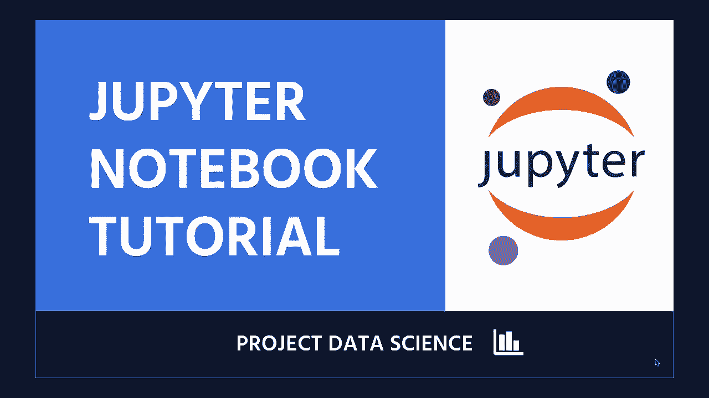
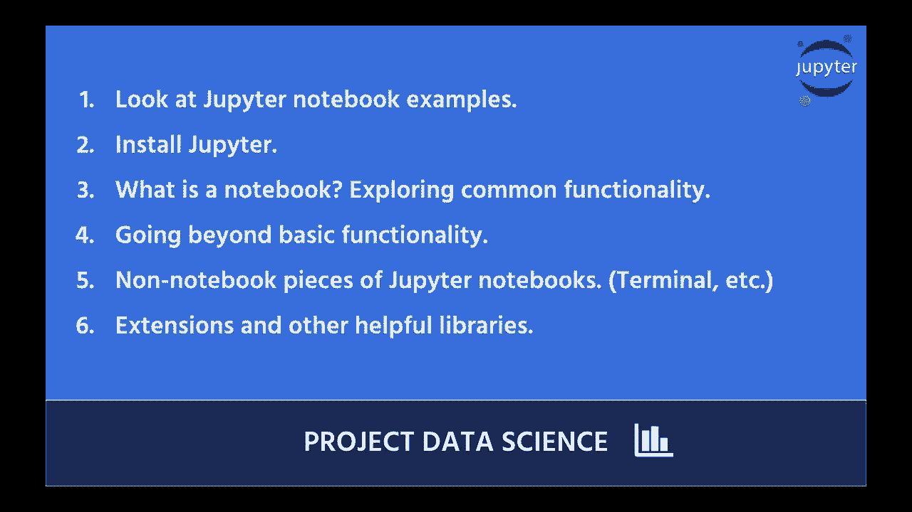

# Jupyter Notebook 超棒教程！P1：介绍与安装 🚀

在本节课中，我们将要学习 Jupyter Notebook 的基础知识。这是一个面向初学者的直截了当的介绍，适合从未使用过 Jupyter Notebook 的人。我们将通过实践来学习，因此建议你准备好电脑并跟随教程一起操作。

我们将学习相当多的内容，并且我们将在 Jupyter Notebook 中进行。数据科学项目就是通过实践来学习，因此我希望你能有一台电脑并跟着我一起学习。

让我们来谈谈我们在本教程中要做的事情。

## 第一步：查看示例 Notebook 📖

首先，我们将查看几个 Jupyter Notebook，以便奠定基础。这有助于我们直观地理解 Notebook 的结构和功能。

## 第二步：安装 Jupyter Notebook 💻

接下来，我们将安装 Jupyter Notebook。我会帮助你在一个良好的虚拟环境中安装 Python 和 Jupyter Notebook。

以下是安装步骤：

1.  **安装 Python**：确保你的系统已安装 Python。可以从 [python.org](https://www.python.org/) 下载。
2.  **创建虚拟环境（推荐）**：在命令行中运行 `python -m venv myenv` 来创建一个隔离的环境。
3.  **激活虚拟环境**：
    *   Windows: `myenv\Scripts\activate`
    *   macOS/Linux: `source myenv/bin/activate`
4.  **安装 Jupyter**：在激活的虚拟环境中，运行 `pip install jupyter`。

## 第三步：启动与探索 Notebook ❓

安装完成后，我们将打开 Jupyter Notebook，并提出问题：什么是 Notebook？我们将开始探索其界面和基本概念。

你可以通过在命令行中运行 `jupyter notebook` 来启动它。这将在你的浏览器中打开 Jupyter 的主界面。

## 第四步：常见操作指南 ⚙️

上一节我们介绍了如何启动 Notebook，本节中我们来看看除了基本功能之外，你还可以在 Jupyter Notebook 中做的一些其他常见操作。

以下是你可以执行的一些常见任务：

*   **创建新的 Notebook**：在 Jupyter 主界面点击 “New” -> “Python 3”。
*   **执行代码单元格**：在代码单元格中按 `Shift + Enter`。
*   **添加文本单元格**：使用 Markdown 语法来添加说明和标题。
*   **保存你的工作**：Notebook 会自动保存，你也可以手动点击 “File” -> “Save and Checkpoint”。

## 第五步：深入了解其他功能 🧩

除了编辑和运行代码，Jupyter Notebook 还包含其他有用的部分和功能。

我们将查看 Jupyter Notebook 的其他部分，除了 Notebook 本身，然后我们将看看一些其他内容。

以下是一些值得探索的功能：

*   **键盘快捷键**：提高效率的关键，例如 `Esc` 进入命令模式，`A/B` 在上方/下方插入单元格。
*   **Jupyter 扩展**：可以通过 `pip install jupyter_contrib_nbextensions` 来安装，以添加更多功能，如代码折叠、目录生成等。
*   **魔术命令**：以 `%` 或 `%%` 开头的特殊命令，例如 `%matplotlib inline` 用于内嵌显示图表。

---

本节课中我们一起学习了 Jupyter Notebook 的入门知识。我们从查看示例开始，逐步完成了安装、启动和基本探索。接着，我们了解了常见的操作方法和一些高级功能，如快捷键和扩展。现在，你已经具备了开始使用 Jupyter Notebook 进行数据科学项目的基础。在接下来的课程中，我们将深入更多实际应用。