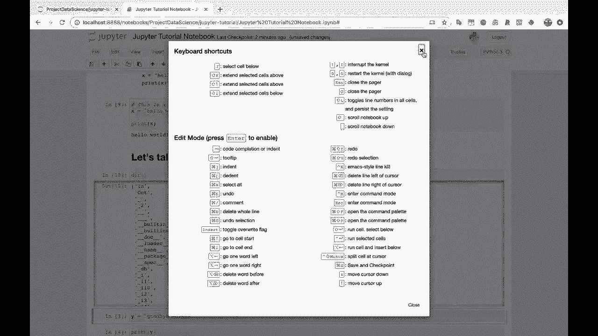
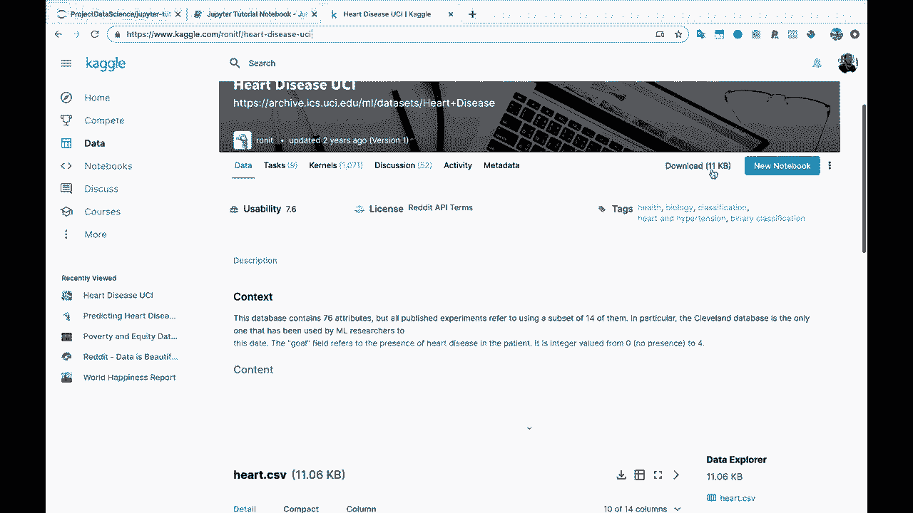
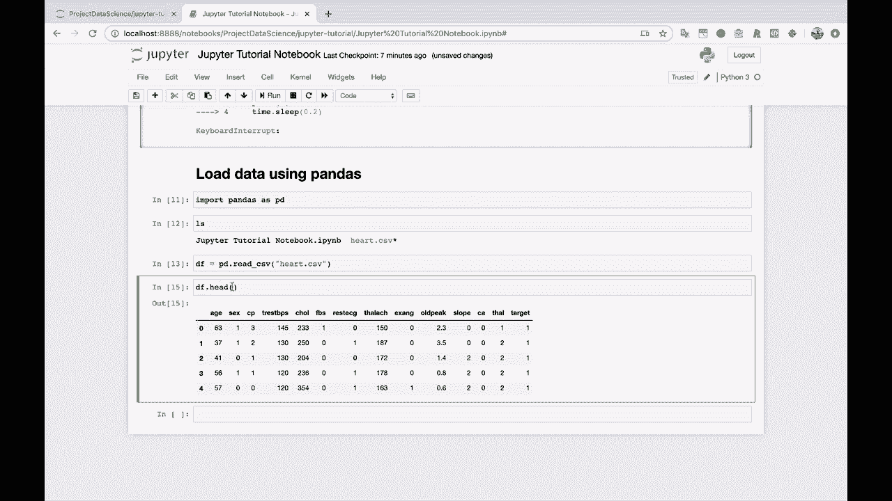

# Jupyter Notebook 超棒教程！P10：使用 pandas 加载和显示数据 📊



在本节课中，我们将学习如何在 Jupyter Notebook 中使用 pandas 库来加载和查看数据。这是进行数据分析和数据科学项目的基础步骤。

好的，你在 Jupyter 笔记本中可能会做的主要事情之一是查看、转换和清理数据。所以让我们使用 pandas 加载一些数据，看看效果如何。

## 导入 pandas 库

首先，我们需要导入 pandas 库。通常，我们会将所有的导入语句放在 Jupyter 笔记本的最顶部，以保持代码的整洁和良好的流程。

```python
import pandas as pd
```

## 准备数据文件

为了演示，我们需要一个数据文件。我们以 Kaggle 上的“心脏病 UCI 数据集”为例。你可以从相关网站下载这个 CSV 文件。

假设我们已经将文件 `heart.csv` 下载并移动到了当前的工作目录中。我们可以使用终端命令 `ls` 在 Jupyter Notebook 中验证文件是否存在。

```python
!ls
```



运行上述代码会列出当前目录下的所有文件，你应该能看到 `heart.csv`。

## 使用 pandas 读取数据

接下来，我们使用 pandas 的 `read_csv` 函数来加载数据。这个函数会将 CSV 文件的内容读取到一个名为 DataFrame 的数据结构中。

```python
df = pd.read_csv('heart.csv')
```

执行这行代码后，数据就被加载到了变量 `df` 中。

## 查看加载的数据

现在，让我们来看看数据是什么样子。在 Jupyter Notebook 中，直接输入 DataFrame 变量的名字，就可以以一种清晰、交互式的表格形式查看数据。

```python
df
```

你会看到一个表格，其中行和列都有高亮显示，并且列名是粗体的，这有助于你轻松地浏览和理解数据结构。

## 查看数据的前几行

通常，我们不需要一次性查看所有数据。使用 `head()` 方法可以方便地查看 DataFrame 的前几行（默认为前5行），这对于快速了解数据概貌非常有用。

```python
df.head()
```

运行这行代码会显示数据的前五行，包括所有的列名和对应的数据值。

## 总结

本节课中我们一起学习了在 Jupyter Notebook 中使用 pandas 库的基础操作。我们首先导入了 pandas，然后准备并验证了数据文件的存在，接着使用 `read_csv` 函数加载了数据，最后通过直接显示和 `head()` 方法查看了数据的内容。



掌握这些步骤是进行后续数据清洗、转换和分析的重要基础。