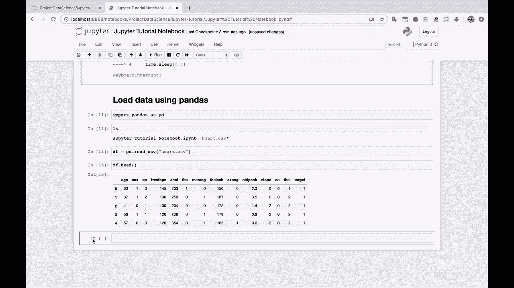
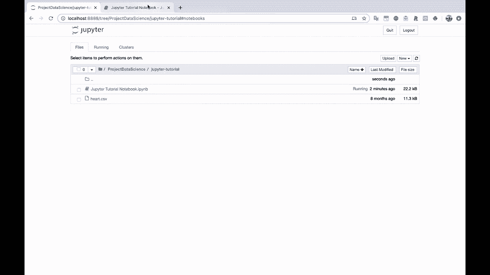
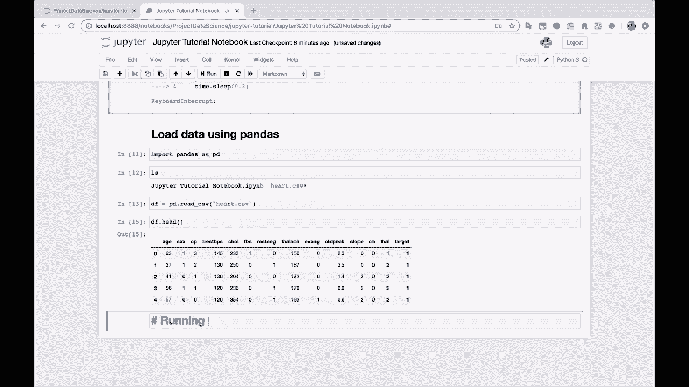
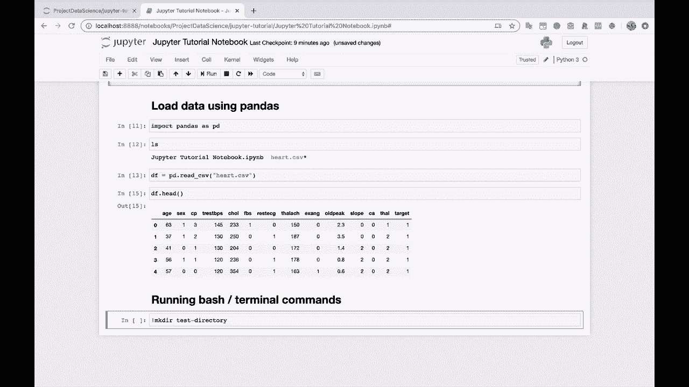
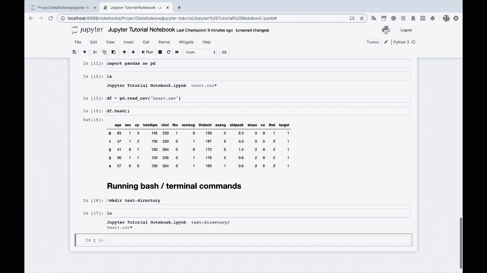
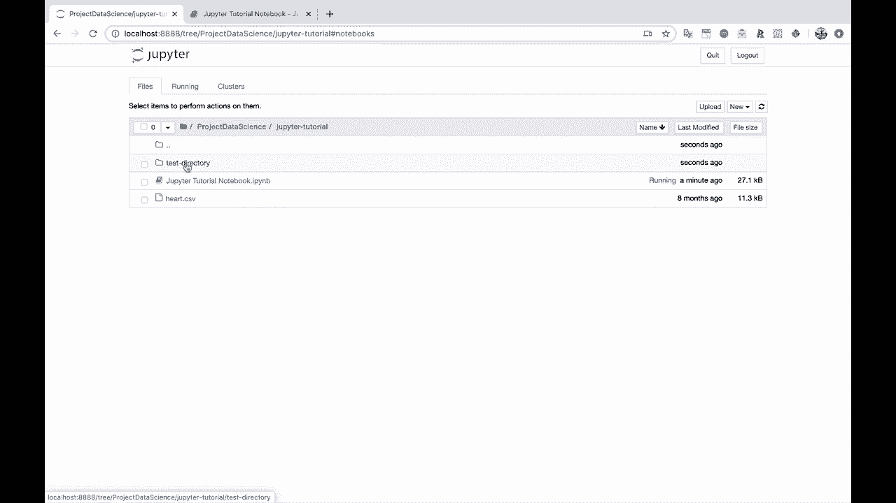
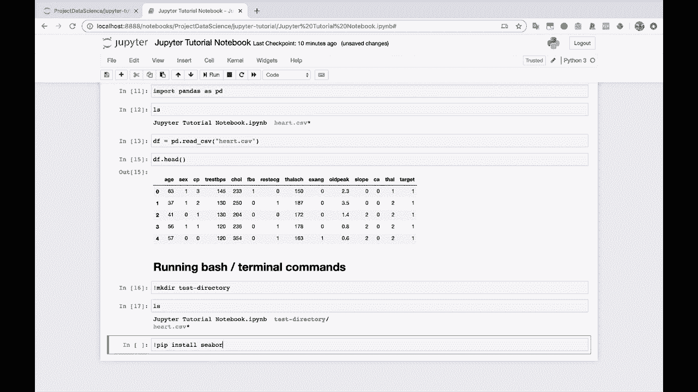
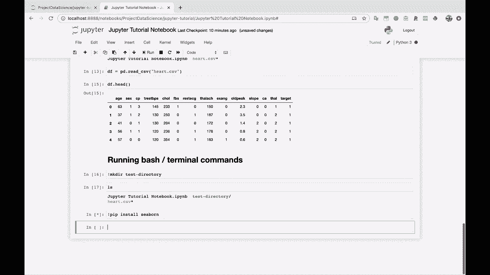
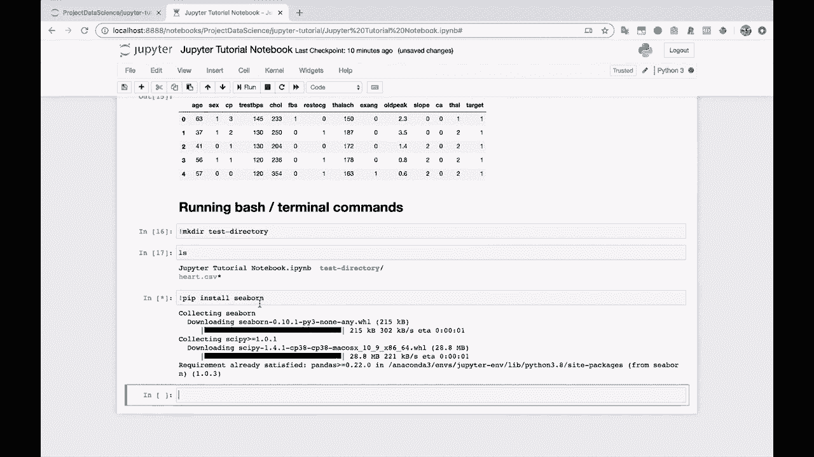
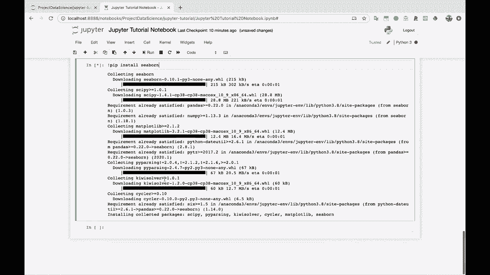

# Jupyter Notebook 超棒教程！P11：在 Jupyter Notebook 中使用终端命令 🖥️

在本节课中，我们将学习如何在 Jupyter Notebook 中直接运行终端命令。这个功能非常实用，它允许你在不离开 Notebook 环境的情况下，执行文件管理、安装包等系统级操作。



---



上一节我们介绍了 Jupyter Notebook 的核心编程功能，本节中我们来看看如何与操作系统进行交互。



关于 Jupyter Notebook 的一个优点是，即使我们主要在这里运行 Python 代码，它同时也允许你运行 Bash（终端）命令。通常，你需要使用一个特殊的语法来告诉 Jupyter Notebook 你想要运行的是 Bash 命令，而不是 Python 代码。

这个特殊语法就是在命令前加上一个感叹号 `!`。

以下是其基本用法：

```bash
!你的终端命令
```



例如，假设我们想要创建一个名为 `test_dir` 的新目录。我们可以在一个代码单元格中输入以下命令并运行：



```bash
!mkdir test_dir
```

运行后，这个目录就会被创建。为了验证，我们可以使用 `ls` 命令来列出当前目录下的所有文件和文件夹：

```bash
!ls
```

你会看到列表中包含了我们刚刚创建的 `test_dir` 目录。如果你返回到 Jupyter Notebook 的文件浏览器界面，也能看到这个新目录。



这个功能在需要安装新的 Python 包时尤其方便。例如，如果你想安装数据可视化库 `seaborn`，可以直接在 Notebook 中执行：





```bash
!pip install seaborn
```

当然，你也可以选择切换回系统终端去执行这些命令。但在 Notebook 内部完成这些操作，能让你的工作流更加集中和高效。



---



本节课中我们一起学习了如何在 Jupyter Notebook 中使用 `!` 前缀来执行终端命令。这包括创建目录、列出文件以及安装 Python 包等操作。掌握这个技巧，可以让你在数据分析或开发过程中，更灵活地管理环境和依赖，而无需频繁切换工具界面。