# Jupyter Notebook 超棒教程！P12：Jupyter Notebook 魔术命令 🪄

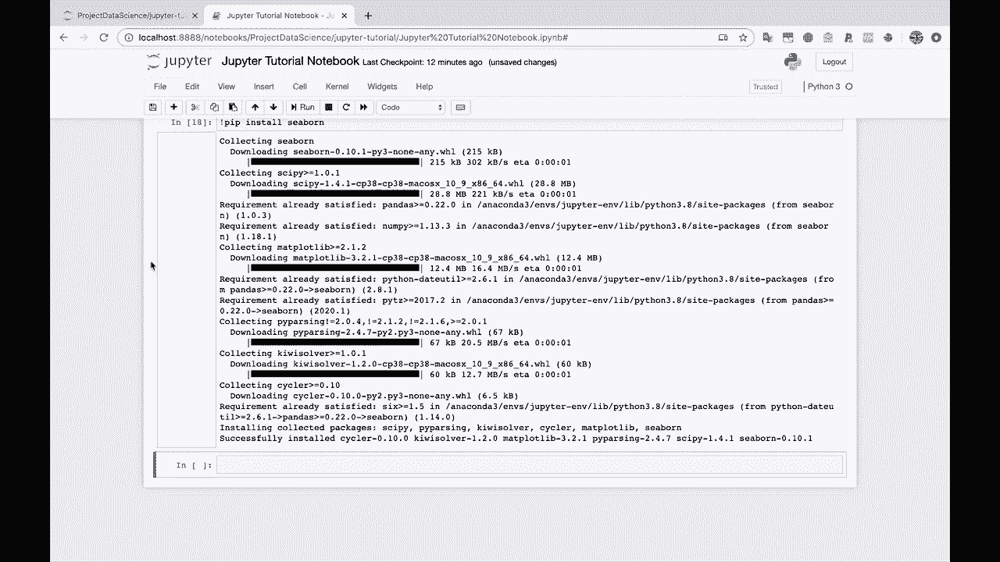

在本节课中，我们将要学习 Jupyter Notebook 中一个非常强大且独特的特性——魔术命令。这些命令以 `%` 或 `%%` 开头，提供了许多标准 Python 环境中无法实现的便捷功能，例如调试代码、测量执行时间、与操作系统交互等。

上一节我们介绍了如何保存和管理笔记本，本节中我们来看看如何利用魔术命令来提升我们的工作效率和调试能力。

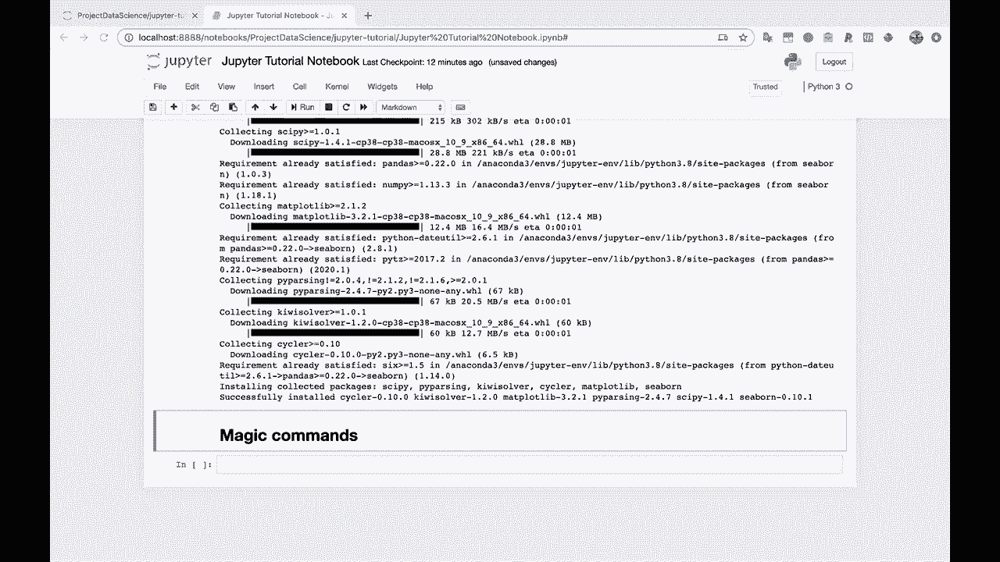

## 什么是魔术命令？

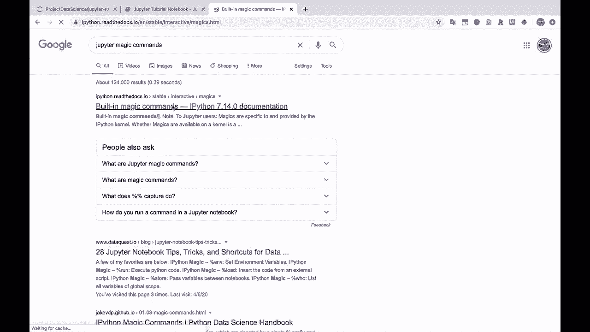

魔术命令是 Jupyter Notebook 特有的指令，它们以百分号 `%`（单行魔术命令）或两个百分号 `%%`（多行魔术命令）开头。这些命令能让你在笔记本环境中执行一些特殊操作。

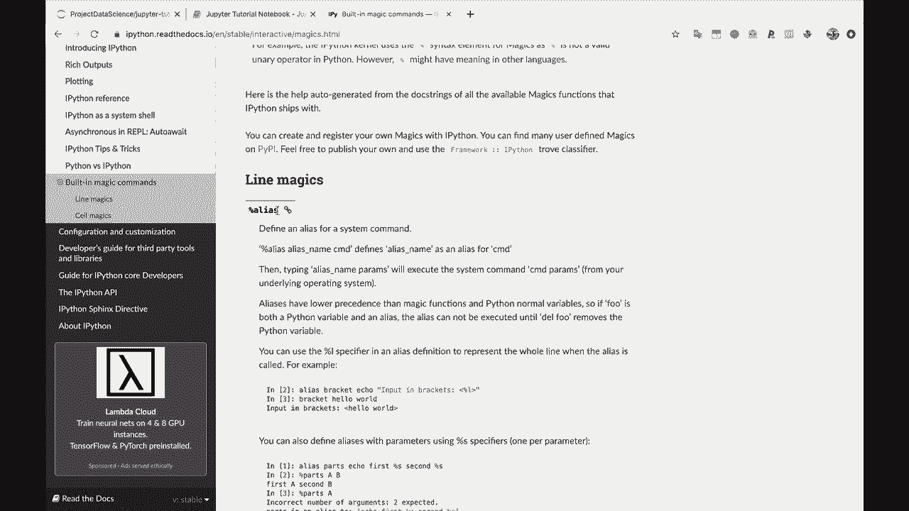

你可以通过搜索“Jupyter 魔术命令”来找到官方文档，其中列出了所有内置的魔术命令。

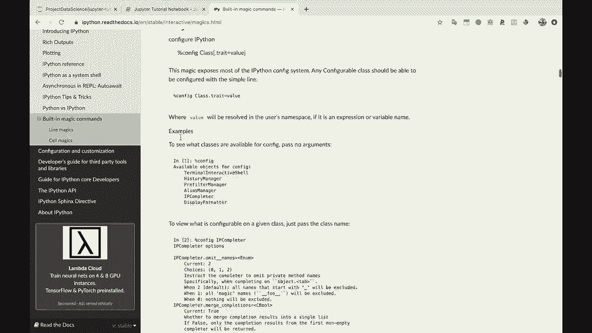

## 一个实用的例子：调试代码

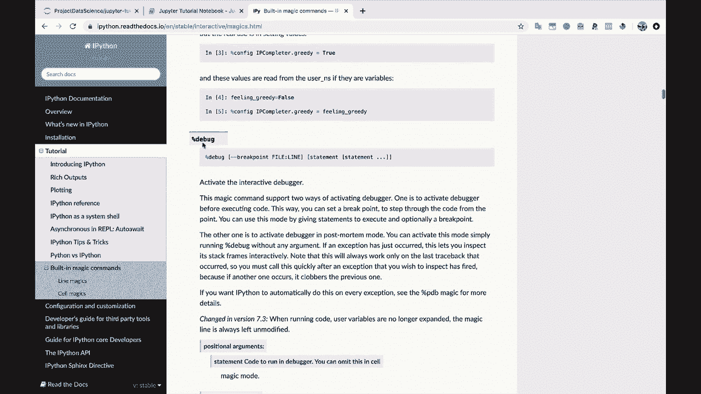

以下是 `%debug` 魔术命令的使用方法。当你的代码抛出异常时，此命令可以让你立即进入调试器，在代码崩溃的执行点进行检查。

例如，我们编写一段会引发错误的代码：

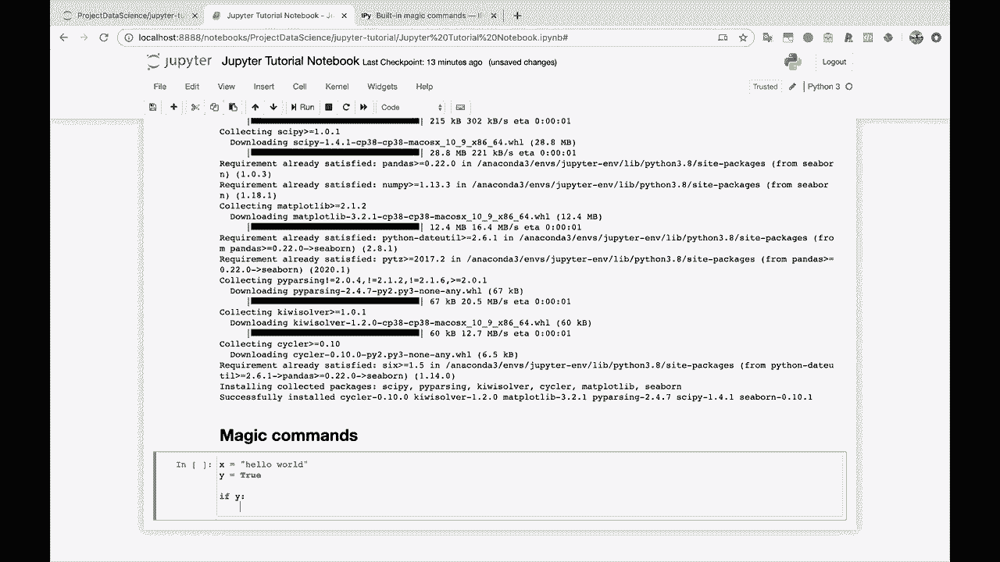

```python
x = "Hello world"
y = True
if y:
    z = 1 / 0  # 这行代码会引发 ZeroDivisionError
```

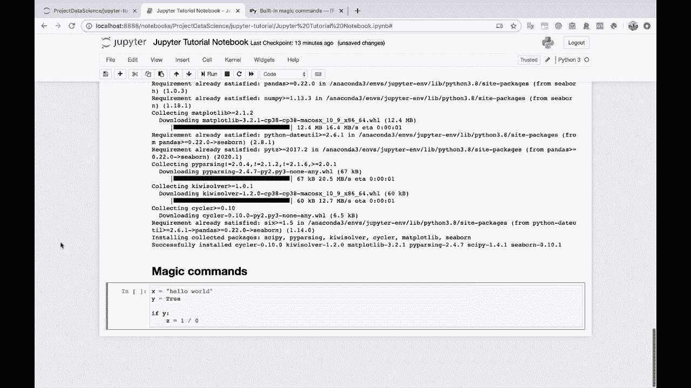

运行上述代码单元会导致程序崩溃。此时，在新的单元格中输入 `%debug` 并执行，即可启动调试器。在调试器中，你可以检查变量状态（例如打印 `y` 的值），并逐步执行代码来定位问题根源。

## 其他有用的魔术命令

魔术命令的功能非常丰富，以下是一些常用的类别和命令：

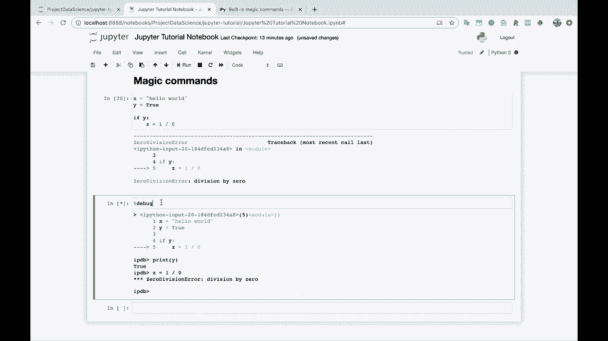

*   **性能分析**：`%timeit` 用于测量单行代码的执行时间；`%%timeit` 用于测量整个单元格代码的执行时间。
*   **代码执行**：`%run` 用于运行外部的 Python 脚本。
*   **系统交互**：`!` 前缀允许你直接执行系统 Shell 命令（例如 `!ls` 或 `!dir` 来列出文件）。
*   **信息查询**：`%who` 或 `%whos` 可以列出当前定义的所有变量。

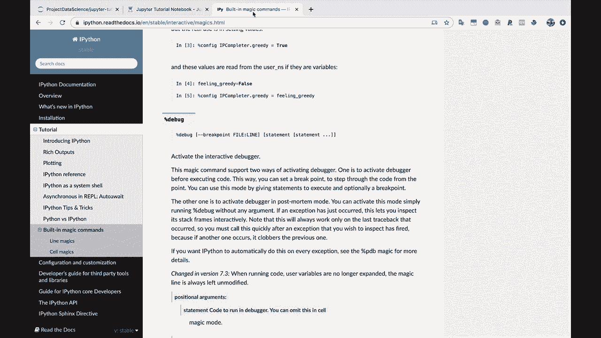

我建议你至少浏览一遍官方文档中的魔术命令列表，以便在需要时能够想起并使用它们。

## 总结

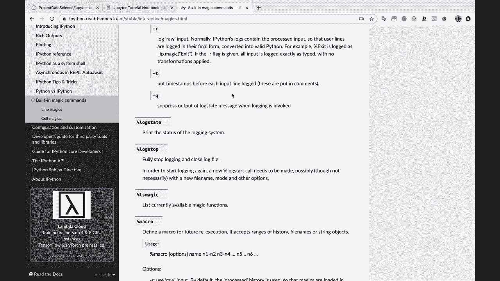

本节课中我们一起学习了 Jupyter Notebook 的魔术命令。我们了解了它们的基本概念，并通过 `%debug` 命令实践了如何调试崩溃的代码。此外，我们还简要介绍了其他几类实用的魔术命令。掌握这些命令将极大地增强你在 Jupyter Notebook 环境下的开发与调试能力。