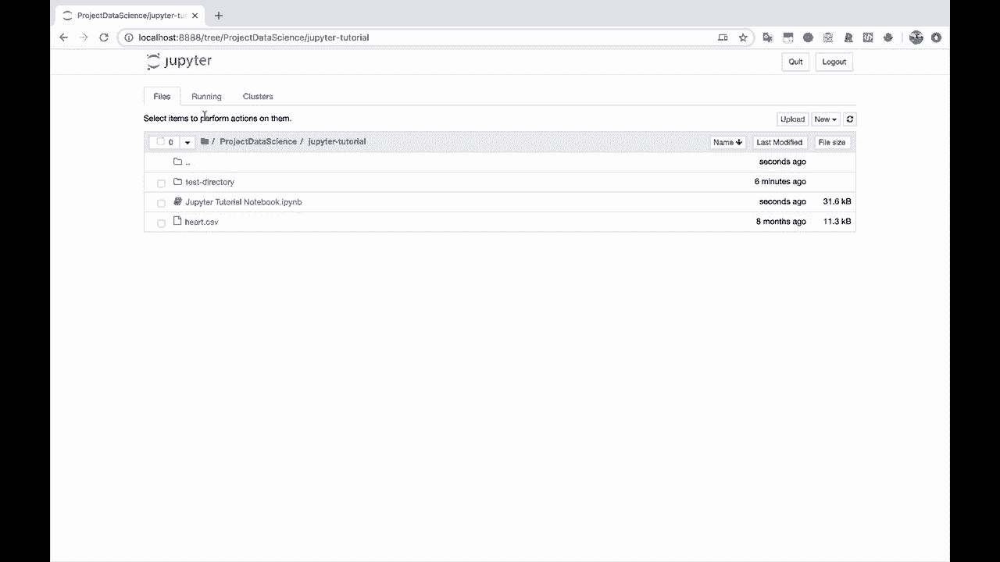
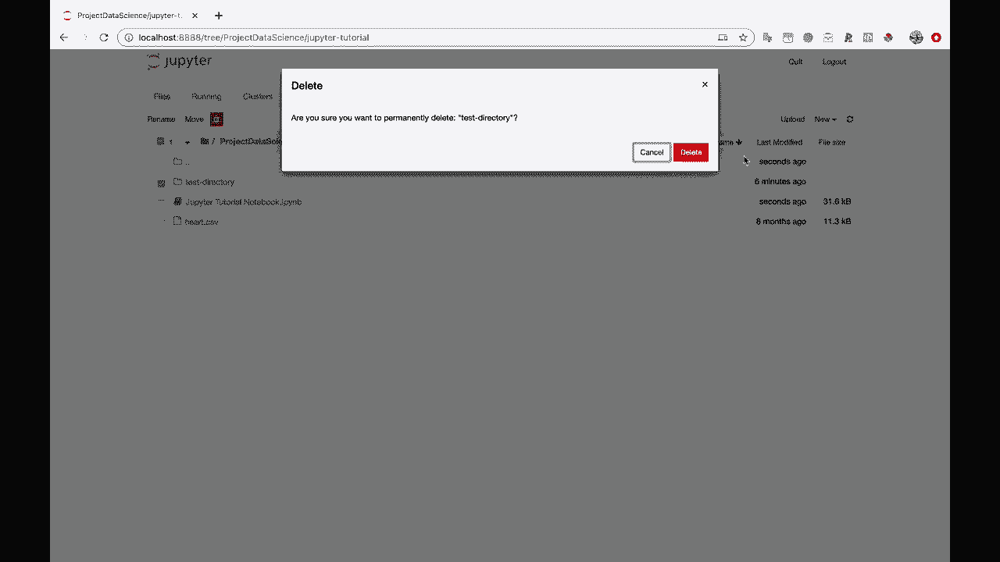
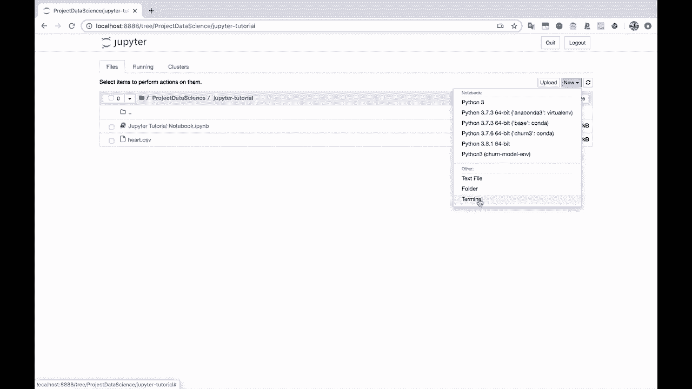
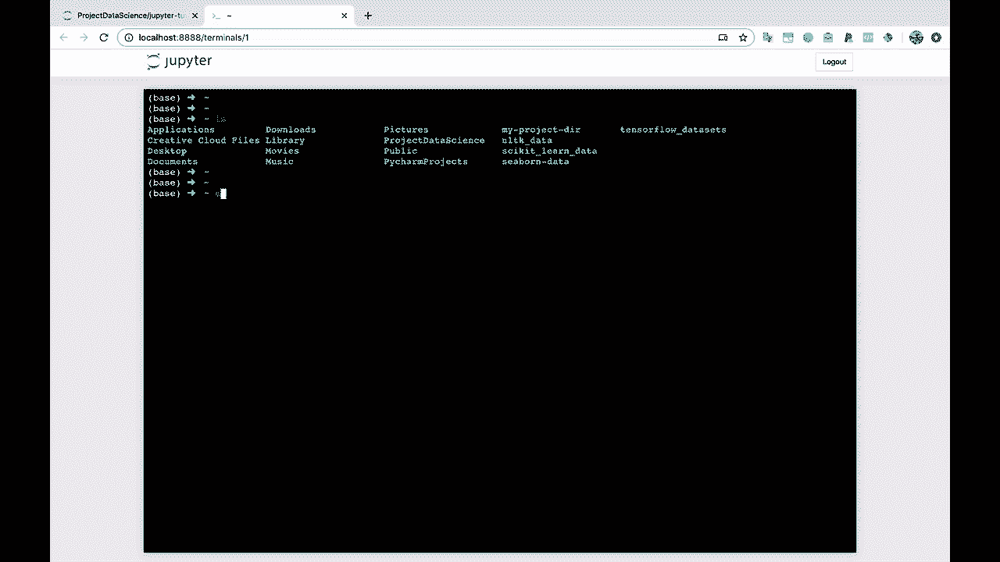
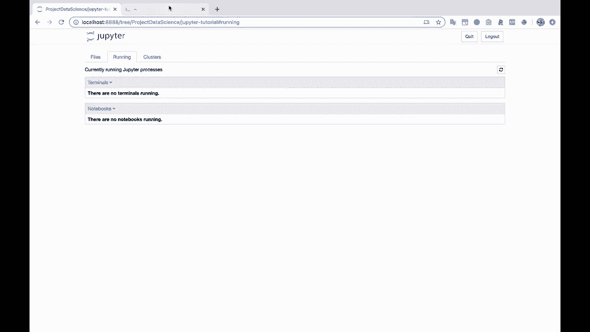

# Jupyter Notebook 超棒教程！P13：Notebook之外的其他功能 🚀

在本节课中，我们将学习Jupyter Notebook除了编写和运行代码单元之外的一些其他实用功能。这些功能能帮助你更好地管理文件、使用命令行工具，从而提升工作效率。



---

上一节我们介绍了如何保存和关闭Notebook。本节中，我们来看看Jupyter界面中“新建”按钮下的其他选项。



如果你点击界面右上角的“新建”按钮，除了创建新的Notebook，你还会注意到“其他”选项下提供了“文本文件”和“终端”两个功能。

## 使用Jupyter内置终端 💻

以下是如何在Jupyter环境中启动和使用终端：

1.  点击“新建”按钮。
2.  在下拉菜单中选择“终端”。

这将打开一个新的浏览器标签页，其中运行着一个命令行终端。在我的例子中，它运行的是Zsh shell，与你本地系统的终端类似。

例如，你可以使用 `ls` 命令列出当前目录下的所有文件和文件夹。



```bash
ls
```

这个内置终端功能强大，你可以执行几乎所有常规终端命令。例如，如果你使用Git进行版本控制，你可以在此直接运行Git命令。

```bash
git status
```



## 管理运行中的终端 ⚙️

当你使用完终端后，可以输入 `exit` 命令来关闭它。

```bash
exit
```

关闭后，该终端标签页会消失。你可以通过刷新Jupyter主界面来查看当前所有正在运行的终端会话。如果终端仍在运行，它会在“运行”选项卡中显示。你可以从那里将其关闭。



---

本节课中我们一起学习了Jupyter Notebook的两个扩展功能：创建文本文件和使用内置终端。这些工具让你能在不离开Jupyter环境的情况下处理文本和运行命令行任务，使工作流程更加集成和高效。