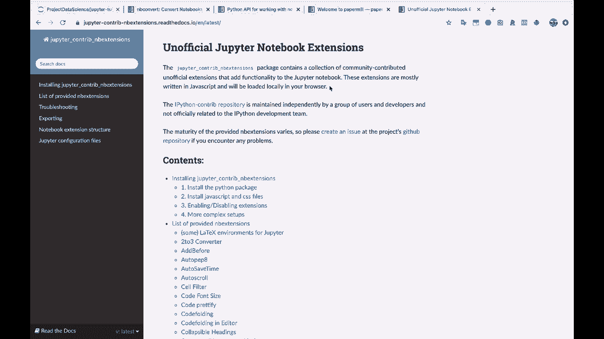
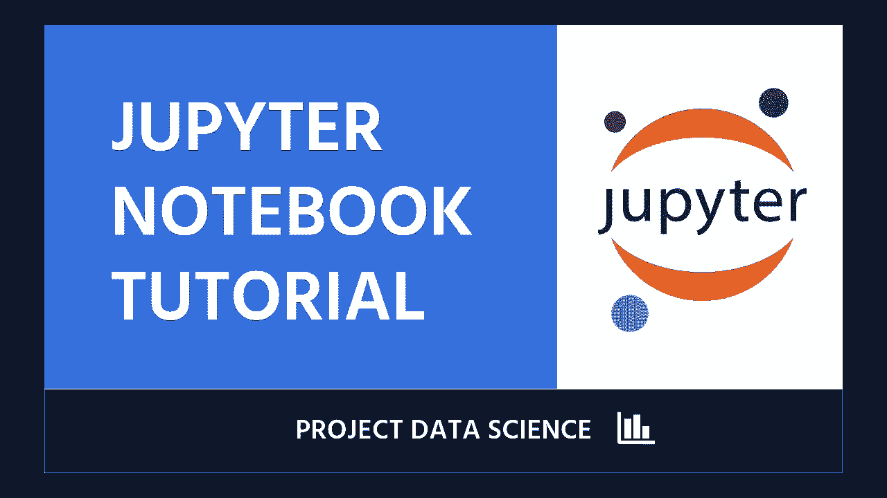

# Jupyter Notebook 超棒教程！P16：16）结论与致谢 🎓

在本节课中，我们将对整个Jupyter Notebook教程系列进行总结，并对学习过程致以感谢。

---

通过前面十五节课的学习，我们已经系统地掌握了Jupyter Notebook的核心功能与实用技巧。从基础的环境搭建、界面熟悉，到进阶的代码编写、数据可视化，再到高效使用的快捷键和扩展插件，我们一步步构建了使用这一强大工具的知识体系。

上一节我们介绍了如何利用Jupyter Notebook进行高效的数据科学项目协作与管理。本节中，我们将对整个学习旅程进行回顾与总结。

## 核心要点回顾 📝

以下是本教程系列涵盖的核心技能与概念总结：

*   **环境与基础**：成功安装并启动了Jupyter Notebook，熟悉了其Web界面的基本构成，包括菜单栏、工具栏、单元格等。
*   **单元格操作**：掌握了两种主要的单元格类型：**`代码单元格`** 用于执行Python代码，**`Markdown单元格`** 用于编写格式化的文本和说明。
*   **代码执行与内核**：理解了内核的概念，学会了如何运行代码、查看输出，以及管理内核状态（如重启、中断）。
*   **数据科学与可视化**：学习了如何使用 **`pandas`** 处理数据，以及利用 **`matplotlib`** 或 **`seaborn`** 库创建图表，其核心代码模式通常为 `df.plot()` 或 `sns.barplot(x, y)`。
*   **效率提升**：掌握了大量快捷键（如`Shift+Enter`运行单元格）和魔术命令（如`%matplotlib inline`），并探索了有用的扩展插件（如`jupyter_contrib_nbextensions`）来增强功能。
*   **项目实践**：了解了如何组织一个完整的数据分析项目，包括导入数据、清理数据、探索性分析和呈现结论。

## 学习成果与展望 🚀

至此，你已经为使用Jupyter Notebook进行数据分析、机器学习、学术研究乃至日常编程任务奠定了坚实的基础。你不仅学会了工具的操作，更理解了其背后的工作逻辑。

本教程旨在为你打开数据科学世界的大门。希望你在学习过程中感到充实，并发现这些知识的价值。同样，也期待你能从我们未来的其他数据科学项目教程中持续获益。

## 结束语

本节课中我们一起学习了整个Jupyter Notebook教程的总结与致谢。

学习之旅永无止境。祝你在此基础上的探索过程愉快且富有成果。我们未来的教程中再见。

祝你好运！😊

