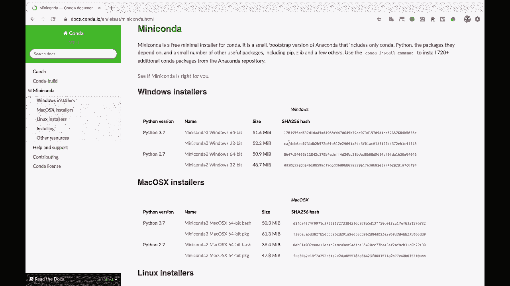

# Jupyter Notebook 超棒教程！P3：安装 Python 与 Jupyter Notebook 🚀

在本节课中，我们将学习如何为使用 Jupyter Notebook 准备环境。主要内容包括两种主要方法：使用无需安装的云端服务 Google Colab，以及在本地电脑上通过 Miniconda 安装 Python 和 Jupyter。

## 云端方案：使用 Google Colab ☁️

如果你不想或无法在本地电脑安装软件，Google Colab 是一个极佳的替代方案。

Google Colab 是运行在云端的 Jupyter Notebook。你可以在浏览器中直接打开并使用它。其核心概念与本地 Jupyter Notebook 完全相同，都支持混合编写文本和代码，并方便地与他人分享。

然而，两者在一些具体功能和界面上会存在细微差别。对于本教程中的大部分内容，Google Colab 都能胜任。如果你希望快速开始而不进行任何安装，可以自由选择使用它。

## 本地方案：通过 Miniconda 安装 💻

对于希望在本地电脑安装 Python 和 Jupyter 的用户，我们推荐使用 Miniconda。

Miniconda 是一个轻量级的 Python 发行版，它包含了 Python 解释器和一个名为 Conda 的强大工具。Conda 主要用于管理 Python 包（例如安装 pandas、Jupyter 等库）和创建虚拟环境。



**虚拟环境**是一种最佳实践，它可以将某个项目所需的 Python 版本和所有依赖包封装在一个独立的目录中，与系统的主 Python 环境及其他项目环境隔离。这避免了不同项目间包版本的冲突。

我们建议为你的操作系统安装 **Python 3.7** 或更高版本的 Miniconda。除非你的工作环境明确要求使用 Python 2.7，否则都应选择 Python 3 版本。

安装完成后，我们可以开始设置项目环境。

上一节我们介绍了 Miniconda 和虚拟环境的概念，本节中我们来看看如何实际操作。

以下是创建并激活一个包含 Jupyter 和 pandas 的虚拟环境的步骤：

1.  打开终端（在 macOS/Linux 上）或命令提示符/PowerShell（在 Windows 上）。
2.  使用以下 Conda 命令创建一个新的虚拟环境，我们将其命名为 `jupyter_env`，并同时安装 `jupyter` 和 `pandas` 包：
    ```bash
    conda create -n jupyter_env jupyter pandas
    ```
    命令中，`-n jupyter_env` 指定了环境名称，`jupyter pandas` 是要安装的包列表。
3.  当 Conda 提示是否继续时，输入 `y` 或 `yes` 确认。
4.  等待 Conda 下载并安装所有必要的包及其依赖项。

安装成功后，需要激活这个新环境才能使用其中的 Python 和包。

以下是激活环境的命令：
```bash
conda activate jupyter_env
```
激活后，终端提示符通常会发生变化，显示当前环境名称（如 `(jupyter_env)`）。此时，如果你运行 `which python`（或 Windows 上的 `where python`）命令，显示的 Python 解释器路径将位于这个虚拟环境目录下，与系统全局的 Python 完全分开。

本节课中我们一起学习了如何为 Jupyter Notebook 搭建工作环境。你掌握了两种途径：使用便捷的云端服务 **Google Colab**，以及在本地通过 **Miniconda** 安装并利用 **Conda 虚拟环境**来管理独立的项目依赖。选择适合你的方式，即可开始后续的 Jupyter Notebook 探索之旅。