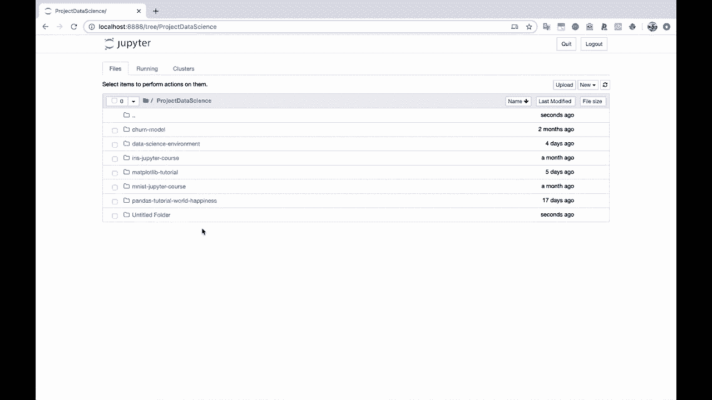
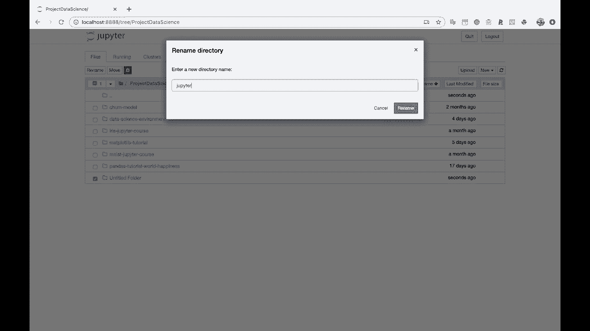
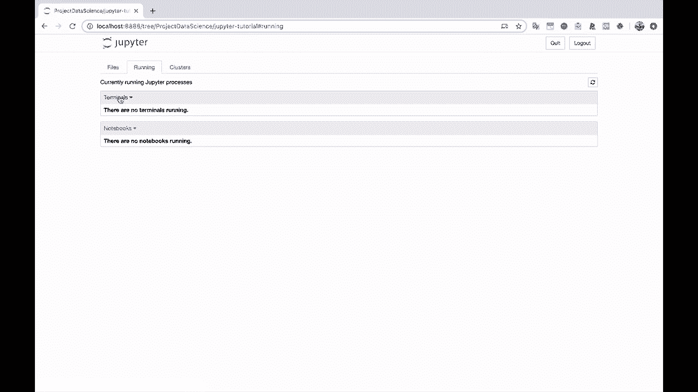

# Jupyter Notebook 超棒教程！P4：启动 Jupyter 笔记本 🚀

在本节课中，我们将学习如何启动 Jupyter Notebook 服务器，并初步了解其用户界面的基本构成。

## 启动 Jupyter Notebook 服务器

上一节我们完成了 Python 和 Jupyter 的安装。现在，我们来看看如何启动 Jupyter Notebook。

在终端中输入以下命令，即可启动 Jupyter Notebook 服务器。在命令末尾添加 `&` 符号，可以让服务器在后台运行，这样我们就能继续使用当前的终端窗口。

```bash
jupyter notebook &
```

执行命令后，Jupyter Notebook 服务会在默认浏览器中自动打开一个新的窗口。

## 认识 Jupyter Notebook 界面

现在，我们已经成功进入了 Jupyter Notebook 的主界面。我是在我的主目录中启动的，因此文件浏览器中显示的是该目录下的所有文件夹。

以下是 Jupyter Notebook 主界面的主要组成部分：



*   **文件浏览器**：这是界面的核心区域，用于浏览、创建和管理笔记本文件（`.ipynb`）及其他文件。
*   **运行标签**：此标签页会显示当前正在运行的笔记本内核和终端会话。
*   **集群标签**：此标签页与并行计算相关，对于初学者，我们暂时无需处理它。

## 创建新的工作目录



为了保持项目整洁，我们最好为教程创建一个专门的文件夹。

以下是创建新文件夹的步骤：
1.  在文件浏览器界面的右上角，点击“新建”按钮。
2.  在下拉菜单中选择“文件夹”。
3.  系统会创建一个名为“Untitled Folder”的新文件夹。
4.  选中该文件夹前的复选框。
5.  点击上方工具栏的“重命名”按钮，将文件夹名称改为“Jupyter教程”。

现在，点击进入这个新创建的“Jupyter教程”文件夹，这里就是我们后续创建和保存笔记本文件的地方。

## 创建新的 Notebook

进入目标文件夹后，我们就可以创建第一个 Notebook 了。

点击“新建”按钮，然后选择“Python 3”（或你安装的其他内核），即可创建一个全新的、空白的 Jupyter Notebook 文件。这就是我们编写和运行代码的主要工作区。



---

本节课中，我们一起学习了如何从终端启动 Jupyter Notebook 服务器，熟悉了其主界面的几个关键部分（文件浏览器、运行标签），并掌握了创建专用项目文件夹和新建 Notebook 的基本方法。下一节，我们将深入探索 Notebook 单元格的操作与魔法命令。