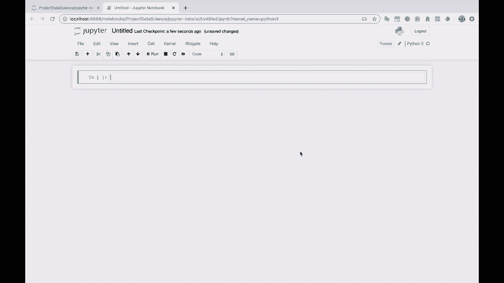
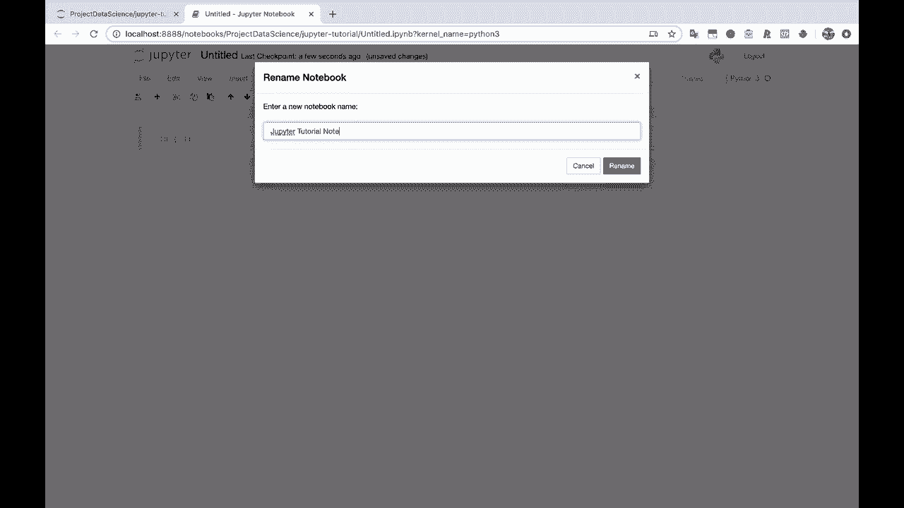
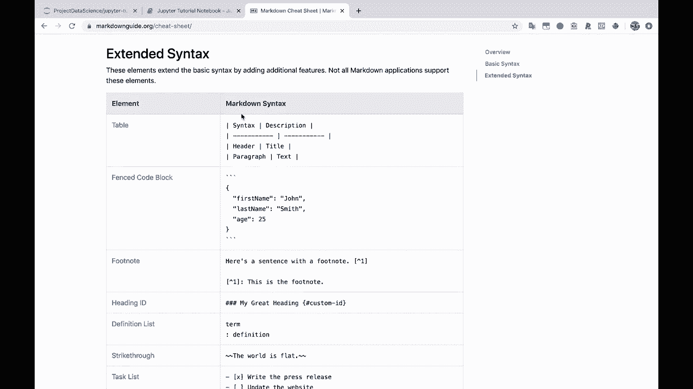

# Jupyter Notebook 超棒教程！P5：基本的Notebook功能 🚀



在本节课中，我们将学习Jupyter Notebook的核心操作，包括如何创建笔记本、运行代码单元格、编写Markdown文档以及理解其背后的运行机制。掌握这些基础是高效使用Jupyter Notebook的关键。



## 创建与命名笔记本

启动Jupyter Notebook后，首先需要创建一个新的笔记本文件。

以下是创建新笔记本的步骤：
1.  在Jupyter主界面点击“New”按钮。
2.  从下拉菜单中选择“Python 3”。
3.  一个新的笔记本标签页将会打开。
4.  点击顶部的“Untitled”字样，将其重命名为“Jupiter Tu 笔记本”。


## 理解代码单元格

笔记本的核心功能之一是代码单元格。它允许你编写并执行代码。

一个单元格默认是代码单元格，你可以通过单元格左侧的 `In [ ]:` 标识或右侧的下拉菜单来确认。

在代码单元格中，你可以编写Python代码。例如，输入以下内容：
```python
x = "hello world"
print(x)
```
然后，按下 `Shift + Enter` 来运行这个单元格。运行后，单元格左侧会出现一个数字（例如 `In [1]:`），表示这是第一个被执行的单元格，下方会输出代码的执行结果：`hello world`。

## 变量与内核的持久性

Jupyter Notebook在后台运行一个单一的Python内核实例，这带来了一个重要的特性：变量在单元格之间是持久共享的。

例如，在下一个单元格中，直接输入变量名 `x` 并运行，它会返回变量 `x` 的值 `‘hello world’`。这说明即使在不同的单元格中，只要内核在运行，之前定义的变量依然可用。

这种特性也意味着执行顺序比单元格的物理位置更重要。你可以先定义一个变量 `y`（例如 `y = “goodbye world”`），然后在它**上方**插入一个新单元格并打印 `y`。只要定义 `y` 的单元格已经执行过（有执行编号），打印操作就能成功，因为变量已存在于内核内存中。

你可以使用 `%whos` 命令来查看当前内核中所有已定义的变量。
```python
%whos
```
运行此命令会列出所有变量及其类型，例如 `x` 和 `y`。这些变量会一直保留，直到你显式删除它们、重启内核或关闭笔记本。

## 使用Markdown单元格

除了代码，Jupyter Notebook还支持Markdown单元格，用于编写格式化的文档和说明。

将单元格类型从“Code”切换为“Markdown”，即可开始编写。Markdown使用简单的符号进行格式化。

以下是一些常用的Markdown语法示例：
*   **标题**：使用 `#` 表示一级标题，`##` 表示二级标题。
*   **粗体文本**：使用两个星号包围文本，如 `**粗体**`。
*   **斜体文本**：使用一个星号包围文本，如 `*斜体*`。
*   **列表**：使用 `-` 或 `*` 创建无序列表；使用数字加 `.` 创建有序列表。
*   **代码块**：使用三个反引号（```）包围代码。

输入Markdown后，按 `Shift + Enter` 运行，单元格会渲染成格式化的文本，而不再是可编辑的源代码。

## 单元格操作与组织

高效地组织笔记本内容离不开对单元格的操作。

以下是常用的单元格操作快捷键：
*   **在上方插入单元格**：按 `A` 键。
*   **在下方插入单元格**：按 `B` 键。
*   **删除单元格**：按两次 `D` 键。
*   **切换单元格类型**：按 `M` 键切换为Markdown，按 `Y` 键切换为Code。

例如，你可以按 `A` 在上方插入一个新单元格，然后按 `M` 将其转换为Markdown单元格，用于添加章节说明或注释。

## 扩展学习：Markdown参考

Markdown功能强大，可以创建表格、链接、图片等。

如果你想深入了解Markdown语法，建议搜索“Markdown cheat sheet”。一个很好的参考网站是 [markdownguide.org](https://www.markdownguide.org)，它提供了完整的语法说明和示例。



---


本节课中我们一起学习了Jupyter Notebook的基本功能。我们掌握了如何创建和命名笔记本，理解了代码单元格的执行与变量持久性，学会了使用Markdown单元格编写文档，并熟悉了操作单元格的快捷方式。这些是使用Jupyter Notebook进行数据分析、编程和记笔记的基石。