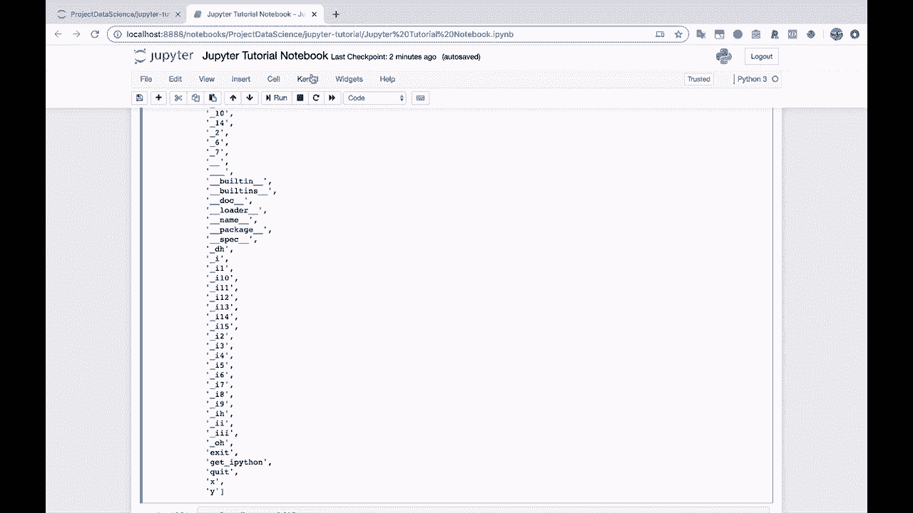
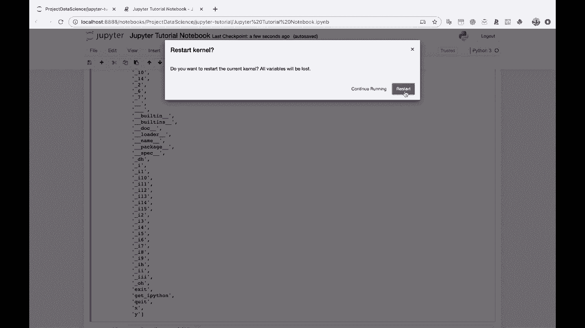
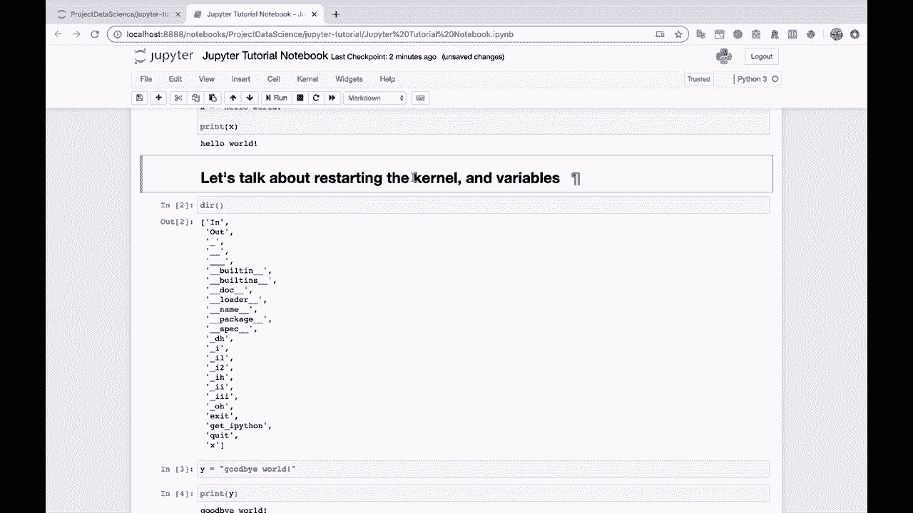

# Jupyter Notebook 超棒教程！P6：内核与变量管理 🧠

在本节课中，我们将要学习 Jupyter Notebook 中两个核心概念：**内核**和**变量**。你将了解变量是如何被内核存储和管理的，以及如何通过重启内核或删除操作来重置它们。掌握这些知识对于高效、清晰地使用 Notebook 至关重要。

---

## 内核与变量的关系

上一节我们介绍了如何执行代码单元。本节中我们来看看代码执行背后的核心——内核。内核是 Notebook 背后运行的 Python 解释器，它负责执行代码并**在内存中存储所有已定义的变量**。这些变量会一直存在，直到你明确删除它们或重启内核。

让我们先查看当前内核中已定义的所有变量。我们可以使用 `dir()` 函数来查看。

```python
# 查看当前命名空间中的变量
print(dir())
```

假设我们之前已经定义过变量 `x` 和 `y`，那么它们会出现在这个列表中。只要我们没有删除它们或重启内核，就可以随时访问。

---

## 删除变量

有时我们需要清理内存或重置某个变量。在 Python 中，可以使用 `del` 语句来删除一个变量。

以下是删除变量的步骤：

1.  使用 `del` 语句后跟变量名。
2.  该操作不会返回任何值，它只是从当前命名空间中移除该变量。
3.  删除后，尝试访问该变量会引发 `NameError`。

例如，我们删除变量 `y`：

```python
# 删除变量 y
del y

# 再次查看变量列表，y 已消失
print(dir())

# 尝试打印 y 会引发错误
print(y)  # 输出：NameError: name 'y' is not defined
```

删除后，我们可以重新定义 `y`。

```python
# 重新定义变量 y
y = "再见，世界"
print(y)
```

---

## 关闭 Notebook 标签 vs. 停止内核

一个常见的误解是关闭浏览器标签页就等于关闭了 Notebook。实际上，**仅仅关闭标签页并不会停止内核**。内核仍在后台运行，并保留着所有变量状态。

你可以通过以下方式验证：
1.  在 Jupyter 主页的 “Running” 标签页中，可以看到该 Notebook 仍在运行。
2.  重新打开该 Notebook 文件，之前定义的变量依然可以访问。

这意味着，即使你关闭了界面，你的工作状态（变量、导入的模块等）仍然保存在服务器的内存中。

要真正停止一个 Notebook，你需要明确地关闭其内核。有以下几种方法：
*   在 Notebook 界面中，点击 “File” -> “Close and Halt”。
*   在 Jupyter 主页的 “Running” 标签页中，点击对应 Notebook 的 “Shutdown” 按钮。
*   直接关闭整个 Jupyter 服务器（例如，在终端中按 `Ctrl+C`）。



---

## 重启内核



重启内核是重置 Notebook 状态的终极方法。它的效果等同于关闭 Python 解释器再重新打开，**所有内存中的变量都会被清除**。

在 Notebook 界面中，你可以通过以下步骤重启内核：

1.  点击顶部菜单栏的 “Kernel”。
2.  在下拉菜单中选择 “Restart…”。
3.  确认重启操作。

重启后，你会注意到单元格执行顺序的编号（如 `In [1]:`）被重置为 `[1]`。此时，之前定义的所有变量都已消失。

```python
# 重启内核后运行，变量列表为空
print(dir())  # 输出中不再有 x 和 y

# 尝试访问之前的变量会报错
print(y)  # NameError: name 'y' is not defined
```

现在，你需要重新运行定义变量的单元格，才能再次使用它们。

---

## 保持 Notebook 的逻辑顺序 🧹

由于变量状态会一直保留在内存中，如果不注意单元格的执行顺序，Notebook 很容易变得混乱。例如，如果你先运行了一个打印变量 `y` 的单元格，但定义 `y` 的单元格在后面，那么打印操作会因为 `y` 未定义而失败。

**最佳实践是：让 Notebook 保持一个清晰、线性的逻辑流。**

以下是保持 Notebook 整洁的建议：

*   **从头到尾按顺序执行**：尽量按照你设想的逻辑顺序（从上到下）创建和运行单元格。
*   **重启后测试**：在将 Notebook 分享给他人或存档前，尝试重启内核并从头到尾依次运行所有单元格，确保它能独立、正确地运行。
*   **善用标记**：使用 Markdown 单元格为代码段添加清晰的说明和标题。

养成这些习惯，能让你更高效地使用 Jupyter Notebook，并避免因状态混乱而产生的错误。



---

本节课中我们一起学习了 Jupyter Notebook 的**内核**如何管理**变量**的生命周期。我们掌握了使用 `del` 语句删除变量、理解了关闭标签与停止内核的区别、学会了如何重启内核以清空所有状态，并强调了保持代码执行顺序线性化的重要性。理解这些概念是成为 Jupyter Notebook 高手的关键一步。