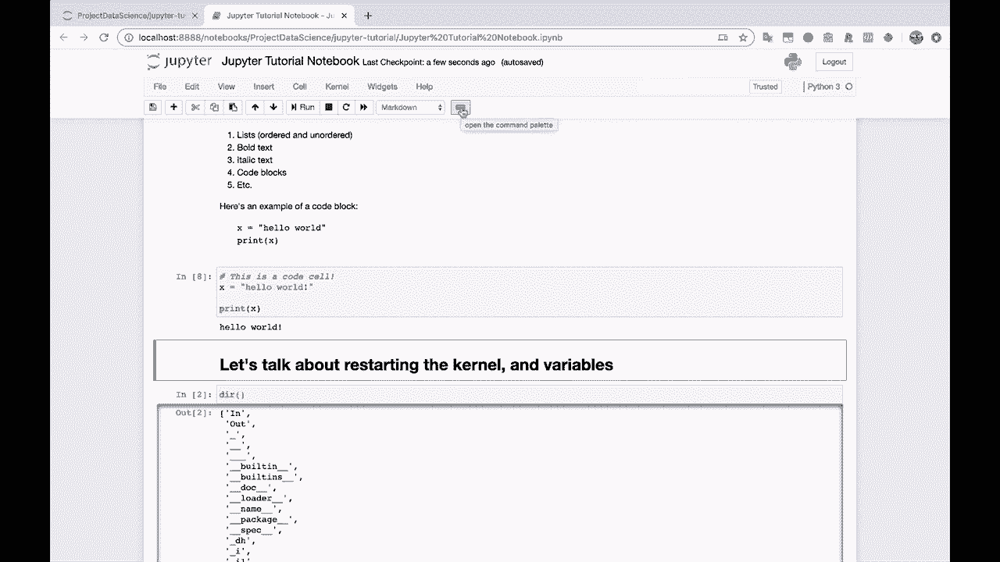
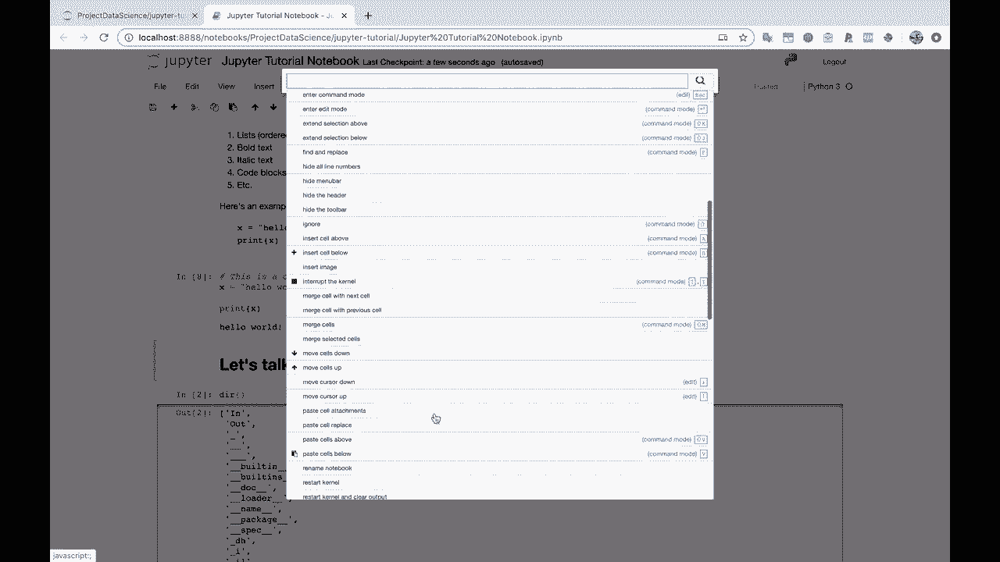

# Jupyter Notebook 超棒教程！P7：其他 Notebook 功能 🧰

在本节课中，我们将学习 Jupyter Notebook 中一些实用的附加功能，包括折叠单元格、使用工具栏按钮、理解不同模式以及中断内核等。掌握这些功能将帮助你更高效地组织和管理你的 Notebook。

## 折叠单元格 📦

上一节我们介绍了代码执行，本节中我们来看看如何管理冗长的输出。当代码产生大量输出时，例如打印一个很长的列表，Notebook 会变得难以滚动浏览。

Jupyter Notebook 提供了折叠单元格输出的功能。你可以点击输出区域左侧的侧边栏图标，将冗长的输出折叠成一个紧凑的滚动框，从而节省屏幕空间。这对于保持 Notebook 的整洁和可读性非常有帮助。

## 工具栏与快捷键 ⌨️

了解了如何管理输出后，我们来看看如何操作单元格本身。Notebook 顶部的工具栏提供了许多常用功能。

以下是工具栏上的一些关键按钮及其作用：
*   **保存**：保存 Notebook 并创建检查点。
*   **加号 (+)**：在当前单元格下方插入一个新单元格。对应的键盘快捷键是字母 **`B`**。
*   **剪刀**：剪切选定的单元格。
*   **复制**：复制选定的单元格。
*   **粘贴**：粘贴已复制或剪切的单元格。
*   **上下箭头**：将选定的单元格向上或向下移动。
*   **运行按钮**：运行当前选定的单元格。

关于快捷键，需要理解 Notebook 的两种主要模式：
*   **编辑模式**：当单元格边框为**绿色**时，表示你正在输入文本或代码。
*   **命令模式**：单击单元格左侧的空白区域，边框会变为**蓝色**。在此模式下，你可以使用键盘快捷键，例如：
    *   **`B`**：在下方插入单元格。
    *   **`A`**：在上方插入单元格。
    *   **`X`**：删除单元格。

## 中断与重启内核 ⏹️🔁

在编写代码时，有时可能会意外创建无限循环，导致内核无响应。例如，运行以下代码会启动一个无限循环：

```python
while True:
    print(1)
    time.sleep(0.2)
```

此时，你可以点击工具栏上的 **“中断内核”** 按钮。这相当于向内核发送一个键盘中断信号 (`KeyboardInterrupt`)，强制停止当前正在执行的代码。

如果内核状态异常或你想从头开始运行所有代码，可以使用 **“重启内核”** 按钮。与之配套的 **“重启内核并重新运行整个笔记本”** 按钮，可以在重启后自动按顺序执行所有单元格，这对于重现整个工作流程非常有用。

在“运行”菜单下，你还可以找到其他执行选项，例如“运行所有单元格”或“运行此单元格以下的所有单元格”，以适应不同的需求。

## 单元格类型与命令面板 📝

最后，我们来快速了解单元格类型的切换和一个强大的工具。每个单元格上方的下拉菜单可以让你在 **代码** 和 **Markdown** 类型之间切换。确保你的 Python 代码在“代码”类型的单元格中，而文档说明则在“Markdown”类型的单元格中，这对于 Notebook 的结构至关重要。

工具栏上还有一个 **“打开命令面板”** 按钮。点击它会显示一个包含大量可用命令的面板，你可以通过搜索快速找到并执行任何操作，这是提升效率的利器。



---



本节课中我们一起学习了 Jupyter Notebook 的几个核心附加功能：如何折叠冗长输出以保持界面整洁；如何使用工具栏按钮和键盘快捷键来高效地插入、移动、运行单元格；如何在代码陷入无限循环时中断内核，以及如何重启内核；最后还了解了切换单元格类型和使用命令面板的方法。熟练运用这些功能，将使你的数据分析与编程工作更加流畅。