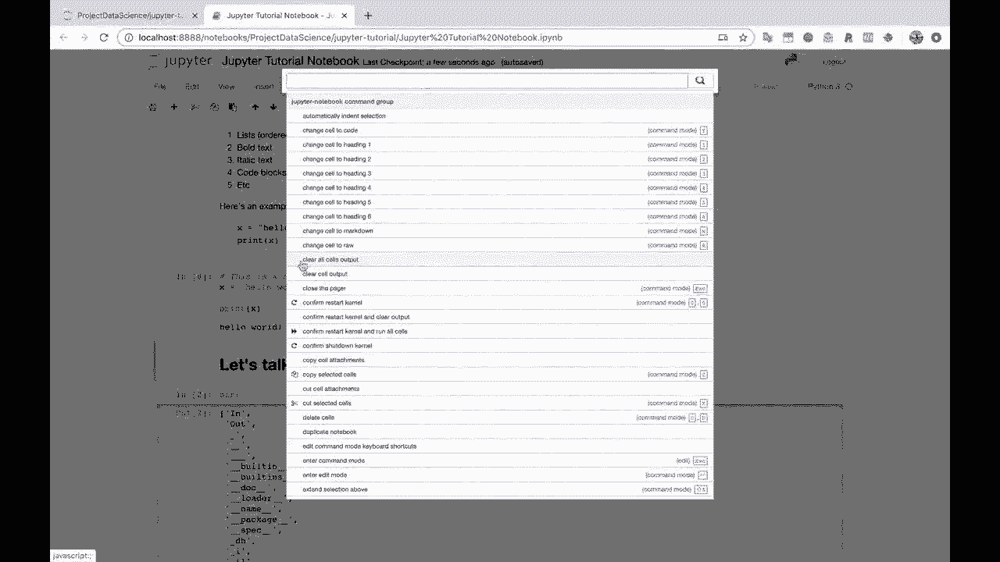
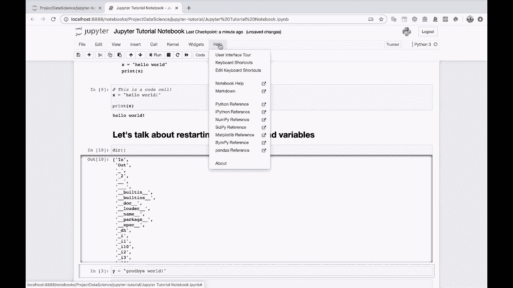

# Jupyter Notebook 超棒教程！P8：菜单功能详解 📋

在本节课中，我们将详细学习Jupyter Notebook界面顶部的菜单栏功能。菜单栏是控制Notebook文件、编辑内容、调整视图和获取帮助的核心区域。掌握这些功能将帮助你更高效地使用Jupyter Notebook。

上一节我们介绍了Notebook的基本界面，本节中我们来看看如何通过菜单栏的各项功能来管理和操作你的Notebook。

## 文件菜单 📁

文件菜单主要用于管理Notebook文件本身，包括创建、保存和设置检查点。

以下是文件菜单中的主要功能列表：
*   **新建笔记本**：创建一个全新的Notebook文件。
*   **保存和检查点**：保存当前Notebook。Jupyter会自动创建“检查点”，允许你回退到之前的保存版本。

## 编辑菜单 ✏️

编辑菜单提供了对Notebook中单元格（Cell）进行编辑和重组的功能。

以下是编辑菜单中的主要功能列表：
*   **拆分单元格**：将一个单元格从光标处拆分成两个。
*   **合并单元格**：将选中的多个单元格合并为一个。
*   **剪切、复制、粘贴和删除**：对单元格执行基本的编辑操作。

## 视图菜单 👁️

视图菜单允许你自定义Notebook的显示方式，以提升代码的可读性。

以下是视图菜单中的主要功能列表：
*   **切换行号**：显示或隐藏代码单元格左侧的行号。这对于调试代码非常有用。

## 插入菜单 ➕

插入菜单用于在Notebook的特定位置添加新的单元格。

## 单元格菜单 📦

单元格菜单是核心操作菜单，用于控制单元格的运行和类型转换。

以下是单元格菜单中的主要功能列表：
*   **运行单元格**：执行当前选中的单元格中的代码或Markdown渲染。
*   **更改单元格类型**：将单元格在**代码**、**Markdown**和**原始NBConvert**类型之间切换。例如，将代码单元格转换为Markdown单元格以编写文本说明。
*   **清除输出**：清除当前单元格或所有单元格的运行结果，使Notebook恢复到未运行代码时的状态。其效果类似于该单元格从未被运行过。

## 内核菜单 ⚙️

内核菜单管理代码执行的后台进程（内核）。例如，可以中断正在运行的程序或重启整个内核。

## 小部件菜单 🧩

小部件菜单用于创建交互式控件。这是一个进阶功能，我们目前暂不深入讨论。

## 帮助菜单 ❓

帮助菜单提供了快速访问官方文档、用户界面导览和快捷键列表的途径，是学习和解决问题的重要资源。

本节课中我们一起学习了Jupyter Notebook菜单栏的各项核心功能。从文件管理、单元格编辑到视图控制和获取帮助，菜单栏是驱动Notebook所有操作的中枢。熟练掌握这些菜单选项，是成为Jupyter Notebook高效用户的关键一步。