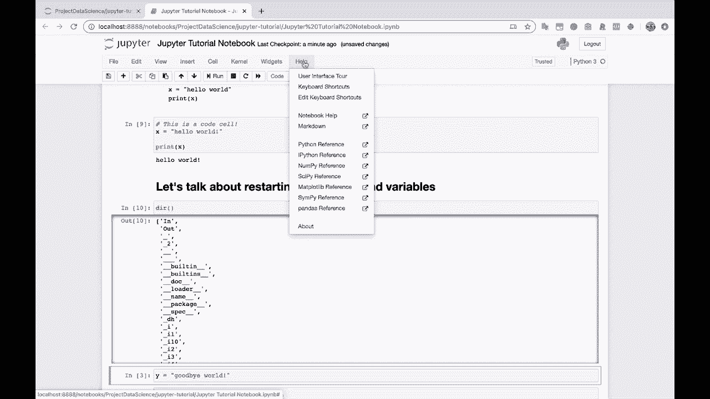
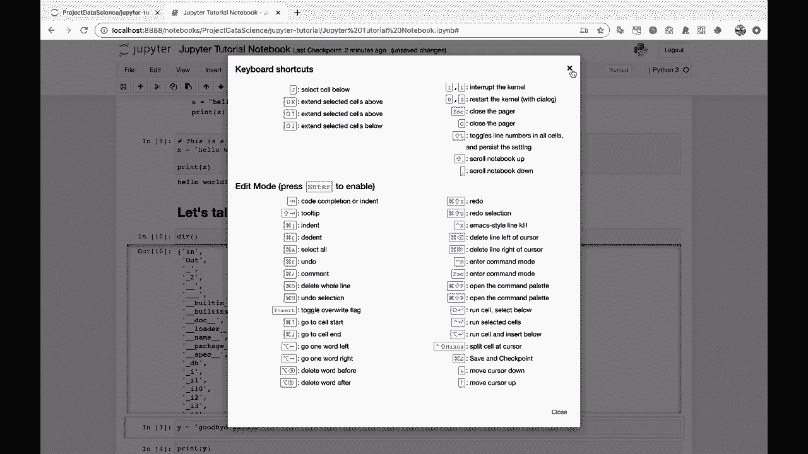

# Jupyter Notebook 超棒教程！P9：Jupyter Notebook键盘快捷键 🎹

在本节课中，我们将学习Jupyter Notebook的键盘快捷键。掌握这些快捷键能显著提升你在Notebook中工作的速度和效率。

上一节我们介绍了Notebook的基本操作，本节中我们来看看如何通过键盘快捷键来优化工作流程。

## 访问快捷键帮助

我最喜欢的一个帮助功能是快捷键列表。通过它，你可以快速查看所有可用的操作。

## 核心快捷键介绍

以下是几个最常用且能极大提升效率的键盘快捷键。

*   **A**：在当前选中单元格的**上方**插入一个新的单元格。
*   **B**：在当前选中单元格的**下方**插入一个新的单元格。
*   **X**：**剪切**当前选中的单元格。
*   **Shift + Enter**：**运行**当前单元格中的代码，并移动到下一个单元格。

## 编辑模式与命令模式

理解Jupyter Notebook的两种模式是有效使用快捷键的关键。

*   **编辑模式**：当你在单元格内输入代码或文本时，处于此模式。此时单元格边框为**绿色**。
*   **命令模式**：当你选中一个单元格但未在其内部输入时，处于此模式。此时单元格边框为**蓝色**。大部分导航和操作单元格的快捷键（如A、B、X）都需在此模式下使用。

`进入编辑模式`的快捷键是 **Enter**。从编辑模式切换回命令模式的快捷键是 **Esc**。

## 学习建议

这里有很多很棒的快捷键，确实值得花些时间去熟悉。

一个高效的学习方法是：如果你发现自己频繁重复某个鼠标操作，就去查找并学习这个操作的键盘快捷键。

---

本节课中我们一起学习了Jupyter Notebook的核心键盘快捷键，包括如何插入、剪切单元格，运行代码，以及区分编辑模式与命令模式。熟练掌握这些快捷键将使你的数据分析工作更加流畅高效。