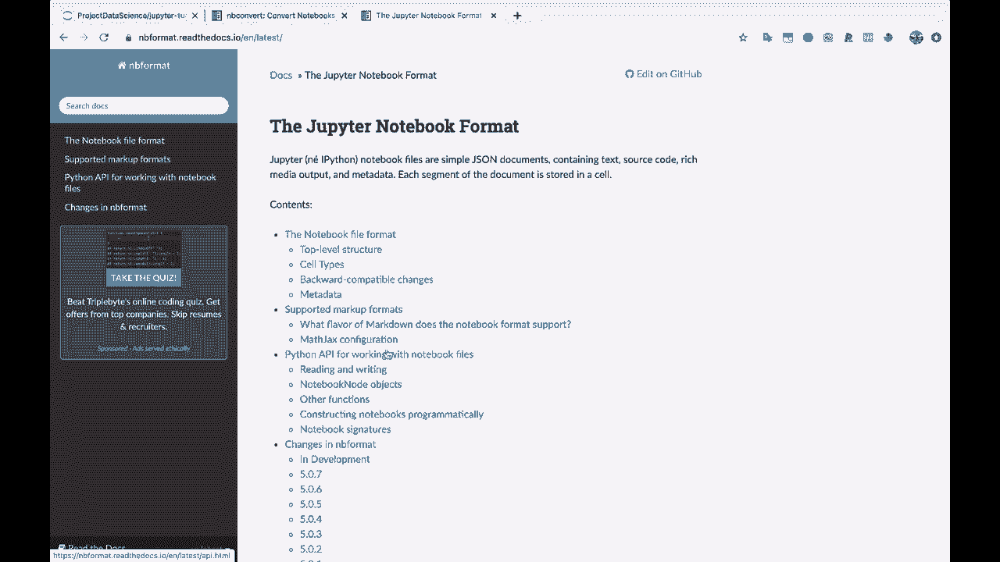
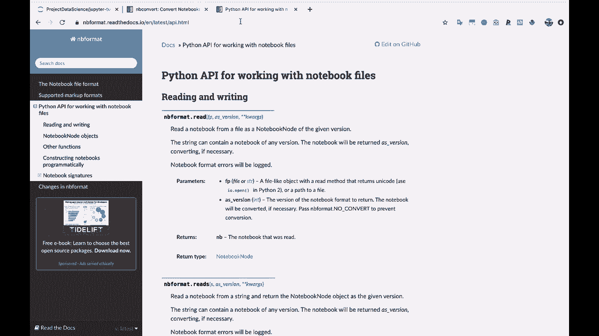
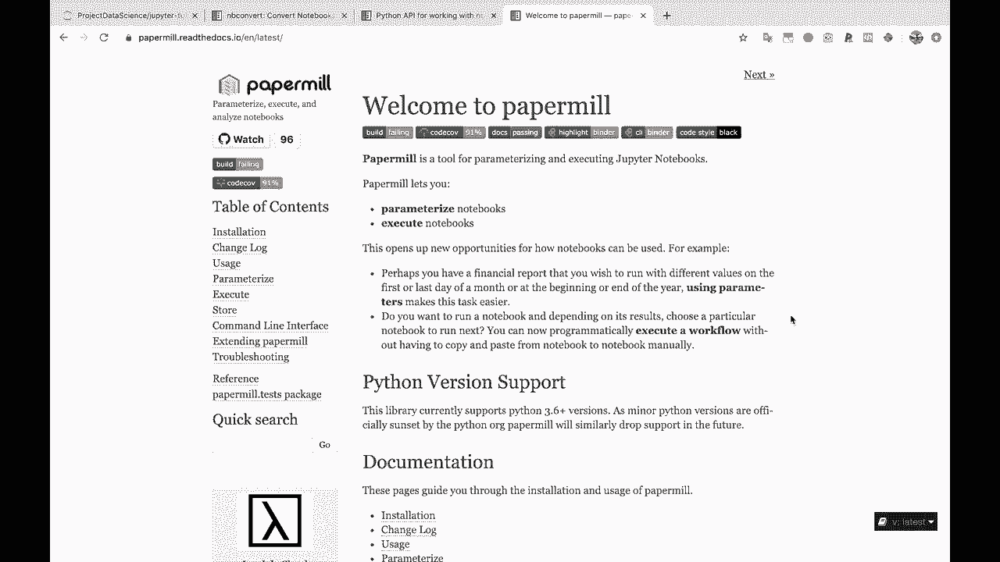
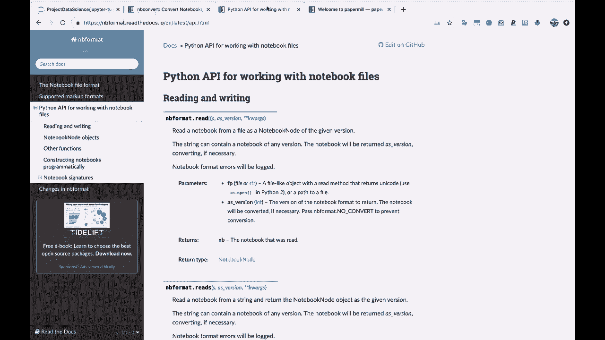
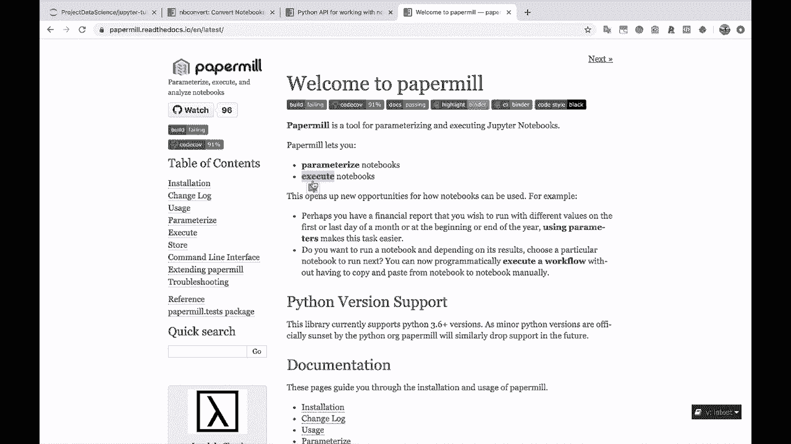
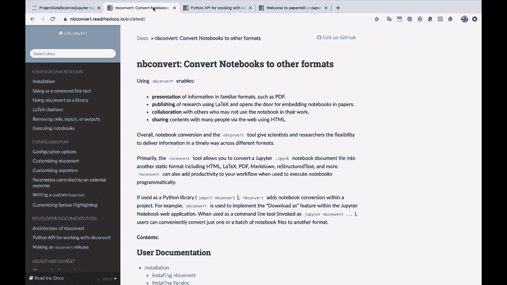
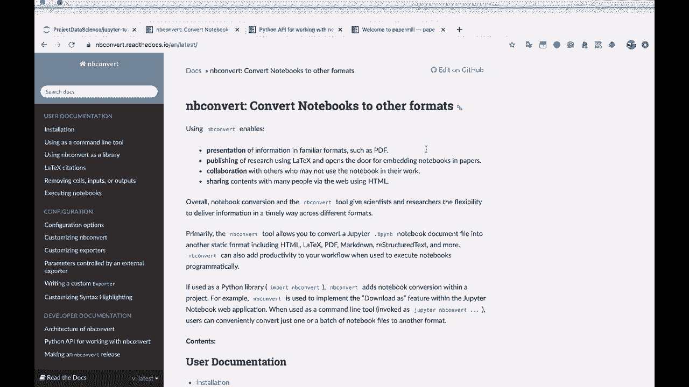
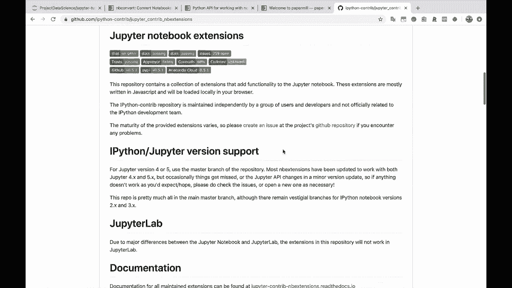
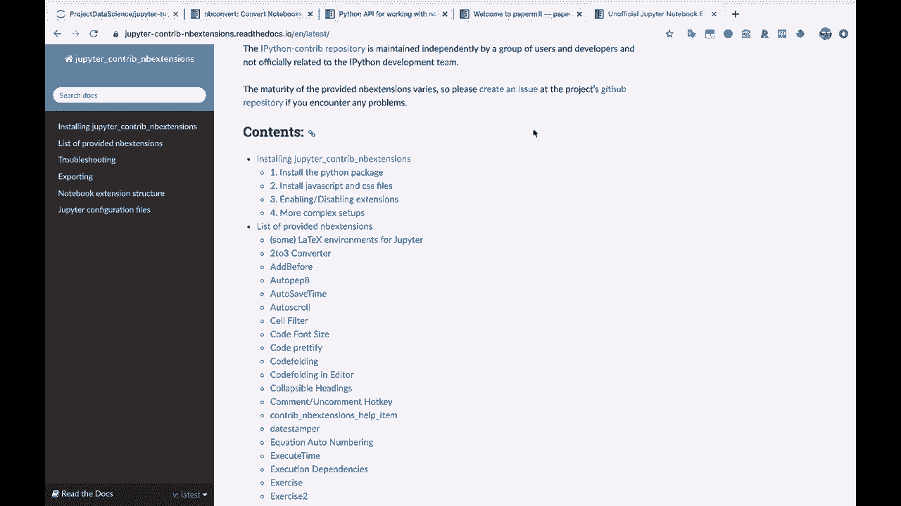

# Jupyter Notebook 教程 P15：扩展与其他库 📚

在本节课中，我们将学习 Jupyter Notebook 的几个强大扩展和辅助库。这些工具能帮助你更高效地转换、编程化处理以及参数化执行笔记本，从而将你的工作流程自动化。

---

## 概述

本节将介绍三个核心工具：`nbconvert`、`nbformat` 和 `papermill`。它们分别用于笔记本格式转换、编程化处理以及参数化与自动化执行。掌握这些工具能极大地提升你使用 Jupyter Notebook 的灵活性和效率。

---

## 1. 格式转换工具：nbconvert


上一节我们介绍了Jupyter的核心功能，本节中我们来看看如何将笔记本转换为其他格式。`nbconvert` 是 Jupyter 安装的一部分，它能帮助你将 `.ipynb` 笔记本文件转换为多种通用格式。

以下是 `nbconvert` 支持的一些主要输出格式：



*   **PDF**：生成可直接打印或分享的PDF文档。
*   **LaTeX**：转换为LaTeX源代码，便于进行学术出版或进一步排版。
*   **HTML**：生成独立的网页文件，方便在浏览器中查看。
*   **Markdown**：转换为纯Markdown文件。
*   **Python脚本**：提取笔记本中的所有代码，生成 `.py` 文件。

使用 `nbconvert` 的基本命令格式如下：
```bash
jupyter nbconvert --to <格式> <笔记本文件名>.ipynb
```
例如，要将 `my_notebook.ipynb` 转换为HTML，可以运行：
```bash
jupyter nbconvert --to html my_notebook.ipynb
```

---

## 2. 编程化处理工具：nbformat

学会了格式转换，我们再来看看如何以编程方式创建和修改笔记本。`nbformat` 同样是随 Jupyter 安装提供的Python API库。它允许你通过编写Python脚本来读取、编辑和生成Jupyter Notebook文件（`.ipynb`）。

这对于自动化生成报告或批量修改多个笔记本非常有用。例如，你可以编写一个脚本，根据不同的数据集动态生成包含特定代码和Markdown说明的笔记本。

核心概念是使用 `nbformat` 库来操作代表笔记本的Python字典结构。以下是一个创建简单笔记本的代码示例：



```python
import nbformat as nbf

# 创建一个新的笔记本对象
nb = nbf.v4.new_notebook()


# 添加一个Markdown单元格
text_cell = nbf.v4.new_markdown_cell("## 这是自动生成的标题")
# 添加一个代码单元格
code_cell = nbf.v4.new_code_cell("print('Hello, World!')")

# 将单元格添加到笔记本中
nb.cells = [text_cell, code_cell]

# 将笔记本保存为 .ipynb 文件
with open('generated_notebook.ipynb', 'w') as f:
    nbf.write(nb, f)
```

---

## 3. 参数化与执行工具：Papermill



`nbformat` 能帮你创建笔记本，而 `papermill` 则能帮你自动化地运行它们。`papermill` 是一个需要单独安装的第三方库，它主要提供两大功能：**参数化笔记本**和**批量执行笔记本**。

**参数化** 意味着你可以像给函数传参一样，在执行时向笔记本注入特定的变量值。例如，你有一个数据分析笔记本，想用不同的日期范围或模型参数多次运行它。

以下是 `papermill` 的基本用法：

1.  **在笔记本中定义参数**：通常使用一个标记为“参数”的代码单元格，里面通过 `parameters` 字典定义默认值。
2.  **通过命令行执行**：使用 `papermill` 命令指定输入笔记本、输出笔记本和要传入的参数。



```bash
# 基本命令格式
papermill input_notebook.ipynb output_notebook.ipynb -p parameter_name value



# 示例：传入参数 alpha 的值为 0.5
papermill model_experiment.ipynb results/experiment_alpha_0.5.ipynb -p alpha 0.5
```

你可以将 `nbformat` 和 `papermill` 结合使用，实现强大的自动化流程：用 `nbformat` 动态生成定制化的实验笔记本，然后用 `papermill` 传入不同参数并执行它们，最后再用 `nbconvert` 将结果批量转换为报告。



---



## 4. 功能扩展库：Jupyter Notebook Extensions

除了处理笔记本本身的库，Jupyter 社区还提供了丰富的**扩展**来增强笔记本界面的功能。这些扩展可以通过 `jupyter_contrib_nbextensions` 包安装和管理。

安装后，你可以在 Jupyter Notebook 的 `Nbextensions` 标签页中启用或禁用各种扩展。



以下是一些常用且实用的扩展功能：

*   **代码自动补全 (Hinterland)**：在输入时提供代码提示。
*   **目录生成 (Table of Contents)**：自动根据Markdown标题生成导航目录。
*   **代码折叠 (Codefolding)**：允许折叠代码单元格，保持界面整洁。
*   **拼写检查器 (Spellchecker)**：检查Markdown单元格中的拼写错误。
*   **变量检查器 (Variable Inspector)**：显示当前内核中所有变量的名称、类型和值。
*   **执行时间记录 (ExecuteTime)**：显示每个单元格的运行开始时间和耗时。

如果你觉得笔记本缺少某个功能，很可能已经有对应的扩展可以实现。

---

## 总结

本节课中我们一起学习了 Jupyter Notebook 生态中几个关键的扩展和库：



1.  **`nbconvert`**：用于将笔记本转换为 PDF、HTML、LaTeX 等多种格式。
2.  **`nbformat`**：提供了通过 Python 编程来读写和创建 `.ipynb` 文件的 API。
3.  **`papermill`**：实现了笔记本的参数化与自动化执行，非常适合批量运行实验。
4.  **`Jupyter Notebook Extensions`**：一系列社区贡献的界面功能增强插件，能显著提升开发体验。

这些工具相互配合，能够帮助你构建自动化、可重复且高效的数据分析和报告工作流。建议你在实际项目中尝试组合使用它们，以释放 Jupyter Notebook 的全部潜力。