# OpenCV 基础教程 P11：第8章：轮廓与形状检测 🔍

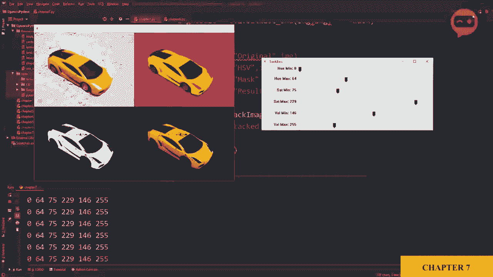

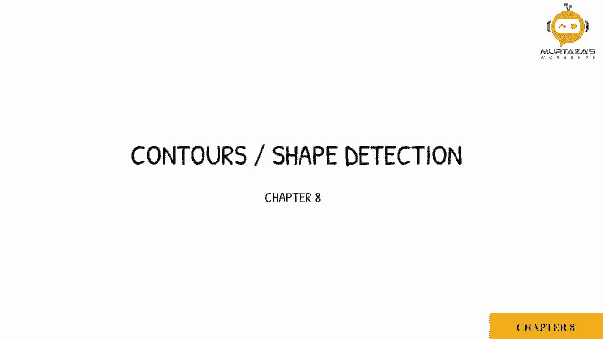


在本节课中，我们将学习如何使用OpenCV检测图像中的形状。我们将通过检测物体的轮廓和角点，并根据这些信息来识别和分类不同的几何形状，如三角形、圆形、正方形和矩形。课程将涵盖从图像预处理到最终形状分类的完整流程。

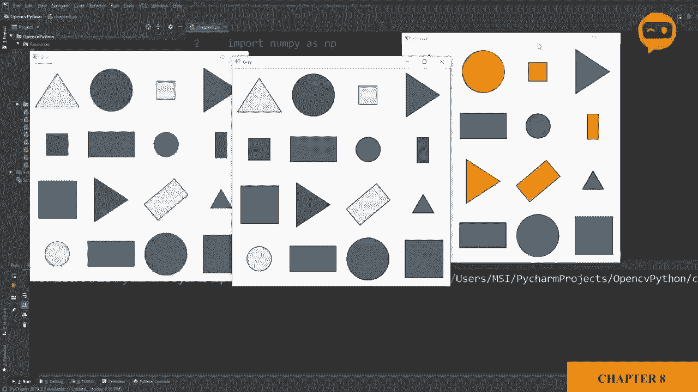

## 图像预处理与边缘检测 🖼️

首先，我们需要对图像进行预处理，将其转换为灰度图并应用模糊处理，以便更清晰地检测边缘。

以下是图像预处理的步骤：

1.  **转换为灰度图**：使用 `cv2.cvtColor` 函数将彩色图像转换为灰度图像。
    ```python
    imgGray = cv2.cvtColor(img, cv2.COLOR_BGR2GRAY)
    ```

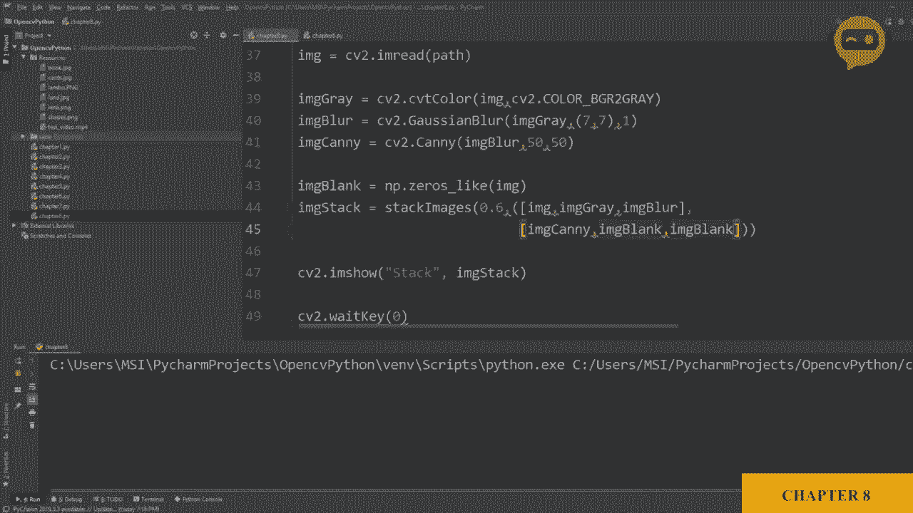

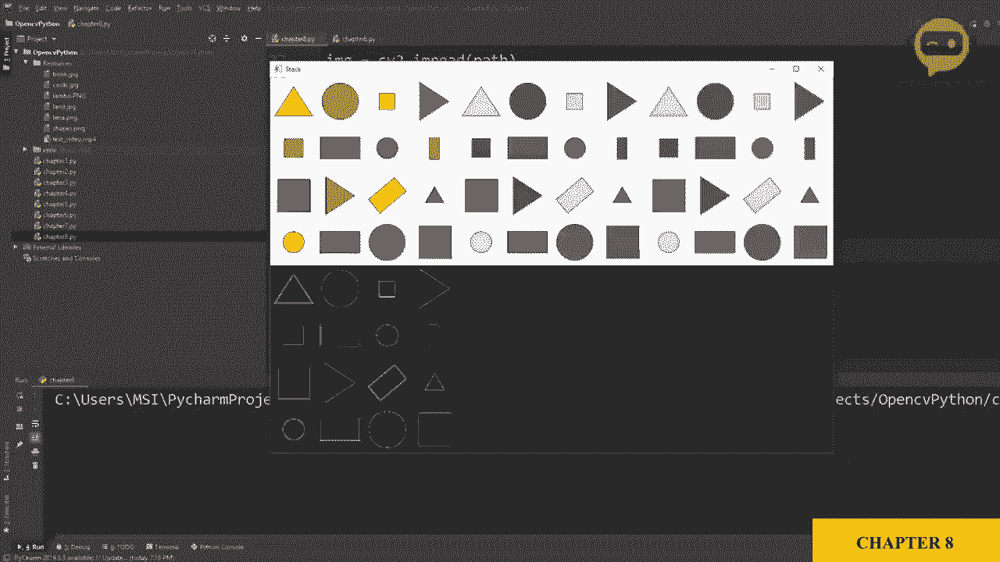

2.  **应用高斯模糊**：使用 `cv2.GaussianBlur` 函数减少图像噪声。
    ```python
    imgBlur = cv2.GaussianBlur(imgGray, (7, 7), 1)
    ```

3.  **边缘检测**：使用Canny边缘检测器 `cv2.Canny` 来找出图像中的边缘。
    ```python
    imgCanny = cv2.Canny(imgBlur, 50, 50)
    ```

为了便于观察，我们可以使用一个堆叠函数将原始图像、灰度图像、模糊图像和边缘检测图像并排显示。


## 轮廓检测与绘制 📐

上一节我们完成了图像的预处理和边缘检测。本节中，我们将从边缘图像中查找并绘制物体的轮廓。

我们将创建一个名为 `getContours` 的函数来完成这项工作。该函数的主要步骤如下：

1.  **查找轮廓**：使用 `cv2.findContours` 函数，并指定 `cv2.RETR_EXTERNAL` 模式来检索最外层轮廓。
    ```python
    contours, hierarchy = cv2.findContours(img, cv2.RETR_EXTERNAL, cv2.CHAIN_APPROX_NONE)
    ```

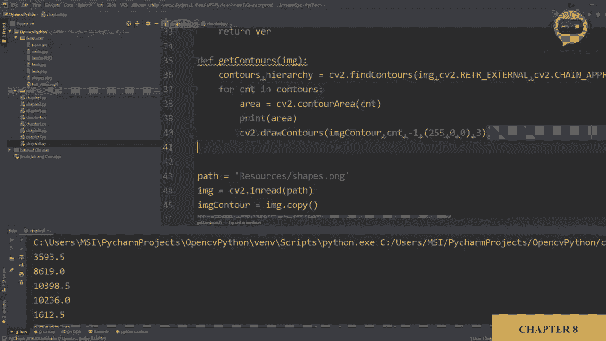

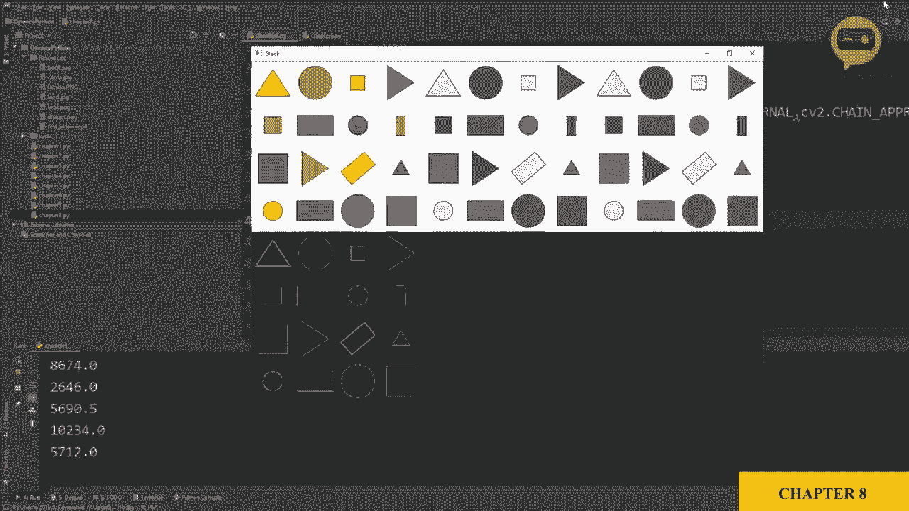

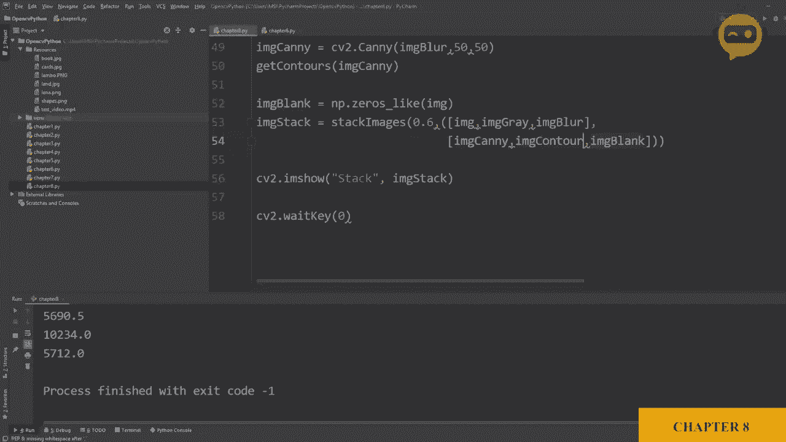

2.  **遍历轮廓**：循环处理每一个检测到的轮廓。
3.  **计算面积**：使用 `cv2.contourArea` 计算每个轮廓的面积，并设置一个最小面积阈值（例如500像素）以过滤噪声。
4.  **绘制轮廓**：使用 `cv2.drawContours` 在图像副本上绘制检测到的轮廓，以便可视化。

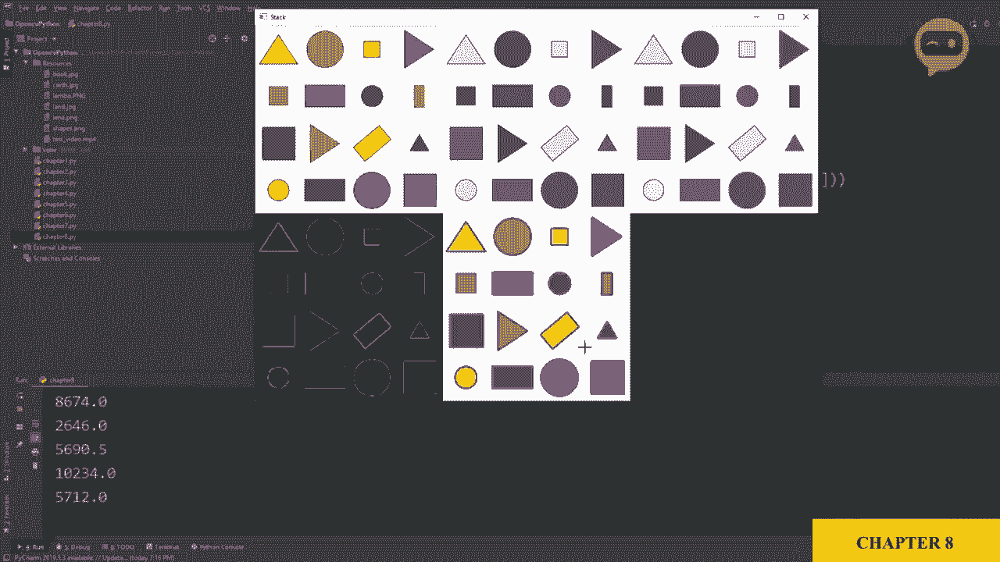

运行函数后，我们可以在图像上看到所有被检测形状的蓝色轮廓线。

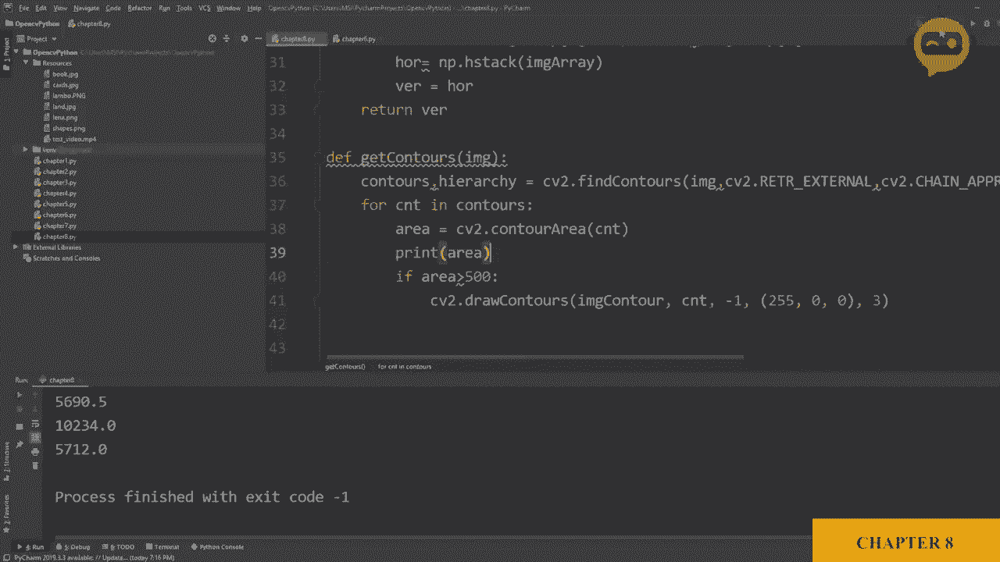


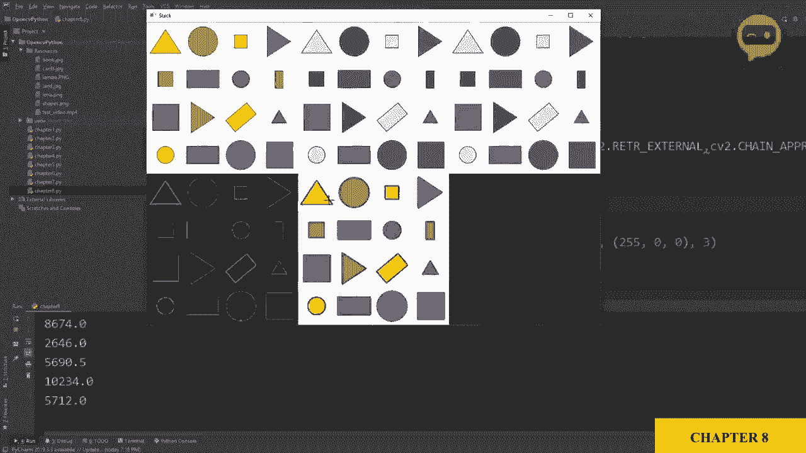

## 角点近似与边界框绘制 🧮

在成功检测并绘制轮廓之后，我们需要进一步分析这些轮廓，以确定它们的形状。这涉及到计算轮廓的周长、近似角点以及绘制边界框。

以下是分析每个轮廓的步骤：

1.  **计算轮廓周长**：使用 `cv2.arcLength` 函数。
    ```python
    peri = cv2.arcLength(cnt, True)
    ```

2.  **近似角点**：使用 `cv2.approxPolyDP` 函数对轮廓进行多边形近似，返回的角点数量是判断形状的关键。
    ```python
    approx = cv2.approxPolyDP(cnt, 0.02 * peri, True)
    objCor = len(approx)
    ```

3.  **获取边界框**：使用 `cv2.boundingRect` 获取每个轮廓的边界矩形坐标（x, y, 宽, 高）。
4.  **绘制边界框**：使用 `cv2.rectangle` 在图像上绘制绿色矩形框，清晰地标出每个检测到的物体。

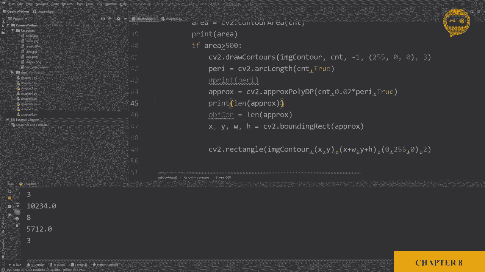


## 形状分类与标注 🏷️

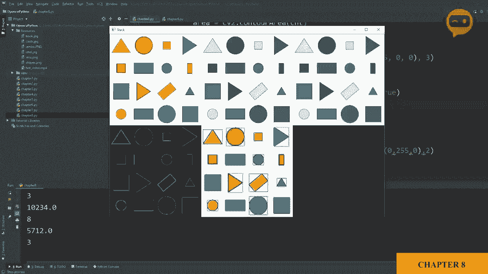

现在我们已经获得了每个轮廓的角点数量和边界框信息。本节我们将利用这些信息对形状进行分类，并在图像上标注出结果。

分类逻辑基于角点数量 `objCor` 和边界框的宽高比：

*   **三角形**：角点数量为3。
    ```python
    if objCor == 3: objectType = "Tri"
    ```

*   **四边形**：角点数量为4。需要进一步用宽高比区分正方形和矩形。
    ```python
    aspRatio = w / float(h)
    if 0.95 < aspRatio < 1.05: objectType = "Square"
    else: objectType = "Rectangle"
    ```

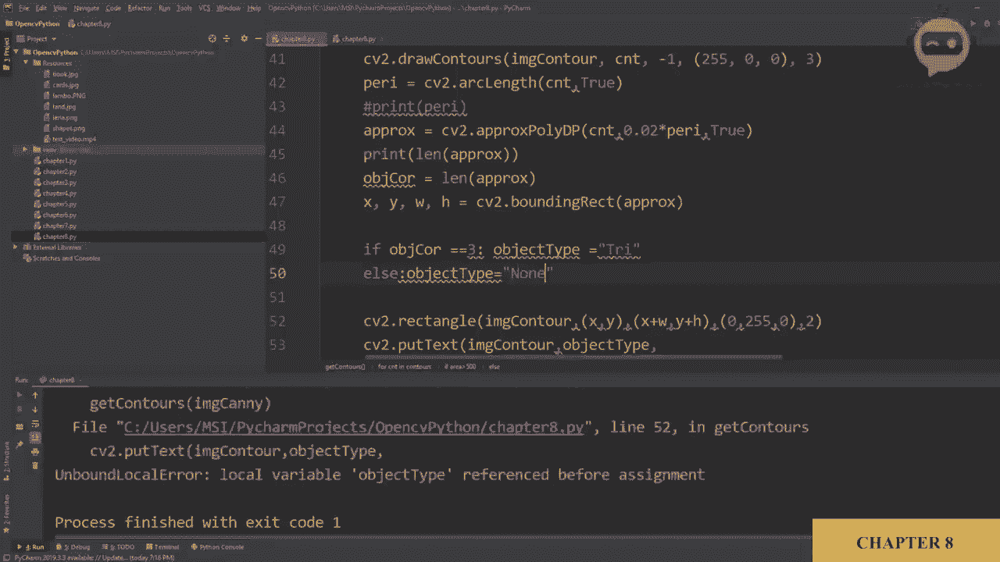

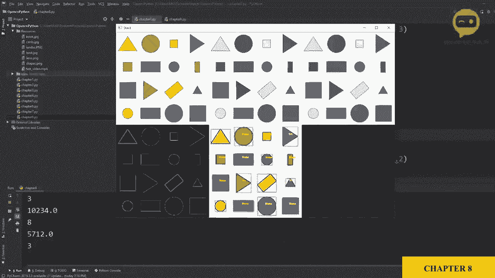

*   **圆形**：角点数量大于4（多边形近似后点数较多）。
    ```python
    elif objCor > 4: objectType = "Circle"
    ```

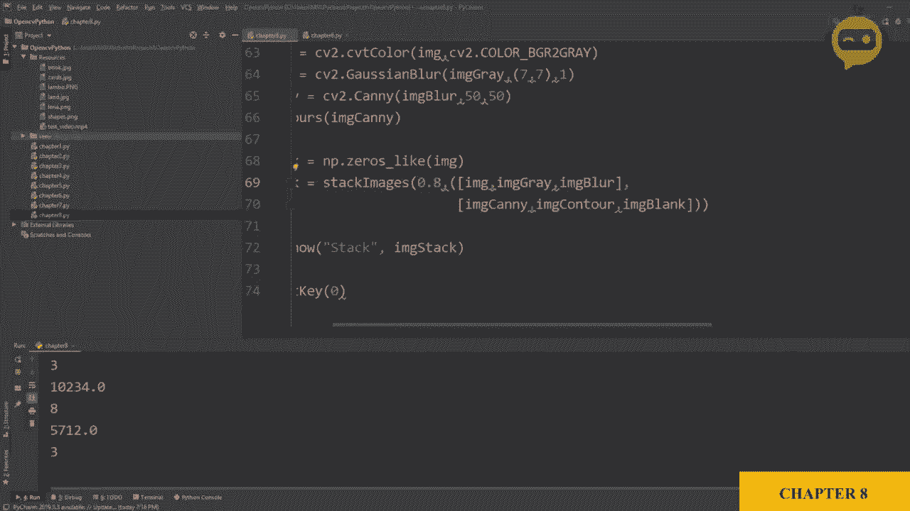

分类完成后，我们使用 `cv2.putText` 函数将形状名称（如“Tri”、“Square”）标注在对应边界框的中心位置附近。

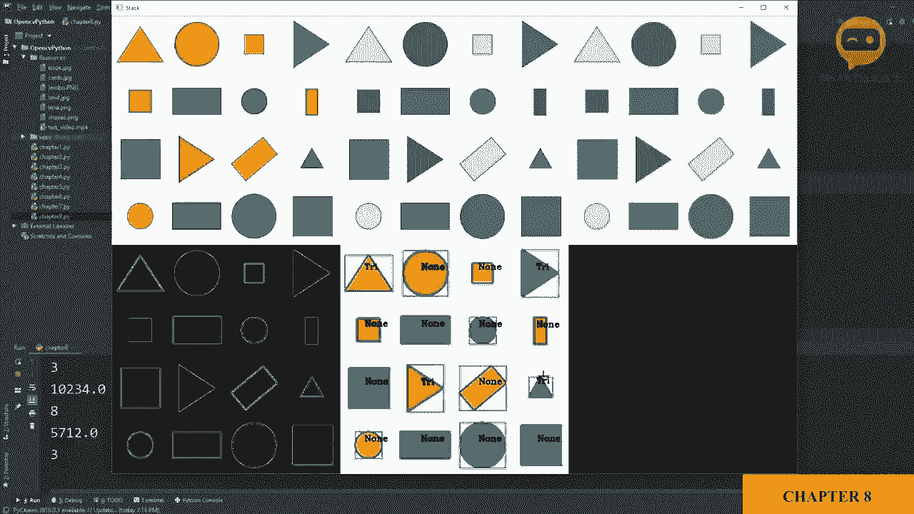

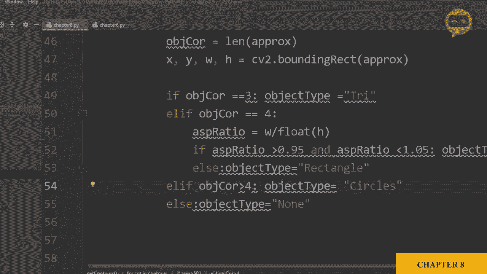

## 总结 📝

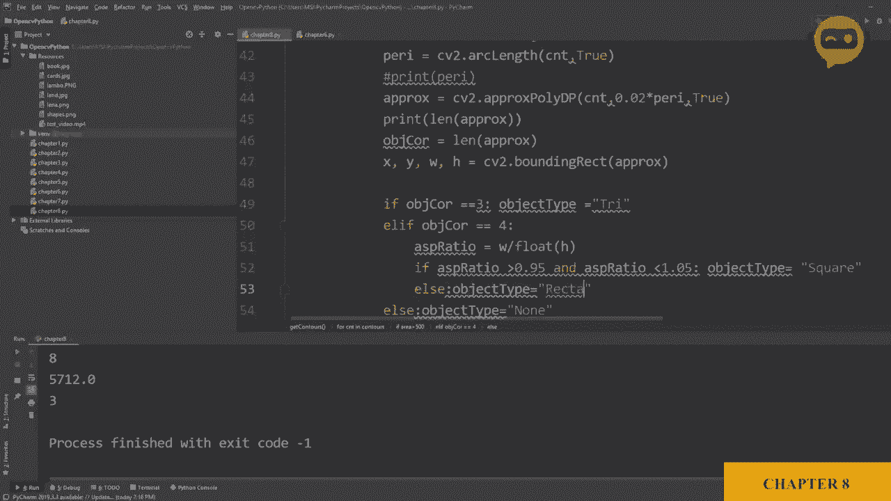

本节课中我们一起学习了使用OpenCV进行轮廓与形状检测的完整流程。

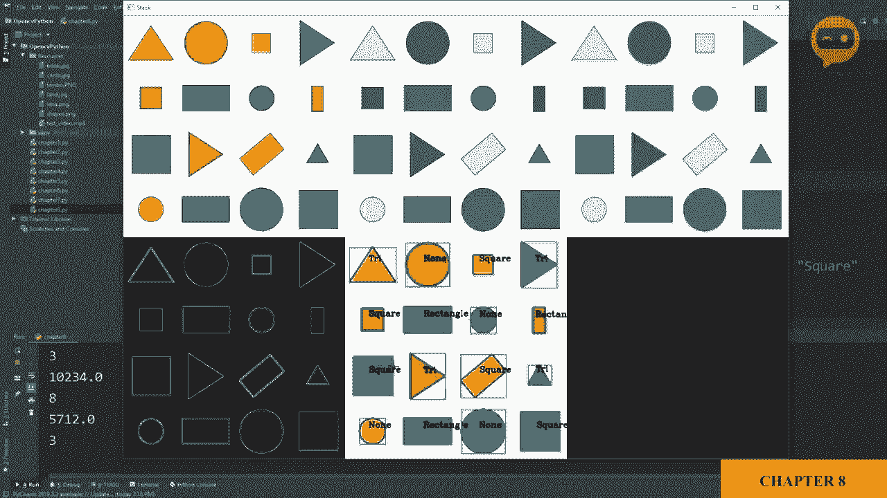

我们首先对图像进行预处理，包括灰度转换、模糊和边缘检测，为轮廓查找做好准备。接着，我们查找并绘制了图像中物体的轮廓。然后，通过计算轮廓周长并进行多边形近似，我们得到了每个形状的角点数量，并绘制了边界框。最后，我们根据角点数量和边界框的宽高比对形状进行了分类和标注，成功识别出了图像中的三角形、正方形、矩形和圆形。


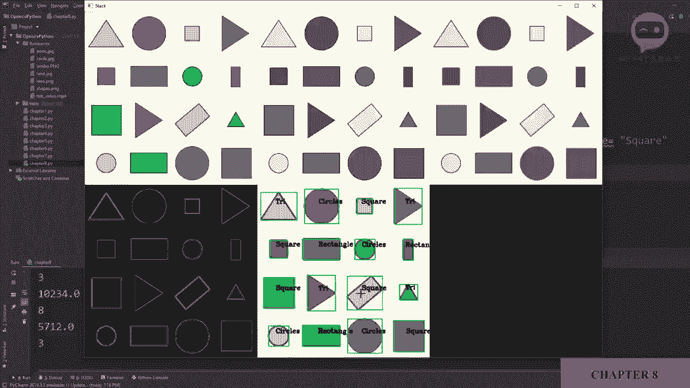

通过本教程，你掌握了利用轮廓分析进行基本形状识别的核心方法，这是计算机视觉中物体检测的基础。