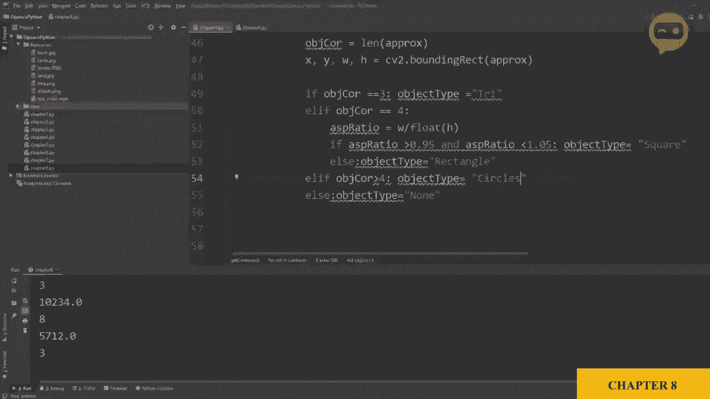
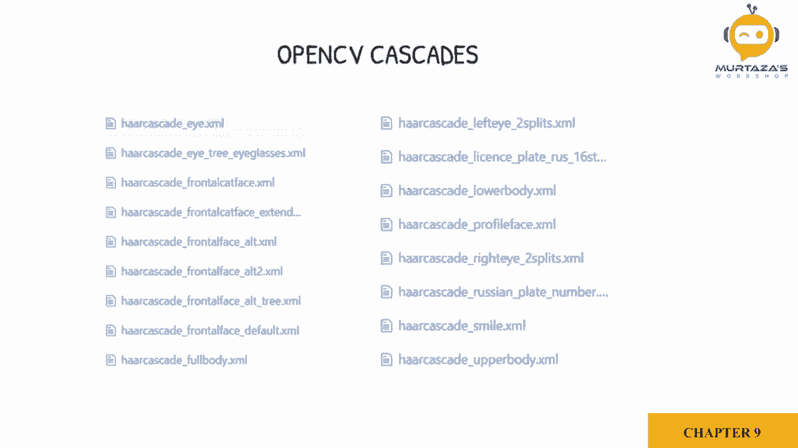
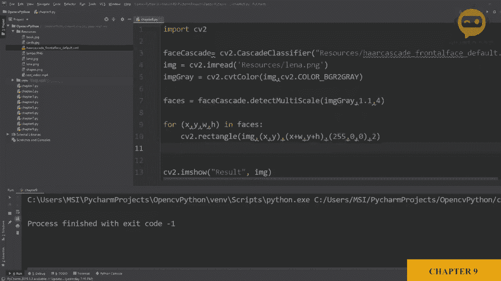

# OpenCV 基础教程，P12：第9章：人脸检测 👤




在本节课中，我们将学习如何使用OpenCV进行人脸检测。我们将重点介绍Viola-Jones人脸检测方法，并使用OpenCV提供的预训练级联分类器来快速实现这一功能。

## 概述：人脸检测原理

要检测人脸，我们将使用Viola和Jones提出的一种方法。这是最早允许实时物体检测的方法之一。该方法需要收集大量的正样本（人脸图像）和负样本（非人脸图像）来训练一个级联分类器。这个训练好的级联文件能帮助我们找到图像中的人脸。

在我们的案例中，我们不会自己训练模型，而是直接使用OpenCV提供的预训练文件。OpenCV提供了一些默认的级联分类器，可以检测不同的物体，如车牌、眼睛、全身等。如果你想了解更多关于创建自定义级联分类器的信息，可以查看描述中提供的单独视频。

## 实现步骤



上一节我们介绍了人脸检测的基本原理，本节中我们来看看具体的代码实现步骤。

以下是实现人脸检测的核心步骤：

1.  **导入图像**：从源文件夹中导入图像，并使用`imshow`函数显示它。
2.  **加载级联分类器**：加载OpenCV提供的预训练人脸检测级联文件。
3.  **图像预处理**：将彩色图像转换为灰度图像，因为级联分类器通常在灰度图上工作。
4.  **执行人脸检测**：使用级联分类器的`detectMultiScale`方法在灰度图像中查找人脸。
5.  **绘制检测结果**：遍历所有检测到的人脸区域，并在原始彩色图像上绘制矩形框。

## 代码详解

现在，让我们深入每一步，看看具体的代码是如何实现的。

### 1. 加载级联分类器

首先，我们需要加载人脸检测的级联分类器文件。代码如下：

```python
face_cascade = cv2.CascadeClassifier(cv2.data.haarcascades + ‘haarcascade_frontalface_default.xml’)
```

### 2. 图像预处理与检测

接下来，读取图像并将其转换为灰度图，然后使用加载的级联分类器进行检测。

```python
# 读取图像
img = cv2.imread(‘path_to_image.jpg’)
# 转换为灰度图
gray = cv2.cvtColor(img, cv2.COLOR_BGR2GRAY)
# 检测人脸
faces = face_cascade.detectMultiScale(gray, scaleFactor=1.1, minNeighbors=4)
```

**参数说明**：
*   `scaleFactor=1.1`：指定图像尺寸减小的比例，用于构建图像金字塔。这个参数可以根据检测结果进行调整。
*   `minNeighbors=4`：指定每个候选矩形应该保留的邻居数量。这个参数也可以根据需求调整，值越高，检测越严格，漏检可能增加；值越低，误检可能增加。

### 3. 绘制检测框

最后，我们遍历所有检测到的人脸，并在原始图像上绘制矩形框。

```python
for (x, y, w, h) in faces:
    cv2.rectangle(img, (x, y), (x+w, y+h), (255, 0, 0), 2)
# 显示结果
cv2.imshow(‘Detected Faces’, img)
cv2.waitKey(0)
```

**代码解释**：
*   `(x, y)` 是矩形框左上角的坐标。
*   `w` 和 `h` 是矩形框的宽度和高度。
*   `(255, 0, 0)` 定义了矩形框的颜色（这里是蓝色）。
*   `2` 定义了矩形框线条的粗细。

运行上述代码后，我们就能在图像中检测到人脸并为其创建边界框。



## 拓展与应用

Viola-Jones级联方法虽然可能不是最精准的，但其速度非常快。因此，许多实时应用（如摄像头）仍然使用这种基于硬件的级联方法来寻找人脸。尽管这是一种相对较旧的算法，但在许多场景下依然有效且表现良好。

如果你想检测更多对象，互联网上有很多他人训练好的级联文件可用。或者，你也可以创建自己的自定义级联分类器来检测汽车、手机、电视等任何你能想到的物体。

## 总结


本节课中，我们一起学习了使用OpenCV进行人脸检测。我们了解了Viola-Jones检测方法的基本原理，并通过加载预训练的级联分类器、转换图像色彩空间、调用`detectMultiScale`函数以及绘制矩形框这几个步骤，成功实现了对图像中人脸的检测和标记。