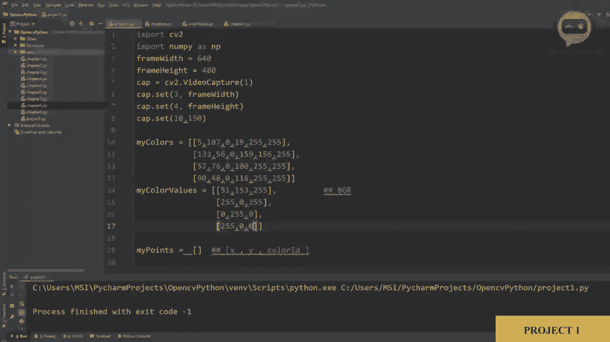
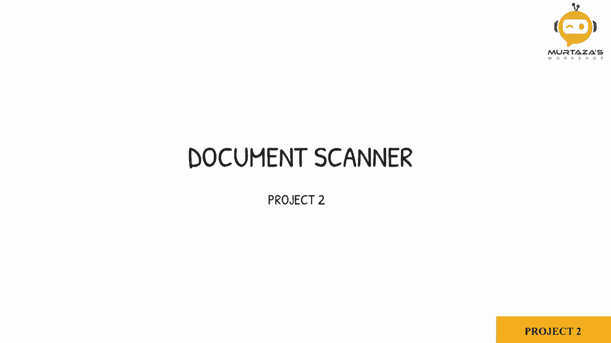
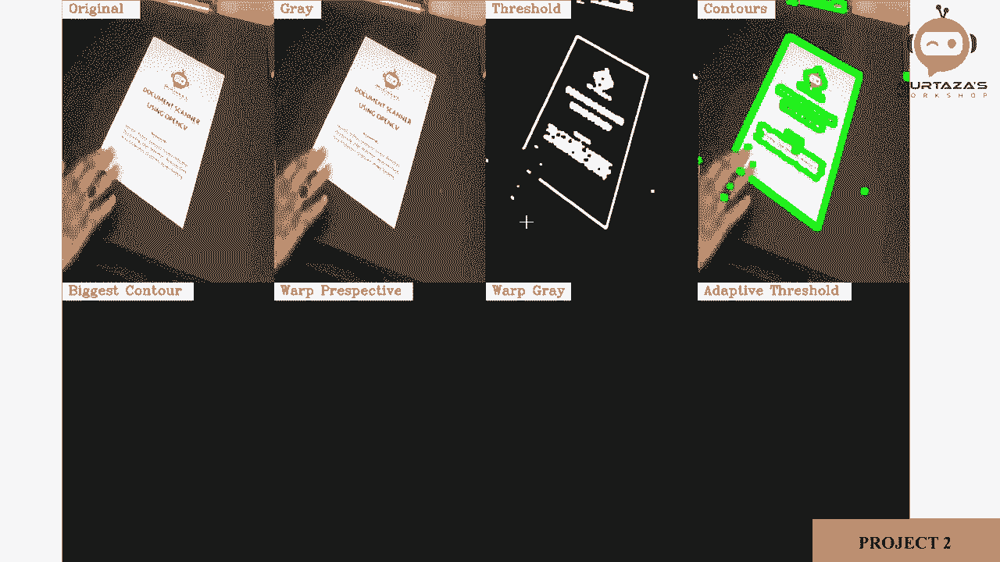
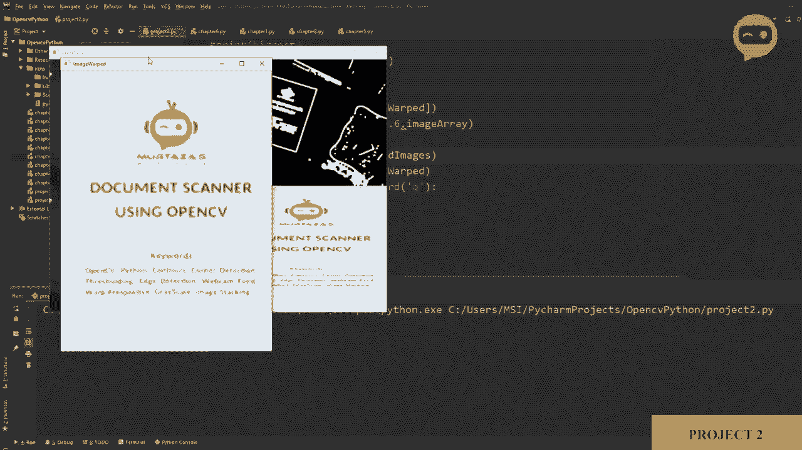
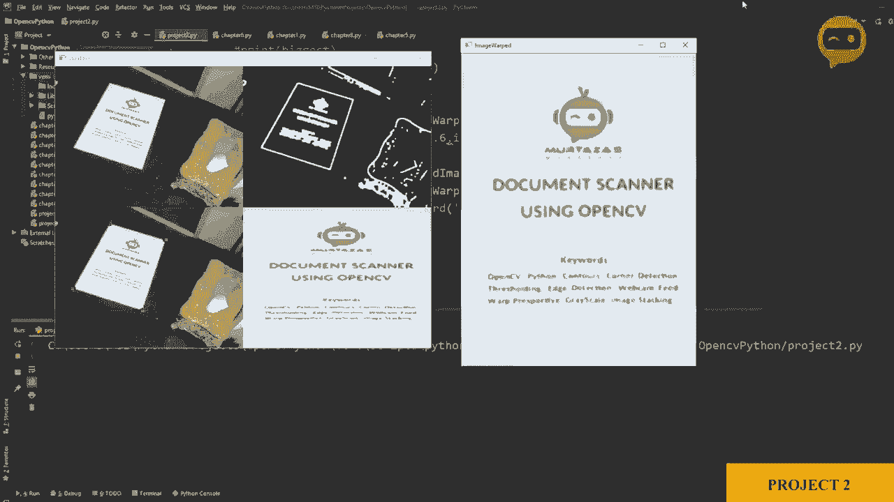
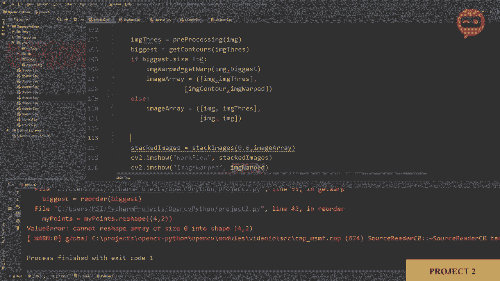
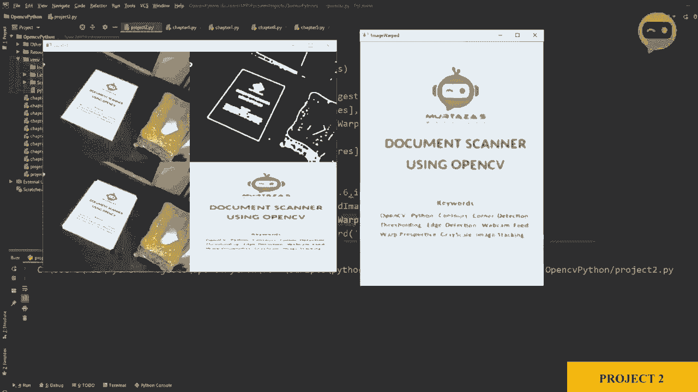

# OpenCV 基础教程，P14：项目2：文档扫描器 📄








在本节课中，我们将学习如何构建一个文档扫描器。我们将从摄像头捕获图像，检测其中的文档，然后通过透视变换获取文档的平面鸟瞰图，最终输出一张类似扫描仪的图像。

## 概述

本项目将整合之前学过的多个OpenCV概念，包括图像预处理、边缘检测、轮廓查找和透视变换。我们将编写一个程序，实时处理摄像头画面，自动识别并“扫描”文档。

## 项目初始化与摄像头设置

首先，我们需要设置摄像头来捕获实时视频。这部分代码与第一章的基础摄像头代码类似。

```python
import cv2
import numpy as np

frameWidth = 640
frameHeight = 480
cap = cv2.VideoCapture(0)
cap.set(3, frameWidth)
cap.set(4, frameHeight)
cap.set(10, 150) # 设置亮度

while True:
    success, img = cap.read()
    # 后续处理将在这里进行
    cv2.imshow("Result", img)
    if cv2.waitKey(1) & 0xFF == ord('q'):
        break
```

## 图像预处理

为了准确检测文档边缘，我们需要对图像进行一系列预处理操作。这包括转换为灰度图、模糊处理以及边缘检测。

我们将定义一个名为 `preProcessing` 的函数来完成这些步骤。

```python
def preProcessing(img):
    imgGray = cv2.cvtColor(img, cv2.COLOR_BGR2GRAY)
    imgBlur = cv2.GaussianBlur(imgGray, (5, 5), 1)
    imgCanny = cv2.Canny(imgBlur, 200, 200)
    kernel = np.ones((5, 5))
    imgDial = cv2.dilate(imgCanny, kernel, iterations=2)
    imgThres = cv2.erode(imgDial, kernel, iterations=1)
    return imgThres
```

以下是预处理步骤的详细说明：
1.  **转换为灰度图**：`cv2.cvtColor(img, cv2.COLOR_BGR2GRAY)` 将彩色图像转换为单通道灰度图像，简化后续处理。
2.  **高斯模糊**：`cv2.GaussianBlur(imgGray, (5, 5), 1)` 使用5x5的核进行模糊，以减少图像噪声。
3.  **Canny边缘检测**：`cv2.Canny(imgBlur, 200, 200)` 检测图像中的边缘。阈值可以调整。
4.  **膨胀与腐蚀**：先使用 `cv2.dilate` 加粗边缘，再使用 `cv2.erode` 使其略微变细。这有助于连接断开的边缘，使轮廓更完整。

## 查找最大轮廓

预处理后，图像中会包含许多边缘。我们需要找到代表文档的那个最大的四边形轮廓。

上一节我们介绍了如何通过预处理来突出文档边缘，本节中我们来看看如何从这些边缘中精确地找到目标轮廓。

我们将编写 `getContours` 函数来寻找面积最大的轮廓，并返回其四个角点。

```python
def getContours(img):
    biggest = np.array([])
    maxArea = 0
    contours, hierarchy = cv2.findContours(img, cv2.RETR_EXTERNAL, cv2.CHAIN_APPROX_NONE)
    for cnt in contours:
        area = cv2.contourArea(cnt)
        if area > 5000:
            peri = cv2.arcLength(cnt, True)
            approx = cv2.approxPolyDP(cnt, 0.02 * peri, True)
            if area > maxArea and len(approx) == 4:
                biggest = approx
                maxArea = area
    return biggest
```

函数逻辑如下：
1.  使用 `cv2.findContours` 查找所有轮廓。
2.  遍历每个轮廓，计算其面积。
3.  设定一个面积阈值（如5000）以过滤掉小噪声。
4.  对符合条件的轮廓，用 `cv2.approxPolyDP` 进行多边形近似。
5.  只保留面积最大且近似结果为四个点的轮廓（即四边形），这很可能就是我们的文档。

## 重新排列角点顺序

找到文档的四个角点后，这些点的顺序可能是任意的。为了进行正确的透视变换，我们需要将它们按固定顺序排列：左上、右上、左下、右下。

以下是重新排列角点顺序的函数 `reorder`。

```python
def reorder(myPoints):
    myPoints = myPoints.reshape((4, 2))
    myPointsNew = np.zeros((4, 1, 2), dtype=np.int32)
    add = myPoints.sum(1)
    myPointsNew[0] = myPoints[np.argmin(add)]
    myPointsNew[3] = myPoints[np.argmax(add)]
    diff = np.diff(myPoints, axis=1)
    myPointsNew[1] = myPoints[np.argmin(diff)]
    myPointsNew[2] = myPoints[np.argmax(diff)]
    return myPointsNew
```

其工作原理基于坐标和的特性：
1.  将四个点的x和y坐标分别相加。
2.  和最小的点是**左上角**，和最大的点是**右下角**。
3.  计算每个点的y-x差值。
4.  差值最小的点是**右上角**，差值最大的点是**左下角**。

## 透视变换与图像裁剪

现在我们已经有了有序的四个源点（文档角点）和目标点（输出图像的四个角）。接下来可以进行透视变换，将倾斜的文档“拉直”为正面视图。

我们定义 `getWarp` 函数来执行透视变换，并可选地对结果进行裁剪以去除黑边。

```python
def getWarp(img, biggest):
    biggest = reorder(biggest)
    pts1 = np.float32(biggest)
    pts2 = np.float32([[0, 0], [frameWidth, 0], [0, frameHeight], [frameWidth, frameHeight]])
    matrix = cv2.getPerspectiveTransform(pts1, pts2)
    imgOutput = cv2.warpPerspective(img, matrix, (frameWidth, frameHeight))

    # 裁剪掉边缘的20个像素
    imgCropped = imgOutput[20:imgOutput.shape[0]-20, 20:imgOutput.shape[1]-20]
    imgCropped = cv2.resize(imgCropped, (frameWidth, frameHeight))
    return imgCropped
```

关键步骤：
1.  `cv2.getPerspectiveTransform(pts1, pts2)` 计算从源点 `pts1` 到目标点 `pts2` 的变换矩阵。
2.  `cv2.warpPerspective(img, matrix, (frameWidth, frameHeight))` 应用该矩阵进行透视变换。
3.  变换后的图像边缘可能有黑边，通过数组切片 `imgOutput[20:-20, 20:-20]` 将其裁剪掉，然后调整回原始尺寸。

## 整合与实时处理

最后，我们将所有步骤整合到主循环中，实现实时文档扫描。同时，我们添加一个图像堆叠功能，以便在同一个窗口中观察处理流程。

```python
def stackImages(scale,imgArray):
    # 图像堆叠函数，用于并排显示多张图像
    rows = len(imgArray)
    cols = len(imgArray[0])
    rowsAvailable = isinstance(imgArray[0], list)
    width = imgArray[0][0].shape[1]
    height = imgArray[0][0].shape[0]
    if rowsAvailable:
        for x in range ( 0, rows):
            for y in range(0, cols):
                if imgArray[x][y].shape[:2] == imgArray[0][0].shape [:2]:
                    imgArray[x][y] = cv2.resize(imgArray[x][y], (0, 0), None, scale, scale)
                else:
                    imgArray[x][y] = cv2.resize(imgArray[x][y], (imgArray[0][0].shape[1], imgArray[0][0].shape[0]), None, scale, scale)
                if len(imgArray[x][y].shape) == 2: imgArray[x][y]= cv2.cvtColor( imgArray[x][y], cv2.COLOR_GRAY2BGR)
        imageBlank = np.zeros((height, width, 3), np.uint8)
        hor = [imageBlank]*rows
        hor_con = [imageBlank]*rows
        for x in range(0, rows):
            hor[x] = np.hstack(imgArray[x])
        ver = np.vstack(hor)
    else:
        for x in range(0, rows):
            if imgArray[x].shape[:2] == imgArray[0].shape[:2]:
                imgArray[x] = cv2.resize(imgArray[x], (0, 0), None, scale, scale)
            else:
                imgArray[x] = cv2.resize(imgArray[x], (imgArray[0].shape[1], imgArray[0].shape[0]), None, scale, scale)
            if len(imgArray[x].shape) == 2: imgArray[x] = cv2.cvtColor(imgArray[x], cv2.COLOR_GRAY2BGR)
        hor= np.hstack(imgArray)
        ver = hor
    return ver

while True:
    success, img = cap.read()
    img = cv2.resize(img, (frameWidth, frameHeight))
    imgContour = img.copy()

    # 1. 预处理
    imgThres = preProcessing(img)

    # 2. 获取最大轮廓
    biggest = getContours(imgThres)

    if biggest.size != 0:
        # 3. 绘制轮廓
        cv2.drawContours(imgContour, biggest, -1, (255, 0, 0), 20)
        # 4. 透视变换
        imgWarp = getWarp(img, biggest)
        # 构建图像数组用于堆叠显示
        imageArray = ([img, imgContour],
                      [imgThres, imgWarp])
    else:
        # 如果没有找到轮廓，则用原图占位
        imageArray = ([img, img],
                      [img, img])

    # 显示堆叠后的图像
    stackedImages = stackImages(0.6, imageArray)
    cv2.imshow("Workflow", stackedImages)

    if cv2.waitKey(1) & 0xFF == ord('q'):
        break
```



程序运行后，窗口将分为四部分显示：
*   左上：原始摄像头图像。
*   右上：绘制了检测到的最大的文档轮廓的图像。
*   左下：预处理后的边缘检测图像。
*   右下：经过透视变换和裁剪后的最终“扫描”结果。

**注意**：如果摄像头前没有文档，程序会因找不到轮廓而跳过变换步骤，此时右下角将显示原始图像。



当文档重新出现时，扫描功能恢复。







## 总结

本节课中我们一起学习了如何构建一个完整的文档扫描器项目。我们回顾并实践了以下核心技能：
1.  使用OpenCV捕获并处理实时视频流。
2.  通过灰度转换、模糊和Canny检测进行图像预处理。
3.  查找并筛选图像中最大的轮廓以定位文档。
4.  对轮廓角点进行重新排序，为透视变换做准备。
5.  应用透视变换将倾斜文档校正为正面视图。
6.  对输出图像进行裁剪和调整，获得更整洁的扫描效果。
7.  将多个处理阶段的图像堆叠显示，便于调试和观察流程。


通过这个项目，你将能够把分散的OpenCV知识组合起来，解决一个实际的计算机视觉问题。你可以尝试调整预处理参数、使用更高分辨率的图像或添加保存扫描结果的功能来进一步扩展本项目。