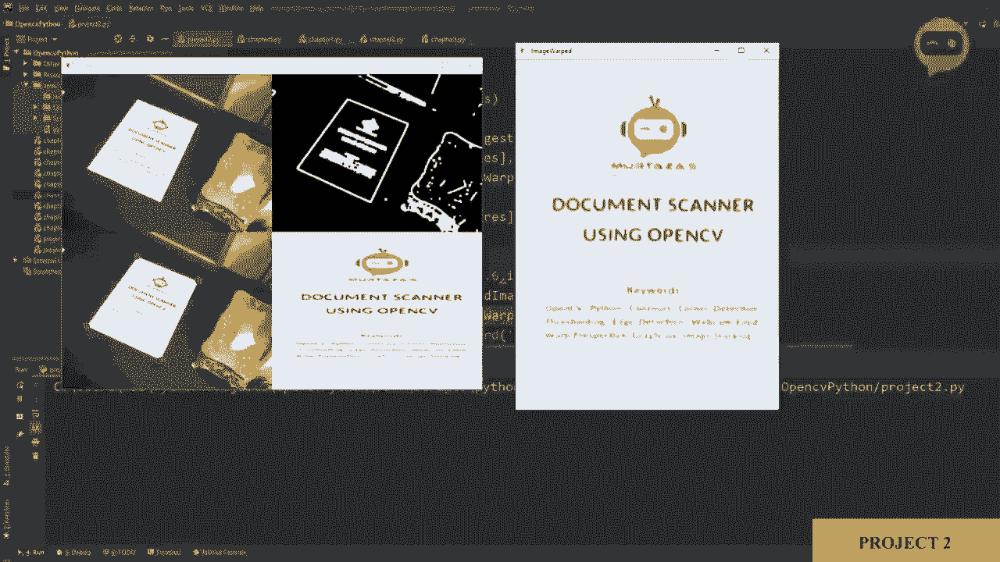
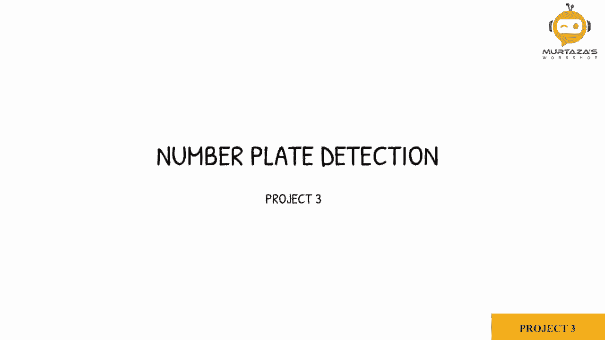
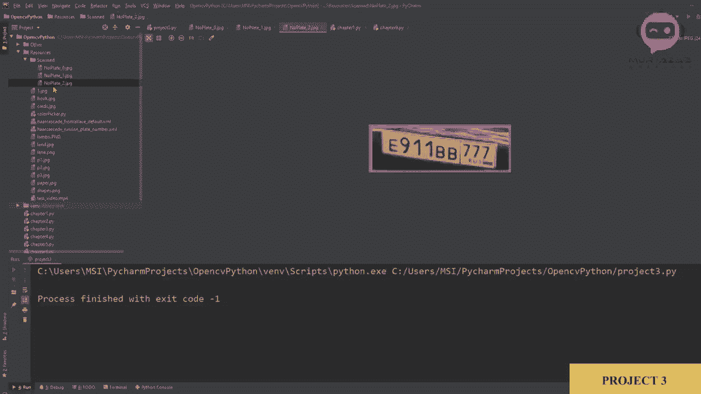

# OpenCV 基础教程，P15：项目3：车牌检测 🚗📸






在本节课中，我们将学习如何利用网络摄像头实时检测汽车的车牌。我们将运用之前学过的级联分类器方法，并在此基础上增加图像过滤、标记和保存功能，最终构建一个完整的车牌检测与保存系统。

## 1. 启动网络摄像头 📹

首先，我们需要启动网络摄像头来捕获实时视频流。这是整个项目的基础，我们将复制并调整之前课程中用于访问摄像头的代码。

```python
import cv2

# 初始化摄像头，参数1通常代表第一个摄像头设备
cap = cv2.VideoCapture(1)

while True:
    # 读取一帧图像
    success, img = cap.read()
    if not success:
        break

    # 显示图像
    cv2.imshow('Video', img)

    # 按下‘q’键退出循环
    if cv2.waitKey(1) & 0xFF == ord('q'):
        break

# 释放摄像头并关闭所有窗口
cap.release()
cv2.destroyAllWindows()
```

运行上述代码，确认摄像头可以正常工作并显示画面。画面中应包含用于测试的汽车图像。

## 2. 应用级联分类器进行车牌检测 🔍

上一节我们启动了摄像头，本节中我们来看看如何检测画面中的车牌。我们将使用级联分类器方法，这与之前人脸检测的原理相同，只是加载的模型文件不同。

以下是实现车牌检测的核心步骤：

1.  **加载级联分类器**：我们需要一个预先训练好的、专门用于检测车牌的级联分类器文件（例如 `Russian_plate_number.xml`）。
2.  **预处理图像**：将彩色图像转换为灰度图，因为级联分类器通常在灰度图上运行。
3.  **执行检测**：调用分类器的 `detectMultiScale` 方法在图像中查找车牌。

我们将检测代码集成到摄像头循环中。

```python
import cv2

# 加载车牌级联分类器
plate_cascade = cv2.CascadeClassifier('resources/Russian_plate_number.xml')

cap = cv2.VideoCapture(1)

while True:
    success, img = cap.read()
    if not success:
        break

    # 转换为灰度图像
    img_gray = cv2.cvtColor(img, cv2.COLOR_BGR2GRAY)

    # 检测车牌
    plates = plate_cascade.detectMultiScale(img_gray, 1.1, 4)

    # 遍历所有检测到的车牌
    for (x, y, w, h) in plates:
        # 在原图上绘制矩形框标记车牌
        cv2.rectangle(img, (x, y), (x+w, y+h), (255, 0, 0), 2)

    cv2.imshow('Video', img)
    if cv2.waitKey(1) & 0xFF == ord('q'):
        break

cap.release()
cv2.destroyAllWindows()
```

运行代码，可以看到摄像头画面中检测到的车牌被蓝色矩形框标出。

## 3. 优化检测结果：添加过滤器与标记 🏷️

目前，检测可能会框出一些非常小的区域（噪声）。为了提升准确性，我们需要添加一个面积过滤器，只保留大于特定阈值的区域，并为这些区域添加文字标签。

以下是优化检测结果的具体操作：

1.  **计算区域面积**：利用检测到的矩形框的宽度（`w`）和高度（`h`）计算面积。
2.  **设置最小面积阈值**：定义一个 `min_area`（例如500），只有面积大于此值的区域才被认为是有效车牌。
3.  **添加文字标签**：在有效车牌框的上方添加“Number Plate”文字进行标记。

```python
import cv2

plate_cascade = cv2.CascadeClassifier('resources/Russian_plate_number.xml')
cap = cv2.VideoCapture(1)
min_area = 500

while True:
    success, img = cap.read()
    if not success:
        break
    img_gray = cv2.cvtColor(img, cv2.COLOR_BGR2GRAY)
    plates = plate_cascade.detectMultiScale(img_gray, 1.1, 4)

    for (x, y, w, h) in plates:
        area = w * h
        if area > min_area:
            # 绘制矩形框
            cv2.rectangle(img, (x, y), (x+w, y+h), (255, 0, 0), 2)
            # 添加文字标签
            cv2.putText(img, "Number Plate", (x, y-5),
                        cv2.FONT_HERSHEY_COMPLEX_SMALL, 1, (255, 0, 0), 2)

    cv2.imshow('Video', img)
    if cv2.waitKey(1) & 0xFF == ord('q'):
        break

cap.release()
cv2.destroyAllWindows()
```

现在，检测结果更加精确，并且每个车牌都有清晰的标签。

## 4. 提取与保存车牌图像 💾

检测到车牌后，我们常常需要将其单独提取出来并保存到本地，以便后续处理（如字符识别）。本节我们将实现这个功能。

以下是提取与保存车牌图像的步骤：

1.  **提取感兴趣区域（ROI）**：利用矩形框的坐标 `(x, y, w, h)` 从原始图像中裁剪出车牌部分。
2.  **保存图像**：当用户按下特定键（如‘s’）时，将裁剪出的车牌图像保存到指定文件夹。
3.  **提供视觉反馈**：保存成功后，在屏幕上显示提示信息，让用户知晓操作已完成。

我们还需要一个计数器来为保存的图片生成不同的文件名。

```python
import cv2

plate_cascade = cv2.CascadeClassifier('resources/Russian_plate_number.xml')
cap = cv2.VideoCapture(1)
min_area = 500
count = 0  # 用于文件命名的计数器

while True:
    success, img = cap.read()
    if not success:
        break
    img_gray = cv2.cvtColor(img, cv2.COLOR_BGR2GRAY)
    plates = plate_cascade.detectMultiScale(img_gray, 1.1, 4)

    for (x, y, w, h) in plates:
        area = w * h
        if area > min_area:
            cv2.rectangle(img, (x, y), (x+w, y+h), (255, 0, 0), 2)
            cv2.putText(img, "Number Plate", (x, y-5),
                        cv2.FONT_HERSHEY_COMPLEX_SMALL, 1, (255, 0, 0), 2)

            # 提取车牌区域 (ROI)
            img_roi = img[y:y+h, x:x+w]
            # 显示ROI（可选，可以单独开一个窗口）
            # cv2.imshow('ROI', img_roi)

    cv2.imshow('Video', img)

    key = cv2.waitKey(1) & 0xFF
    if key == ord('q'):
        break
    elif key == ord('s'):  # 按下's'键保存
        if 'img_roi' in locals():  # 确保有ROI可保存
            count += 1
            # 保存图像到 resources/scans/ 文件夹
            cv2.imwrite(f'resources/scans/plate_{count}.jpg', img_roi)
            # 在屏幕上显示保存成功的反馈
            cv2.rectangle(img, (0, 200), (640, 300), (0, 255, 0), cv2.FILLED)
            cv2.putText(img, "Scan Saved", (150, 265),
                        cv2.FONT_HERSHEY_DUPLEX, 2, (0, 0, 255), 2)
            cv2.imshow('Video', img)
            cv2.waitKey(500)  # 显示反馈信息500毫秒

cap.release()
cv2.destroyAllWindows()
```

运行程序，当检测到车牌时，按下‘s’键，程序会将当前车牌保存至 `resources/scans/` 文件夹下，并以 `plate_1.jpg`, `plate_2.jpg` 等名称递增，同时在屏幕上会有“Scan Saved”的绿色提示框短暂出现。



## 总结 📝

本节课中我们一起学习了如何构建一个完整的实时车牌检测系统。


1.  我们首先启动了网络摄像头，获取实时视频流。
2.  接着，我们应用了级联分类器来检测视频帧中的车牌位置。
3.  然后，我们通过设置面积过滤器和添加文字标签优化了检测结果，使其更准确、直观。
4.  最后，我们实现了车牌区域的提取功能，并允许用户通过按键将检测到的车牌图像保存到本地，同时提供了清晰的视觉反馈。


通过这个项目，你将OpenCV的基础知识（图像读取、灰度转换、目标检测、图像裁剪、文件保存）串联起来，完成了一个具有实用价值的计算机视觉应用。