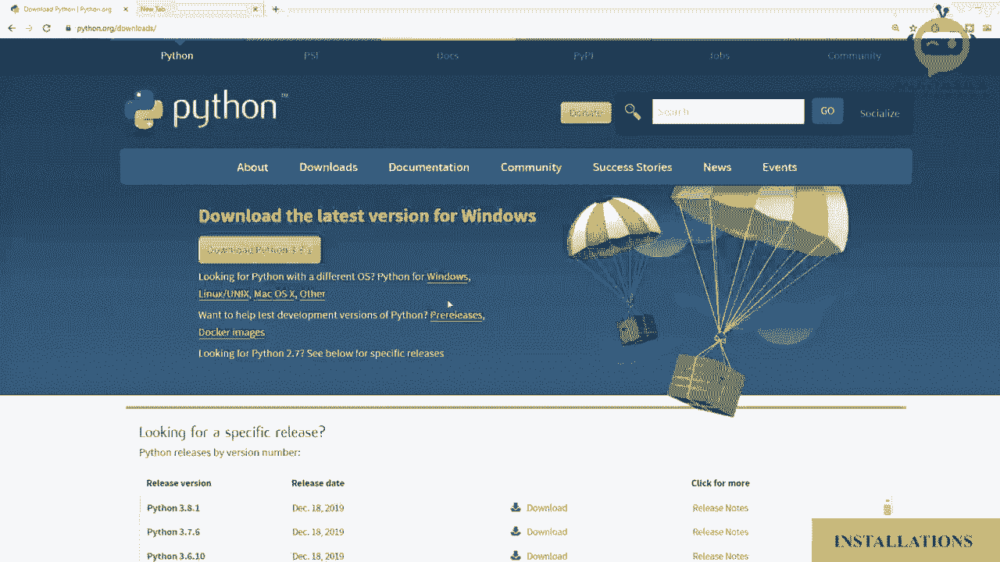
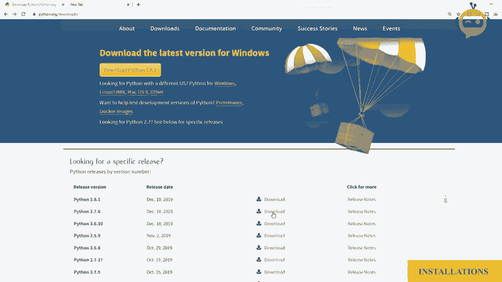
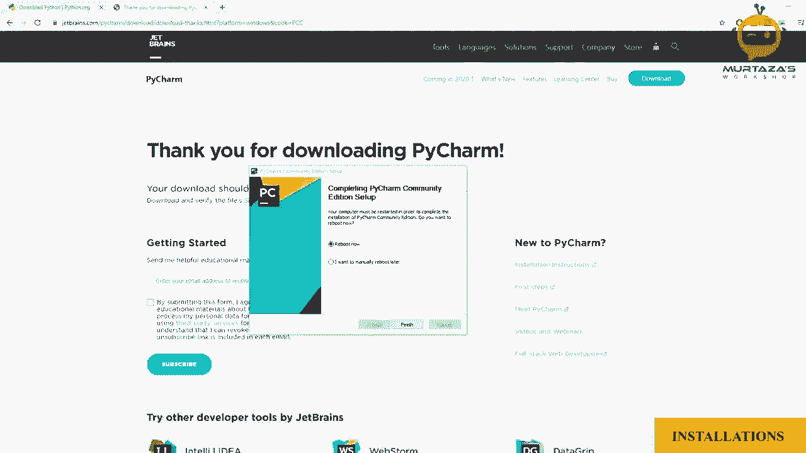
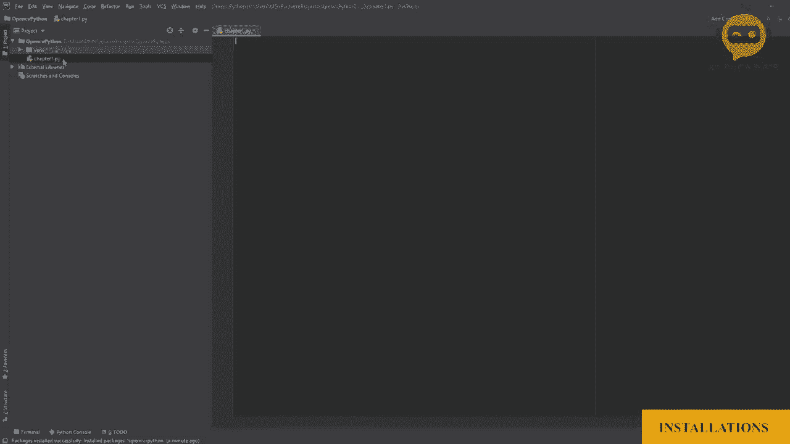
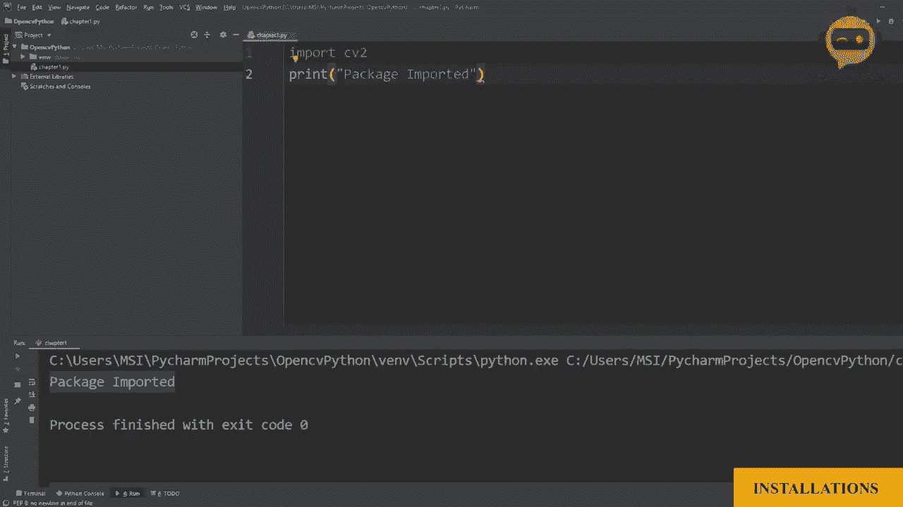

# OpenCV 基础教程，P3：第0章：安装 🛠️


在本章中，我们将学习如何为OpenCV开发搭建基础环境。主要内容包括安装Python、安装代码编辑器PyCharm，以及安装OpenCV库本身。完成本章后，你将拥有一个可以开始编写OpenCV代码的工作环境。

## 1. 安装Python 🐍



首先，我们需要安装Python。Python是运行OpenCV代码的编程语言。

我们将访问Python官方网站的下载页面。为了确保与OpenCV的最佳兼容性，我们选择下载版本3.7.6，而不是最新版本。




根据你的操作系统选择对应的安装包。本教程以Windows系统为例，如果你使用的是Mac，请下载对应的Mac版本。

下载完成后，运行安装程序。在安装过程中，请务必勾选“Add Python 3.7 to PATH”选项，这会将Python添加到系统路径，方便后续使用。

安装完成后，关闭安装对话框。

## 2. 安装PyCharm 💻

接下来，我们需要一个代码编辑器。PyCharm是一个功能强大的集成开发环境（IDE），它能帮助我们更高效地编写代码。

我们将访问PyCharm官方网站的下载页面。选择下载免费的“Community”（社区版）。

下载完成后，运行安装文件。在安装向导中，建议进行以下配置：
*   将 `.py` 文件关联到PyCharm。
*   将启动器添加到系统路径。

安装完成后，可能需要重启计算机。重启后，运行PyCharm。




## 3. 创建项目并配置环境 🚀

现在，让我们在PyCharm中创建一个新项目来存放我们的OpenCV代码。

启动PyCharm后，点击“Create New Project”（创建新项目）。在项目设置中，需要关注“Project Interpreter”（项目解释器）。

确保解释器自动检测到我们之前安装的Python 3.7。如果没有，可以手动指定其路径。

在项目名称处，可以输入“OpenCV_Tutorial”，然后点击“Create”（创建）。

现在，我们进入了PyCharm的工作环境。左侧是项目文件和文件夹，右侧是代码编辑区域。

初始时，项目文件夹中主要包含PyCharm创建的虚拟环境。我们需要在这个环境中安装OpenCV库。

以下是安装OpenCV库的步骤：
1.  点击菜单栏的“File”（文件）。
2.  选择“Settings”（设置）。
3.  在设置窗口中，选择“Project: [你的项目名]” -> “Python Interpreter”（Python解释器）。
4.  点击解释器窗口右上角的“+”号（添加包）。
5.  在弹出的搜索框中，输入“opencv-python”。
6.  在搜索结果中找到并选中“opencv-python”包。
7.  点击“Install Package”（安装包）按钮。

等待安装完成后，关闭设置窗口。

## 4. 编写并运行第一个OpenCV程序 ✅

环境配置完毕，现在我们来创建第一个Python文件，验证OpenCV是否安装成功。

在PyCharm左侧的项目面板中，右键点击你的项目根目录。
选择“New”（新建） -> “Python File”（Python文件）。
将文件命名为“chapter1.py”。



现在，我们可以在右侧的编辑器中编写代码了。


在 `chapter1.py` 文件中，输入以下代码：


```python
import cv2
print("Package imported.")
```

代码解释：
*   `import cv2`：这行代码导入了OpenCV库。`cv2` 是OpenCV在Python中的标准导入名称。
*   `print(“Package imported.”)`：这行代码会在控制台输出一条信息。

要运行这段代码，请在编辑器中右键点击，选择“Run ‘chapter1’”（运行chapter1）。



如果一切正常，你将在PyCharm底部的“Run”（运行）工具窗口中看到输出：“Package imported.”。

这条消息意味着OpenCV包已经成功导入，你的开发环境已经准备就绪。


## 总结 📝

在本章中，我们一起完成了OpenCV开发环境的搭建。我们首先安装了Python 3.7.6，然后安装了PyCharm作为代码编辑器。接着，我们创建了一个新项目，并在项目的虚拟环境中安装了 `opencv-python` 库。最后，我们通过编写并运行一个简单的导入程序，成功验证了环境的可用性。现在，你已经拥有了一个功能完整的OpenCV编程环境，可以开始后续的学习了。