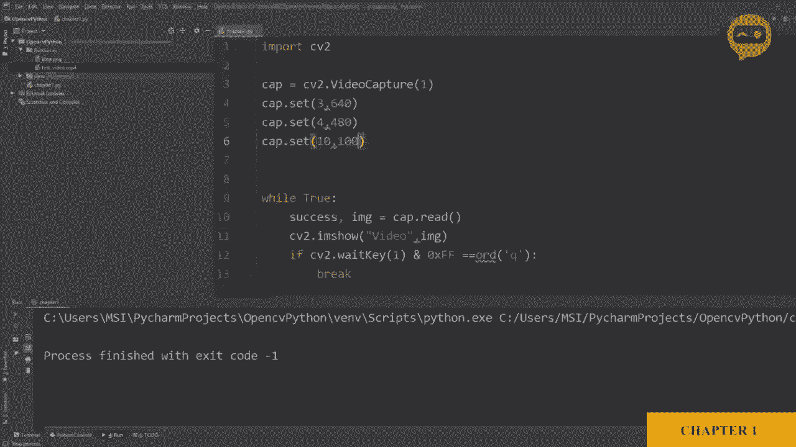
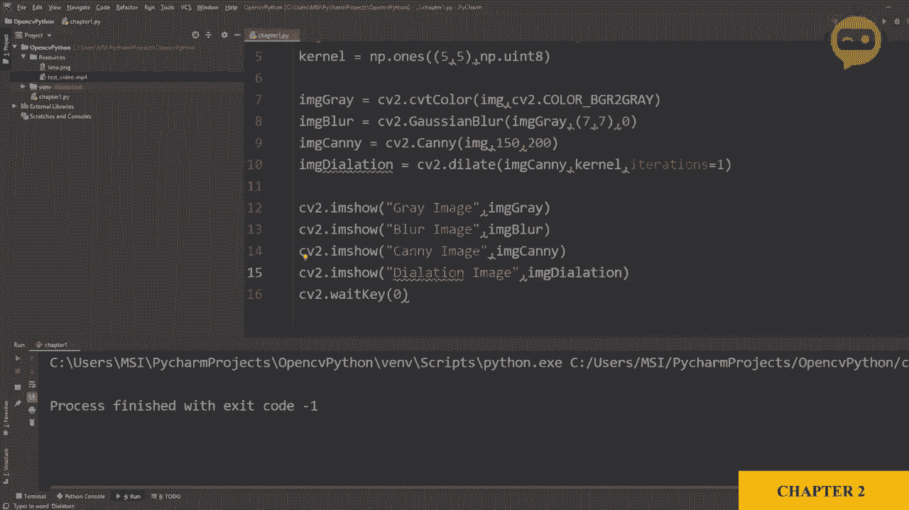
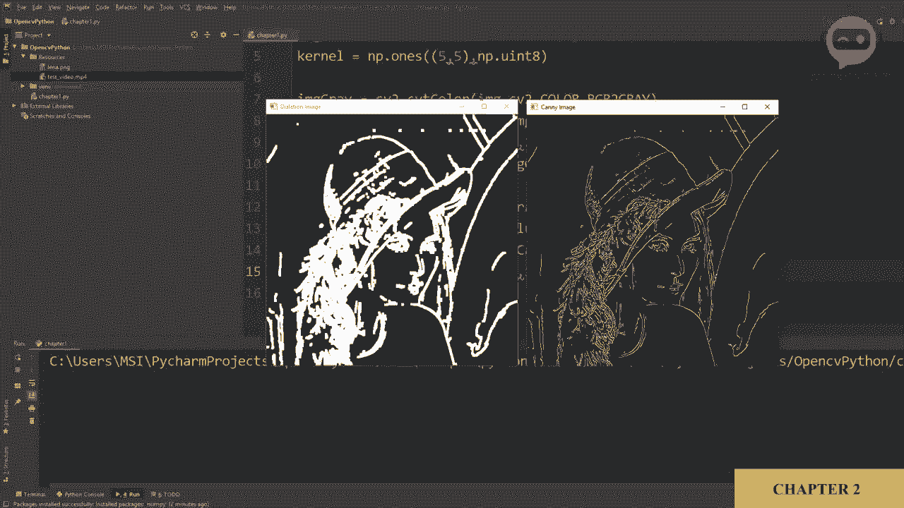
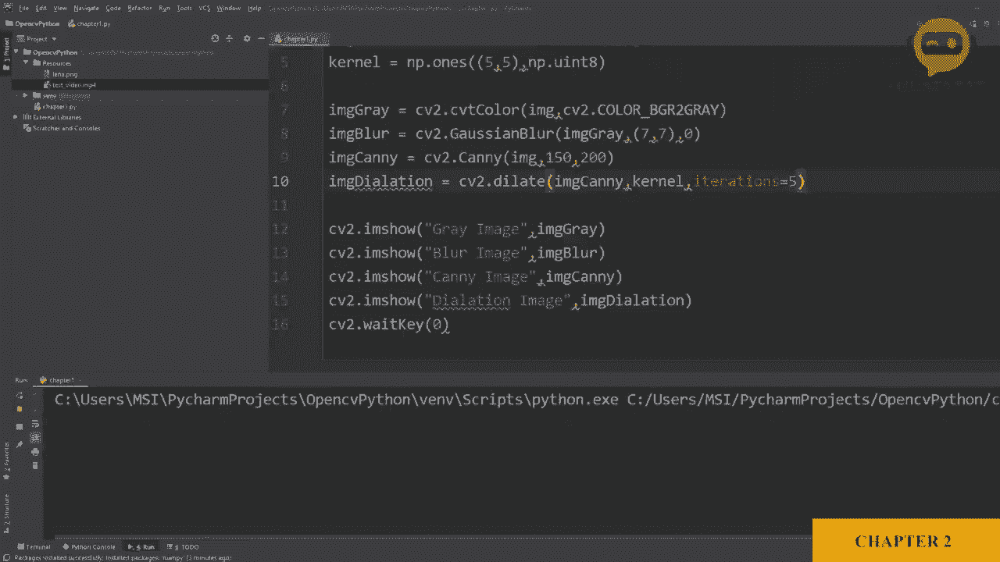
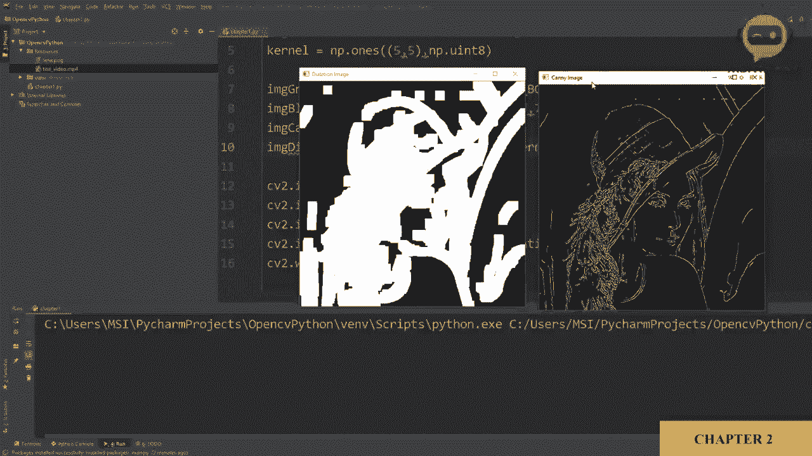
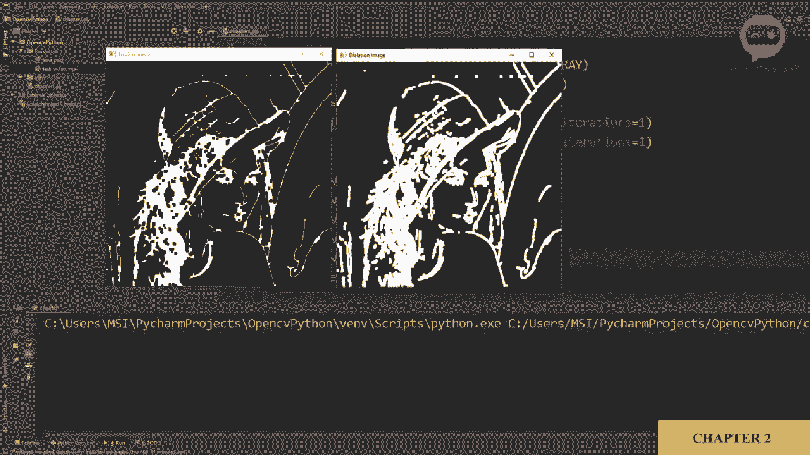

# OpenCV 基础教程 P5：第2章：基础函数 🛠️




在本节课中，我们将学习OpenCV中一些最基础且常用的图像处理函数。我们将从读取图像开始，逐步探索灰度转换、模糊、边缘检测、图像膨胀与腐蚀等操作。这些是构建更复杂计算机视觉项目的基石。

## 图像读取与灰度转换

首先，我们需要导入图像。OpenCV使用 `imread` 函数来读取图像文件。

```python
import cv2
img = cv2.imread('resources/Lina.png')
```

读取图像后，我们常将其转换为灰度图像，以简化后续处理。这可以通过 `cvtColor` 函数实现。

```python
img_gray = cv2.cvtColor(img, cv2.COLOR_BGR2GRAY)
```

**注意**：OpenCV默认使用BGR颜色通道顺序，而非传统的RGB。

转换完成后，我们可以使用 `imshow` 函数来显示图像。

```python
cv2.imshow('Grayscale Image', img_gray)
cv2.waitKey(0)
cv2.destroyAllWindows()
```

## 图像模糊处理

上一节我们介绍了如何读取和转换图像，本节中我们来看看如何对图像进行模糊处理。模糊操作可以减少图像噪声和细节。

OpenCV提供了多种模糊函数，这里我们使用 `blur` 函数进行均值模糊。

以下是使用 `blur` 函数的基本步骤：

1.  指定要模糊的图像（这里使用灰度图像）。
2.  定义内核大小（例如 `(7,7)`），它必须是奇数。
3.  调用 `blur` 函数。

```python
img_blur = cv2.blur(img_gray, (7,7))
cv2.imshow('Blurred Image', img_blur)
cv2.waitKey(0)
```

## 边缘检测

模糊处理可以平滑图像，而边缘检测则用于突出图像中的轮廓和边界。接下来，我们将学习使用Canny边缘检测器。

Canny边缘检测需要设置两个阈值参数。

以下是使用Canny边缘检测器的步骤：

1.  使用 `Canny` 函数。
2.  传入源图像（如灰度图像）。
3.  设置低阈值和高阈值（例如 `100` 和 `100`）。

```python
img_canny = cv2.Canny(img_gray, 100, 100)
cv2.imshow('Canny Edge Image', img_canny)
cv2.waitKey(0)
```

调整阈值可以控制检测到的边缘数量。提高阈值（例如 `200` 和 `150`）会减少检测到的边缘。

## 图像膨胀

有时检测到的边缘线条不连续。为了使边缘更粗、更连贯，我们可以使用图像膨胀操作。

膨胀操作需要一个由数字1组成的矩阵作为内核。我们需要使用NumPy库来创建这个内核矩阵。

首先，确保已安装并导入NumPy。

```python
import numpy as np
```

以下是进行图像膨胀的步骤：

1.  使用 `getStructuringElement` 函数或NumPy定义一个内核（例如 `5x5` 的全1矩阵）。
2.  使用 `dilate` 函数，传入图像（如Canny边缘图像）和定义好的内核。
3.  指定迭代次数以控制膨胀程度。



```python
kernel = np.ones((5,5), np.uint8)
img_dilation = cv2.dilate(img_canny, kernel, iterations=1)
cv2.imshow('Dilated Image', img_dilation)
cv2.waitKey(0)
```

增加 `iterations` 参数的值会使边缘变得更粗。



## 图像腐蚀



与膨胀相反的操作是腐蚀，它可以使图像中的白色区域（如边缘）变细。本节我们将学习如何实现腐蚀。



腐蚀操作使用与膨胀相同的内核。

以下是进行图像腐蚀的步骤：

1.  使用 `erode` 函数。
2.  传入要处理的图像（例如膨胀后的图像）和内核。
3.  指定迭代次数。

```python
img_erosion = cv2.erode(img_dilation, kernel, iterations=1)
cv2.imshow('Eroded Image', img_erosion)
cv2.waitKey(0)
```

---



本节课中我们一起学习了OpenCV的多个基础函数：读取图像 (`imread`)、转换为灰度 (`cvtColor`)、图像模糊 (`blur`)、Canny边缘检测 (`Canny`)、图像膨胀 (`dilate`) 和腐蚀 (`erode`)。理解这些基本操作是迈向更高级图像处理和分析的第一步。