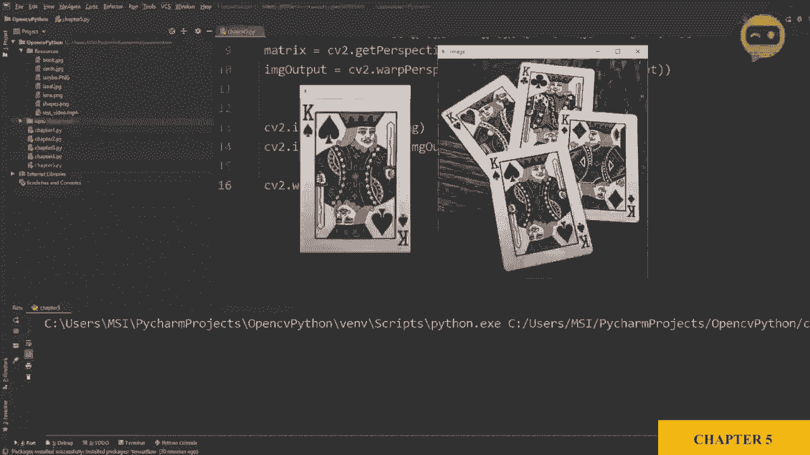
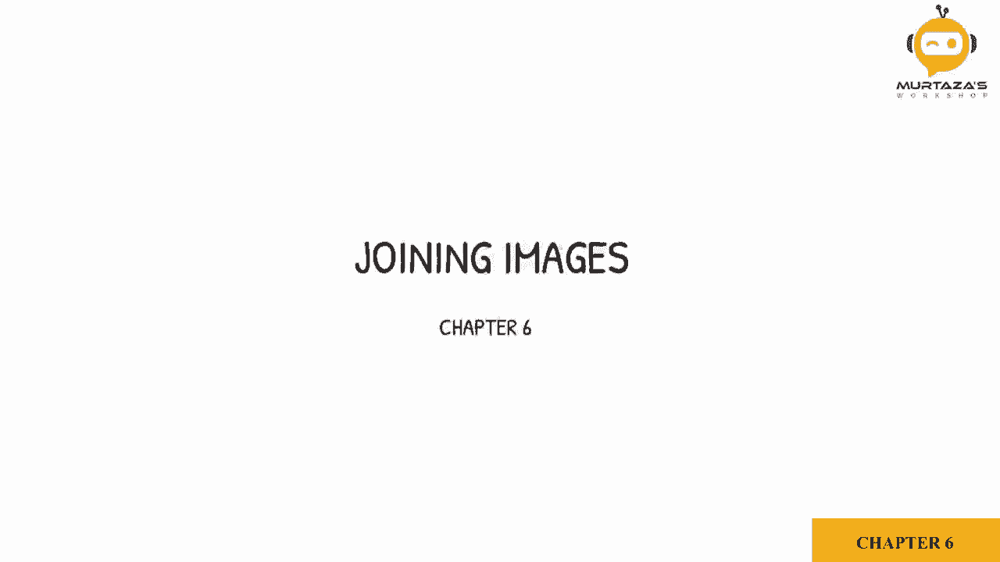
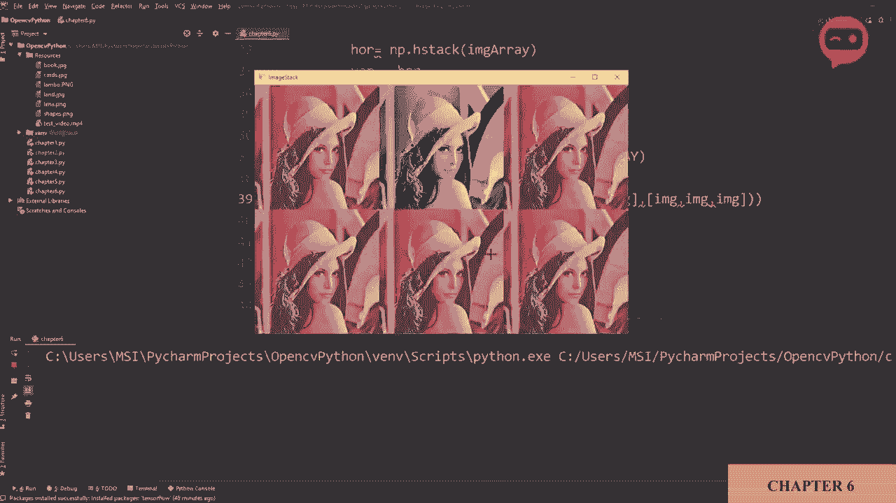

# OpenCV 基础教程 P9：第6章：图像拼接 📸





在本节课中，我们将要学习如何将多张图像连接或“拼接”在一起，显示在同一个窗口中。这在处理大量图像、避免打开过多独立窗口时非常有用。

## 概述
图像拼接是将两张或多张图像在水平或垂直方向上组合成一张新图像的过程。OpenCV本身不直接提供此功能，但我们可以借助NumPy库或自定义函数来实现，并解决图像尺寸和通道数不一致的问题。

## 水平与垂直拼接
首先，我们来看看如何使用NumPy的基本函数进行简单的图像拼接。

以下是使用NumPy进行水平拼接的步骤：
1.  导入必要的库：`cv2` 和 `numpy`。
2.  使用 `numpy.hstack()` 函数将图像数组在水平方向连接。

```python
import cv2
import numpy as np

img = cv2.imread('Resources/Lina.png')
img_horizontal = np.hstack((img, img))
cv2.imshow('Horizontal', img_horizontal)
cv2.waitKey(0)
```

运行上述代码，你将看到两张相同的图像并排显示。

上一节我们介绍了水平拼接，本节中我们来看看垂直拼接。其原理与水平拼接类似，只是使用的函数不同。

以下是使用NumPy进行垂直拼接的步骤：
1.  使用 `numpy.vstack()` 函数将图像数组在垂直方向连接。

```python
img_vertical = np.vstack((img, img))
cv2.imshow('Vertical', img_vertical)
cv2.waitKey(0)
```

## 基本方法的局限性
然而，上述使用NumPy的 `hstack` 和 `vstack` 的方法存在两个主要问题：
1.  **无法调整图像尺寸**：所有图像必须具有完全相同的高度（对于水平拼接）或宽度（对于垂直拼接），否则程序会报错。
2.  **通道数必须一致**：所有图像的色彩通道数必须相同（例如，都是3通道的BGR图像或都是1通道的灰度图）。混合不同通道数的图像会导致错误。

## 使用自定义函数进行灵活拼接
为了解决上述限制，我们可以使用一个自定义的 `stackImages` 函数。这个函数可以自动调整图像尺寸并处理不同通道数的图像，让我们能够轻松创建图像网格。

你无需完全理解该函数的所有内部细节，只需掌握如何调用它即可。其核心思想是接收一个缩放比例参数和一个图像列表的列表（代表行和列），然后返回拼接好的图像。

以下是 `stackImages` 函数的一个示例实现：

```python
def stackImages(scale, imgArray):
    rows = len(imgArray)
    cols = len(imgArray[0])
    rowsAvailable = isinstance(imgArray[0], list)
    width = imgArray[0][0].shape[1]
    height = imgArray[0][0].shape[0]
    if rowsAvailable:
        for x in range (0, rows):
            for y in range(0, cols):
                if imgArray[x][y].shape[:2] == imgArray[0][0].shape [:2]:
                    imgArray[x][y] = cv2.resize(imgArray[x][y], (0, 0), None, scale, scale)
                else:
                    imgArray[x][y] = cv2.resize(imgArray[x][y], (imgArray[0][0].shape[1], imgArray[0][0].shape[0]), None, scale, scale)
                if len(imgArray[x][y].shape) == 2:
                    imgArray[x][y]= cv2.cvtColor(imgArray[x][y], cv2.COLOR_GRAY2BGR)
        imageBlank = np.zeros((height, width, 3), np.uint8)
        hor = [imageBlank]*rows
        hor_con = [imageBlank]*rows
        for x in range(0, rows):
            hor[x] = np.hstack(imgArray[x])
        ver = np.vstack(hor)
    else:
        for x in range(0, rows):
            if imgArray[x].shape[:2] == imgArray[0].shape[:2]:
                imgArray[x] = cv2.resize(imgArray[x], (0, 0), None, scale, scale)
            else:
                imgArray[x] = cv2.resize(imgArray[x], (imgArray[0].shape[1], imgArray[0].shape[0]), None, scale, scale)
            if len(imgArray[x].shape) == 2:
                imgArray[x] = cv2.cvtColor(imgArray[x], cv2.COLOR_GRAY2BGR)
        hor = np.hstack(imgArray)
        ver = hor
    return ver
```

现在，让我们看看如何调用这个强大的函数。

### 创建单行图像网格
假设我们想将三张图像在水平方向上以50%的比例缩小并拼接。

以下是调用函数创建单行图像网格的示例：
```python
imgStack = stackImages(0.5, ([img, img, img]))
cv2.imshow('ImageStack', imgStack)
cv2.waitKey(0)
```

### 创建多行图像网格
该函数真正的优势在于创建多行多列的图像网格。你只需要提供一个二维列表，其中每个子列表代表一行。

以下是调用函数创建多行图像网格的示例（例如，一个2x3的网格）：
```python
imgStack = stackImages(0.5, ( [img, img, img],
                              [img, img, img] ))
cv2.imshow('ImageStack', imgStack)
cv2.waitKey(0)
```
**注意**：每一行的图像数量（列数）应该保持一致。

### 混合不同通道的图像
现在，我们可以演示该函数如何处理通道数不同的图像。例如，将一张灰度图像与彩色图像拼接在一起。

以下是混合灰度与彩色图像进行拼接的示例：
```python
imgGray = cv2.cvtColor(img, cv2.COLOR_BGR2GRAY)
imgStack = stackImages(0.5, ([img, imgGray, img]))
cv2.imshow('ImageStack', imgStack)
cv2.waitKey(0)
```
函数会自动将灰度图像转换为三通道，以便与其他彩色图像正确拼接。



## 总结
本节课中我们一起学习了OpenCV中的图像拼接技术。我们首先了解了使用NumPy进行简单水平（`hstack`）和垂直（`vstack`）拼接的方法及其局限性。然后，我们引入了一个自定义的 `stackImages` 函数，它能够灵活地调整图像尺寸、处理不同通道数的图像，并轻松创建复杂的多行多列图像网格。掌握这个函数将极大地便利你在后续项目中管理和可视化多个图像结果。