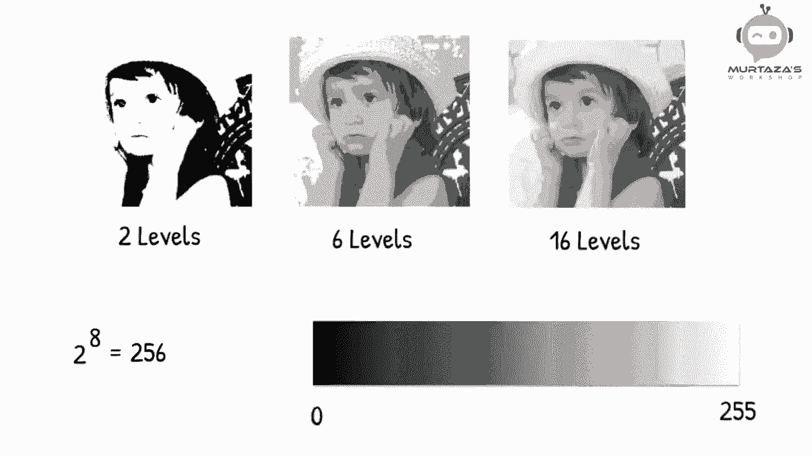
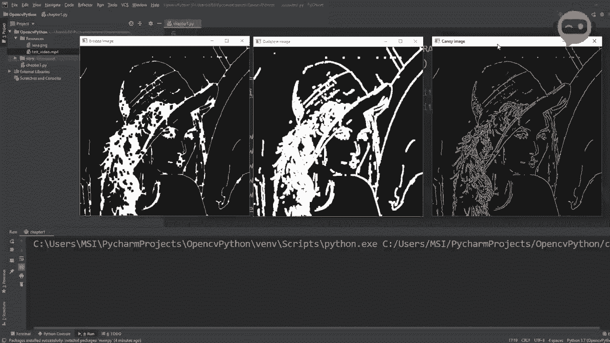
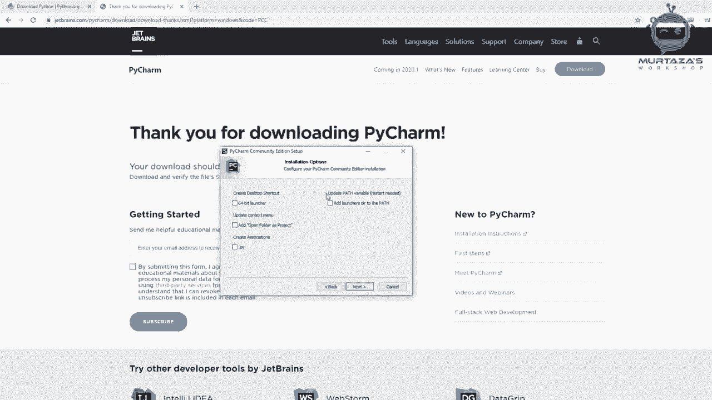
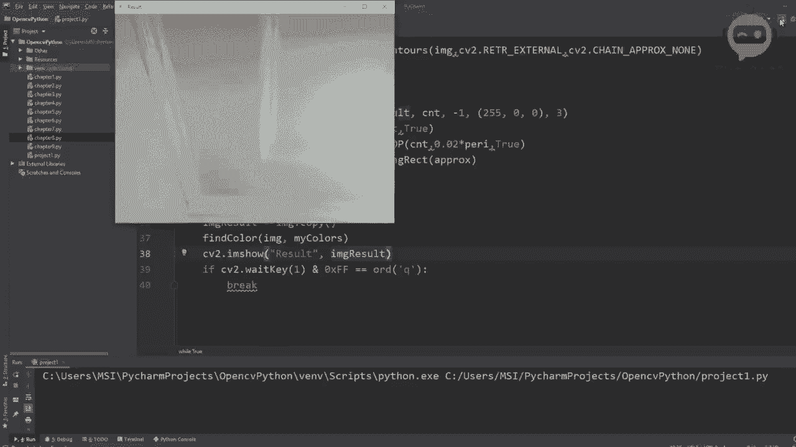
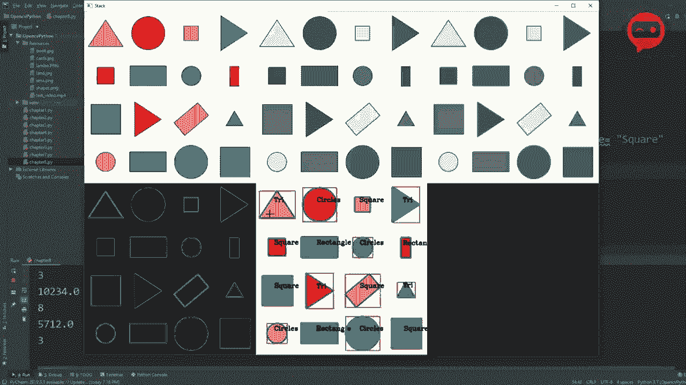
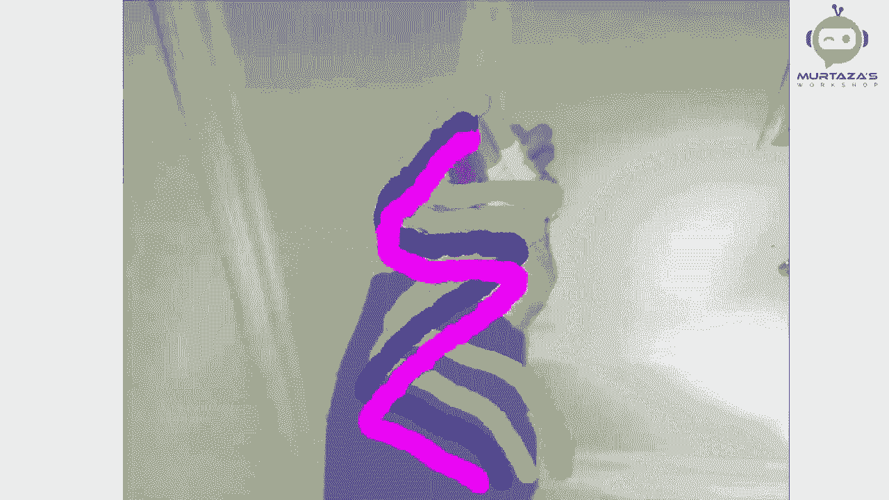
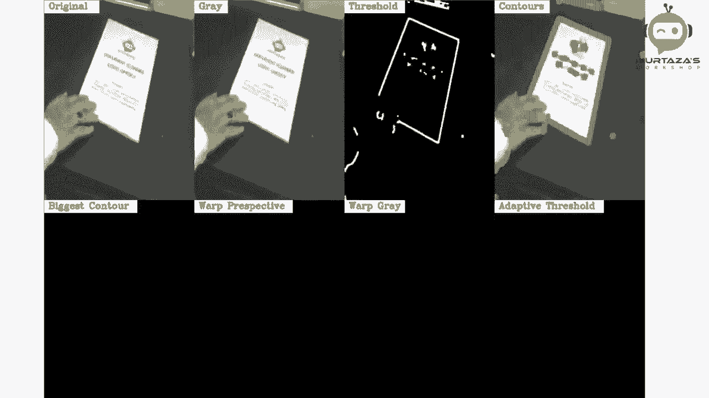
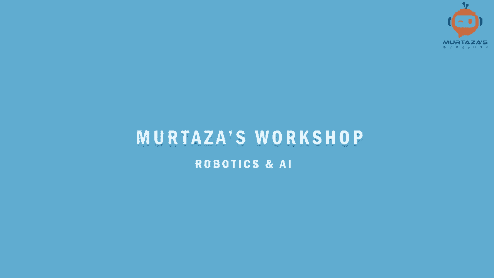
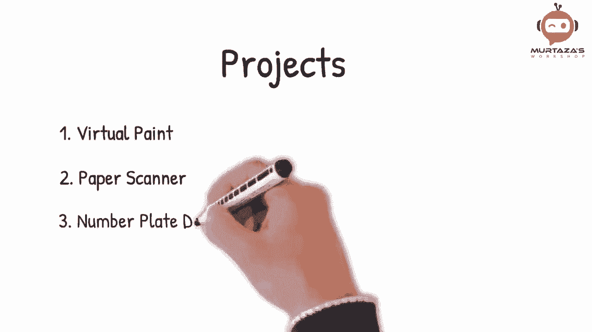

# OpenCV基础教程，P1：第0章：OpenCV介绍 🎬

在本节课中，我们将要学习OpenCV的基础知识，了解课程的整体结构，并明确学习目标。OpenCV是一个强大的计算机视觉库，我们将使用Python语言来学习它，因为它简单易学且应用广泛。

## 课程概述 📋

OpenCV（Open Source Computer Vision Library）是一个开源的计算机视觉和机器学习软件库。本课程旨在用三个小时的时间，带领初学者掌握使用OpenCV所需的核心技能。

我们将从最基础的安装开始，逐步学习各项功能，最终能够创建实际的项目，例如颜色检测、形状识别、人脸检测甚至车牌识别等项目。

如果你是编程或计算机视觉的初学者，无需担心。本课程将跳过复杂的理论，专注于实践操作，帮助你快速获得可以在简历中展示的计算机视觉技能。

到课程结束时，你将熟悉OpenCV的核心原则，并能够应用不同的技术来解决实际问题。

## 课程结构 🗺️

上一节我们介绍了课程的整体目标，本节中我们来看看具体的学习路径。以下是本课程将涵盖的主要章节和主题：

1.  **图像介绍**：了解数字图像的基本概念。
2.  **环境安装**：完成Python和OpenCV库的必要安装。
3.  **读取媒体文件**：学习如何使用OpenCV读取图像、视频和网络摄像头数据。
4.  **基本操作**：掌握调整图像大小、裁剪图像等基础功能。
5.  **绘图功能**：学习在图像上绘制不同的形状（如矩形、圆形）和添加文本。
6.  **进阶主题**：深入探讨更高级的功能，包括：
    *   图像扭曲与透视变换
    *   图像拼接
    *   颜色检测
    *   轮廓/形状检测
    *   人脸检测
7.  **项目实战**：在理解核心原理后，我们将动手创建三个综合项目：
    *   **虚拟画板**：一个可以通过摄像头进行交互的绘图应用。
    *   **文档扫描仪**：将拍摄的文档图片进行矫正和扫描。
    *   **车牌检测器**：从图像或视频中自动检测并识别车牌。

如果你想了解更多关于这些项目的内容，可以关注后续的课程更新。

## 总结 🎯

本节课中，我们一起学习了OpenCV课程的介绍和整体结构。我们明确了学习目标是掌握实用的计算机视觉技能，并了解了从基础安装到高级项目实战的完整学习路径。

接下来，我们将从第一课“图像介绍”开始，一步步进入OpenCV的世界。