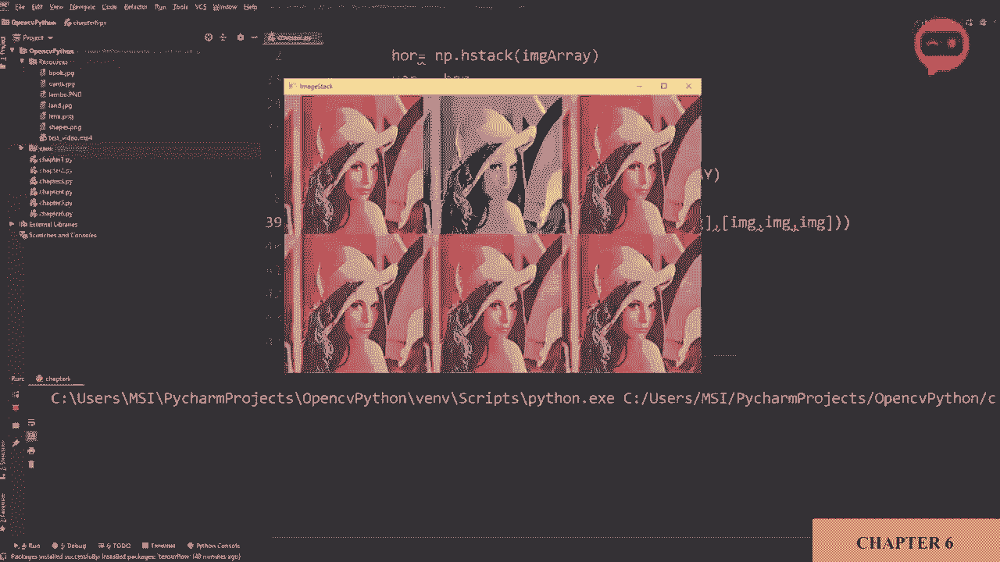
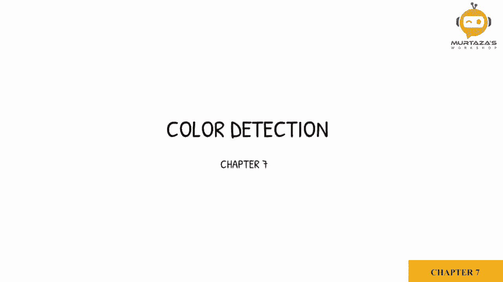
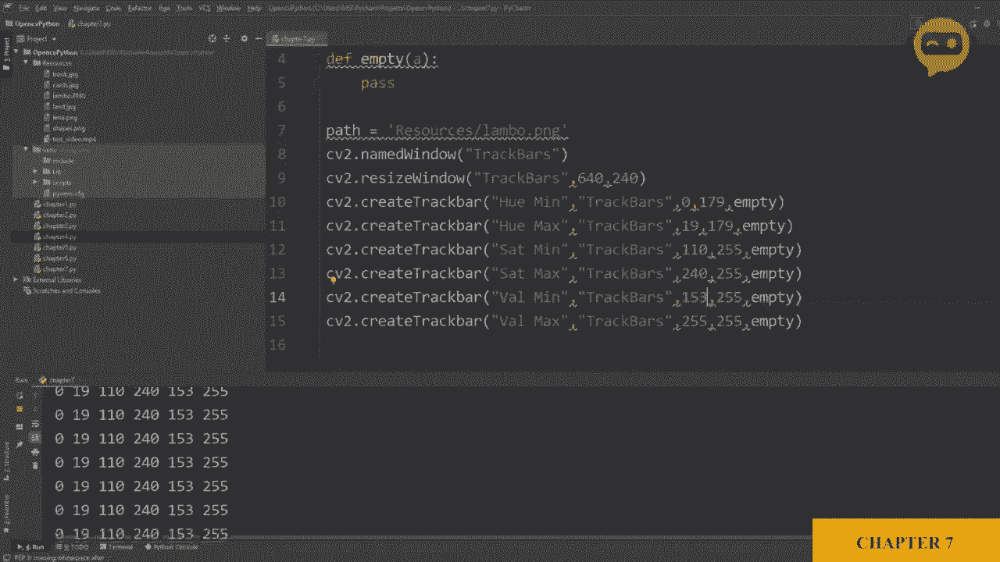
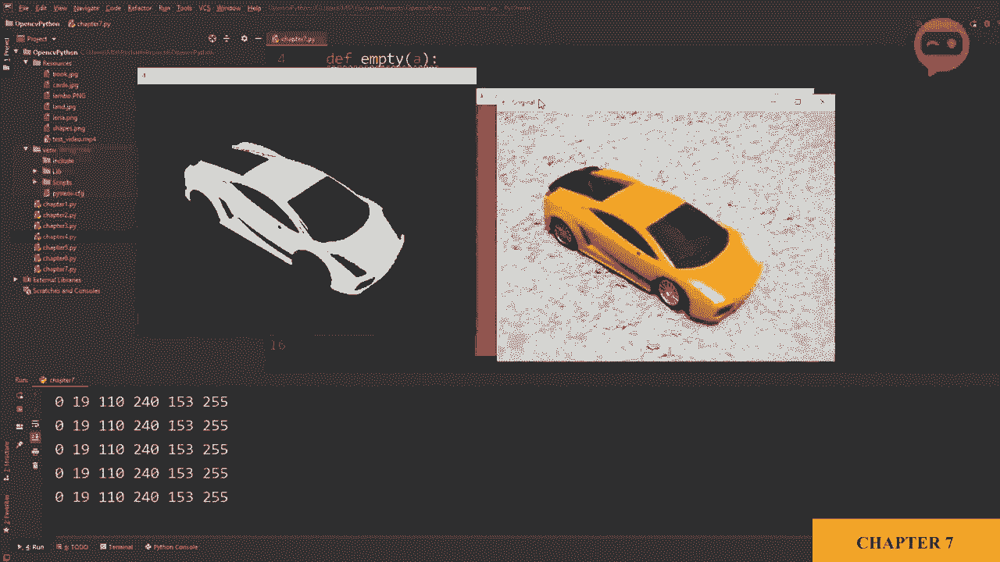
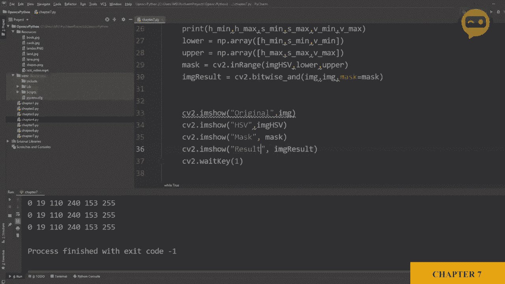
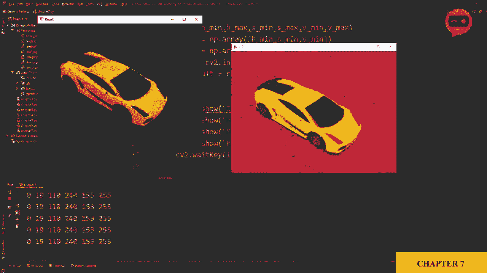
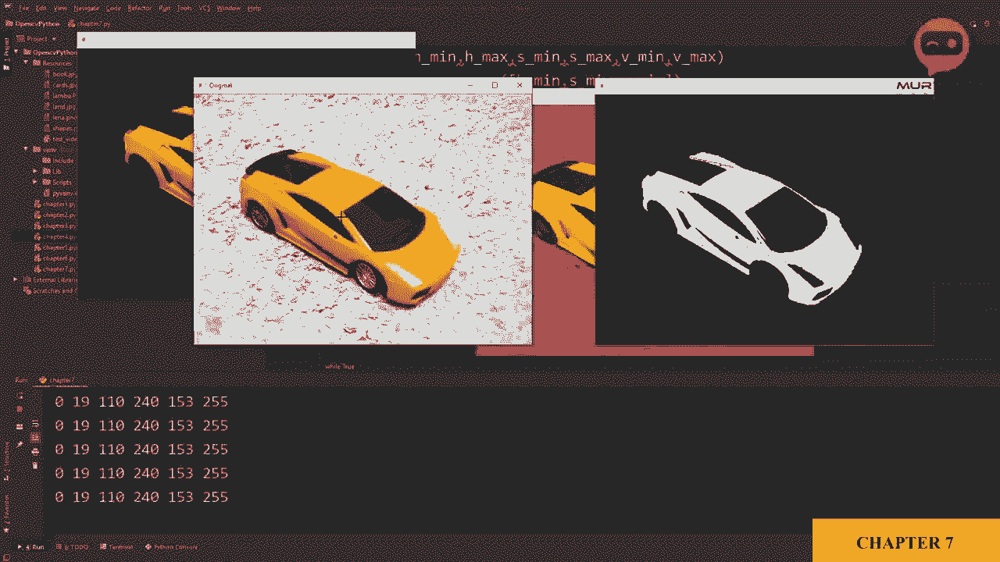
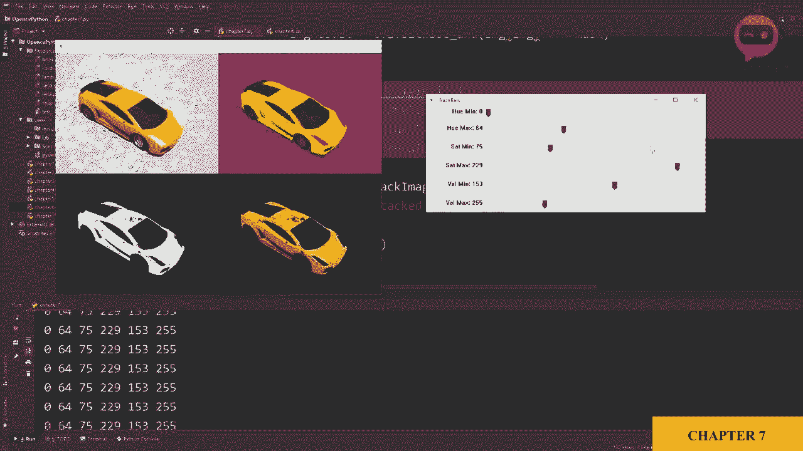

# OpenCV基础教程，P10：第7章：图像颜色检测识别 🎨






在本节课中，我们将学习如何使用OpenCV检测和识别图像中的特定颜色。我们将通过将图像转换到HSV色彩空间，并使用滑块动态调整颜色范围来创建一个颜色掩码，最终提取出目标颜色的区域。

## 导入库与图像

首先，我们需要导入必要的库并加载要处理的图像。

```python
import cv2
import numpy as np

# 从资源文件夹加载图像
img = cv2.imread('Labo/orange_object.jpg')
cv2.imshow('Original Image', img)
cv2.waitKey(0)
```

我们使用`cv2.imread`函数加载图像，并使用`cv2.imshow`显示它。`cv2.waitKey(0)`用于保持窗口打开，直到按下任意键。

## 转换到HSV色彩空间

为了更有效地进行颜色检测，我们需要将图像从BGR色彩空间转换到HSV色彩空间。HSV分别代表色调（Hue）、饱和度（Saturation）和明度（Value），它能更好地分离颜色信息。

```python
img_hsv = cv2.cvtColor(img, cv2.COLOR_BGR2HSV)
cv2.imshow('HSV Image', img_hsv)
cv2.waitKey(0)
```

这里，`cv2.cvtColor`函数用于进行色彩空间转换。转换后，我们可以查看HSV格式的图像。

## 创建滑块动态调整颜色范围

我们通常不知道目标颜色的精确HSV范围。为了解决这个问题，我们将创建滑块来实时调整HSV的最小和最大值，以找到最佳范围。

首先，创建一个窗口来放置滑块。

```python
cv2.namedWindow('TrackBars')
cv2.resizeWindow('TrackBars', 640, 240)
```

接下来，创建六个滑块，分别对应H、S、V的最小值和最大值。我们需要一个空函数作为滑块回调。

```python
def empty(a):
    pass

# 创建H最小值滑块
cv2.createTrackbar('Hue Min', 'TrackBars', 0, 179, empty)
# 创建H最大值滑块
cv2.createTrackbar('Hue Max', 'TrackBars', 179, 179, empty)
# 创建S最小值滑块
cv2.createTrackbar('Sat Min', 'TrackBars', 0, 255, empty)
# 创建S最大值滑块
cv2.createTrackbar('Sat Max', 'TrackBars', 255, 255, empty)
# 创建V最小值滑块
cv2.createTrackbar('Val Min', 'TrackBars', 0, 255, empty)
# 创建V最大值滑块
cv2.createTrackbar('Val Max', 'TrackBars', 255, 255, empty)
```

`cv2.createTrackbar`函数用于创建滑块。参数依次是：滑块名称、窗口名称、初始值、最大值和回调函数。

## 读取滑块值并创建颜色掩码

现在，我们需要在一个循环中不断读取滑块的值，并用这些值来定义颜色的上下限，从而创建掩码。

```python
while True:
    # 获取滑块当前位置的值
    h_min = cv2.getTrackbarPos('Hue Min', 'TrackBars')
    h_max = cv2.getTrackbarPos('Hue Max', 'TrackBars')
    s_min = cv2.getTrackbarPos('Sat Min', 'TrackBars')
    s_max = cv2.getTrackbarPos('Sat Max', 'TrackBars')
    v_min = cv2.getTrackbarPos('Val Min', 'TrackBars')
    v_max = cv2.getTrackbarPos('Val Max', 'TrackBars')
    print(h_min, h_max, s_min, s_max, v_min, v_max)

    # 定义HSV的下限和上限
    lower = np.array([h_min, s_min, v_min])
    upper = np.array([h_max, s_max, v_max])

    # 创建掩码
    mask = cv2.inRange(img_hsv, lower, upper)

    cv2.imshow('Mask', mask)
    if cv2.waitKey(1) & 0xFF == ord('q'):
        break
```

`cv2.getTrackbarPos`函数用于获取滑块的值。`cv2.inRange`函数检查图像数组中的每个像素是否在指定的下限和上限范围内，并返回一个二值掩码（在范围内的为白色255，不在的为黑色0）。

通过移动滑块，你可以实时看到掩码图像的变化，从而精确地调整出目标颜色的范围。

## 应用掩码获取结果图像

获得满意的掩码后，我们可以使用位“与”操作将掩码应用到原始图像上，从而只保留目标颜色的区域。

```python
    # 应用掩码，获取结果图像
    img_result = cv2.bitwise_and(img, img, mask=mask)
    cv2.imshow('Result', img_result)
```

`cv2.bitwise_and`函数对两幅图像进行按位与操作。这里，我们使用同一个原始图像，并传入我们创建的掩码。操作的结果是，只有在掩码中为白色的像素位置，原始图像的像素才会被保留在新图像中。





## 使用图像堆叠函数整理显示

为了更清晰地对比各个步骤的结果，我们可以使用一个图像堆叠函数，将原始图像、HSV图像、掩码和结果图像并排显示。

以下是堆叠图像的函数：

```python
def stackImages(scale, imgArray):
    rows = len(imgArray)
    cols = len(imgArray[0])
    rowsAvailable = isinstance(imgArray[0], list)
    width = imgArray[0][0].shape[1]
    height = imgArray[0][0].shape[0]
    if rowsAvailable:
        for x in range(0, rows):
            for y in range(0, cols):
                if imgArray[x][y].shape[:2] == imgArray[0][0].shape[:2]:
                    imgArray[x][y] = cv2.resize(imgArray[x][y], (0, 0), None, scale, scale)
                else:
                    imgArray[x][y] = cv2.resize(imgArray[x][y], (imgArray[0][0].shape[1], imgArray[0][0].shape[0]), None, scale, scale)
                if len(imgArray[x][y].shape) == 2:
                    imgArray[x][y] = cv2.cvtColor(imgArray[x][y], cv2.COLOR_GRAY2BGR)
        imageBlank = np.zeros((height, width, 3), np.uint8)
        hor = [imageBlank] * rows
        hor_con = [imageBlank] * rows
        for x in range(0, rows):
            hor[x] = np.hstack(imgArray[x])
        ver = np.vstack(hor)
    else:
        for x in range(0, rows):
            if imgArray[x].shape[:2] == imgArray[0].shape[:2]:
                imgArray[x] = cv2.resize(imgArray[x], (0, 0), None, scale, scale)
            else:
                imgArray[x] = cv2.resize(imgArray[x], (imgArray[0].shape[1], imgArray[0].shape[0]), None, scale, scale)
            if len(imgArray[x].shape) == 2:
                imgArray[x] = cv2.cvtColor(imgArray[x], cv2.COLOR_GRAY2BGR)
        hor = np.hstack(imgArray)
        ver = hor
    return ver
```





在主循环中，使用该函数堆叠图像：



```python
    img_stack = stackImages(0.6, ([img, img_hsv], [mask, img_result]))
    cv2.imshow('Stacked Images', img_stack)
```



现在，所有图像都整齐地排列在一个窗口中，方便我们同时观察和调整。

## 总结

本节课中，我们一起学习了使用OpenCV进行图像颜色检测识别的完整流程。

我们首先将图像转换到HSV色彩空间以便更好地处理颜色。接着，通过创建滑块动态调整HSV的阈值范围，找到了目标颜色的精确范围并生成了掩码。最后，我们应用掩码提取出了原始图像中特定颜色的区域，并通过图像堆叠功能清晰地展示了整个处理过程。


这个方法可以广泛应用于物体识别、颜色过滤等计算机视觉任务中。