# OpenCV基础教程，P13：项目1：VR绘画 🎨

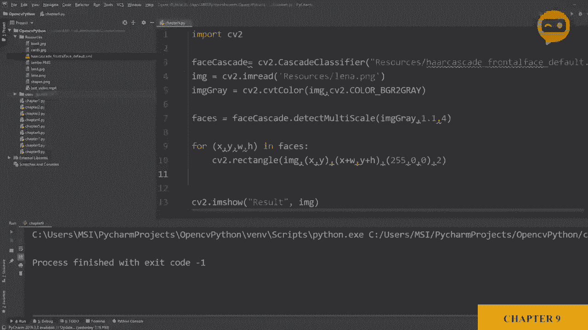

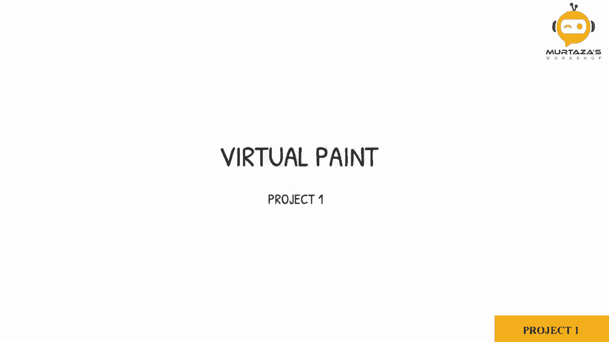

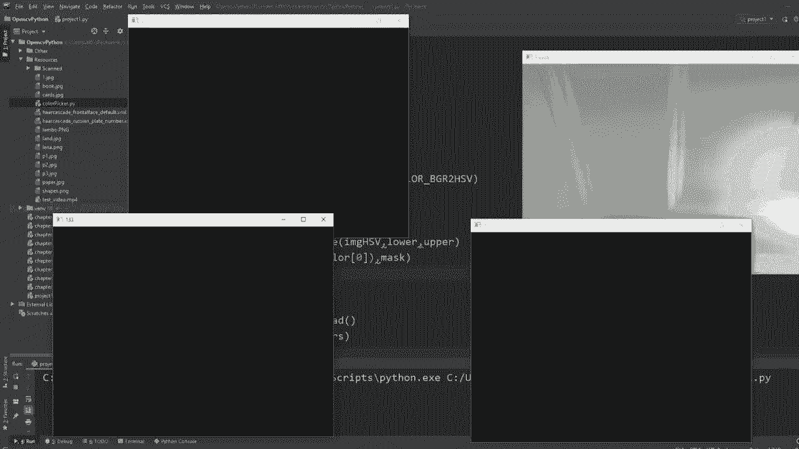

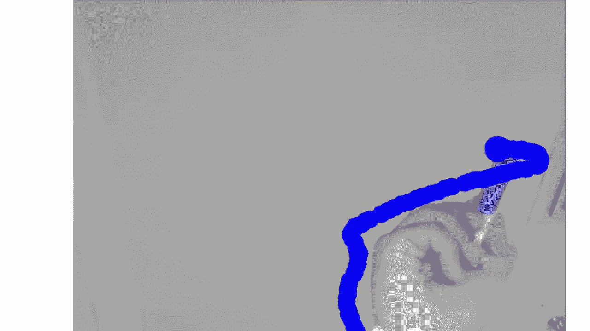

在本节课中，我们将学习如何结合之前学过的知识，创建一个虚拟现实（VR）绘画应用。我们将使用网络摄像头检测特定颜色的物体（例如彩色笔尖），并在屏幕上实时绘制出这些物体的移动轨迹。

## 概述

我们将分步完成以下任务：
1.  启动并显示网络摄像头画面。
2.  检测画面中预定义的多种颜色。
3.  定位检测到的颜色区域。
4.  在检测到的位置绘制对应颜色的点，并保存轨迹，形成绘画效果。

---

## 第一步：启动网络摄像头 📹

首先，我们需要获取来自网络摄像头的实时视频流。我们将使用OpenCV的`VideoCapture`功能。

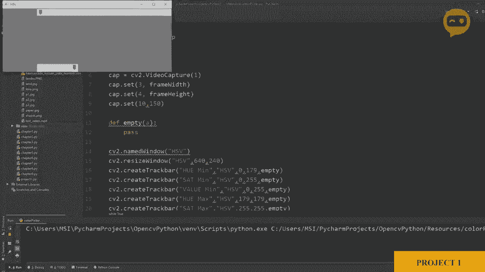

```python
import cv2
import numpy as np

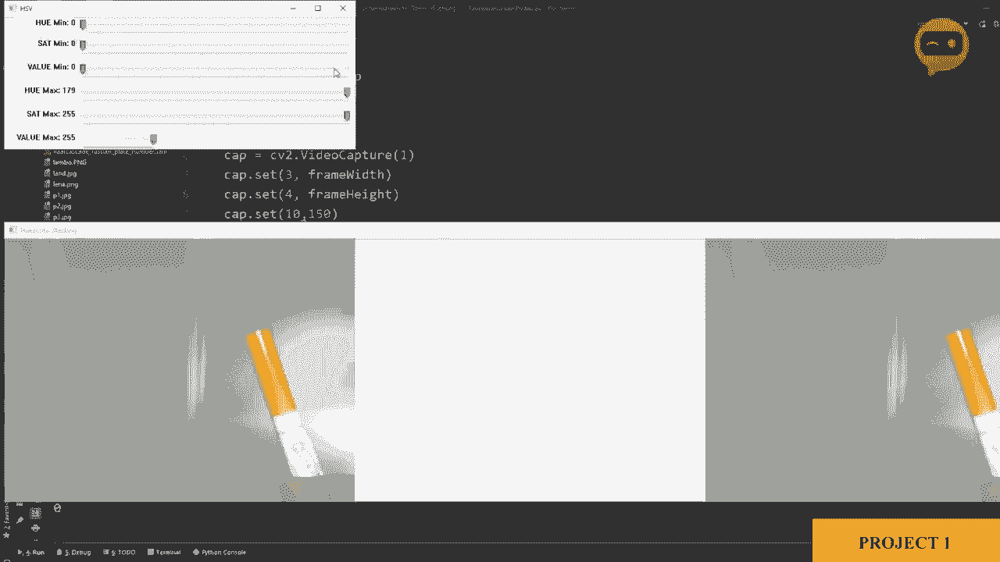

# 初始化摄像头，参数‘1’通常代表外接摄像头，如果是内置摄像头可尝试‘0’
cap = cv2.VideoCapture(1)
# 设置帧的宽度和高度
cap.set(3, 640)  # 参数3对应宽度
cap.set(4, 480)  # 参数4对应高度
# 设置亮度（可选）
cap.set(10, 150) # 参数10对应亮度

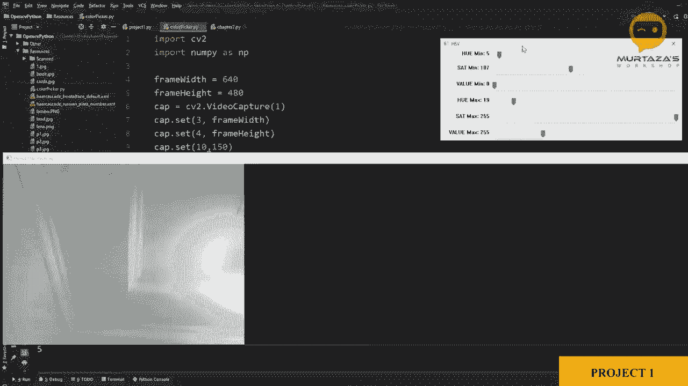

while True:
    # 读取一帧图像
    success, img = cap.read()
    # 显示图像
    cv2.imshow("Video", img)
    # 按‘q’键退出循环
    if cv2.waitKey(1) & 0xFF == ord('q'):
        break
```

运行上述代码，你应该能看到网络摄像头的画面。这是我们项目的基础。

---

## 第二步：检测特定颜色 🎨

上一节我们启动了摄像头，本节中我们来看看如何从画面中检测我们感兴趣的颜色。我们将创建一个通用的颜色检测函数。

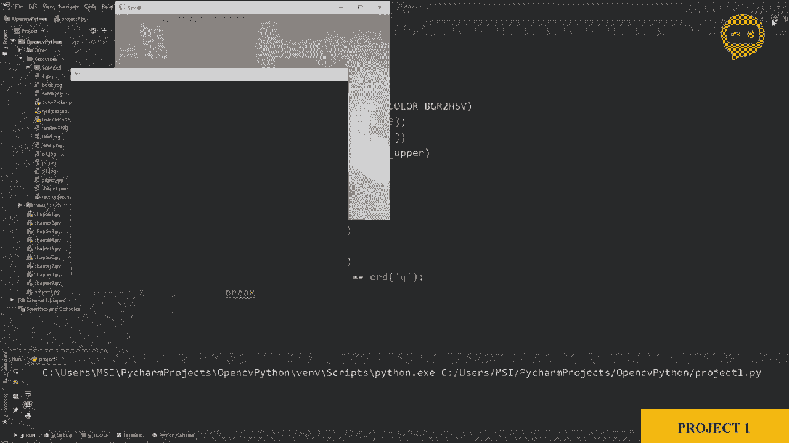

为了检测颜色，我们需要将图像从BGR色彩空间转换到HSV色彩空间，并设定每种颜色的HSV阈值范围。

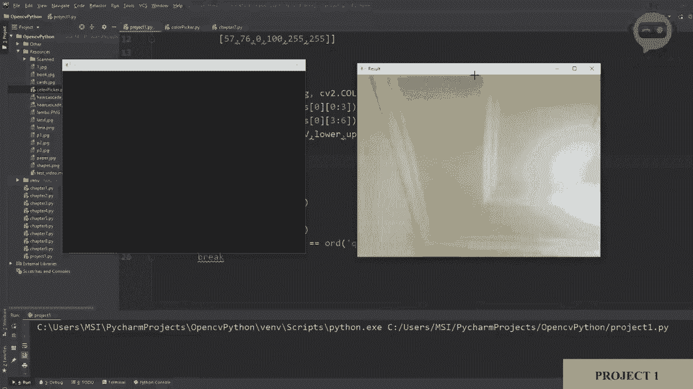

以下是定义颜色阈值和检测函数的步骤：

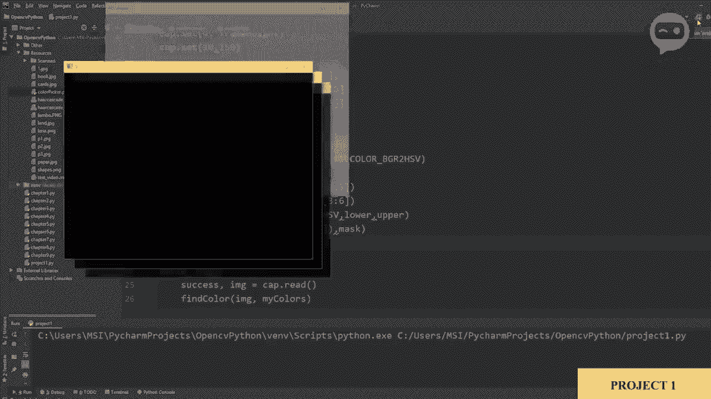

首先，我们定义一个列表`myColors`，其中包含我们想要检测的每种颜色的HSV最小值（H_min, S_min, V_min）和最大值（H_max, S_max, V_max）。这些值可以通过之前课程中的“颜色选择器”工具获得。

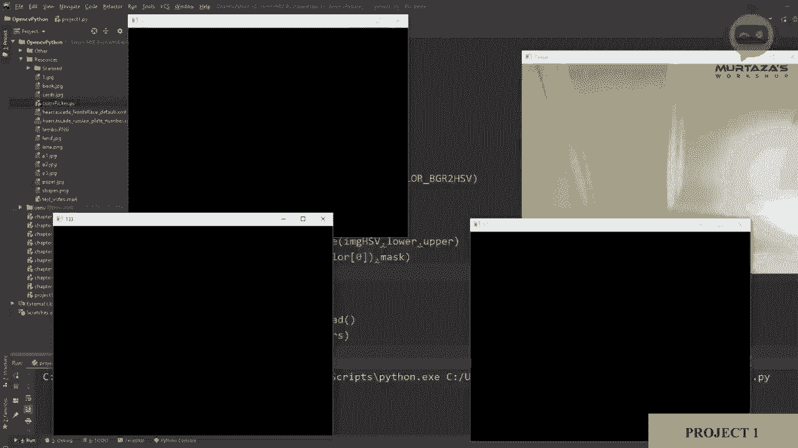

```python
# 定义要检测的颜色列表 [H_min, S_min, V_min, H_max, S_max, V_max]
myColors = [
            [5, 107, 0, 19, 255, 255],    # 橙色
            [133, 56, 0, 159, 156, 255],  # 紫色
            [57, 76, 0, 100, 255, 255]    # 绿色
           ]
```

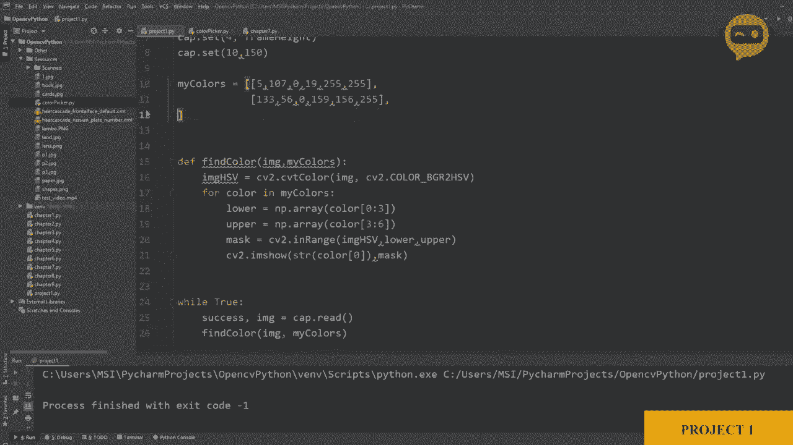

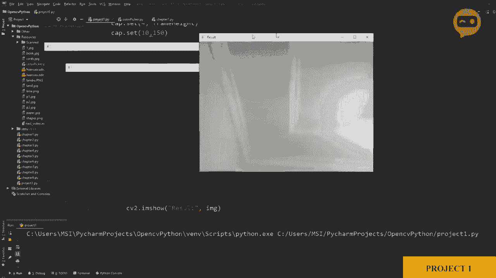

接下来，我们编写`findColor`函数。该函数接收一帧图像，遍历`myColors`列表中的每种颜色，创建对应的掩膜（mask），并返回检测到的所有颜色区域的位置信息。

```python
def findColor(img, myColors):
    imgHSV = cv2.cvtColor(img, cv2.COLOR_BGR2HSV)
    newPoints = []  # 用于存储新检测到的点 [x, y, colorId]
    count = 0
    for color in myColors:
        lower = np.array(color[0:3])
        upper = np.array(color[3:6])
        mask = cv2.inRange(imgHSV, lower, upper)
        # 获取检测区域的轮廓和位置
        x, y = getContours(mask)
        # 如果检测到有效点（非原点），则记录
        if x != 0 and y != 0:
            newPoints.append([x, y, count])
        count += 1
    return newPoints
```

---

## 第三步：定位颜色区域 📍

在`findColor`函数中，我们调用了`getContours`函数来获取颜色掩膜中物体的精确位置（具体来说是物体边界框的顶部中心点，作为“笔尖”）。

`getContours`函数接收一个二值掩膜图像，找到其中的轮廓，并计算轮廓的边界矩形。

```python
def getContours(img):
    contours, hierarchy = cv2.findContours(img, cv2.RETR_EXTERNAL, cv2.CHAIN_APPROX_NONE)
    x, y, w, h = 0, 0, 0, 0
    for cnt in contours:
        area = cv2.contourArea(cnt)
        if area > 500:  # 过滤掉太小的噪点
            # 绘制轮廓（仅用于调试，可注释掉）
            # cv2.drawContours(imgResult, cnt, -1, (255, 0, 0), 3)
            peri = cv2.arcLength(cnt, True)
            approx = cv2.approxPolyDP(cnt, 0.02 * peri, True)
            x, y, w, h = cv2.boundingRect(approx)
    # 返回边界框顶部中心的坐标，作为笔尖位置
    return x + w // 2, y
```

---

## 第四步：绘制并保存轨迹 ✏️

现在我们已经能够实时检测并定位颜色点。为了形成绘画效果，我们需要保存所有检测到的点，并在每一帧中将它们绘制出来。

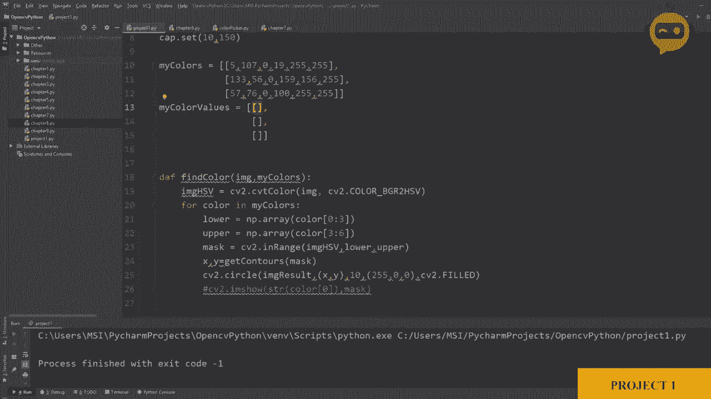

首先，定义每种颜色对应的绘图颜色（BGR格式）。

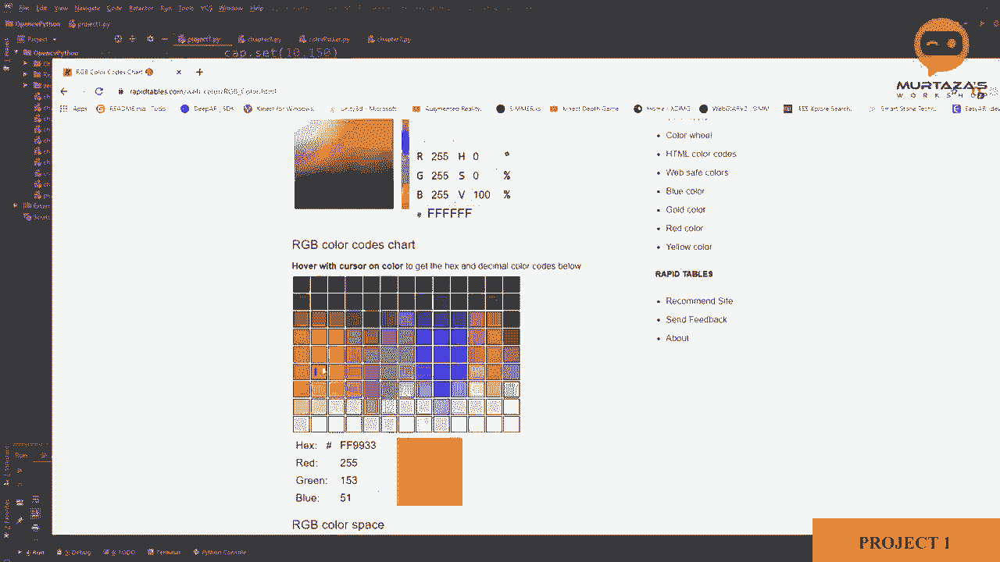

```python
# 定义绘图颜色，顺序与 myColors 列表对应
myColorValues = [
                [51, 153, 255],   # 橙色 (BGR)
                [255, 0, 255],    # 紫色
                [0, 255, 0]       # 绿色
               ]
```

然后，初始化一个列表`myPoints`来存储所有需要绘制的点，每个点的格式为`[x, y, colorId]`。

接着，创建`drawOnCanvas`函数，它负责将`myPoints`中的所有点绘制到画布上。

```python
def drawOnCanvas(myPoints, myColorValues):
    for point in myPoints:
        x, y, colorId = point
        color = myColorValues[colorId]
        cv2.circle(imgResult, (x, y), 10, color, cv2.FILLED)
```

最后，在主循环中整合所有功能：
1.  读取帧。
2.  调用`findColor`检测新点。
3.  将新点加入总列表`myPoints`。
4.  调用`drawOnCanvas`绘制所有历史点。
5.  显示结果。

```python
myPoints = []  # [[x1, y1, colorId1], [x2, y2, colorId2], ...]

while True:
    success, img = cap.read()
    imgResult = img.copy()  # 创建一份拷贝作为绘图画布
    # 检测新点
    newPoints = findColor(img, myColors)
    # 将新点添加到总列表
    if len(newPoints) != 0:
        for newP in newPoints:
            myPoints.append(newP)
    # 如果有需要绘制的点，就绘制
    if len(myPoints) != 0:
        drawOnCanvas(myPoints, myColorValues)

    cv2.imshow("Result", imgResult)
    if cv2.waitKey(1) & 0xFF == ord('q'):
        break
```

---

## 扩展：添加更多颜色

这个项目的优势在于其可扩展性。如果你想添加一种新颜色（例如蓝色），只需完成以下两步：

1.  **确定HSV阈值**：使用“颜色选择器”工具找出蓝色的HSV范围，例如`[90, 50, 50, 130, 255, 255]`，并将其添加到`myColors`列表末尾。
2.  **确定绘图颜色**：查找蓝色的BGR值（例如`[255, 0, 0]`），并将其添加到`myColorValues`列表末尾。

无需修改核心检测和绘图逻辑，程序就能自动识别并绘制新的颜色。

---

## 总结

本节课中，我们一起完成了一个有趣的VR绘画项目。我们回顾并综合运用了多个OpenCV核心概念：
*   使用`VideoCapture`捕获视频流。
*   利用色彩空间转换和阈值处理进行**颜色检测**。
*   通过寻找轮廓和边界框进行**对象定位**。
*   在图像上**绘制图形**（圆形）来可视化轨迹。

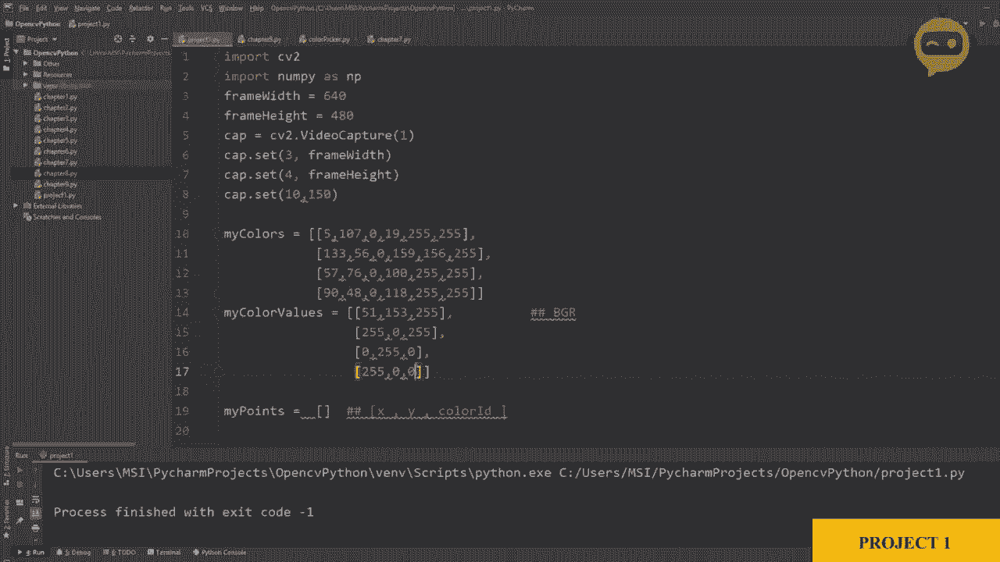

通过这个项目，你将颜色检测、轮廓查找和实时绘图结合，创建了一个交互式应用。你可以通过修改`myColors`和`myColorValues`列表，轻松地让程序识别并绘制更多颜色。