# OpenCV基础教程，P2：第0章：图像知识介绍 📸

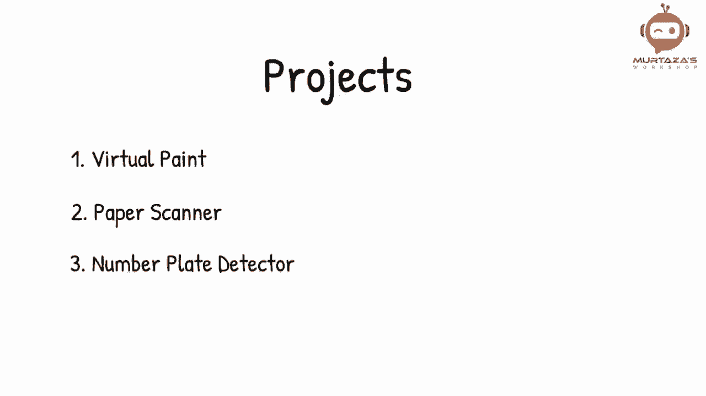

在本节课中，我们将要学习数字图像的基础知识。我们将从图像的基本构成开始，逐步了解像素、分辨率、灰度图像以及彩色图像（RGB）的概念。这些知识是后续学习OpenCV图像处理的基石。

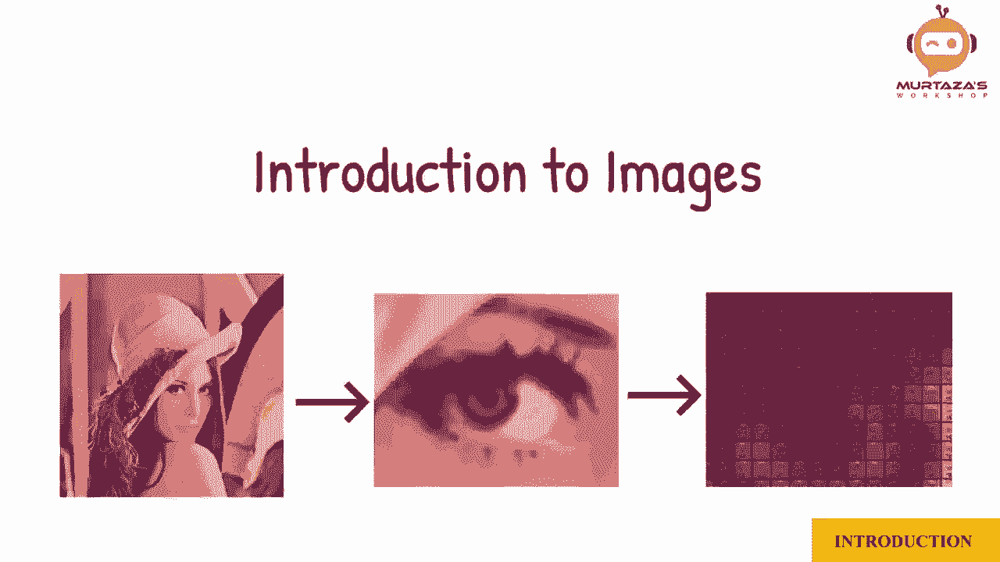

## 图像由什么组成？🧩

让我们从图像介绍开始。图像是由什么组成的呢？假设我想显示数字3。我将采用一个框的数组，每个框可以是填充或空的。

要写数字3，我们会给一些框上色以创建那个形状。现在，一些框是白色的，而一些框是黑色的。我们可以将所有黑色框表示为0，所有白色框表示为1。在这个例子中，我们有10乘10个框。如果我们想要更多细节，可以增加框的数量。

实际上，这些框就是**像素**。

## 理解分辨率与像素 📐

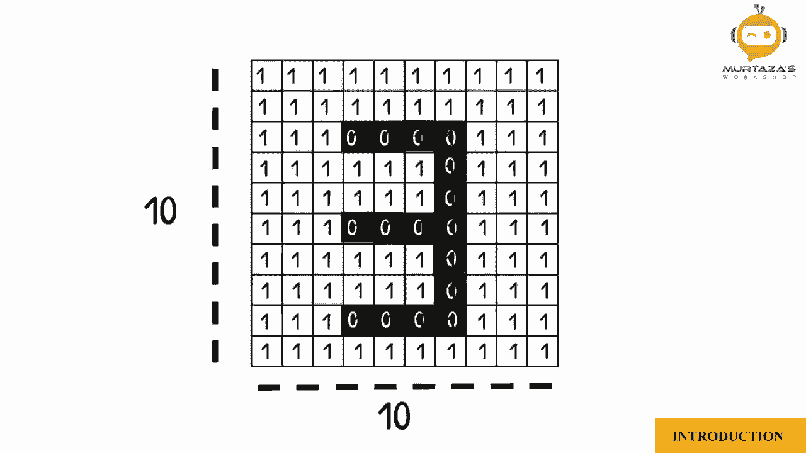

你可能听说过VGA、HD、全高清和4K。这些都代表固定数量的像素。

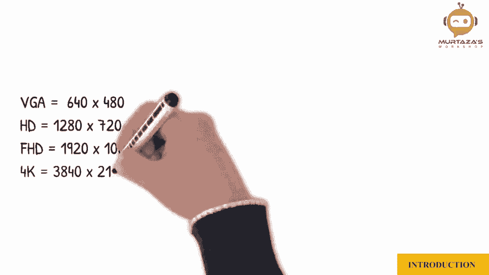

以下是常见分辨率示例：
*   **VGA**：640 x 480 像素
*   **HD**：1280 x 720 像素
*   **全高清 (FHD)**：1920 x 1080 像素
*   **4K (UHD)**：3840 x 2160 像素

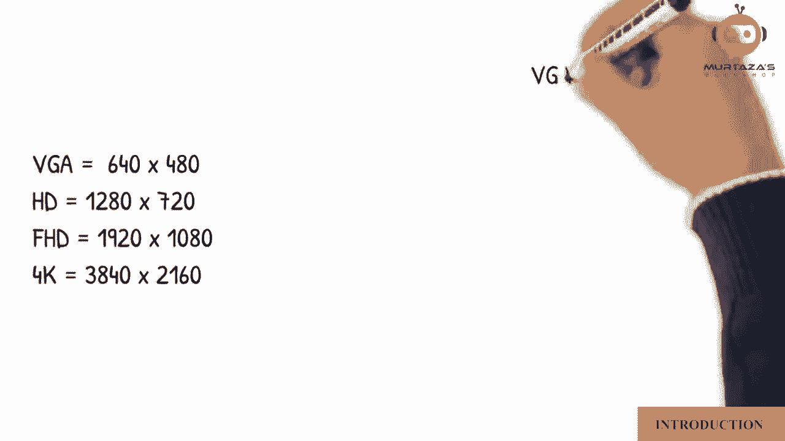

这意味着VGA图像的宽度是640个像素，高度是480个像素。目前，我们讨论的图像只有两种颜色：黑色和白色。这被称为**二值图像**。

## 从黑白到灰度 🎨

为了获得更多细节，我们可以让图像包含更多级别的亮度，而不仅仅是0和1。这意味着我们将拥有一个值的范围。

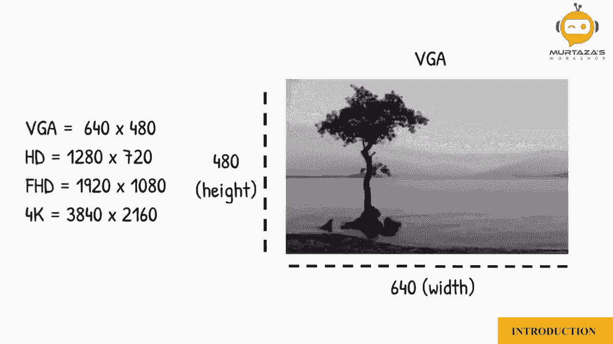

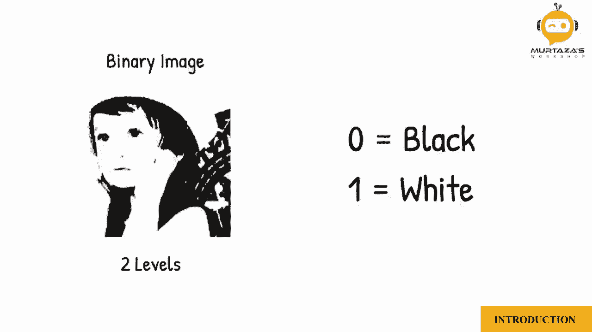

在这里，我们可以看到2级、6级和16级灰度的区别。但图像仍然可能不够清晰，所以通常我们使用**8位**值来表示灰度。这将为我们提供256个亮度级别，其中0代表纯黑色，255代表纯白色。

用公式表示灰度值范围：
`灰度值 ∈ [0, 255]`

这意味着我们现在在白色和黑色之间有254种中间灰度。换句话说，我们有254种灰度。

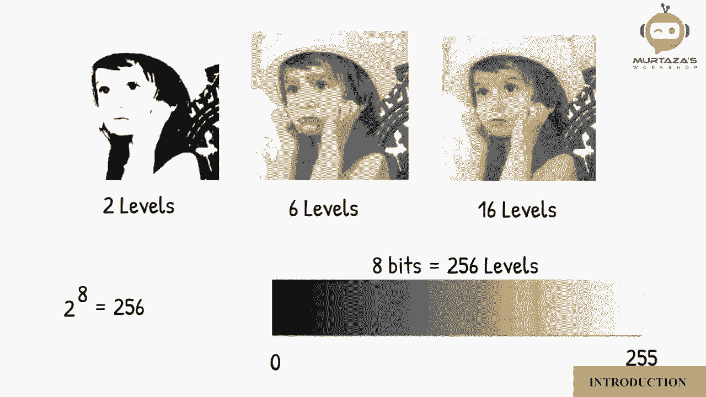

这种图像现在被称为**灰度图像**。

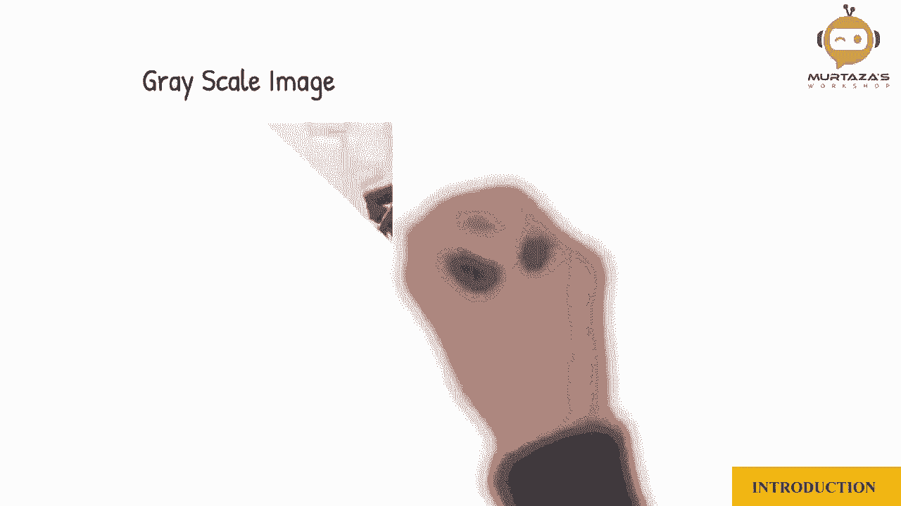
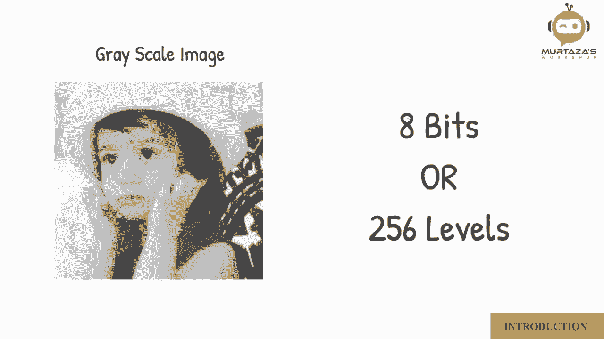

## 彩色图像：RGB模型 🌈

上一节我们介绍了灰度图像，本节中我们来看看如何构成彩色图像。对于彩色图像，我们使用**RGB模型**。

一个彩色图像由三个灰度图像通道叠加而成，分别表示**红色**、**绿色**和**蓝色**的强度。将这三个通道的图像按一定比例相加，就可以得到完整的彩色图像。

这意味着一个彩色VGA图像的数据量是 `640 x 480 x 3`。

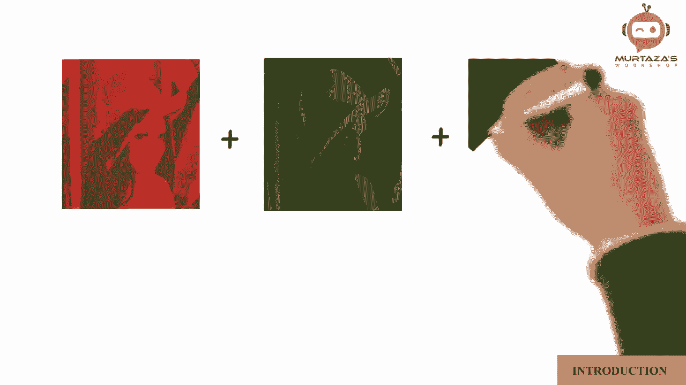

用代码概念描述一个彩色像素：
`一个彩色像素 = (R值, G值, B值)`
其中每个R、G、B值都在0到255之间。

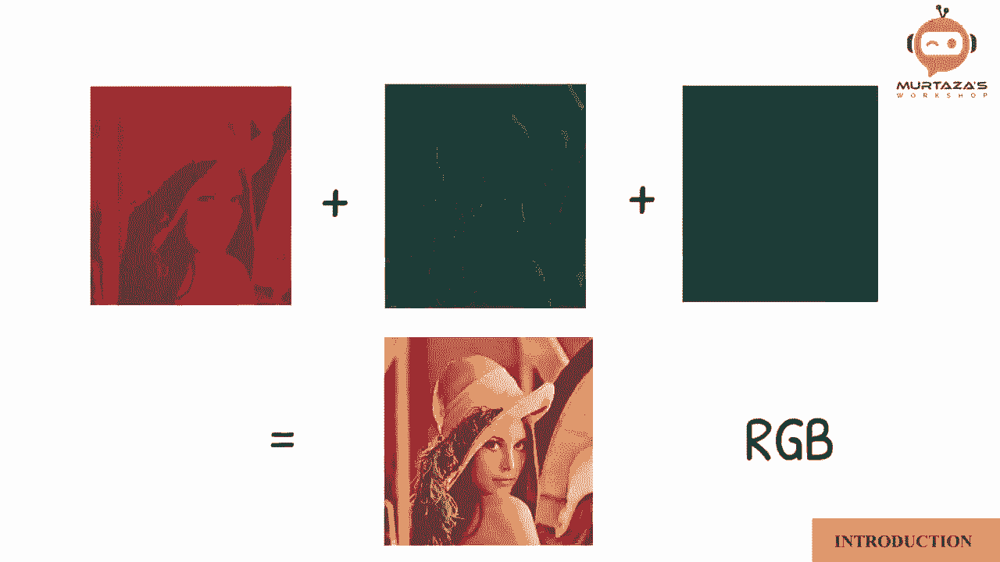

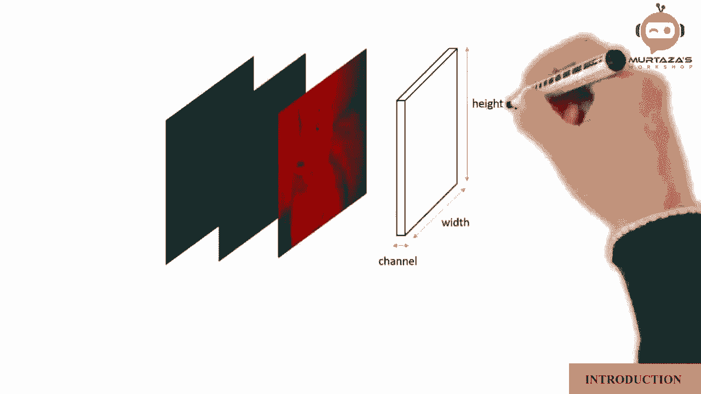

---

本节课中我们一起学习了数字图像的核心基础知识。我们了解到图像由像素阵列构成，分辨率定义了图像的尺寸（如640x480）。图像从最简单的黑白二值图像，发展到具有256级亮度的灰度图像，最终通过红、绿、蓝三个通道的叠加形成彩色图像。理解这些概念是使用OpenCV进行任何图像处理操作的第一步。