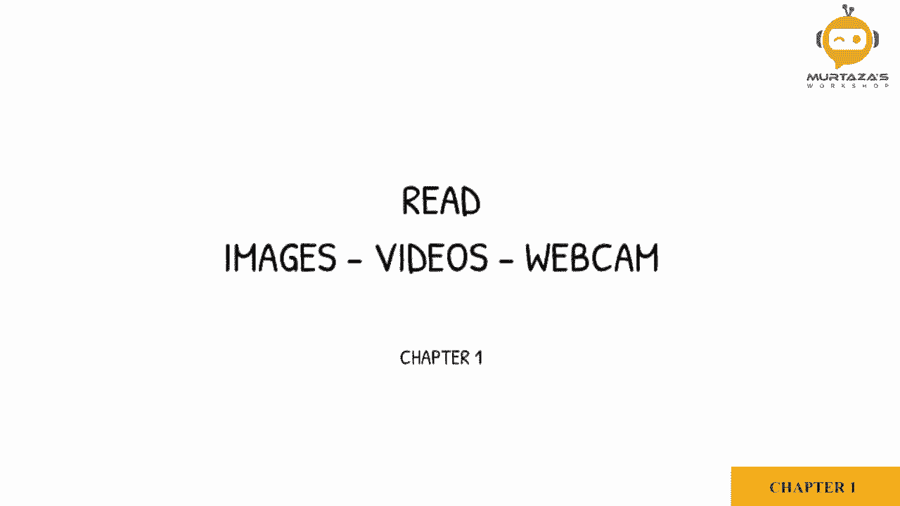
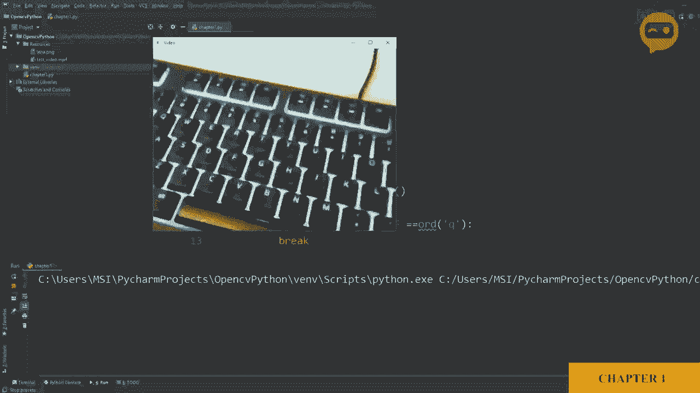

# OpenCV基础教程，P4：第1章：图像、视频与摄像头数据读取 📸




在本节课中，我们将学习如何使用OpenCV库读取三种常见的数据源：图像文件、视频文件以及摄像头实时画面。这是进行任何图像处理或计算机视觉任务的第一步。

## 读取图像文件 🖼️

我们将从最简单的任务开始：读取一张存储在磁盘上的图像。OpenCV提供了一个专门的函数来完成这个操作。

首先，我们需要声明一个变量来存储读取的图像数据。然后，使用OpenCV的 `cv2.imread()` 函数，并传入图像文件的路径。

以下是读取图像的核心代码：

```python
import cv2
img = cv2.imread(‘resources/Lena.png’)
```

读取图像后，我们需要将其显示在屏幕上。OpenCV使用 `cv2.imshow()` 函数来创建窗口并显示图像。该函数需要两个参数：窗口的名称和要显示的图像变量。

为了能让窗口保持显示，我们需要使用 `cv2.waitKey()` 函数来添加一个延迟。如果参数为0，则表示无限期等待，直到用户按下任意键。

以下是显示图像的完整代码：

```python
cv2.imshow(‘Output’， img)
cv2.waitKey(0)
```

运行上述代码，你将看到名为“Lena.png”的图像显示在一个窗口中。

## 读取视频文件 🎥

上一节我们介绍了如何读取静态图像，本节中我们来看看如何处理动态的视频。视频本质上是一系列连续的图像帧。

读取视频的第一步是创建一个视频捕捉对象。我们使用 `cv2.VideoCapture()` 函数，并传入视频文件的路径。

以下是创建视频捕捉对象的代码：

```python
cap = cv2.VideoCapture(‘resources/test_video.mp4’)
```

创建对象后，我们需要在一个循环中逐帧读取视频。`cap.read()` 方法会返回两个值：一个布尔值表示是否成功读取到帧，以及帧本身（即图像数据）。

在循环中，我们使用与显示图像相同的方法来显示每一帧，并设置一个短暂的延迟来模拟视频播放速度。同时，我们还需要设置一个退出循环的条件，例如按下键盘上的特定键。

以下是读取和显示视频的完整流程：

```python
while True:
    success， img = cap.read()
    cv2.imshow(‘Video’， img)
    if cv2.waitKey(1) & 0xFF == ord(‘q’):
        break
```

运行这段代码，视频将开始播放。按下键盘上的 ‘q’ 键可以随时退出播放。

## 读取摄像头实时画面 📹

使用OpenCV读取摄像头实时画面与读取视频文件非常相似。主要区别在于，我们不再传入文件路径，而是传入一个摄像头ID。

通常，内置或默认的摄像头ID为0。如果你连接了多个摄像头，可以尝试1、2等ID。

以下是初始化摄像头捕捉的代码：

```python
cap = cv2.VideoCapture(0)
```

在创建摄像头对象后，我们还可以设置一些摄像头属性，例如画面的宽度和高度，以获得更好的显示效果。OpenCV使用预定义的ID号来代表这些属性。

以下是设置摄像头画面宽度和高度的示例：

```python
cap.set(3， 640)  # 设置宽度，ID 3 代表宽度
cap.set(4， 480)  # 设置高度，ID 4 代表高度
cap.set(10， 100) # 设置亮度，ID 10 代表亮度
```

设置完成后，读取和显示帧的循环代码与处理视频文件时完全相同。运行程序，你将看到摄像头拍摄的实时画面显示在窗口中。



## 总结 📝


本节课中我们一起学习了OpenCV数据读取的基础。我们掌握了三个核心操作：
1.  使用 `cv2.imread()` 和 `cv2.imshow()` 读取并显示单张图像。
2.  使用 `cv2.VideoCapture()` 创建对象，并通过循环调用 `cap.read()` 来逐帧读取和显示视频文件。
3.  通过将摄像头ID（通常是0）传递给 `cv2.VideoCapture()`，并使用相同的循环结构，来捕获和显示摄像头的实时画面。

理解并熟练运用这些方法是进入更复杂图像处理世界的关键第一步。