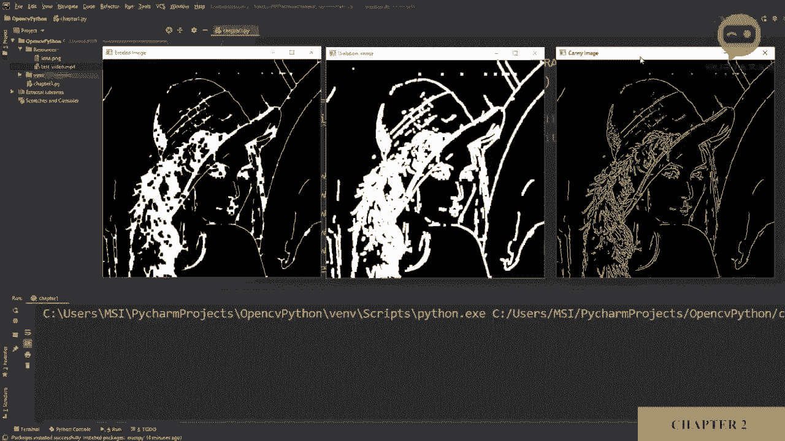
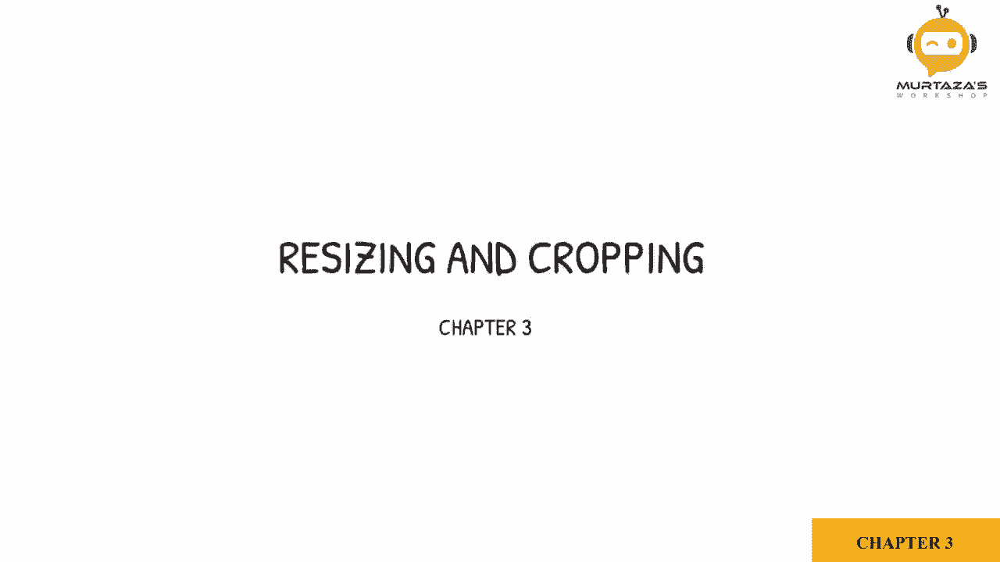
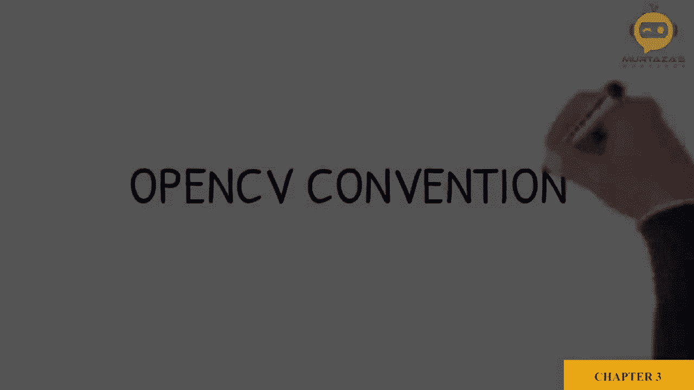
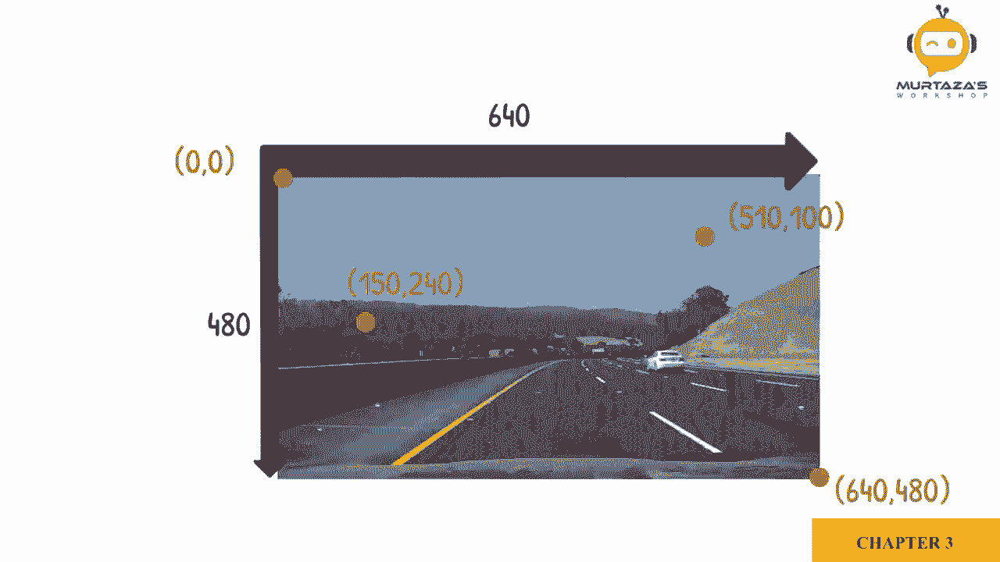
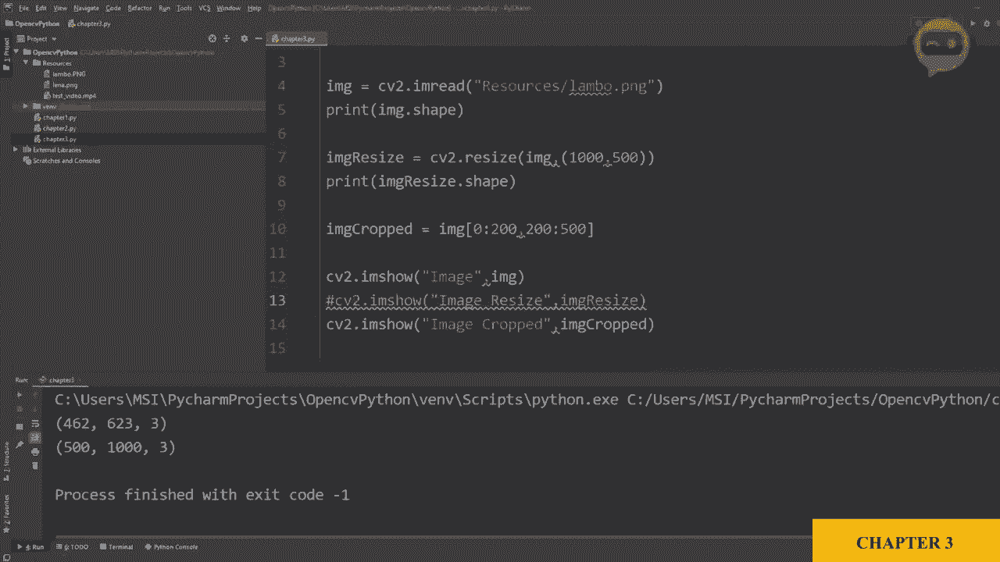

# OpenCV基础教程 P6：第3章：图像缩放与截取 📏✂️







在本节课中，我们将要学习OpenCV中两个非常实用的图像处理操作：**图像缩放**与**图像截取**。你将学会如何改变图像的尺寸以及如何提取图像中你感兴趣的部分。

## 坐标系约定 📍



在开始具体操作之前，我们需要理解OpenCV处理图像时的坐标系约定。

在数学中，绘制二维图形时，通常X轴的正方向朝右（东），Y轴的正方向朝上（北）。然而，在OpenCV中，X轴的方向是相同的，但Y轴的正方向是朝下（南）。这类似于计算机屏幕上像素的排列方式。

为了更进一步理解，我们来看一张图像。假设这张图像的分辨率是640像素（宽）× 480像素（高），图像的原点（0, 0）位于左上角。此时，X坐标的最大值是宽度-1，Y坐标的最大值是高度-1。

## 图像缩放

上一节我们介绍了OpenCV的坐标系，本节中我们来看看如何调整图像的大小。缩放图像意味着改变其像素尺寸，这在适配不同屏幕、减少计算量或统一输入大小时非常有用。

首先，我们需要知道图像的当前尺寸。以下是获取和修改图像尺寸的步骤。

以下是操作步骤：
1.  **导入库并读取图像**：我们首先导入OpenCV库，然后读取一张示例图像。
    ```python
    import cv2
    img = cv2.imread(‘lamo.jpg’) # 读取名为‘lamo’的图像
    ```
2.  **获取图像尺寸**：使用 `.shape` 属性来获取图像的高度、宽度和通道数。
    ```python
    print(img.shape) # 输出格式为 (高度, 宽度, 通道数)
    # 例如输出 (462, 623, 3) 表示高462像素，宽623像素，3个颜色通道(BGR)
    ```
3.  **调整图像大小**：使用 `cv2.resize()` 函数来缩放图像。你需要指定目标宽度和高度。
    ```python
    # 将图像缩放到宽300像素，高200像素
    width, height = 300, 200
    img_resized = cv2.resize(img, (width, height))
    ```
    你也可以放大图像，但请注意，单纯增加像素数量不会提升图像质量。
    ```python
    # 放大图像到宽1000像素，高500像素
    img_enlarged = cv2.resize(img, (1000, 500))
    ```
4.  **显示与验证**：显示原始图像和缩放后的图像，并可以再次打印尺寸进行验证。
    ```python
    cv2.imshow(‘Original Image’, img)
    cv2.imshow(‘Resized Image’, img_resized)
    cv2.waitKey(0)
    print(img_resized.shape)
    ```

## 图像截取

学会了缩放之后，我们来看看如何截取图像。图像截取，或称裁剪，用于获取图像中你感兴趣的特定区域。这在人脸识别、目标检测或简单的内容提取中非常常用。

在OpenCV中，图像本质上是一个由像素值组成的多维数组（矩阵）。因此，我们可以直接使用数组切片的方式来裁剪图像，而无需调用特定的函数。

以下是操作步骤：
1.  **理解切片顺序**：在OpenCV中，图像的数组表示形式为 `img[高度范围, 宽度范围]`。请注意，这里的顺序是**先高度（Y轴），后宽度（X轴）**，这与 `cv2.resize()` 中先宽度后高度的参数顺序不同。
2.  **定义裁剪区域**：你需要指定想要保留的高度范围和宽度范围。
    ```python
    # 假设原图尺寸为 (462, 623)
    # 裁剪出高度从0到200像素，宽度从200到500像素的区域
    y_start, y_end = 0, 200   # 高度范围
    x_start, x_end = 200, 500 # 宽度范围
    img_cropped = img[y_start:y_end, x_start:x_end]
    ```
    这段代码的含义是：在Y轴（高度）上，保留从第0行到第199行（Python切片不包含结束值）；在X轴（宽度）上，保留从第200列到第499列。
3.  **显示裁剪结果**：显示裁剪后的图像，你可以直观地看到提取出的部分。
    ```python
    cv2.imshow(‘Cropped Image’, img_cropped)
    cv2.waitKey(0)
    ```

---

本节课中我们一起学习了OpenCV中图像处理的两个基础操作：**缩放**与**截取**。

*   **图像缩放**通过 `cv2.resize()` 函数实现，可以灵活地调整图像的宽高尺寸。
*   **图像截取**利用了NumPy数组的切片功能，通过 `img[y1:y2, x1:x2]` 的语法可以直接提取出图像的任意矩形区域。



理解OpenCV**先高度后宽度**的坐标与切片约定，是正确进行这些操作的关键。掌握这两个技能，你就能为图像进行初步的尺寸调整和区域选取，为后续更复杂的处理打下基础。