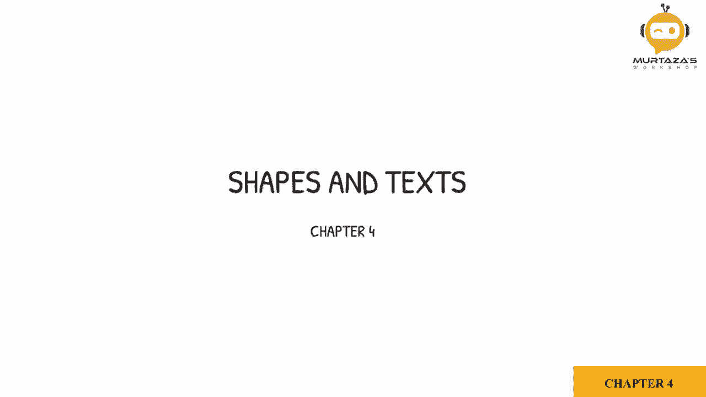
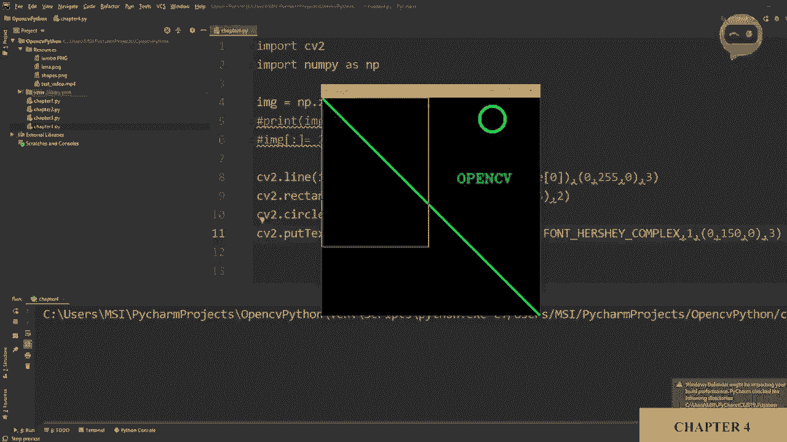

# OpenCV基础教程，P7：第4章：形状与文本 🎨




在本节课中，我们将学习如何使用OpenCV在图像上绘制各种形状和添加文本。具体内容包括：创建一个画布、绘制线条、矩形、圆形以及放置文字。我们将通过简单的代码示例来演示每个功能。

## 创建画布

首先，我们需要创建一个图像作为绘制的画布。我们将使用NumPy库来生成一个全黑的矩阵。

```python
import cv2
import numpy as np

# 创建一个512x512像素的黑色图像（单通道，灰度图）
image = np.zeros((512, 512))
cv2.imshow('Canvas', image)
cv2.waitKey(0)
print(image.shape)  # 输出: (512, 512)
```

运行上述代码，你会看到一个黑色的正方形窗口。`image.shape`的输出确认了这是一个512像素高、512像素宽的单通道（灰度）图像。

上一节我们创建了一个灰度画布，本节中我们来看看如何创建一个彩色的画布。

为了绘制彩色图形，我们需要一个三通道的图像（代表蓝色、绿色、红色）。只需在创建矩阵时指定通道数为3即可。

```python
# 创建一个512x512像素的彩色黑色图像（三通道）
image = np.zeros((512, 512, 3), np.uint8)
cv2.imshow('Color Canvas', image)
cv2.waitKey(0)
print(image.shape)  # 输出: (512, 512, 3)
```

现在，图像矩阵有了第三个维度，可以存储颜色信息。初始值全为0，所以图像显示为黑色。

## 为图像区域上色

我们可以为图像的特定区域填充颜色。这通过为矩阵的切片赋值来实现。

以下是操作步骤：
1.  使用切片语法 `image[height_range, width_range]` 选择图像区域。
2.  为该区域分配一个BGR颜色值（例如，蓝色是 `[255, 0, 0]`）。

```python
# 将整个图像填充为蓝色
image[:] = [255, 0, 0]
cv2.imshow('Blue Image', image)
cv2.waitKey(0)

# 仅为图像的特定区域（高度100-300，宽度200-300）填充蓝色
image[100:300, 200:300] = [255, 0, 0]
cv2.imshow('Partially Blue Image', image)
cv2.waitKey(0)
```

在第一个例子中，`[:]` 表示选择整个图像。在第二个例子中，我们只选择了高度从100到300像素、宽度从200到300像素的矩形区域进行上色。

## 绘制线条

现在，让我们在图像上绘制线条。OpenCV提供了 `cv2.line()` 函数。

该函数的参数如下：
*   `img`: 要绘制线条的图像。
*   `pt1`: 线条的起点坐标 `(x, y)`。
*   `pt2`: 线条的终点坐标 `(x, y)`。
*   `color`: 线条的BGR颜色。
*   `thickness`: 线条的粗细（像素）。

```python
# 重新创建一个黑色画布
image = np.zeros((512, 512, 3), np.uint8)

# 从点(0,0)到点(300,300)绘制一条绿色的线，粗细为3像素
cv2.line(image, (0,0), (300,300), (0, 255, 0), 3)
cv2.imshow('Line', image)
cv2.waitKey(0)
```

运行代码，你会看到一条从左上角到坐标(300,300)的绿色对角线。

我们可以利用图像的尺寸信息来绘制一条贯穿画布的对角线。

```python
# 获取图像的高度和宽度
height, width = image.shape[0], image.shape[1]
# 从左上角(0,0)到右下角(width, height)画线
cv2.line(image, (0,0), (width, height), (0, 255, 0), 3)
cv2.imshow('Diagonal Line', image)
cv2.waitKey(0)
```

## 绘制矩形

接下来学习绘制矩形。我们使用 `cv2.rectangle()` 函数。

该函数需要以下参数：
*   `img`: 要绘制矩形的图像。
*   `pt1`: 矩形左上角的坐标 `(x, y)`。
*   `pt2`: 矩形右下角的坐标 `(x, y)`。
*   `color`: 矩形的BGR边框颜色。
*   `thickness`: 边框粗细。如果设置为 `cv2.FILLED` 或 `-1`，则填充整个矩形。

```python
# 在点(0,0)到点(250,350)之间绘制一个红色边框的矩形，边框粗细为2像素
cv2.rectangle(image, (0,0), (250,350), (0, 0, 255), 2)
cv2.imshow('Rectangle', image)
cv2.waitKey(0)

# 绘制一个填充的蓝色矩形
cv2.rectangle(image, (100,100), (300,300), (255, 0, 0), cv2.FILLED)
cv2.imshow('Filled Rectangle', image)
cv2.waitKey(0)
```

第一个矩形是空心的，第二个矩形是实心的。

## 绘制圆形

要绘制圆形，我们使用 `cv2.circle()` 函数。

该函数的参数包括：
*   `img`: 要绘制圆形的图像。
*   `center`: 圆心的坐标 `(x, y)`。
*   `radius`: 圆的半径（像素）。
*   `color`: 圆的BGR颜色。
*   `thickness`: 边框粗细。同样，`cv2.FILLED` 或 `-1` 用于填充。

```python
# 以点(450,50)为圆心，绘制一个半径为30像素、淡蓝色边框的圆，边框粗细为5像素
cv2.circle(image, (450, 50), 30, (255, 255, 0), 5)
cv2.imshow('Circle', image)
cv2.waitKey(0)
```

圆心(450, 50)表示从左边开始450像素，从顶部开始50像素的位置。

## 添加文本

最后，我们学习如何在图像上添加文字，使用 `cv2.putText()` 函数。

以下是该函数的关键参数：
*   `img`: 要添加文本的图像。
*   `text`: 要显示的字符串。
*   `org`: 文本左下角的起始坐标 `(x, y)`。
*   `fontFace`: 字体类型（如 `cv2.FONT_HERSHEY_SIMPLEX`）。
*   `fontScale`: 字体缩放因子，控制大小。
*   `color`: 文本的BGR颜色。
*   `thickness`: 文本线条的粗细。

```python
# 在位置(300, 100)处以简单字体、绿色写下“OpenCV”，字体缩放为1，粗细为1
cv2.putText(image, 'OpenCV', (300, 100), cv2.FONT_HERSHEY_SIMPLEX, 1, (0, 150, 0), 1)
cv2.imshow('Text', image)
cv2.waitKey(0)

# 调整字体缩放和粗细的效果
cv2.putText(image, 'Big Text', (200, 200), cv2.FONT_HERSHEY_SIMPLEX, 2, (0, 150, 0), 3) # 更大更粗
cv2.putText(image, 'Small Text', (200, 300), cv2.FONT_HERSHEY_SIMPLEX, 0.5, (0, 150, 0), 1) # 更小
cv2.imshow('Adjusted Text', image)
cv2.waitKey(0)
cv2.destroyAllWindows()
```

通过调整 `fontScale`（如2.0或0.5）和 `thickness`，你可以轻松改变文本的外观。



## 总结


本节课中我们一起学习了OpenCV中绘制形状和文本的基础操作。我们首先创建了单通道和三维通道的画布，然后逐步实践了如何为区域上色、绘制线条、矩形、圆形以及添加文字。每个功能都通过核心函数（如 `cv2.line()`, `cv2.rectangle()`, `cv2.circle()`, `cv2.putText()`）和清晰的参数说明进行演示。掌握这些技能是进行图像标注、创建可视化结果和构建简单图像界面的重要基础。