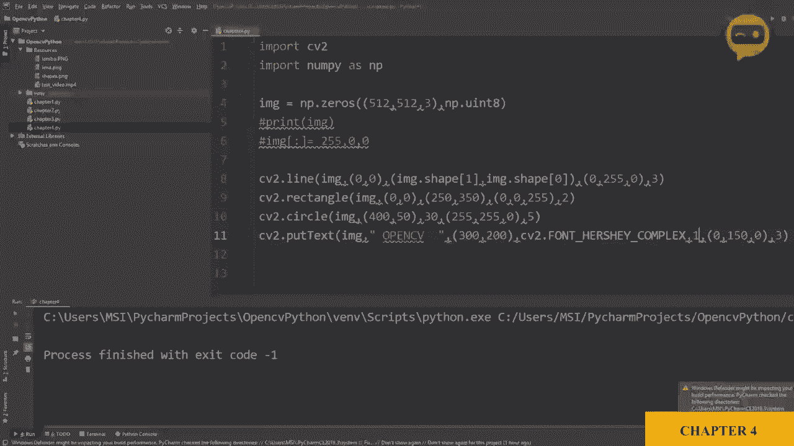
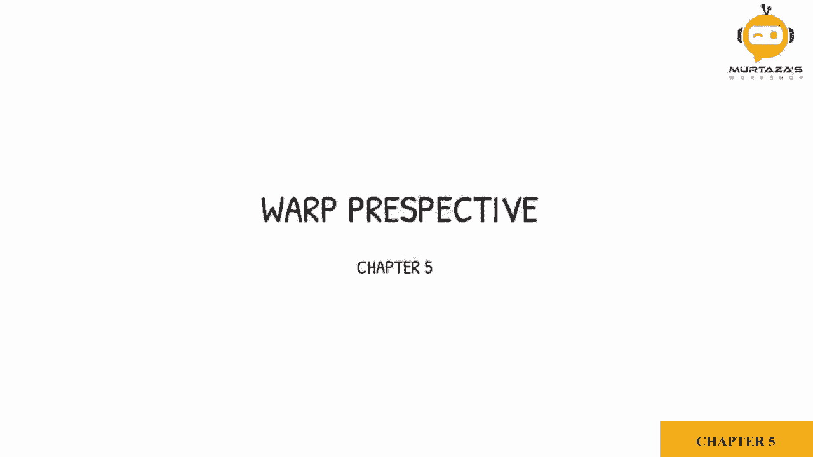
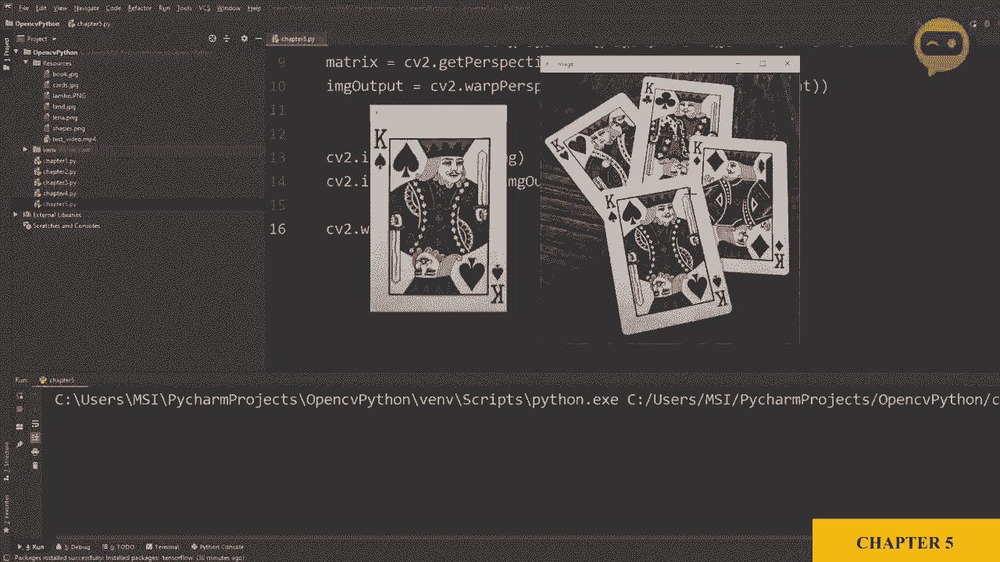

# OpenCV基础教程，P8：第5章：透视变换 🃏



在本节课中，我们将学习如何使用OpenCV进行透视变换，以获取图像的鸟瞰图。我们将以一张扑克牌图像为例，演示如何通过定义四个角点，将其从倾斜视角转换为正面平铺的视图。



## 概述

透视变换是计算机视觉中一项重要的技术，它可以将图像从一个视角投影到另一个视角。本节课，我们将通过一个具体的例子——校正一张倾斜的扑克牌——来掌握这项技能。我们将学习如何定义源图像和目标图像的角点，计算变换矩阵，并最终生成校正后的图像。

## 定义源图像的角点

首先，我们需要加载目标图像。这里我们有一张名为“cards”的图像，位于资源文件夹中。使用`cv2.imshow`函数可以显示它。

为了对图像进行透视变换，我们必须先确定源图像中我们感兴趣的四个角点。对于这张黑桃K扑克牌，我们已经通过工具（如Windows画图）获取了其四个角的像素坐标。

以下是定义这些角点的代码：

```python
import cv2
import numpy as np

# 加载图像
image = cv2.imread('cards.jpg')

# 定义扑克牌四个角在源图像中的坐标 (x, y)
points_src = np.float32([[111, 219], [188, 154], [154, 482], [352, 386]])
```
在上面的代码中，`points_src`数组包含了扑克牌左上、右上、左下、右下四个角的坐标。这些值需要根据你的具体图像进行调整。

## 定义目标图像的角点

上一节我们定义了源图像的角点。本节中，我们来看看我们希望图像变换后的目标形状。我们希望将扑克牌校正为一个规则的矩形。

为此，我们需要定义目标矩形四个角的位置。我们假设扑克牌的标准尺寸比例是2.5英寸宽，3.5英寸高。为了保持这个纵横比，我们可以将目标宽度和高度设置为250和350像素。

以下是定义目标角点的代码：

```python
# 定义目标图像的宽度和高度，保持扑克牌纵横比
width, height = 250, 350

# 定义目标矩形的四个角点 (x, y)
points_dst = np.float32([[0, 0], [width, 0], [0, height], [width, height]])
```
`points_dst`数组定义了目标矩形：左上角(0,0)，右上角(width,0)，左下角(0,height)，右下角(width,height)。

## 计算与应用透视变换矩阵

现在，我们同时拥有了源点集和目标点集。OpenCV提供了一个函数，可以根据这两组点计算出一个透视变换矩阵。

这个变换矩阵是一个3x3的矩阵，它描述了如何将源图像中的点映射到目标图像中的点。其数学形式可以表示为：

**`dst_point = M * src_point`** （使用齐次坐标）

其中`M`就是透视变换矩阵。

以下是计算和应用该矩阵的代码：

```python
# 计算透视变换矩阵
matrix = cv2.getPerspectiveTransform(points_src, points_dst)

# 应用透视变换，生成输出图像
image_output = cv2.warpPerspective(image, matrix, (width, height))
```
`cv2.getPerspectiveTransform`函数接收源点和目标点，返回变换矩阵。`cv2.warpPerspective`函数则使用这个矩阵对原始图像进行几何变换，生成校正后的图像。

## 显示与查看结果

最后，让我们显示原始图像和经过透视变换后的图像，以对比查看效果。

以下是显示图像的代码：

```python
# 显示原始图像和输出图像
cv2.imshow('Original Image', image)
cv2.imshow('Output Image', image_output)
cv2.waitKey(0)
cv2.destroyAllWindows()
```
运行上述完整代码后，你将看到两个窗口：一个显示原始的倾斜扑克牌，另一个显示校正后的正面平铺视图。



## 总结

本节课中，我们一起学习了OpenCV中透视变换的核心流程。我们首先通过手动或工具获取了源图像中物体的四个角点，然后定义了期望的目标矩形角点。接着，利用`cv2.getPerspectiveTransform`函数计算变换矩阵，并使用`cv2.warpPerspective`函数应用该变换，最终得到了物体的鸟瞰图。这项技术广泛应用于文档扫描、车牌识别、增强现实等领域，是图像几何处理的重要基础。