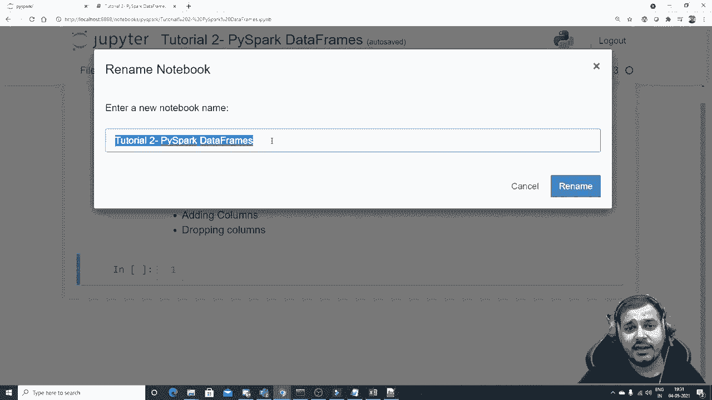
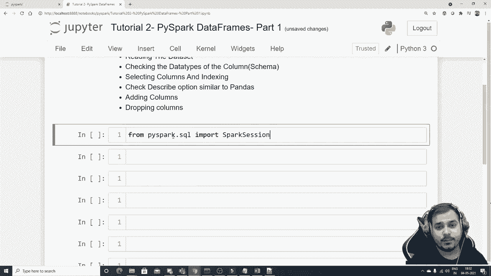
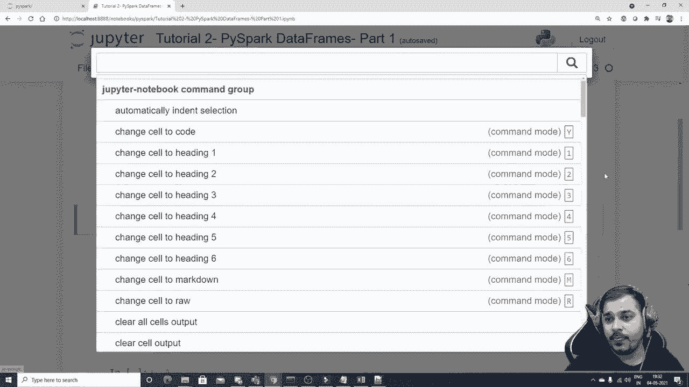
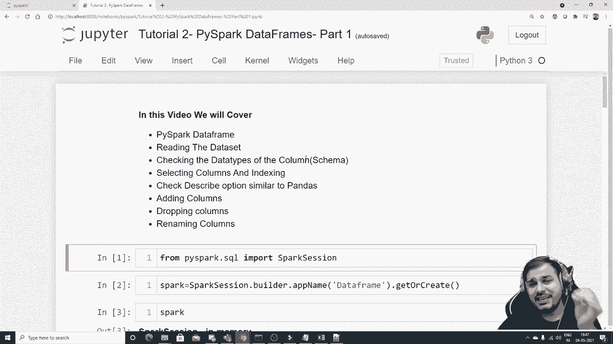

# PySpark 大数据处理入门，2：L2 - PySpark 数据帧 🚀


在本节课中，我们将学习 PySpark 的核心数据结构——数据帧。我们将从如何创建和读取数据开始，逐步学习如何检查数据结构、选择列、查看数据摘要，以及如何添加、删除和重命名列。这些是进行任何数据处理前的基础操作。

## 构建 Spark 会话




首先，要使用 PySpark，我们需要创建一个 Spark 会话。这是所有 PySpark 操作的起点。

```python
from pyspark.sql import SparkSession





sp = SparkSession.builder.appName("DataFrame_Practice").getOrCreate()
```

## 读取数据集

创建会话后，我们可以读取数据。我们将使用一个名为 `test1.csv` 的 CSV 文件作为示例。

```python
# 方法一：使用 .options() 指定参数
df_pyspark = spark.read.options(header='True', inferSchema='True').csv('test1.csv')

# 方法二：使用 .csv() 时直接传入参数（更简洁）
df_pyspark = spark.read.csv('test1.csv', header=True, inferSchema=True)
```

**参数解释**：
*   `header='True'`：将 CSV 文件的第一行作为列名。
*   `inferSchema='True'`：自动推断每列的数据类型。如果不设置，所有列默认会被视为字符串类型。

要查看数据内容，可以使用 `.show()` 方法。

```python
df_pyspark.show()
```

## 检查数据结构（Schema）

在数据处理前，了解数据的结构（即每列的名称和数据类型）至关重要。这类似于 Pandas 中的 `.info()` 方法。

```python
df_pyspark.printSchema()
```

执行此命令后，你将看到类似 `name: string`， `age: integer`， `experience: integer` 的输出，清晰地展示了列名和对应的数据类型。

## 选择列与查看数据

上一节我们介绍了如何查看数据的整体结构，本节中我们来看看如何操作具体的列。

以下是获取列名和查看数据子集的方法。

```python
# 获取所有列名
df_pyspark.columns

# 查看前3行数据（以列表形式返回）
df_pyspark.head(3)

# 选择单列（返回一个DataFrame）
df_pyspark.select("name").show()

# 选择多列
df_pyspark.select("name", "experience").show()
```

**注意**：直接使用 `df_pyspark[“name”]` 会返回一个 `Column` 对象，而不是包含数据的 DataFrame。要查看数据，必须使用 `.select()` 方法。

## 数据摘要（Describe）

`.describe()` 方法可以提供数据集的统计摘要，如计数、均值、标准差、最小值和最大值。这对于数值型数据的初步分析非常有用。

```python
df_pyspark.describe().show()
```

**注意**：对于字符串类型的列（如 `name`），统计值（如均值）将显示为 `null`。

## 添加、删除与重命名列

数据预处理中，经常需要调整数据的列结构。接下来，我们学习如何操作列。

### 添加新列

使用 `.withColumn()` 方法可以添加新列。它需要两个参数：新列的名称和新列的值（通常基于现有列计算得出）。

```python
# 假设我们想计算两年后的工作经验
df_pyspark = df_pyspark.withColumn("experience_after_2yrs", df_pyspark["experience"] + 2)
df_pyspark.show()
```

### 删除列

使用 `.drop()` 方法可以删除一列或多列。

```python
# 删除单个列
df_pyspark = df_pyspark.drop("experience_after_2yrs")

# 删除多个列（传入列名列表）
# df_pyspark = df_pyspark.drop(*["col1", "col2"])
df_pyspark.show()
```

### 重命名列

使用 `.withColumnRenamed()` 方法可以重命名现有的列。

```python
df_pyspark = df_pyspark.withColumnRenamed("name", "new_name")
df_pyspark.show()
```

**重要提示**：PySpark 的 DataFrame 操作（如添加、删除、重命名列）默认是**不可变**的。这意味着操作会返回一个新的 DataFrame，而不会修改原始 DataFrame。因此，通常需要将结果赋值给一个新变量（或覆盖原变量）以保存更改。

## 总结



本节课中我们一起学习了 PySpark DataFrame 的基础操作。我们掌握了如何创建 Spark 会话、读取 CSV 数据并正确推断数据类型。接着，我们学习了如何检查数据的结构（Schema）、选择特定的列进行查看、获取数据的统计摘要。最后，我们实践了数据预处理中常见的列操作：添加新列、删除已有列以及重命名列。这些是构建更复杂数据处理流程的基石。在下一部分，我们将深入探讨数据过滤、处理缺失值等进阶操作。