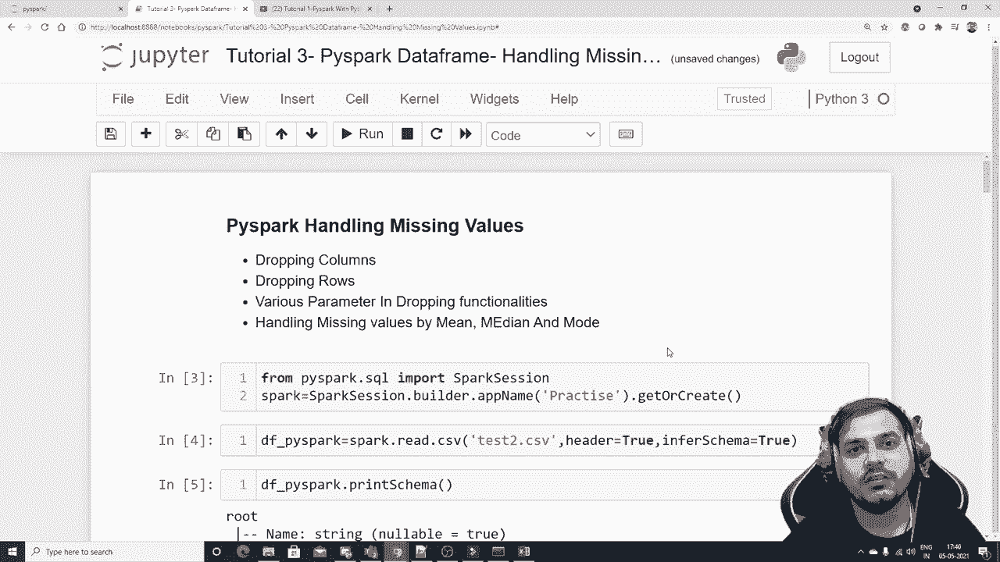

# PySpark 大数据处理入门，3：L3- Pyspark DataFrames 处理缺失值 🧹


在本节课中，我们将学习如何在 PySpark DataFrames 中处理缺失值。我们将涵盖删除列、删除行、以及使用均值、中位数或众数来填充缺失值等核心操作。掌握这些技能对于数据清洗和准备至关重要。

## 概述 📋

处理缺失值是数据预处理的关键步骤。缺失值可能由多种原因造成，如果不妥善处理，会影响后续分析和建模的准确性。本节课将介绍 PySpark 中处理缺失值的几种常用方法。


## 启动 Spark 会话 🚀

开始使用 PySpark 前，我们需要先启动一个 Spark 会话。

```python
from pyspark.sql import SparkSession
spark = SparkSession.builder.appName('practice').getOrCreate()
```

这段代码创建了一个名为 “practice” 的 Spark 应用会话，它是所有 DataFrame 操作的起点。

## 读取数据集 📂

我们将使用一个包含姓名、年龄、经验和薪资列的示例数据集，其中部分值缺失。

```python
df = spark.read.csv('test2.csv', header=True, inferSchema=True)
df.show()
```

执行上述代码会显示数据集，你可以看到其中存在一些空值（`null`）。

## 删除列 ❌

有时，数据集中的某些列可能无关紧要或包含过多缺失值，我们可以将其删除。

删除列的操作非常简单。以下是删除“姓名”列的方法：

```python
df_without_name = df.drop('姓名')
df_without_name.show()
```

执行后，新的 DataFrame 将不再包含“姓名”列。

## 处理缺失行：删除操作 🗑️

上一节我们介绍了如何删除列，本节中我们来看看如何根据缺失值删除行。PySpark 提供了 `.na.drop()` 方法来实现。

### 基本删除

默认情况下，`.na.drop()` 会删除任何包含至少一个空值的行。

```python
df_cleaned = df.na.drop()
df_cleaned.show()
```

执行后，所有包含空值的行都会被移除。

### `how` 参数

`drop` 方法有一个 `how` 参数，可以接受两个值：`‘any’` 和 `‘all’`。

*   `how=‘any’`：这是默认值。只要行中有一个空值，该行就会被删除。
*   `how=‘all’`：只有当一行中所有值都为空时，该行才会被删除。

```python
# 删除所有值都为空的行
df_cleaned_all = df.na.drop(how='all')
df_cleaned_all.show()
```

### `thresh` 参数

`thresh`（阈值）参数用于指定一行中至少需要有多少个**非空值**才能被保留。

```python
# 保留至少包含2个非空值的行
df_thresh_2 = df.na.drop(thresh=2)
df_thresh_2.show()
```

例如，设置 `thresh=2` 意味着如果某行只有1个或0个非空值，它将被删除。

### `subset` 参数

`subset` 参数允许我们只针对特定列检查空值。

```python
# 只删除“经验”列为空的行
df_subset = df.na.drop(subset=['经验'])
df_subset.show()

# 删除“年龄”或“经验”列为空的行
df_subset_multi = df.na.drop(subset=['年龄', '经验'])
df_subset_multi.show()
```

## 处理缺失行：填充操作 🧽

除了删除，另一种常见方法是填充缺失值。PySpark 使用 `.na.fill()` 方法。

### 统一填充

我们可以用一个统一的值（如字符串“缺失值”）填充所有空值。

```python
df_filled = df.na.fill('缺失值')
df_filled.show()
```

### 指定列填充

更常见的是，我们只为特定列填充缺失值。

```python
# 只填充“经验”列的空值
df_filled_exp = df.na.fill('未知', subset=['经验'])
df_filled_exp.show()
```

## 使用统计值填充 📊

上一节我们介绍了用固定值填充，本节中我们来看看更智能的方法：使用列的统计量（均值、中位数、众数）进行填充。这需要使用 PySpark MLlib 库中的 `Imputer` 估算器。

首先，我们需要从 `pyspark.ml.feature` 导入 `Imputer`。

```python
from pyspark.ml.feature import Imputer
```

以下是使用均值填充的步骤：

```python
# 1. 定义要处理的列
input_cols = ['年龄', '经验', '薪资']
output_cols = [f'{col}_imputed' for col in input_cols] # 生成输出列名，如‘年龄_imputed’

# 2. 创建Imputer对象，设置策略为‘mean’（均值）
imputer = Imputer(inputCols=input_cols,
                  outputCols=output_cols,
                  strategy='mean')

# 3. 拟合模型并转换数据
model = imputer.fit(df)
df_imputed_mean = model.transform(df)
df_imputed_mean.show()
```

执行后，DataFrame 会新增三列（例如 `年龄_imputed`），其中原始的空值已被相应列的均值替换。

### 使用中位数或众数填充

只需更改 `strategy` 参数即可。

```python
# 使用中位数填充
imputer_median = Imputer(inputCols=input_cols,
                         outputCols=output_cols,
                         strategy='median')
df_imputed_median = imputer_median.fit(df).transform(df)
df_imputed_median.show()

# 使用众数填充（适用于分类或数值数据）
imputer_mode = Imputer(inputCols=input_cols,
                       outputCols=output_cols,
                       strategy='mode')
df_imputed_mode = imputer_mode.fit(df).transform(df)
df_imputed_mode.show()
```

## 总结 🎯

本节课中我们一起学习了 PySpark DataFrame 处理缺失值的核心方法。

*   **删除操作**：使用 `.drop()` 删除列，使用 `.na.drop()` 根据条件删除包含空值的行。关键参数包括 `how`, `thresh`, `subset`。
*   **填充操作**：使用 `.na.fill()` 用固定值填充空值。
*   **统计值填充**：使用 `Imputer` 估算器，用列的**均值**、**中位数**或**众数**智能地填充缺失值，这是最常用的方法之一。

正确处理缺失值是构建可靠数据管道的基础。你可以根据数据的特性和分析目标，选择最合适的方法。

