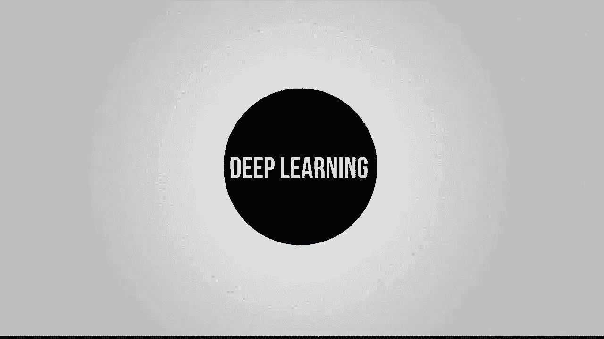
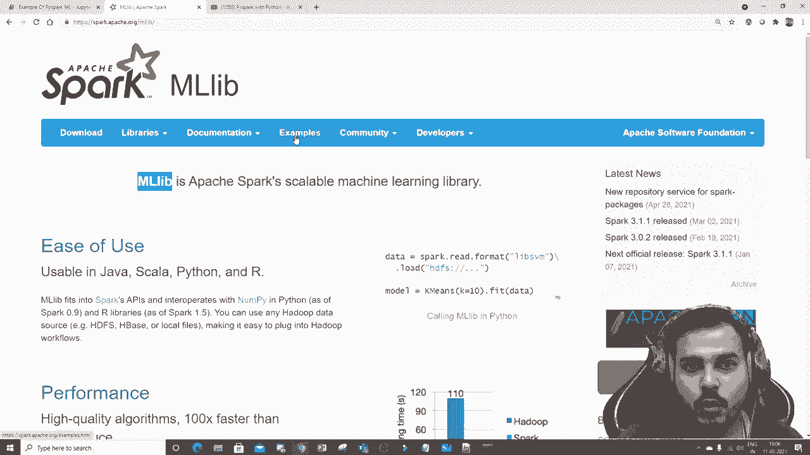
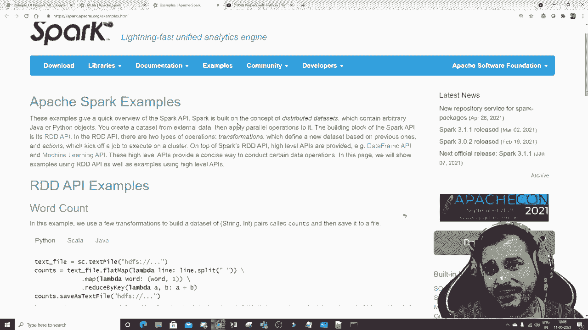
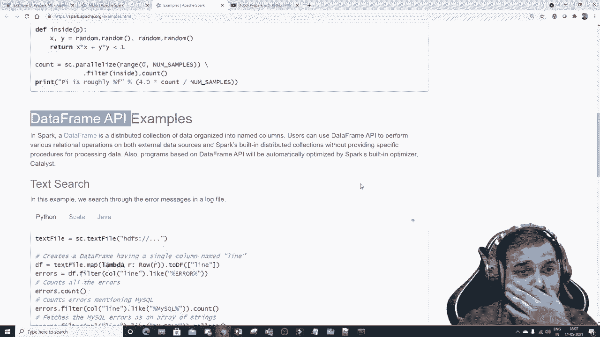
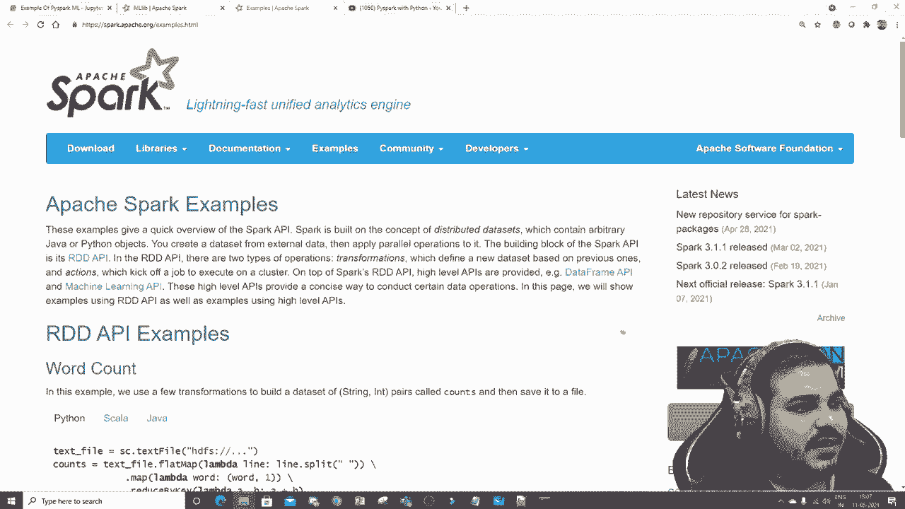
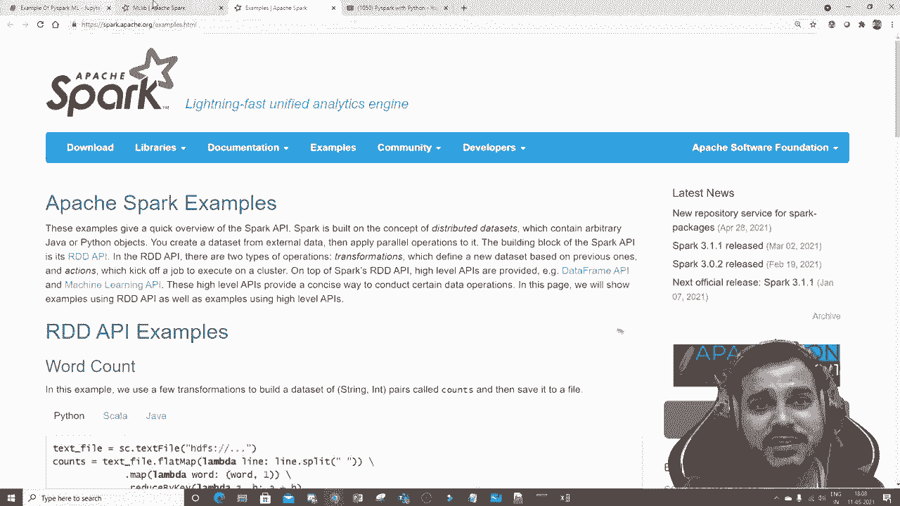
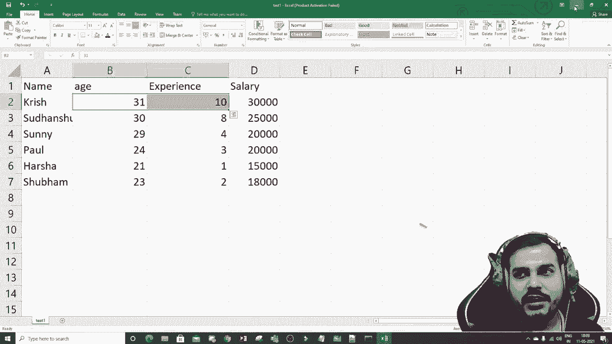
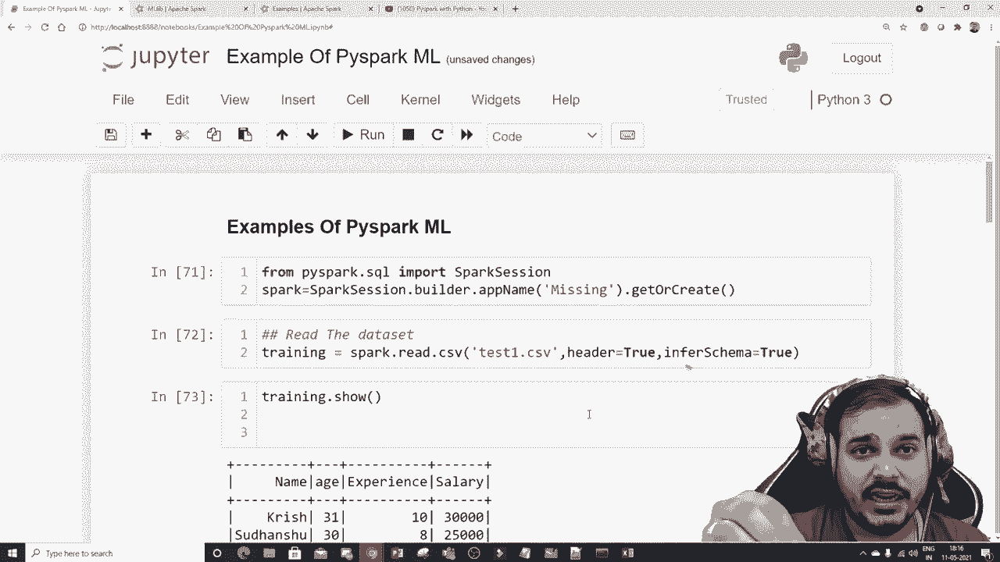
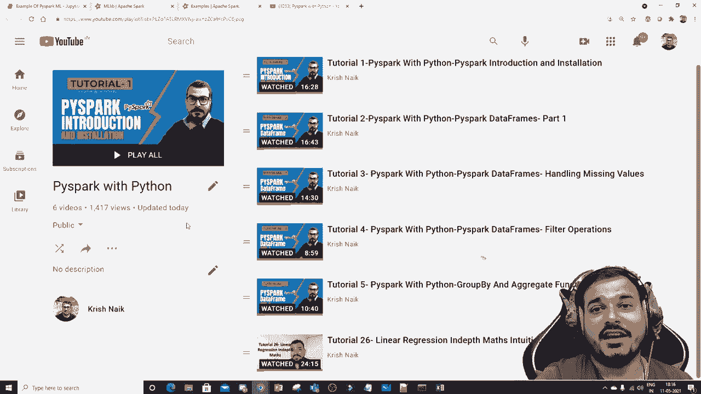

# PySpark 大数据处理入门，6：L6- PySpark MLlib 简介 🚀



在本节课中，我们将要学习 PySpark 的机器学习库 MLlib。我们将了解其两种主要 API，并通过一个简单的线性回归示例，演示如何使用 DataFrame API 来构建和评估一个机器学习模型。

---

## 概述

Spark MLlib 提供了优秀的文档和丰富的示例。MLlib 主要提供两种技术：一种是基于 RDD 的 API，另一种是基于 DataFrame 的 API。DataFrame API 是较新且广泛使用的技术，因此本教程将重点介绍如何使用 DataFrame API 来解决机器学习问题。



上一节我们介绍了 PySpark 的核心数据处理，本节中我们来看看如何使用其机器学习库。





---

## MLlib 的两种 API

Spark MLlib 包含两种不同的技术实现。



*   **RDD-based API**：基于弹性分布式数据集（RDD）的早期 API。
*   **DataFrame-based API**：基于 DataFrame 的新 API，它构建在 Spark SQL 之上，能更好地利用 Spark 的优化器，并且与 ML 管道（Pipeline）集成得更好。

我们将专注于 **DataFrame API**，因为它更现代且功能强大。

---



## 一个简单的机器学习示例

让我们通过一个具体的例子来演示 MLlib 的使用。这是一个简单的线性回归问题，旨在根据员工的年龄和工作经验来预测其薪水。

以下是实现此用例的主要步骤。

### 1. 准备数据与 Spark 会话



首先，我们需要创建一个 SparkSession 并加载数据。

```python
from pyspark.sql import SparkSession

# 创建 Spark 会话
spark = SparkSession.builder.appName("MLlibExample").getOrCreate()

# 读取数据集
train_df = spark.read.csv("test1.csv", header=True, inferSchema=True)
# 查看数据模式
train_df.printSchema()
# 查看数据列
train_df.columns
```

我们的数据集包含以下列：`姓名`、`年龄`、`经验`、`薪水`。其中，`年龄`和`经验`是独立特征（用于预测），`薪水`是依赖特征（要预测的目标）。

### 2. 特征工程：组合特征

在 PySpark MLlib 中，大多数算法要求将输入特征组合成一个单独的向量列。我们使用 `VectorAssembler` 来完成这个任务。

```python
from pyspark.ml.feature import VectorAssembler

# 定义要组合的特征列
feature_columns = ['年龄', '经验']

# 创建 VectorAssembler，将指定列组合成一个名为“独立特征”的新向量列
assembler = VectorAssembler(inputCols=feature_columns, outputCol="独立特征")

# 应用转换
output_df = assembler.transform(train_df)
# 查看转换后的数据
output_df.show()
```

转换后，数据集中新增了一个 `独立特征` 列，它包含了 `年龄` 和 `经验` 的组合向量。

### 3. 准备训练数据

接下来，我们从转换后的数据中选取模型需要的列：特征向量和标签。

```python
# 选择用于模型训练的列：特征向量和标签（薪水）
final_data = output_df.select("独立特征", "薪水")
final_data.show()
```

现在，`final_data` 包含两列：`独立特征`（输入 `X`）和 `薪水`（输出 `y`）。

### 4. 划分训练集与测试集

我们将数据随机分为两部分，一部分用于训练模型，另一部分用于评估模型性能。

```python
# 将数据按75%-25%的比例随机划分为训练集和测试集
train_data, test_data = final_data.randomSplit([0.75, 0.25])
```

### 5. 创建并训练线性回归模型

现在，我们可以创建线性回归模型，并在训练数据上进行拟合。

```python
from pyspark.ml.regression import LinearRegression

# 创建线性回归模型
# 指定特征向量列和标签列的名称
lr = LinearRegression(featuresCol="独立特征", labelCol="薪水")

# 在训练数据上拟合模型
lr_model = lr.fit(train_data)
```

训练完成后，我们可以查看模型的系数和截距。

```python
# 获取模型的系数和截距
print("系数：", lr_model.coefficients)
print("截距：", lr_model.intercept)
```

### 6. 评估模型

最后，我们使用测试数据来评估训练好的模型性能。

```python
# 在测试集上进行预测
test_results = lr_model.evaluate(test_data)

# 查看预测结果
test_results.predictions.show()

# 查看评估指标，例如均方误差（MSE）和平均绝对误差（MAE）
print("均方误差 (MSE):", test_results.meanSquaredError)
print("平均绝对误差 (MAE):", test_results.meanAbsoluteError)
```

这些指标可以帮助我们理解模型在未知数据上的预测准确度。

---

## 总结

本节课中我们一起学习了 PySpark MLlib 的基本概念和使用流程。我们了解到 MLlib 提供了基于 DataFrame 的现代化 API。通过一个简单的线性回归示例，我们实践了从数据准备、特征组合、划分数据集、训练模型到评估模型的完整步骤。核心操作包括使用 `VectorAssembler` 组合特征，以及使用 `LinearRegression` 等算法进行建模。



在接下来的课程中，我们将更深入地探讨线性回归等算法的理论及其在 PySpark 中的详细实现。



祝你学习愉快！😊