# PySpark 大数据处理入门，第7课：📊 Databricks 简介


在本节课中，我们将学习什么是 Databricks 平台，了解其核心功能，并演示如何在社区版中创建集群、上传数据并运行基础的 PySpark 代码。

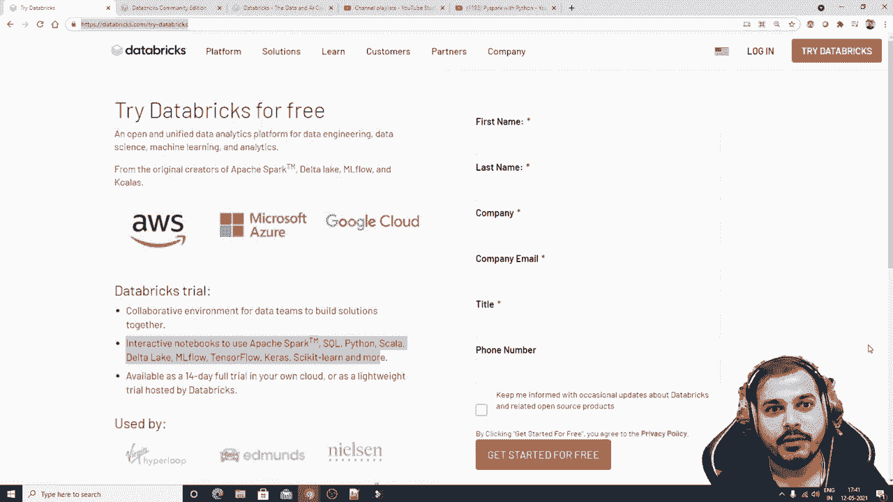

---


## 概述

Databricks 是一个开放、统一的数据分析平台，专为数据工程、数据科学和机器学习任务设计。它简化了大数据处理，并提供了与主流云服务（如 AWS、Azure、Google Cloud）的深度集成。本节课将介绍 Databricks 的基本概念、两种使用方式（社区版与云付费版），并带领大家完成一次从创建集群到运行代码的完整流程。

---

## 什么是 Databricks？

Databricks 是一个基于 Apache Spark 的云平台，旨在帮助数据团队协作处理大规模数据。它提供了托管式的 Spark 集群、交互式笔记本环境以及用于管理机器学习生命周期的工具（如 MLflow）。

其核心优势在于：
*   **统一平台**：整合了数据工程、数据科学和商业分析工作流。
*   **托管集群**：自动配置和管理 Spark 集群，用户无需关心底层基础设施。
*   **多语言支持**：支持 Python、Scala、R 和 SQL。
*   **云原生**：深度集成 AWS、Azure 和 Google Cloud，便于数据访问和计算资源扩展。

---

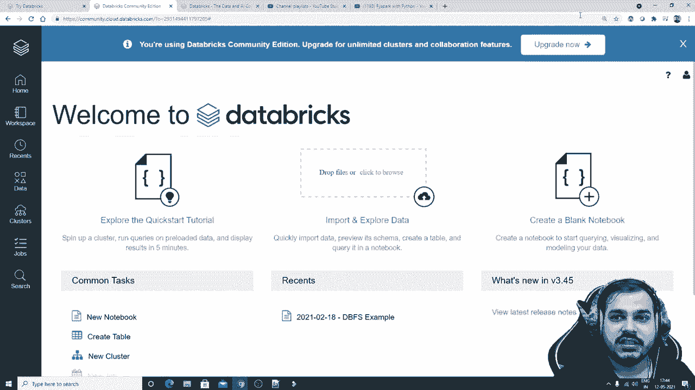

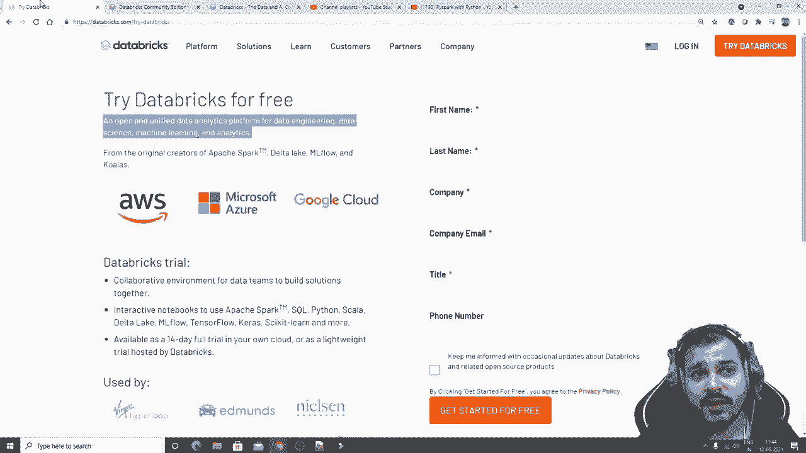

## 两种使用方式

Databricks 提供两种主要的使用模式。

以下是两种模式的对比：

1.  **社区版**：免费版本，提供有限的计算资源（单个集群节点），适合学习和个人项目。
2.  **付费版**：基于 AWS、Microsoft Azure 或 Google Cloud 平台的商业版本，提供强大的计算能力、多节点集群和高级企业功能。

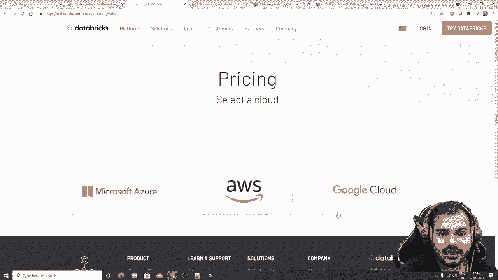

---

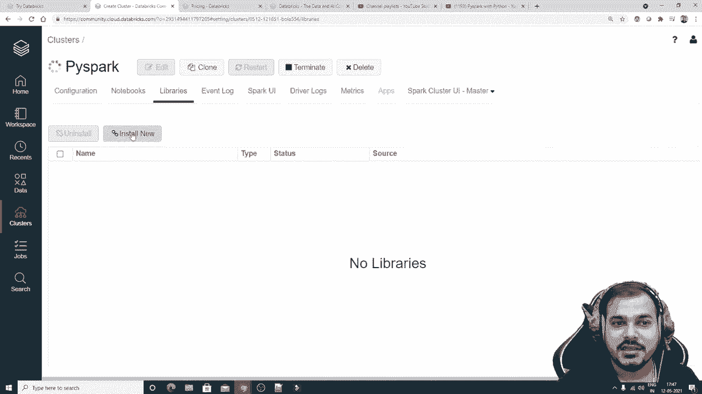

## 社区版入门演示

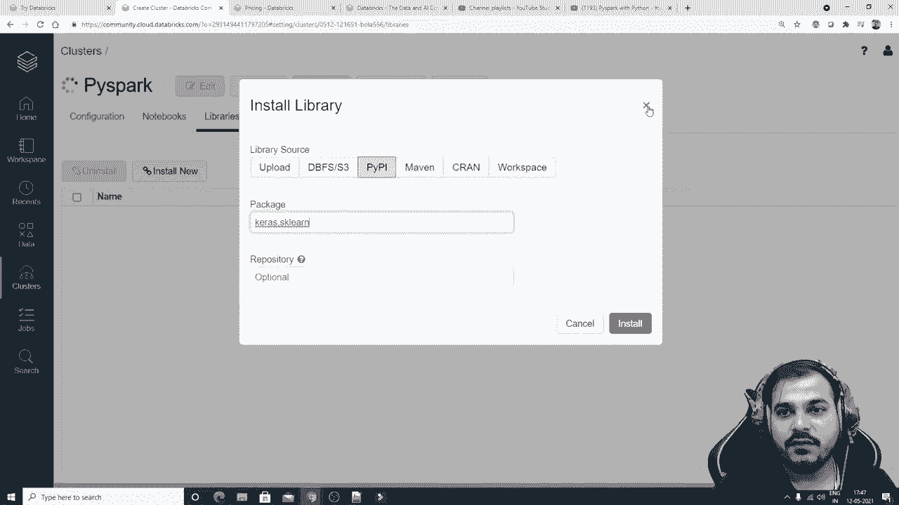

上一节我们介绍了 Databricks 的两种使用方式，本节中我们来看看如何在社区版中实际操作。

### 创建集群

首先，我们需要创建一个计算集群来运行我们的代码。

以下是创建集群的步骤：
1.  登录 Databricks 社区版工作区。
2.  在侧边栏点击“创建” -> “集群”。
3.  为集群命名（例如：`PySpark_Cluster`）。
4.  选择运行时版本（例如：`Runtime: 8.2 (Scala 2.12, Spark 3.1.1)`）。
5.  在免费版中，集群配置是固定的（例如：1个驱动节点，15.3 GB内存，2个核心）。
6.  点击“创建集群”并等待其启动。

集群创建后，状态将显示为“运行中”。

### 上传数据

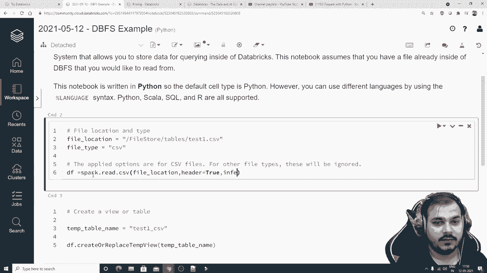

有了运行中的集群，接下来我们可以上传数据进行分析。

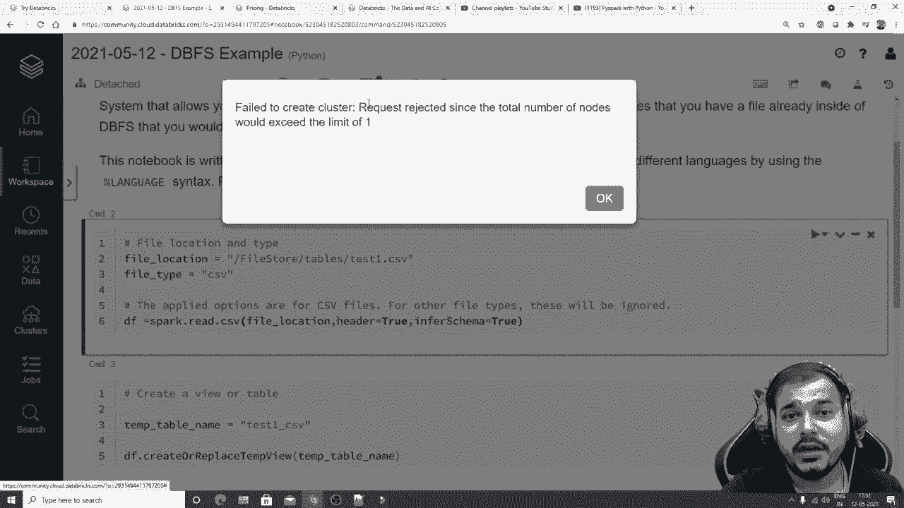

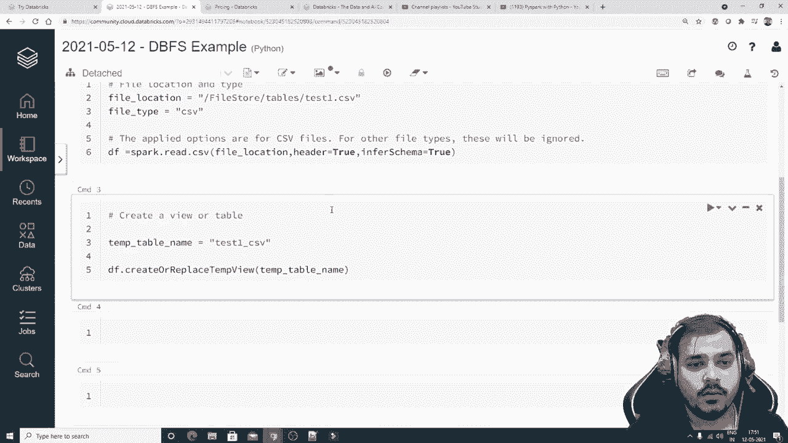

以下是上传数据的步骤：
1.  在工作区点击“数据” -> “创建数据表” -> “上传文件”选项卡。
2.  将本地文件（如 CSV 文件）拖拽至上传区域。
3.  文件上传后，平台会生成用于创建数据表的示例代码。

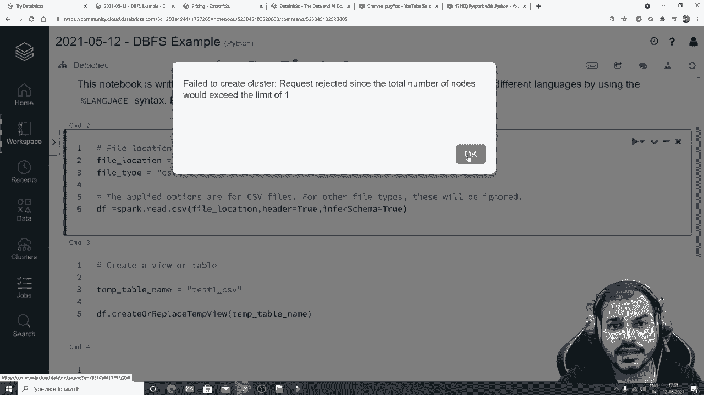

### 创建笔记本并运行代码

数据准备就绪后，我们可以在笔记本中编写和运行 PySpark 代码。

以下是运行 PySpark 代码的步骤：
1.  点击“创建” -> “笔记本”。
2.  为笔记本命名，并选择默认语言为“Python”。将笔记本附加到已创建的集群。
3.  在单元格中编写 PySpark 代码。例如，读取上传的 CSV 文件：
    ```python
    # 定义文件路径（根据上传后显示的实际路径修改）
    file_location = "/FileStore/tables/your_file.csv"
    # 读取CSV文件
    df = spark.read.csv(file_location, header=True, inferSchema=True)
    # 显示数据框结构和内容
    df.printSchema()
    df.show()
    ```
4.  按 `Shift+Enter` 运行单元格。首次运行时会启动附加的集群。
5.  可以继续执行其他操作，例如选择特定列：
    ```python
    df.select("salary").show()
    ```

---

## 总结

本节课中我们一起学习了 Databricks 平台的基础知识。我们了解到 Databricks 是一个强大的、统一的数据分析平台，支持数据工程和机器学习。我们演示了如何在其免费社区版中创建 Spark 集群、上传数据以及运行 PySpark 代码进行基本的数据操作。

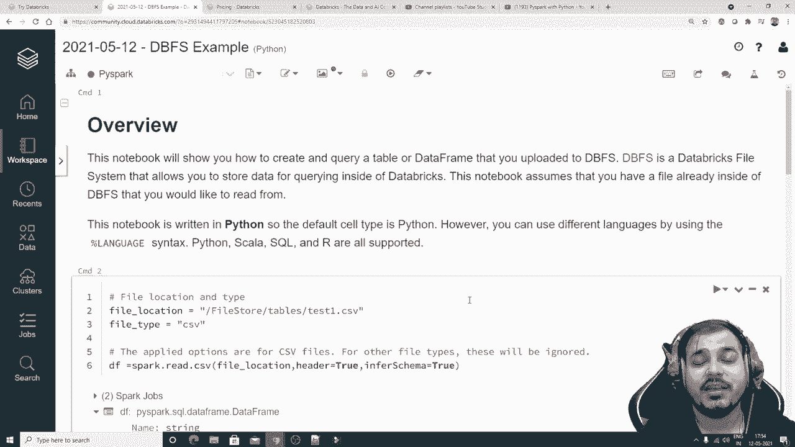

通过本节课的实践，你已经具备了在 Databricks 环境中开始大数据处理的基本能力。在接下来的课程中，我们将利用这个平台，实现更复杂的数据处理算法和机器学习模型。