# PySpark 大数据处理入门，8：Databricks 中的多元线性回归实现 📊

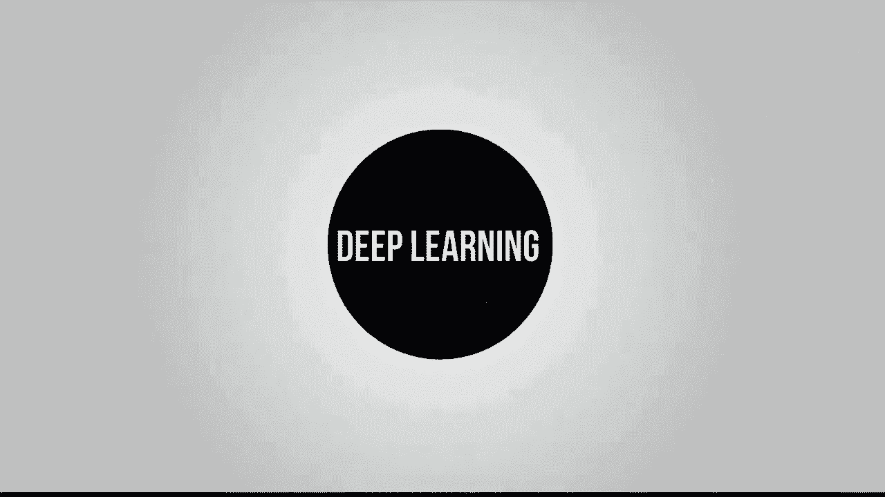

在本节课中，我们将学习如何在 Databricks 环境中使用 PySpark 实现一个多元线性回归模型。我们将使用一个餐厅小费数据集，目标是基于多个特征（如小费金额、用餐人数、性别、是否吸烟、星期几和用餐时间）来预测总账单金额。

---

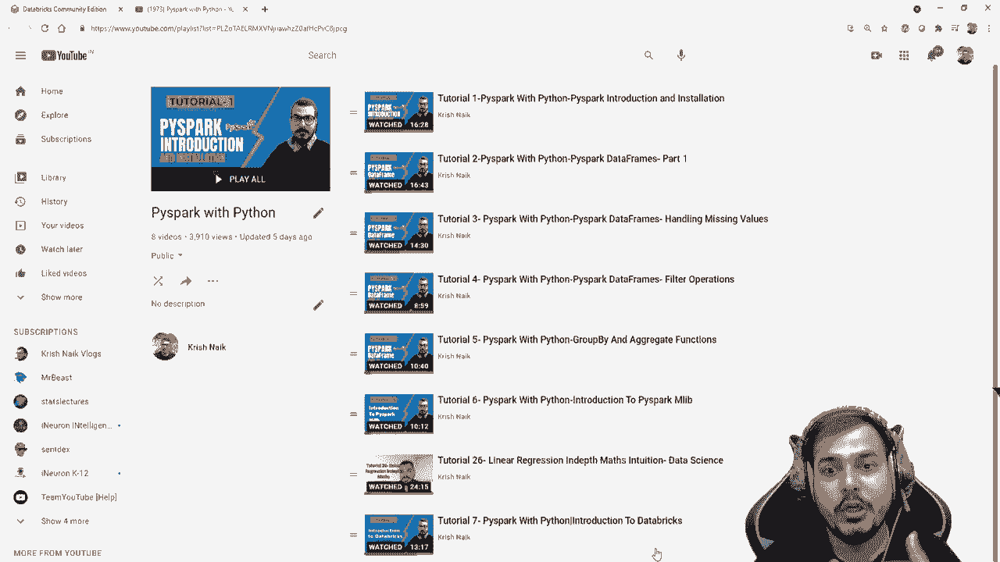

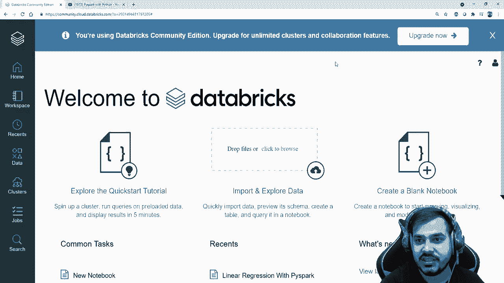

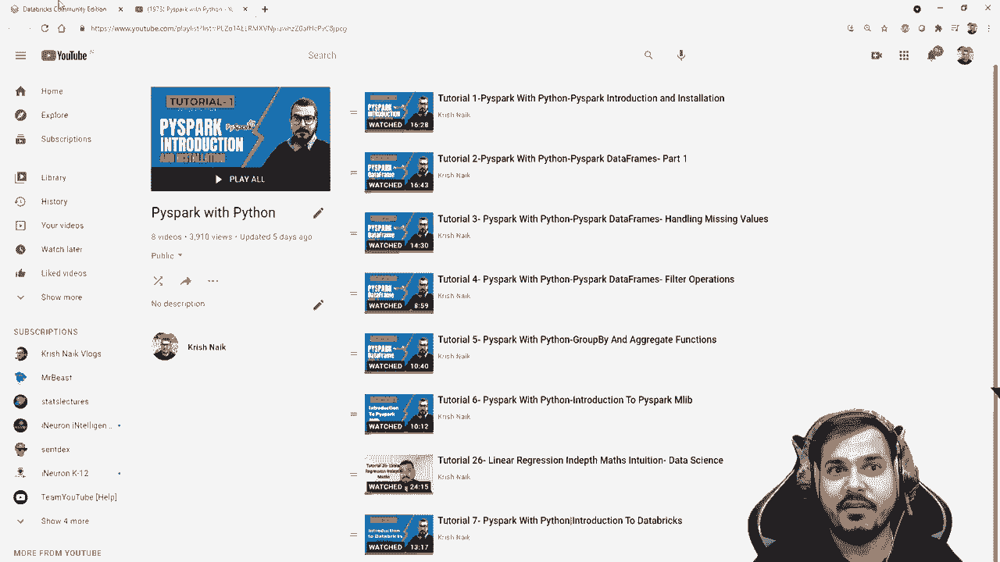

## 1. 环境与数据准备 🛠️

首先，我们需要在 Databricks 中准备好工作环境并加载数据。

### 1.1 创建集群

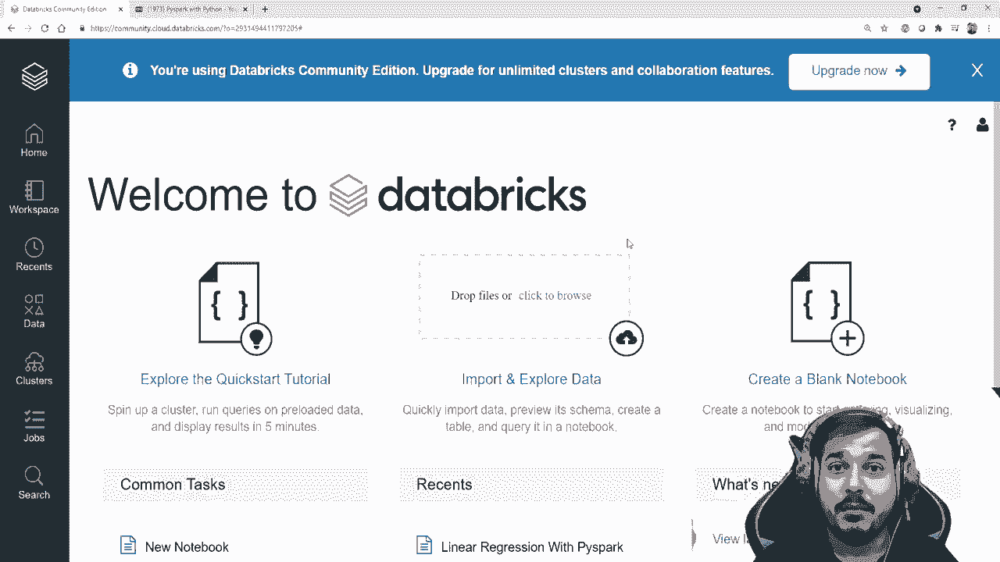

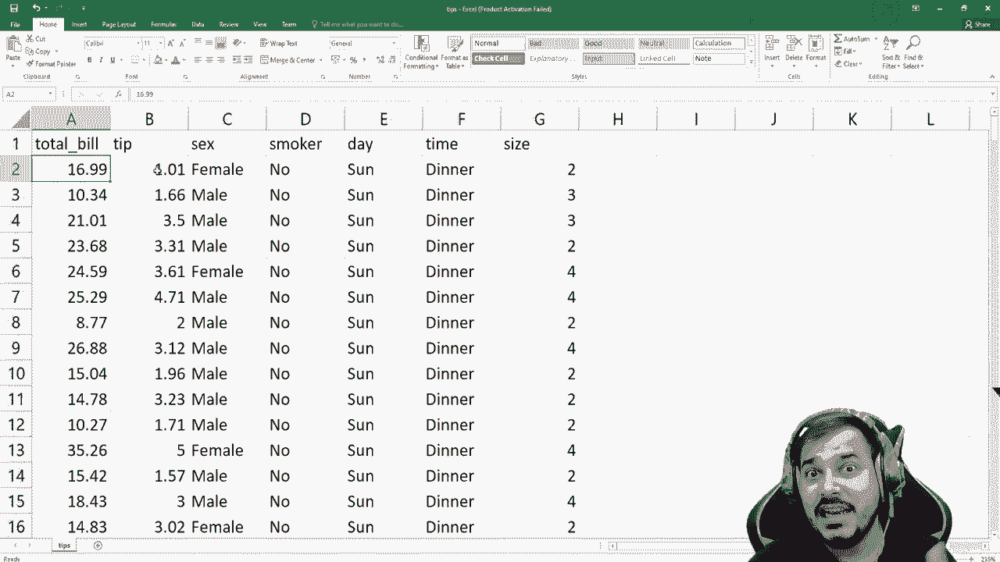

在 Databricks 中，计算任务在集群上运行。社区版允许创建一个集群。

以下是创建集群的步骤：
1.  在左侧边栏点击 **“计算”**。
2.  点击 **“创建集群”**。
3.  为集群命名（例如，“线性回归集群”）。
4.  选择合适的运行时版本（例如，带 Scala 2.12 的 Runtime 8.2）。
5.  点击 **“创建集群”** 并等待其启动。

### 1.2 上传与加载数据

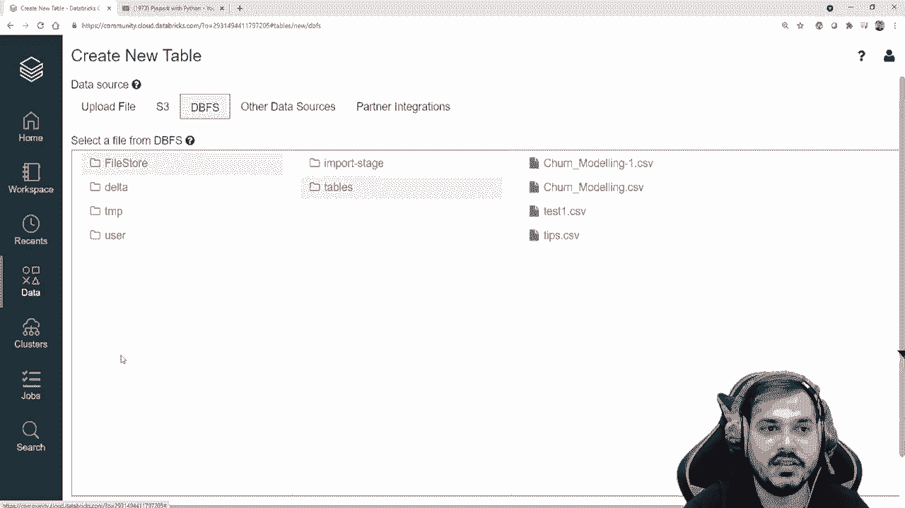

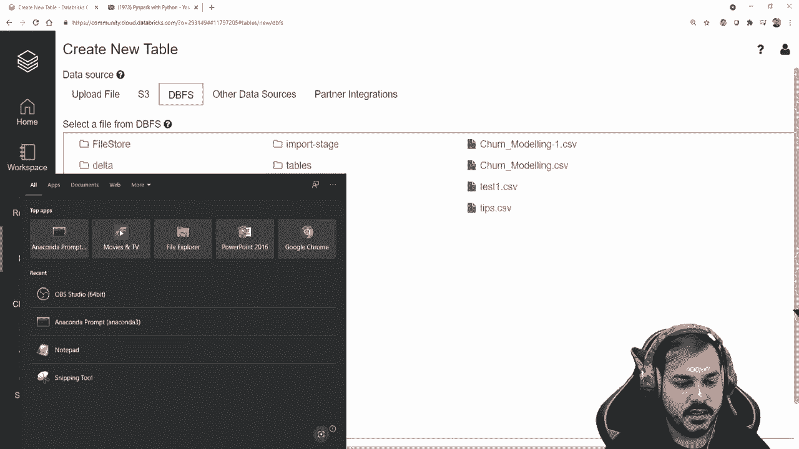

我们将使用一个名为 `tips.csv` 的数据集。首先需要将其上传到 Databricks 文件系统 (DBFS)。

上传数据步骤：
1.  点击左侧边栏的 **“数据”**。
2.  点击 **“创建表”**，然后选择 **“上传文件”**。
3.  将本地的 `tips.csv` 文件拖入上传区域。
4.  文件上传后，记下其在 DBFS 中的路径（例如：`/FileStore/tables/tips.csv`）。

现在，我们可以在笔记本中加载数据。

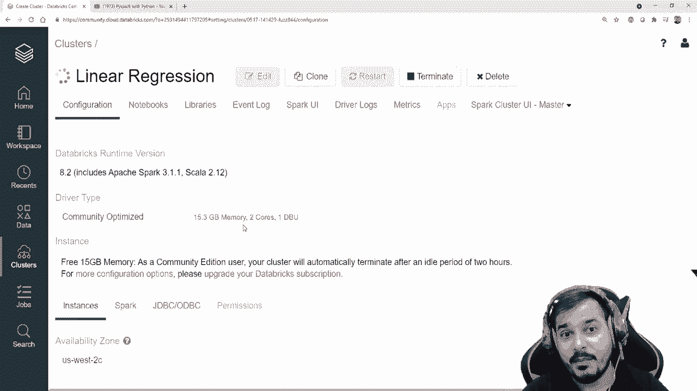

```python
# 定义文件路径
file_location = "/FileStore/tables/tips.csv"
file_type = "csv"

# 读取CSV文件，第一行作为表头，并自动推断Schema
df = spark.read.csv(file_location, header=True, inferSchema=True)

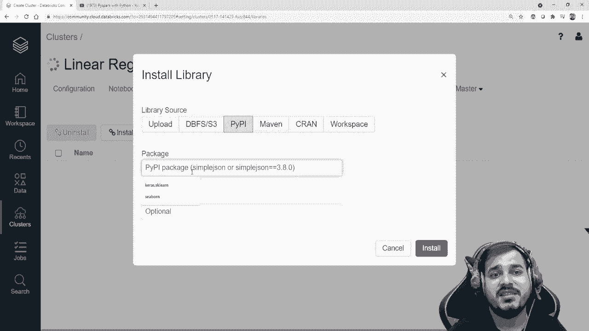

# 查看数据前几行
df.show()
```

执行上述代码后，你将看到数据集包含以下列：`total_bill`（总账单）， `tip`（小费）， `sex`（性别）， `smoker`（是否吸烟）， `day`（星期几）， `time`（用餐时间）， `size`（用餐人数）。

---

## 2. 数据预处理与特征工程 🔧

上一节我们成功加载了数据。本节中，我们来看看如何为机器学习模型准备数据，特别是处理类别型特征。

我们的目标是预测 `total_bill`（总账单）。因此，`total_bill` 是因变量（标签），其他列是自变量（特征）。其中 `sex`， `smoker`， `day`， `time` 是字符串类型的类别特征，需要转换为数值。

### 2.1 处理类别特征

PySpark ML 提供了 `StringIndexer` 工具，可以将字符串列编码为标签索引（例如，“Male”->0, “Female”->1）。这是一种顺序编码。

以下是使用 `StringIndexer` 的步骤：

```python
# 导入必要的库
from pyspark.ml.feature import StringIndexer

# 对 ‘sex‘ 列进行编码
indexer_sex = StringIndexer(inputCol=“sex”, outputCol=“sex_indexed”)
df_indexed = indexer_sex.fit(df).transform(df)

# 查看转换后的列
df_indexed.select(“sex”, “sex_indexed”).show()
```

为了同时对多个类别列进行编码，我们可以指定输入和输出列的列表。

```python
# 对 ‘smoker‘, ‘day‘, ‘time‘ 三列同时进行编码
indexer_multi = StringIndexer(inputCols=[“smoker”, “day”, “time”],
                              outputCols=[“smoker_indexed”, “day_indexed”, “time_indexed”])
df_indexed = indexer_multi.fit(df_indexed).transform(df_indexed)

# 查看所有转换后的新列
df_indexed.show()
```

现在，所有的字符串特征都被转换成了数值索引。

### 2.2 组合特征向量

机器学习算法通常要求所有输入特征被组合成一个特征向量。PySpark ML 使用 `VectorAssembler` 来完成这个任务。

我们需要指定哪些列是用于预测的特征（自变量），并将它们组合成一个新列。

```python
from pyspark.ml.feature import VectorAssembler

# 指定所有自变量列名
feature_columns = [“tip”, “size”, “sex_indexed”, “smoker_indexed”, “day_indexed”, “time_indexed”]

# 创建 VectorAssembler，将特征列组合成一个名为 ‘independent_features‘ 的向量列
assembler = VectorAssembler(inputCols=feature_columns, outputCol=“independent_features”)

# 应用转换
output = assembler.transform(df_indexed)

# 选择我们最终需要的两列：特征向量和标签
final_data = output.select(“independent_features”, “total_bill”)
final_data.show(truncate=False)
```

现在，`final_data` 数据框包含两列：`independent_features`（包含所有预测特征的向量）和 `total_bill`（我们要预测的标签）。

---

## 3. 构建与评估线性回归模型 🧮

数据预处理完成后，本节我们将数据集拆分为训练集和测试集，训练线性回归模型，并进行预测和评估。

### 3.1 拆分数据与训练模型

首先，我们将数据随机分为训练集（75%）和测试集（25%）。然后，导入线性回归算法并训练模型。

```python
from pyspark.ml.regression import LinearRegression

# 拆分数据集
train_data, test_data = final_data.randomSplit([0.75, 0.25])

# 初始化线性回归模型
# 设置特征向量列和标签列
lr = LinearRegression(featuresCol=“independent_features”, labelCol=“total_bill”)

# 在训练数据上拟合模型
lr_model = lr.fit(train_data)
```

模型训练完成后，我们可以查看其参数。

```python
# 打印模型系数和截距
print(“Coefficients: “ + str(lr_model.coefficients))
print(“Intercept: “ + str(lr_model.intercept))
```

### 3.2 进行预测与评估

使用训练好的模型在测试集上进行预测，并计算评估指标以衡量模型性能。

```python
# 在测试集上进行预测
predictions = lr_model.transform(test_data)

# 查看预测结果（包含特征、实际值和预测值）
predictions.select(“independent_features”, “total_bill”, “prediction”).show()

# 导入评估器
from pyspark.ml.evaluation import RegressionEvaluator

# 评估模型性能
evaluator_r2 = RegressionEvaluator(labelCol=“total_bill”, predictionCol=“prediction”, metricName=“r2”)
evaluator_mae = RegressionEvaluator(labelCol=“total_bill”, predictionCol=“prediction”, metricName=“mae”)
evaluator_mse = RegressionEvaluator(labelCol=“total_bill”, predictionCol=“prediction”, metricName=“mse”)

r2 = evaluator_r2.evaluate(predictions)
mae = evaluator_mae.evaluate(predictions)
mse = evaluator_mse.evaluate(predictions)

print(“R-squared (R2) on test data = %g“ % r2)
print(“Mean Absolute Error (MAE) on test data = %g“ % mae)
print(“Mean Squared Error (MSE) on test data = %g“ % mse)
```

**R²** 越接近1，模型拟合越好。**MAE** 和 **MSE** 越小，模型预测误差越小。

---

## 4. 总结与练习 📝

本节课中，我们一起学习了在 Databricks 平台使用 PySpark 实现多元线性回归的完整流程：

1.  **环境搭建**：创建集群并上传数据。
2.  **数据预处理**：使用 `StringIndexer` 处理类别特征，使用 `VectorAssembler` 组合特征向量。
3.  **模型训练**：拆分数据，使用 `LinearRegression` 算法训练模型。
4.  **预测评估**：在测试集上预测，并使用 R²、MAE、MSE 等指标评估模型性能。

这个过程展示了 PySpark ML 库处理结构化数据并构建机器学习管道的基本模式。

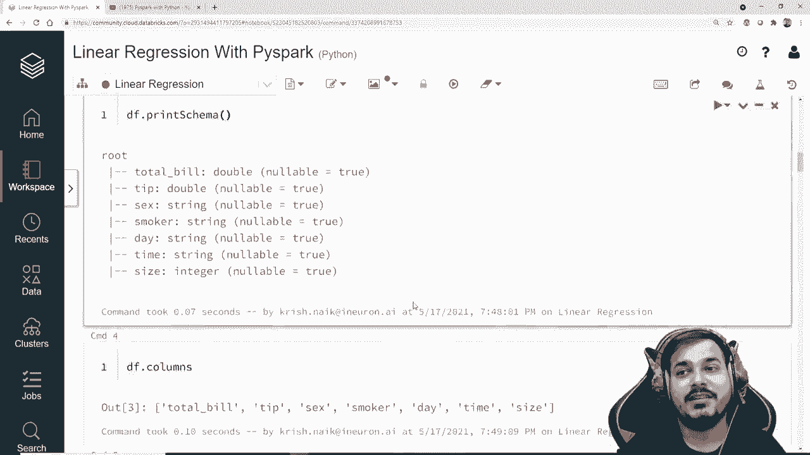

**课后练习**：
*   尝试使用不同的特征组合，观察模型性能的变化。
*   研究如何使用 PySpark 的 `OneHotEncoder` 对类别特征进行独热编码，并比较其与 `StringIndexer` 的效果差异。
*   查阅 PySpark 文档，学习如何将训练好的 `lr_model` 保存到 DBFS，以便后续加载使用。