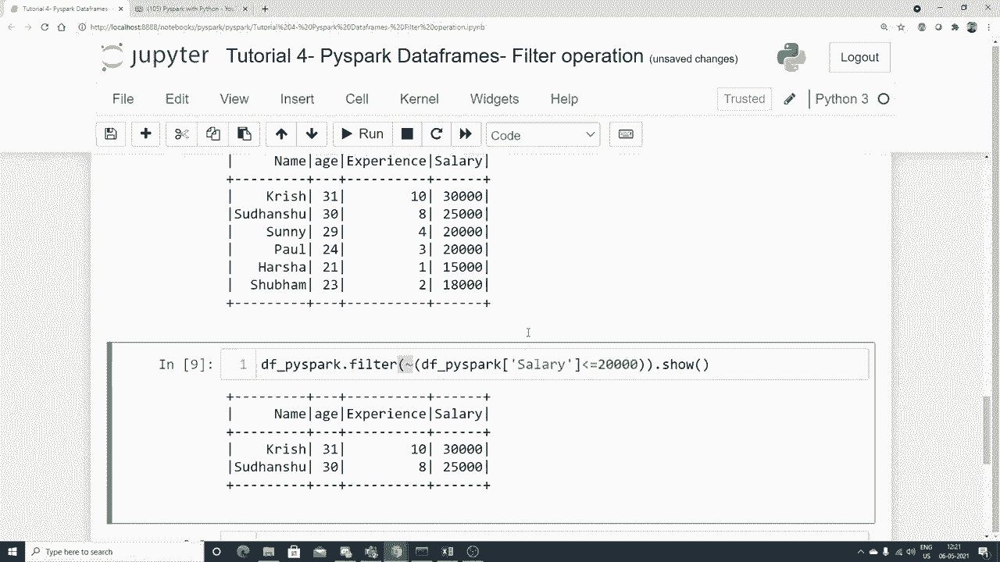

# PySpark 大数据处理入门 P4：L4 - PySpark DataFrames 过滤操作 🔍


## 概述
在本节课中，我们将要学习 PySpark DataFrames 的过滤操作。过滤是数据预处理中的一项关键技术，它允许我们根据指定的布尔条件从数据集中检索出符合条件的记录。

## 创建 SparkSession 与读取数据
使用 PySpark 的第一步是创建 SparkSession，它是所有 Spark 功能的入口点。


```python
from pyspark.sql import SparkSession

spark = SparkSession.builder.appName("dataframe").getOrCreate()
```

创建会话后，我们可以读取数据集。本节使用一个名为 `test1.csv` 的示例数据集，它包含姓名、年龄、经验和薪水等列。

```python
df_spark = spark.read.csv("test1.csv", header=True, inferSchema=True)
df_spark.show()
```

## 过滤操作基础
上一节我们介绍了如何加载数据，本节中我们来看看如何使用 `.filter()` 方法进行基础过滤。

假设我们想找出薪水小于或等于 20000 的记录。

```python
# 方法一：在 .filter() 中直接写入条件表达式
df_spark.filter("Salary <= 20000").show()

# 方法二：使用 DataFrame 的列进行条件判断
df_spark.filter(df_spark.Salary <= 20000).show()
```

两种方法都会返回薪水满足条件的记录。

## 选择特定列并进行过滤
在过滤后，我们可能只关心部分列的数据。这时可以结合使用 `.select()` 方法。

以下是结合过滤与列选择的示例：

```python
df_spark.filter("Salary <= 20000").select("Name", "Age").show()
```

此操作先过滤出薪水符合条件的记录，然后只显示这些记录的“姓名”和“年龄”两列。

## 组合多个过滤条件
在实际应用中，我们经常需要根据多个条件进行过滤。PySpark 支持使用 `&` (与)、`|` (或) 来组合条件。

以下是组合多个条件的示例：

```python
# 使用 AND (&) 组合条件：薪水在15000到20000之间
df_spark.filter((df_spark.Salary <= 20000) & (df_spark.Salary >= 15000)).show()

# 使用 OR (|) 组合条件
# df_spark.filter((条件1) | (条件2)).show()
```

请注意，当组合多个条件时，每个条件都需要用括号括起来。

## 使用“非”条件进行过滤
除了正向筛选，我们还可以使用“非”条件来获取不满足特定条件的记录。这可以通过在条件前使用 `~` 操作符实现。

以下是使用“非”条件进行过滤的示例：

```python
# 获取薪水 NOT <= 20000 的记录，即薪水大于20000的记录
df_spark.filter(~(df_spark.Salary <= 20000)).show()
```



## 总结
本节课中我们一起学习了 PySpark DataFrames 的过滤操作。我们掌握了如何使用 `.filter()` 方法根据单一或多个条件筛选数据，如何结合 `.select()` 方法选择特定列，以及如何使用 `&`、`|` 和 `~` 操作符来构建复杂的过滤逻辑。这些操作是数据清洗和预处理的核心技能，能帮助你从海量数据中高效提取所需信息。