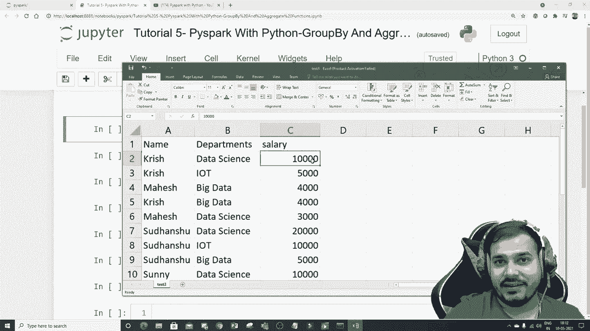
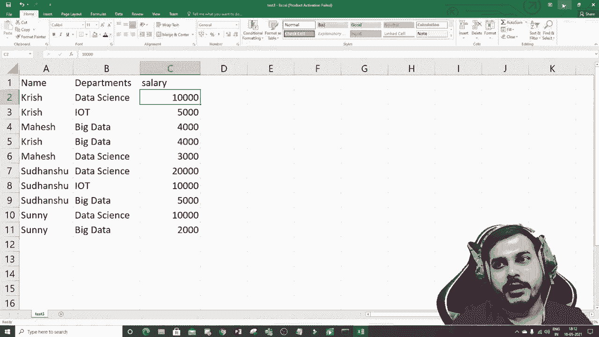
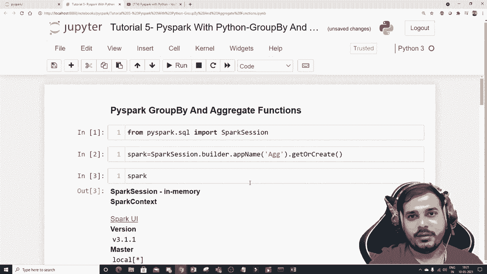

# PySpark 大数据处理入门，P5：L5 - PySpark DataFrames 分组和聚合函数 📊


在本节课中，我们将要学习 PySpark DataFrames 中两个核心的数据处理操作：**分组**和**聚合**。我们将通过具体的例子，了解如何按特定列对数据进行分组，并使用聚合函数（如求和、求平均值、计数等）来汇总和分析数据。

## 概述

分组和聚合是数据分析中的基础操作，常用于回答诸如“哪个部门的薪资总和最高？”或“每个员工的平均薪资是多少？”这类问题。在 PySpark 中，我们可以通过 `groupBy()` 和一系列聚合函数轻松实现这些计算。

## 环境准备与数据加载

首先，我们需要导入必要的库并创建一个 SparkSession，这是所有 Spark 功能的入口点。





```python
from pyspark.sql import SparkSession

# 创建 SparkSession
spark = SparkSession.builder.appName("aggregate").getOrCreate()
```

创建会话后，我们可以读取数据集。假设我们有一个名为 `test3.csv` 的文件，它包含 `name`、`department` 和 `salary` 三列。

```python
# 读取 CSV 文件
df_pyspark = spark.read.csv('test3.csv', header=True, inferSchema=True)

# 查看数据
df_pyspark.show()

# 查看数据结构（模式）
df_pyspark.printSchema()
```

执行上述代码后，我们可以看到数据内容以及各列的数据类型（例如，`name` 和 `department` 是字符串类型，`salary` 是整数类型）。

## 分组操作

分组操作的核心是 `groupBy()` 方法。它允许我们根据一列或多列的值将数据分成不同的组。但请注意，`groupBy()` 本身不会产生汇总结果，它需要与聚合函数结合使用。

上一节我们介绍了如何加载数据，本节中我们来看看如何进行分组。

以下是按员工姓名分组的示例：

```python
# 按‘name’列分组
grouped_df = df_pyspark.groupBy('name')
```

此时，`grouped_df` 是一个 `GroupedData` 对象，它代表了分组后的数据状态，但尚未进行任何计算。

## 聚合函数

聚合函数用于对每个分组内的数据进行计算，如求和、求平均值、计数、求最大值/最小值等。它们需要应用在 `groupBy()` 之后。

以下是常用的聚合函数示例：

### 1. 求和

我们可以计算每位员工的薪资总和。

```python
# 按姓名分组，并计算薪资总和
df_pyspark.groupBy('name').sum('salary').show()
```

执行结果将显示每位员工的薪资总和，这有助于我们快速找出总薪资最高的员工。

### 2. 求平均值

我们可以计算每个部门的平均薪资。

```python
# 按部门分组，并计算平均薪资
df_pyspark.groupBy('department').avg('salary').show()
```

这个操作能告诉我们哪个部门的平均薪资水平最高。

### 3. 计数

我们可以统计每个部门有多少名员工。

```python
# 按部门分组，并统计员工数量
df_pyspark.groupBy('department').count().show()
```

### 4. 求最大值与最小值

我们可以找出每位员工的最高和最低薪资记录。

```python
# 按姓名分组，找出最高薪资
df_pyspark.groupBy('name').max('salary').show()

# 按姓名分组，找出最低薪资
df_pyspark.groupBy('name').min('salary').show()
```

## 直接使用聚合函数

除了在分组后使用，聚合函数也可以直接对整个 DataFrame 的某一列进行计算，而无需先分组。

例如，计算整个公司的薪资总支出：

```python
# 计算‘salary’列的总和
df_pyspark.agg({'salary': 'sum'}).show()
```

## 总结

本节课中我们一起学习了 PySpark DataFrames 的分组与聚合操作。我们掌握了：



1.  如何使用 `groupBy()` 方法对数据进行分组。
2.  如何结合 `sum()`、`avg()`、`count()`、`max()`、`min()` 等聚合函数对分组数据进行汇总分析。
3.  如何直接使用 `agg()` 函数进行聚合计算。

这些操作是数据预处理和洞察提取的关键技能，能够帮助我们高效地从海量数据中获取有价值的信息。在接下来的课程中，我们将开始探索 Spark MLlib 库，并尝试解决一些机器学习问题。