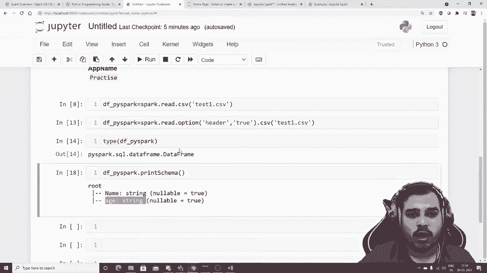
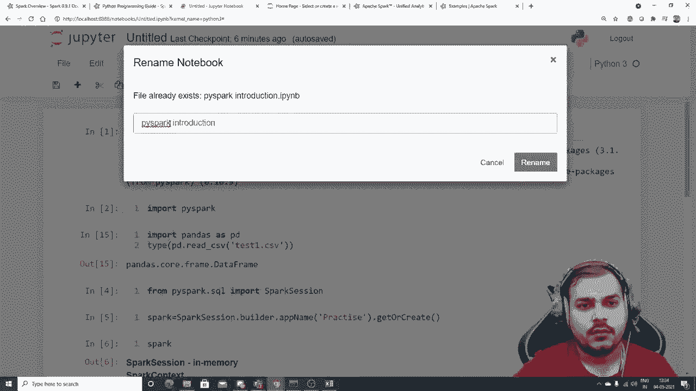
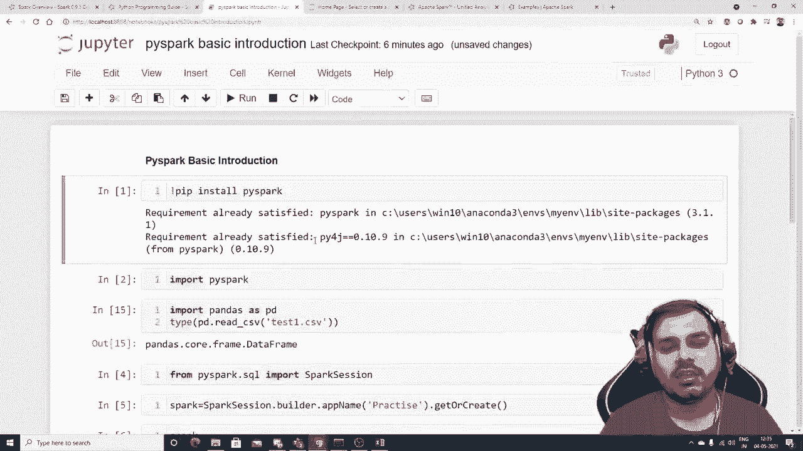

# PySpark大数据处理入门，1：L1- Pyspark介绍和安装 🚀


在本节课中，我们将要学习什么是Apache Spark以及为什么需要它，并完成PySpark库的安装和基本环境配置。我们将通过一个简单的例子，演示如何启动Spark会话并读取一个CSV文件。

---

## 概述

Apache Spark是一个快速的通用集群计算系统，用于处理大规模数据。PySpark是Spark为Python提供的API库，允许我们使用Python编写Spark应用程序。与传统的单机处理（如Pandas）相比，Spark的优势在于它能将数据和计算任务分布到多台机器（集群）上并行处理，从而高效处理海量数据。

例如，如果你的数据有1.8TB，而单台机器的内存只有64GB，那么使用传统的单机工具将无法直接加载和处理。这时，就需要像Spark这样的分布式计算框架。

上一节我们介绍了课程的整体目标，本节中我们来看看如何搭建PySpark环境并进行第一个数据读取操作。

---

## 为什么选择Apache Spark？

Apache Spark因其出色的性能而闻名。其主要优势包括：

*   **速度快**：Spark的内存计算引擎使其工作负载处理速度比传统的MapReduce快**100倍**。
*   **易用性**：支持使用Java、Scala、Python和R快速编写应用程序。本课程将专注于使用Python和PySpark。
*   **功能全面**：无缝结合了SQL查询、流式数据处理和复杂的机器学习分析。
*   **运行环境灵活**：可以在Hadoop、Apache Mesos、Kubernetes上以独立模式运行，也支持在AWS、Databricks等云平台上运行。

---

## 安装PySpark

我们将使用Spark 3.1.1版本。为了避免与其他Python库发生冲突，**强烈建议创建一个新的虚拟环境**。

以下是安装步骤：

1.  **创建并激活虚拟环境**（以`conda`为例）：
    ```bash
    conda create -n my_spark_env python=3.8
    conda activate my_spark_env
    ```
2.  **使用pip安装PySpark**：
    ```bash
    pip install pyspark==3.1.1
    ```
3.  **验证安装**：
    在Python环境中运行以下代码，如果没有报错，则说明安装成功。
    ```python
    import pyspark
    print(pyspark.__version__)
    ```

> **注意**：如果安装或导入过程中遇到问题，请检查Python环境或库版本冲突。


---

## 第一个PySpark程序：读取CSV文件

安装完成后，让我们通过一个简单的例子来体验PySpark。我们将读取一个本地CSV文件。

### 1. 准备示例数据

首先，创建一个名为 `test1.csv` 的CSV文件，内容如下：
```
name,age
Krisna,31
Shoan,30
Sunny,29
```
将其保存在你的工作目录中。

### 2. 启动Spark会话

在PySpark中，所有操作的起点是创建一个`SparkSession`对象。

```python
# 导入必要的模块
from pyspark.sql import SparkSession

# 创建SparkSession实例
spark = SparkSession.builder \
    .appName("MyFirstPySparkApp") \
    .getOrCreate()

# 查看Spark版本信息
print(spark.version)
```
执行上述代码后，你将看到类似 `3.1.1` 的输出，这表示一个本地Spark会话已经成功启动。

### 3. 读取CSV文件

使用创建好的`spark`会话对象来读取数据。

```python
# 读取CSV文件，并指定第一行为列名（header）
df_pyspark = spark.read \
    .option("header", "true") \
    .csv("test1.csv")

# 查看数据框的类型
print(type(df_pyspark))
# 输出: <class 'pyspark.sql.dataframe.DataFrame'>
```
这里，`.option("header", "true")` 告诉Spark将CSV文件的第一行作为列名。如果不设置此选项，Spark会生成默认的列名（如`_c0`, `_c1`）。

### 4. 查看数据

PySpark DataFrame提供了多种方法来查看数据结构和内容。

```python
# 显示数据框的前几行数据
df_pyspark.show()
```
输出结果：
```
+------+---+
|  name|age|
+------+---+
|Krisna| 31|
| Shoan| 30|
| Sunny| 29|
+------+---+

# 查看数据框的结构（类似于Pandas的df.info()）
df_pyspark.printSchema()
```
输出结果：
```
root
 |-- name: string (nullable = true)
 |-- age: string (nullable = true)
```
`printSchema()` 方法显示了每列的名称和数据类型。注意，目前`age`列被识别为字符串（string），在后续课程中我们会学习如何转换数据类型。



---



## 总结

本节课中我们一起学习了：
1.  **Apache Spark的核心价值**：一个用于大规模数据处理的快速、分布式计算框架。
2.  **PySpark的安装**：如何在独立的Python环境中安装PySpark库。
3.  **PySpark的基本操作**：如何创建`SparkSession`，以及使用它读取CSV文件并查看数据。



我们已经成功搭建了PySpark环境并完成了第一个数据读取任务。下一节课，我们将深入探讨PySpark DataFrame，学习如何执行数据清洗、转换列类型、处理缺失值等更复杂的操作，为后续的分布式机器学习打下坚实基础。