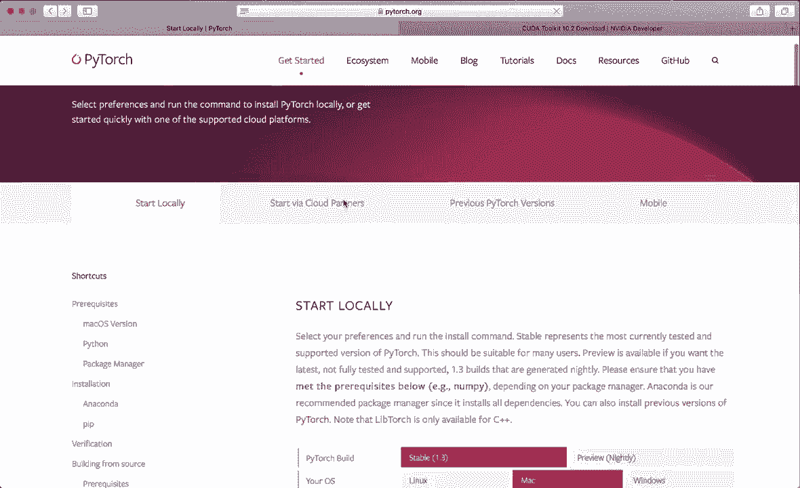
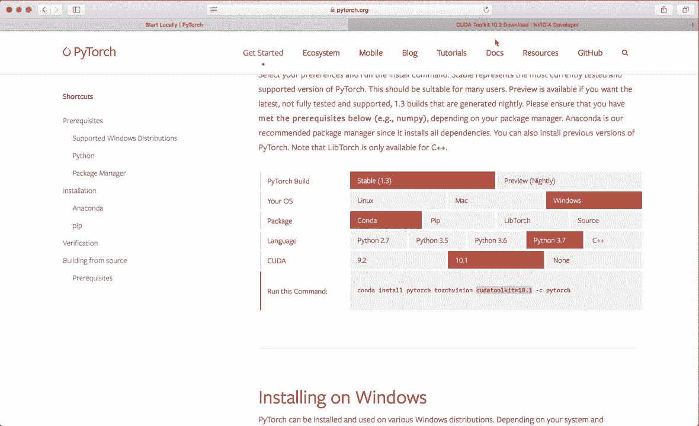
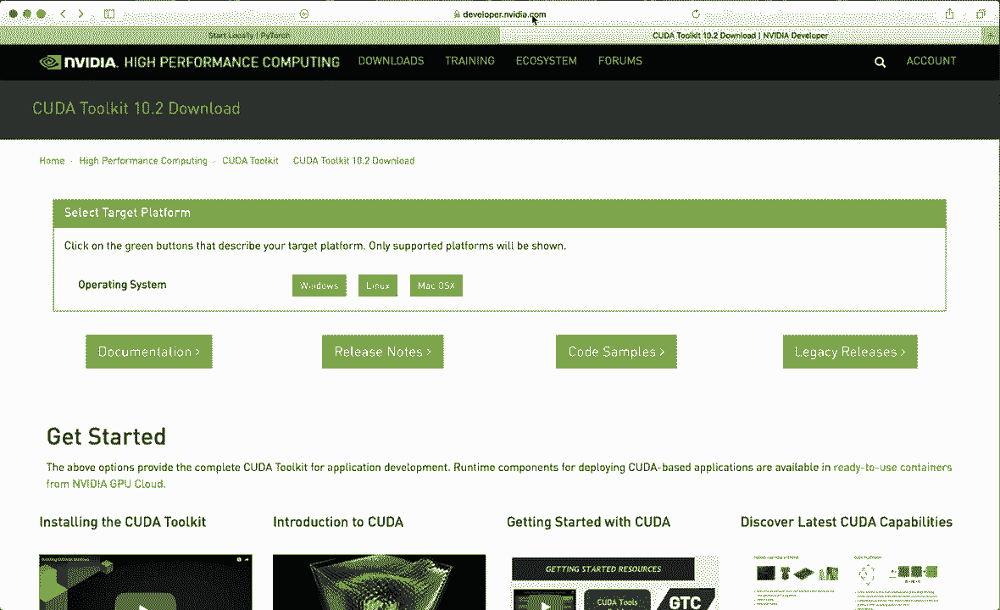
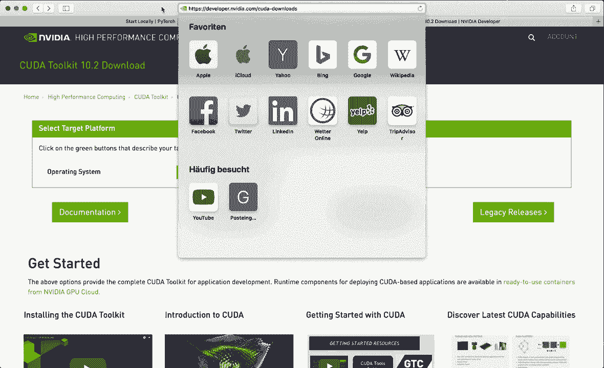
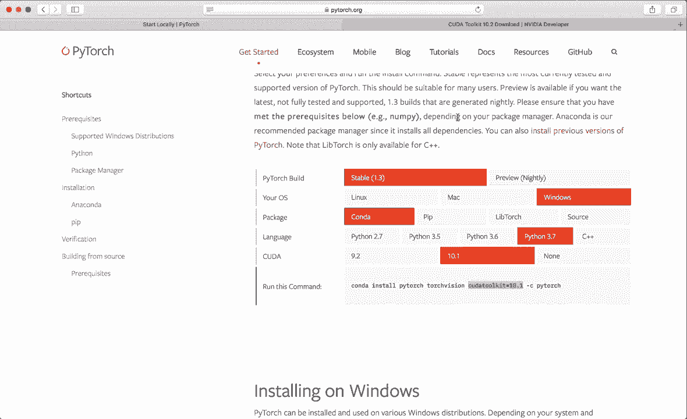
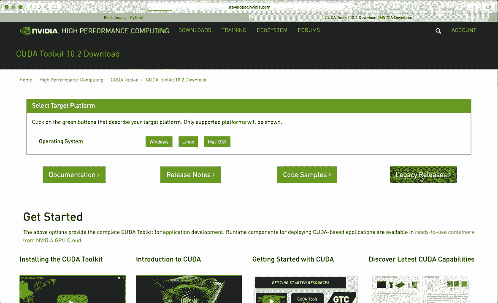
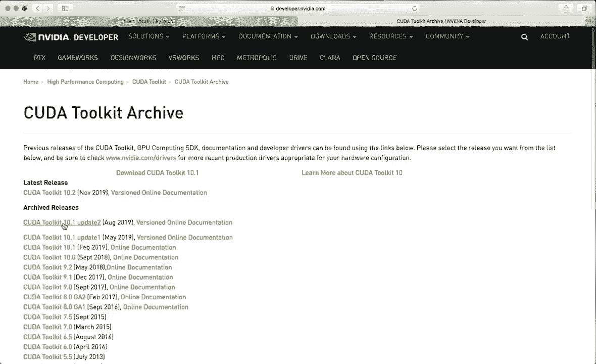
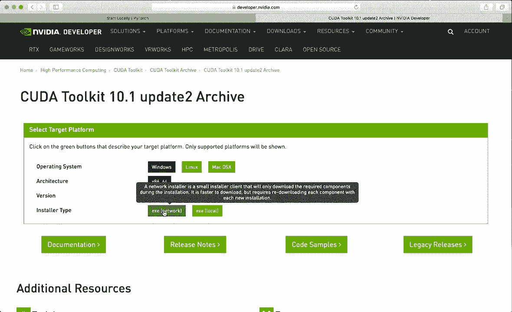
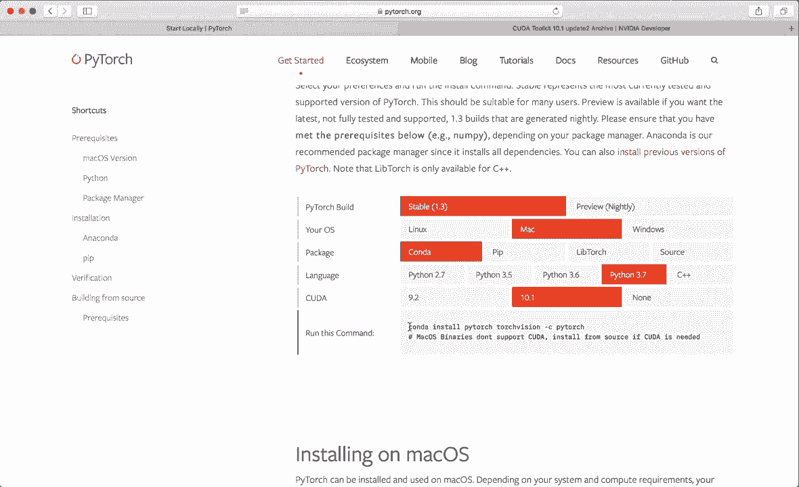

# PyTorch 极简实战教程！P1：L1- 安装 🛠️

在本节课中，我们将学习如何安装 PyTorch，这是目前最流行的机器学习和深度学习框架之一。我们将从访问官方网站开始，根据你的操作系统和需求选择合适的安装选项，并最终完成安装验证。

## 概述

PyTorch 是一个功能强大的开源框架，用于构建深度学习模型。要开始使用它，首先需要正确安装。本节教程将引导你完成从环境准备到安装验证的完整步骤。

## 安装步骤



以下是安装 PyTorch 的具体步骤，我们将从访问官方网站开始。

### 1. 访问官方网站

首先，访问 PyTorch 的官方网站 `pytorch.org`，然后点击“开始”按钮。

### 2. 选择构建版本

在网站上，选择最新的 PyTorch 构建版本。目前最新版本是 1.3。

### 3. 选择操作系统

根据你的计算机系统选择对应的操作系统，例如 Windows、macOS 或 Linux。

### 4. 选择包管理器

选择你希望用来安装 PyTorch 的包管理器。强烈推荐使用 Anaconda，因为它能方便地管理 Python 环境和依赖包。

如果你尚未安装 Anaconda，可以参考其他相关教程进行安装。

### 5. 选择 Python 版本



选择最新的 Python 版本。例如，可以选择 Python 3.7。



> **注意**：在 macOS 上，目前只能安装 CPU 版本的 PyTorch。如果你使用 Linux 或 Windows 并希望获得 GPU 加速支持，则需要额外安装 CUDA 工具包。



### 6. 安装 CUDA 工具包（可选，用于 GPU 支持）

CUDA 工具包是 NVIDIA 提供的用于创建高性能 GPU 加速应用程序的开发环境。安装它需要你的计算机配备 NVIDIA GPU。

*   访问 NVIDIA 开发者网站：`developer.nvidia.com/cuda-downloads`。
*   目前 PyTorch 支持的最新 CUDA 版本是 10.1。请确保下载此版本，而不是最新的 10.2 版本。
*   在网站上找到“旧版发布”页面，选择 CUDA Toolkit 10.1。
*   根据你的操作系统（例如 Windows 10）下载安装程序，并按照说明完成安装。安装程序会自动检查你的系统是否兼容。



### 7. 复制安装命令



返回 PyTorch 官网，网站会根据你的选择（操作系统、包管理器、Python版本、CUDA版本）生成一条安装命令。复制这条命令。

### 8. 创建并激活虚拟环境



打开终端（或命令提示符/Anaconda Prompt），建议先创建一个独立的虚拟环境来安装 PyTorch，以避免包冲突。

使用以下命令创建一个名为 `pytorch` 的虚拟环境，并指定 Python 版本：

```bash
conda create -n pytorch python=3.7
```



按回车确认创建，此过程需要一些时间。

环境创建完成后，使用以下命令激活它：



```bash
conda activate pytorch
```

激活后，终端提示符的开头会显示环境名称 `(pytorch)`。

### 9. 安装 PyTorch

在激活的 `pytorch` 环境中，粘贴并运行从官网复制的安装命令。例如：

```bash
conda install pytorch torchvision -c pytorch
```

按回车继续，等待安装完成。

### 10. 验证安装

安装完成后，在当前的 `pytorch` 环境中启动 Python 解释器进行验证：

```bash
python
```

在 Python 交互界面中，尝试导入 `torch` 模块：

```python
import torch
```

如果没有出现“ModuleNotFoundError”错误，则说明导入成功。

你可以进一步测试，例如创建一个张量：

```python
x = torch.rand(3)
print(x)
```

要检查 GPU（CUDA）支持是否可用，可以运行：

```python
torch.cuda.is_available()
```

如果返回 `True`，则表示 GPU 支持已成功启用；如果返回 `False`（例如在仅安装 CPU 版本的 macOS 上），则表示当前仅能使用 CPU。

## 总结

本节课中，我们一起学习了 PyTorch 的完整安装流程。我们访问了官方网站，根据系统配置选择了合适的安装选项，使用 Conda 创建了独立的虚拟环境，执行了安装命令，并最终通过导入模块和简单测试验证了安装是否成功。现在，你的 PyTorch 开发环境已经准备就绪，可以开始后续的学习和开发了。