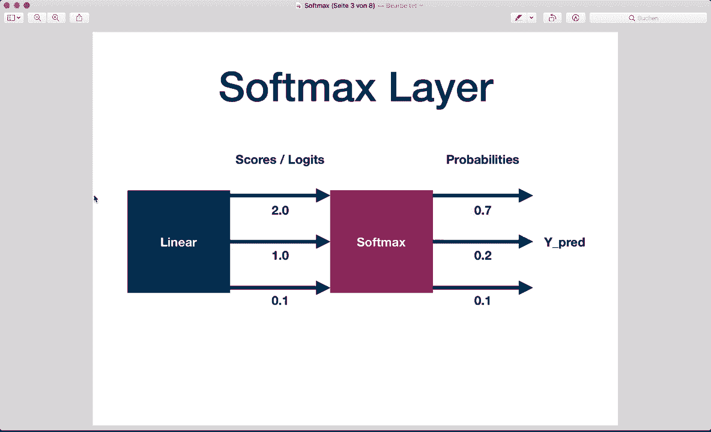
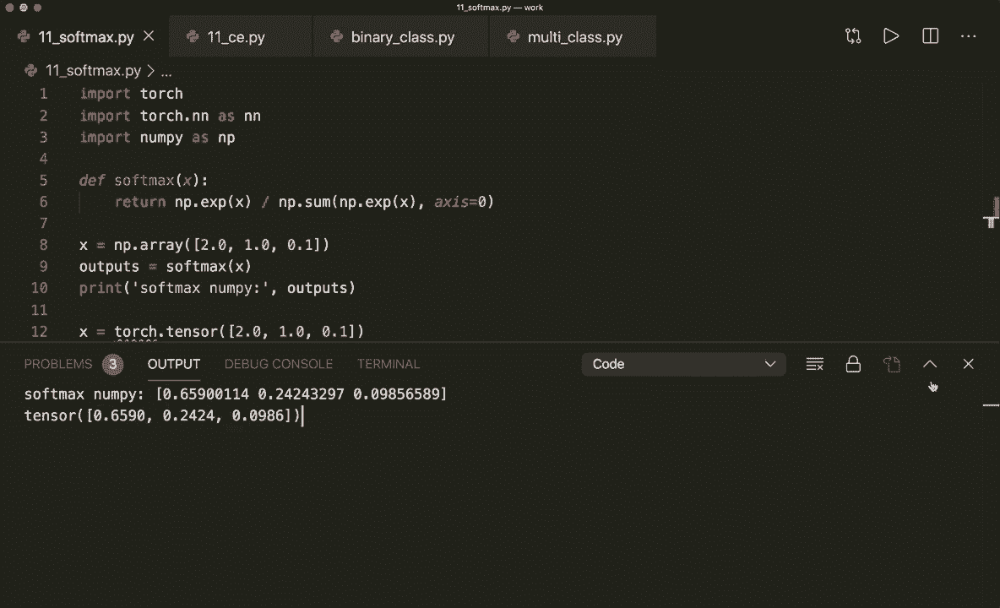
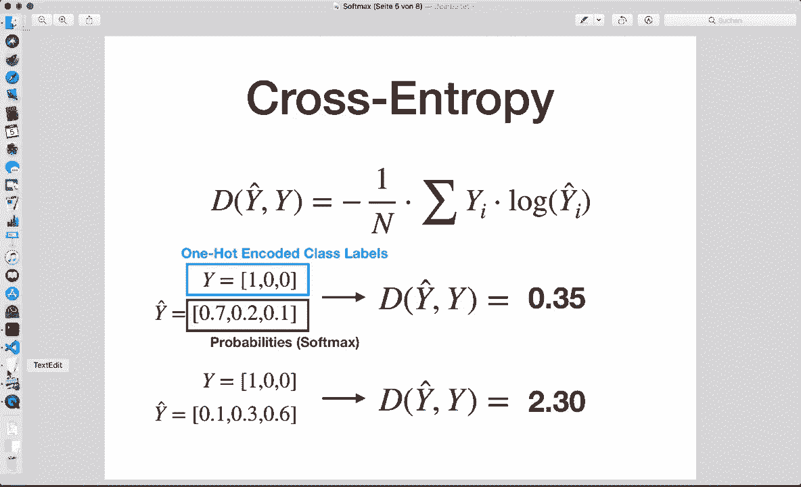
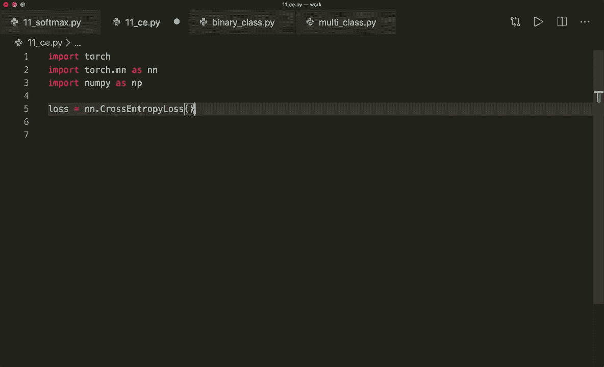
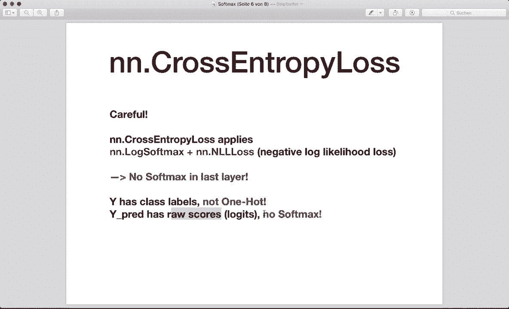
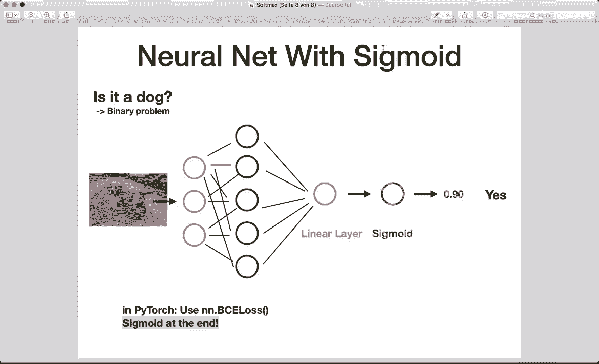

# PyTorch 极简实战教程！P11：L11- Softmax 和交叉熵 🧮

在本节课中，我们将要学习神经网络分类任务中的两个核心概念：Softmax函数和交叉熵损失。我们将从数学原理入手，然后学习如何在NumPy和PyTorch中实现它们，最后了解一个典型的分类神经网络是如何构建的。

## Softmax函数

上一节我们介绍了课程概述，本节中我们来看看Softmax函数。Softmax函数是神经网络中用于多分类问题的关键函数，它将一组原始分数（logits）转换为概率分布。

其核心公式如下：

**公式：**
`softmax(x_i) = exp(x_i) / Σ_j exp(x_j)`



这个公式对每个输入元素应用指数函数，然后除以所有元素指数值的总和，从而将所有输出值压缩到0和1之间，并且所有输出值的和为1。

让我们通过一个例子来理解。假设一个线性层输出三个原始分数（logits）：`[2.0, 1.0, 0.1]`。应用Softmax后，我们得到概率：`[0.659, 0.242, 0.099]`。可以看到，最高的原始值得到了最高的概率，并且所有概率之和为1。我们可以选择概率最高的类别作为模型的预测。

以下是Softmax在NumPy中的实现代码：

```python
import numpy as np



def softmax(x):
    return np.exp(x) / np.sum(np.exp(x), axis=0)

x = np.array([2.0, 1.0, 0.1])
outputs = softmax(x)
print(outputs)
```

在PyTorch中，我们可以直接使用内置函数：

```python
import torch

x = torch.tensor([2.0, 1.0, 0.1])
outputs = torch.softmax(x, dim=0)
print(outputs)
```



## 交叉熵损失

理解了如何将输出转化为概率后，我们需要一种方法来衡量预测的好坏，这就是交叉熵损失。交叉熵损失衡量的是预测概率分布与真实标签分布之间的差异。预测越准确，损失值越低。

交叉熵损失的计算公式如下：

**公式：**
`Loss = - Σ (y_true_i * log(y_pred_i))`

其中，`y_true` 是真实标签的独热编码（one-hot encoding），`y_pred` 是预测的概率。

以下是交叉熵在NumPy中的计算示例。首先，我们需要将真实标签转换为独热编码：



```python
def cross_entropy(y_true, y_pred):
    # y_true 是独热编码
    loss = -np.sum(y_true * np.log(y_pred))
    return loss

# 假设有3个类别，真实标签是类别0
y_true_good = np.array([1, 0, 0])
# 一个好的预测：类别0的概率最高
y_pred_good = np.array([0.7, 0.2, 0.1])
# 一个差的预测：类别0的概率很低
y_pred_bad = np.array([0.1, 0.3, 0.6])



loss_good = cross_entropy(y_true_good, y_pred_good)
loss_bad = cross_entropy(y_true_good, y_pred_bad)
print(f‘好的预测损失：{loss_good}‘)
print(f‘差的预测损失：{loss_bad}‘)
```

## 在PyTorch中使用交叉熵损失

在PyTorch中使用交叉熵损失时，有两个重要的注意事项：
1.  `nn.CrossEntropyLoss` 内部已经结合了Softmax和负对数似然损失，因此**不需要**在网络最后一层手动添加Softmax。
2.  输入的真实标签 `y` **不需要**是独热编码，只需是类别索引即可。预测的 `y_pred` 应该是原始分数（logits），而不是经过Softmax的概率。

以下是PyTorch中的使用示例：

```python
import torch.nn as nn

# 1. 定义损失函数
loss_fn = nn.CrossEntropyLoss()

# 2. 准备数据
# 真实标签：类别索引，例如 [0] 表示第一个样本属于类别0
Y = torch.tensor([0])
# 好的预测：原始分数，类别0的分数最高
Y_pred_good = torch.tensor([[2.0, 1.0, 0.1]])  # 形状：(样本数, 类别数)
# 差的预测：原始分数，类别0的分数很低
Y_pred_bad = torch.tensor([[0.5, 2.0, 0.3]])

# 3. 计算损失
l1 = loss_fn(Y_pred_good, Y)
l2 = loss_fn(Y_pred_bad, Y)

print(f‘好的预测损失：{l1.item()}‘)
print(f‘差的预测损失：{l2.item()}‘)

# 4. 获取预测的类别
_, predictions1 = torch.max(Y_pred_good, 1)
_, predictions2 = torch.max(Y_pred_bad, 1)
print(f‘好的预测类别：{predictions1}‘)
print(f‘差的预测类别：{predictions2}‘)
```

PyTorch的交叉熵损失也支持批量计算：

```python
# 批量样本示例：3个样本，3个类别
Y = torch.tensor([2, 0, 1])  # 三个样本的真实标签
# 预测值：形状为 (3, 3)
Y_pred_good = torch.tensor([[0.1, 0.2, 3.0],  # 样本1：类别2分数高
                            [2.0, 0.1, 0.3],  # 样本2：类别0分数高
                            [0.1, 2.0, 0.3]]) # 样本3：类别1分数高

l1 = loss_fn(Y_pred_good, Y)
print(f‘批量好的预测损失：{l1.item()}‘)
```

## 分类神经网络的典型结构 🏗️

掌握了核心组件后，我们来看看如何将它们组合成一个完整的分类神经网络。网络的结构取决于问题是多分类还是二分类。

### 多分类网络结构

对于一个典型的多分类问题（例如，识别猫、狗、鸟），网络结构如下：

1.  输入层
2.  若干隐藏层（带有激活函数，如ReLU）
3.  输出层：一个线性层，输出节点数等于类别数量。
4.  **注意**：在使用 `nn.CrossEntropyLoss` 时，**不需要**在最后一层添加Softmax激活函数。

以下是PyTorch中的实现示例：

```python
class MulticlassNN(nn.Module):
    def __init__(self, input_size, hidden_size, num_classes):
        super(MulticlassNN, self).__init__()
        self.linear1 = nn.Linear(input_size, hidden_size)
        self.relu = nn.ReLU()
        self.linear2 = nn.Linear(hidden_size, num_classes)
        # 没有 Softmax 层

    def forward(self, x):
        out = self.linear1(x)
        out = self.relu(out)
        out = self.linear2(out) # 输出原始分数（logits）
        return out

# 模型、损失函数和优化器
model = MulticlassNN(input_size=784, hidden_size=50, num_classes=3)
criterion = nn.CrossEntropyLoss() # 损失函数内部处理Softmax
optimizer = torch.optim.SGD(model.parameters(), lr=0.001)
```

### 二分类网络结构

对于二分类问题（例如，判断是或否），网络结构有所不同：

1.  输入层
2.  若干隐藏层
3.  输出层：一个线性层，输出节点数为1。
4.  在最后一层**需要**使用Sigmoid激活函数将输出压缩到0和1之间，表示概率。
5.  使用 `nn.BCELoss`（二元交叉熵损失）作为损失函数。

以下是PyTorch中的实现示例：

```python
class BinaryClassNN(nn.Module):
    def __init__(self, input_size, hidden_size):
        super(BinaryClassNN, self).__init__()
        self.linear1 = nn.Linear(input_size, hidden_size)
        self.relu = nn.ReLU()
        self.linear2 = nn.Linear(hidden_size, 1)
        self.sigmoid = nn.Sigmoid() # 需要 Sigmoid 层

    def forward(self, x):
        out = self.linear1(x)
        out = self.relu(out)
        out = self.linear2(out)
        out = self.sigmoid(out) # 输出概率
        return out

# 模型、损失函数和优化器
model = BinaryClassNN(input_size=784, hidden_size=50)
criterion = nn.BCELoss() # 二元交叉熵损失
optimizer = torch.optim.SGD(model.parameters(), lr=0.001)
```

**关键区别总结：**
*   **多分类**：输出层节点数 = 类别数，使用 `nn.CrossEntropyLoss`，网络末尾**不加**Softmax。
*   **二分类**：输出层节点数 = 1，使用 `nn.BCELoss`，网络末尾**必须加**Sigmoid。

## 总结

本节课中我们一起学习了Softmax函数和交叉熵损失，这是构建分类神经网络的基石。

我们首先了解了Softmax的数学原理，它如何将原始分数转化为概率分布。接着，我们学习了交叉熵损失，它如何衡量预测概率与真实标签之间的差距。我们重点比较了在NumPy中手动实现与在PyTorch中使用内置函数的区别，特别是PyTorch中 `nn.CrossEntropyLoss` 将Softmax和损失计算合二为一的便利性。



最后，我们探讨了多分类和二分类神经网络的典型结构，明确了在两种情况下输出层设计、激活函数选择和损失函数使用的不同规则。正确理解这些概念和实现细节，是成功构建和训练分类模型的关键。