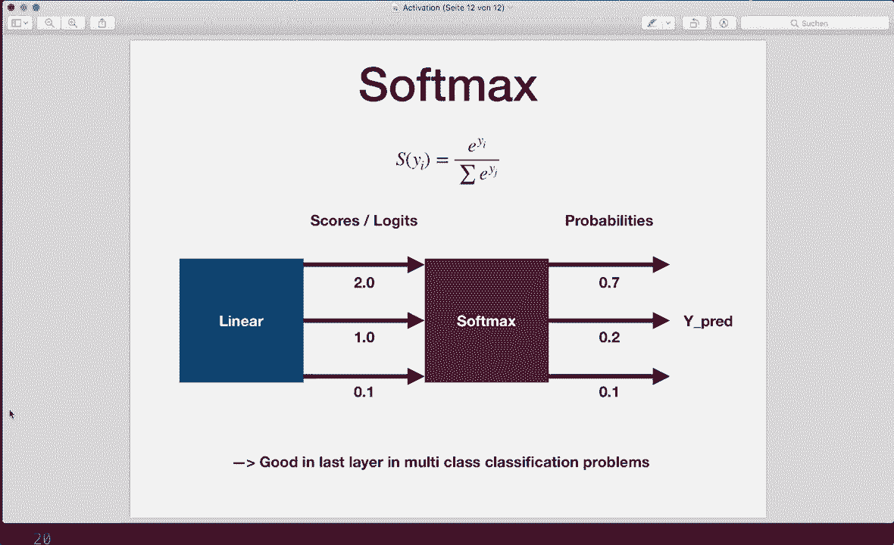

# PyTorch 极简实战教程！P12：L12- 激活函数 🧠

在本节课中，我们将要学习神经网络中的一个核心组件：激活函数。我们将了解激活函数是什么、为什么需要它们、有哪些常见的类型，以及如何在PyTorch模型中应用它们。

## 概述

激活函数对神经网络层的输出应用非线性变换，它决定了神经元是否应该被“激活”。如果没有激活函数，无论网络有多少层，整个模型本质上只是一个线性回归模型，无法处理复杂的任务。通过在层之间引入非线性，网络才能学习并执行更复杂的模式识别和预测。

上一节我们介绍了神经网络的基本结构，本节中我们来看看如何通过激活函数为网络注入非线性能力。

## 为什么需要激活函数？

假设我们有一个线性层，它执行的操作是 `output = weight * input + bias`。如果我们在网络层之间只使用这样的线性变换，那么整个网络从输入到输出的组合变换仍然是一个线性函数。线性模型的能力有限，无法拟合复杂的数据关系（如异或问题）。

因此，结论是：通过在层与层之间加入非线性激活函数，我们的网络可以学习并执行更复杂的任务。通常，在每一层（尤其是隐藏层）的线性变换之后，我们都会应用一个激活函数。

## 常见的激活函数

以下是几种最流行的激活函数及其特点。

### 1. 二进制阶跃函数
这是一个最简单的激活函数。当输入大于阈值（通常为0）时输出1，否则输出0。它直观地演示了“激活”的概念，但在实际中很少使用，因为其梯度在大部分区域为零，不利于反向传播。

### 2. Sigmoid函数
如果你学习过逻辑回归，应该对这个函数很熟悉。其公式为：
`σ(x) = 1 / (1 + e^(-x))`
它将输入压缩到(0, 1)区间，输出可以解释为概率。它通常用于二分类问题的输出层。

### 3. 双曲正切函数 (Tanh)
Tanh函数可以看作一个缩放并平移的Sigmoid函数。其公式为：
`tanh(x) = (e^x - e^(-x)) / (e^x + e^(-x))`
它的输出范围在(-1, 1)之间，均值接近0，这使得它在训练隐藏层时通常比Sigmoid表现更好。

### 4. ReLU函数 (整流线性单元)
这是目前最流行的激活函数。其定义为：
`ReLU(x) = max(0, x)`
对于正值输入，它直接输出该值（线性）；对于负值输入，输出为0。尽管形式简单，但它引入了非线性，并且能有效缓解梯度消失问题，是隐藏层的默认选择。

### 5. Leaky ReLU函数
这是ReLU的一个改进版本，旨在解决“神经元死亡”问题（即某些神经元因输出恒为0而停止更新）。其定义为：
`LeakyReLU(x) = max(ax, x)`，其中 `a` 是一个很小的正数（如0.01）。
对于负输入，它会输出一个很小的斜率 `a*x`，而不是0，从而确保梯度始终可以流动。



### 6. Softmax函数
Softmax函数通常用于多分类问题的输出层。它将一个向量“压缩”为另一个向量，其中每个元素的值在(0,1)之间，且所有元素之和为1，从而可以解释为概率分布。其公式为：
`Softmax(x_i) = e^(x_i) / Σ_j e^(x_j)`

## 在PyTorch中使用激活函数

在PyTorch中，使用激活函数主要有两种方式：将其作为`nn.Module`的一部分定义，或在`forward`方法中直接调用函数。

### 方式一：作为`nn.Module`定义
我们可以在模型的`__init__`方法中，像定义层一样定义激活函数。

```python
import torch.nn as nn

class MyModel(nn.Module):
    def __init__(self):
        super(MyModel, self).__init__()
        self.linear1 = nn.Linear(10, 20)
        self.relu = nn.ReLU()        # 定义ReLU模块
        self.linear2 = nn.Linear(20, 5)
        self.sigmoid = nn.Sigmoid()  # 定义Sigmoid模块

    def forward(self, x):
        out = self.linear1(x)
        out = self.relu(out)         # 应用ReLU
        out = self.linear2(out)
        out = self.sigmoid(out)      # 应用Sigmoid
        return out
```

### 方式二：在`forward`中直接调用函数
我们也可以只在`__init__`中定义线性层，而在前向传播时直接使用`torch`或`torch.nn.functional`中的函数。

```python
import torch
import torch.nn as nn
import torch.nn.functional as F

class MyModel(nn.Module):
    def __init__(self):
        super(MyModel, self).__init__()
        self.linear1 = nn.Linear(10, 20)
        self.linear2 = nn.Linear(20, 5)

    def forward(self, x):
        out = self.linear1(x)
        out = F.relu(out)            # 使用functional中的ReLU
        out = self.linear2(out)
        out = torch.sigmoid(out)     # 使用torch中的Sigmoid
        return out
```

两种方式效果相同，选择哪一种取决于个人编码风格。`torch.nn`模块中提供了所有常见的激活函数类（如`nn.ReLU`, `nn.Sigmoid`, `nn.Tanh`, `nn.Softmax`, `nn.LeakyReLU`）。对应的函数形式也可以在`torch`命名空间（如`torch.relu`）或`torch.nn.functional`模块（如`F.leaky_relu`）中找到。

## 总结

本节课中我们一起学习了神经网络激活函数的核心知识。我们首先理解了为什么需要非线性激活函数来增强模型的表达能力。接着，我们逐一介绍了二进制阶跃、Sigmoid、Tanh、ReLU、Leaky ReLU和Softmax这几种常见激活函数的特性与适用场景。最后，我们掌握了在PyTorch中应用激活函数的两种主要方法。记住一个经验法则：当不确定使用哪种激活函数时，在隐藏层中使用ReLU通常是一个安全且有效的起点。